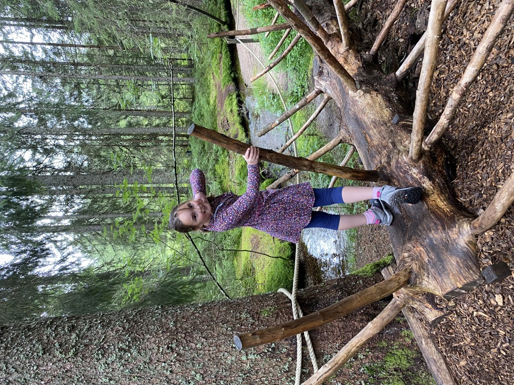
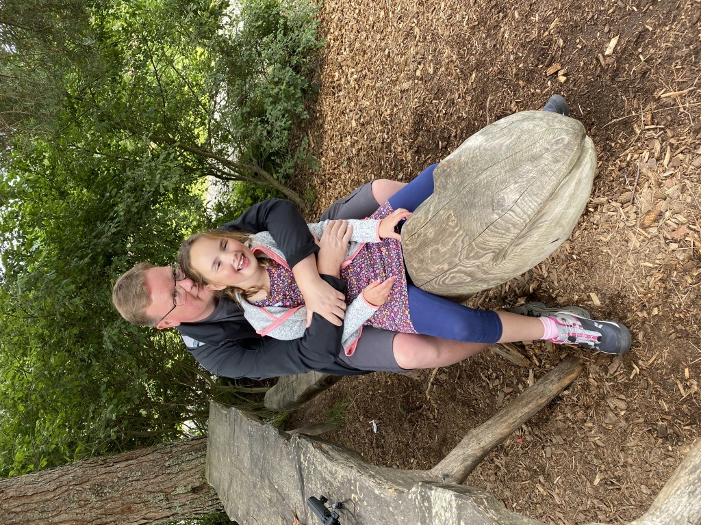
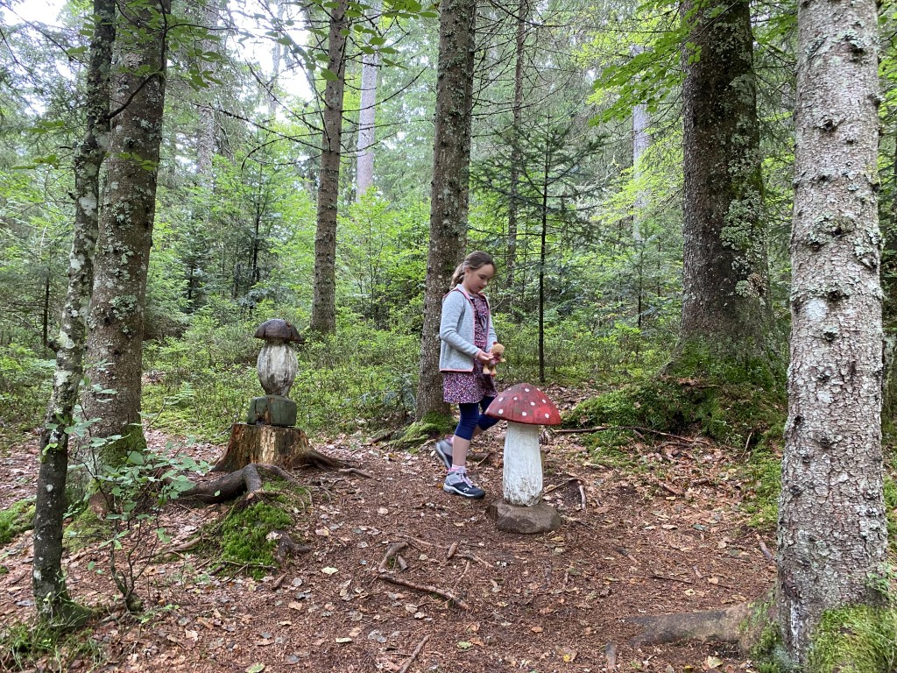
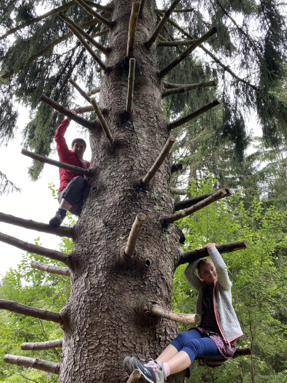
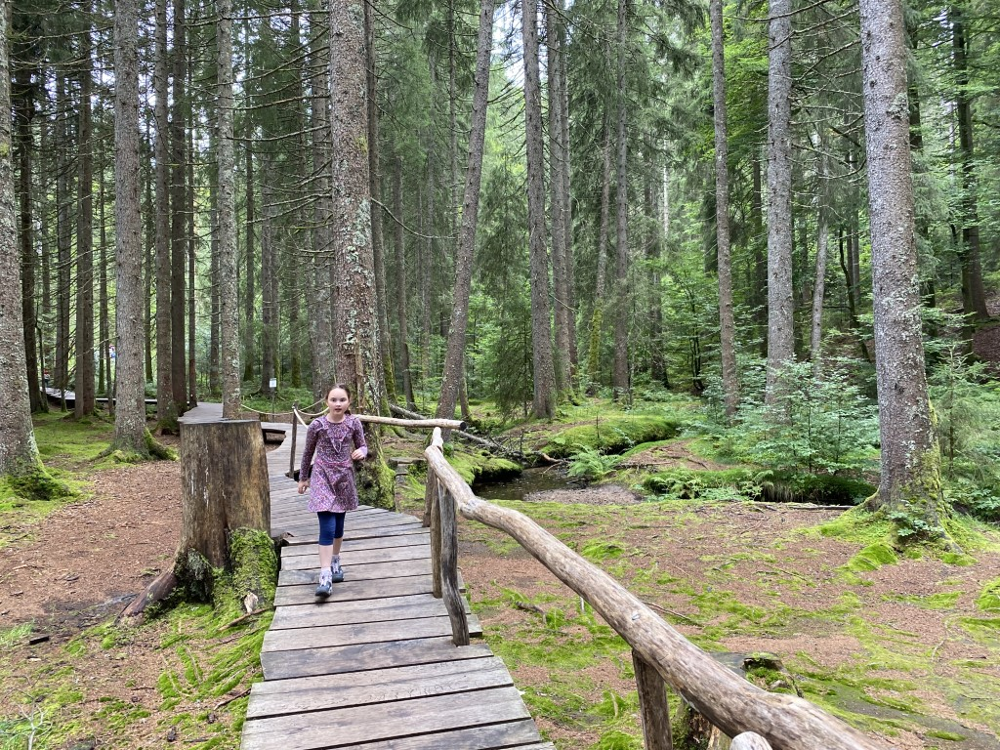

De weersvoorspellingen voor vandaag zijn gelukkig weer een heel stuk beter. We besluiten de wandelschoenen maar weer eens aan te trekken en rijden naar Bernau, naar het Zauberwald-pfad. Het is een 2.5 km lang pad voorzien van allerlei bezienswaardigheden en activiteiten gericht op kinderen. En verdikkeme, het is een heel mooie omgeving, en echt de moeite waard.

Na dit avontuur wilden we gaan zwemmen in Menzenschwand, maar dat kon helaas niet: op maandagen en dinsdagen is het bad niet geopend voor normale stervelingen. Dus toen zijn we maar naar huis gereden en hebben movie-matinee (Rio, compleet met popcorn) gehouden.
