Na al het gebubbel en geluier van de laatste dagen, hebben we vandaag weer de wandelschoenen aangetrokken. Bestemming is deze keer het Rötenbacher Ameisenpfad. Een Ameise is een mier, en wat dat betreft is de naamgeving van het wandelpad is heel treffend: het stikt hier van de mieren! Overal waar je kijkt, zie je een hoop mierenhopen.

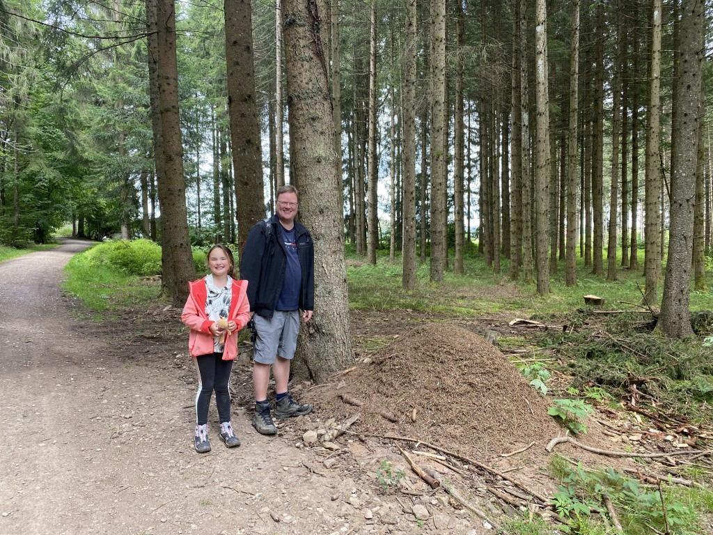

Ondanks de beperkte lengte van 5 kilometer, is het toch een heel erg leuke wandeling. Vanaf de auto gaan we de kloof in, en vervolgens volgen we al kronkelende het pad langs de Rötenbach. De kloof is hier nog niet zo diep als die van de Wutach of Gauchach, maar daardoor oogt het allemaal wat vriendelijker en lichter. Ook is het pad niet zo glibberig als die van eerdere wandelingen in deze omgeving.

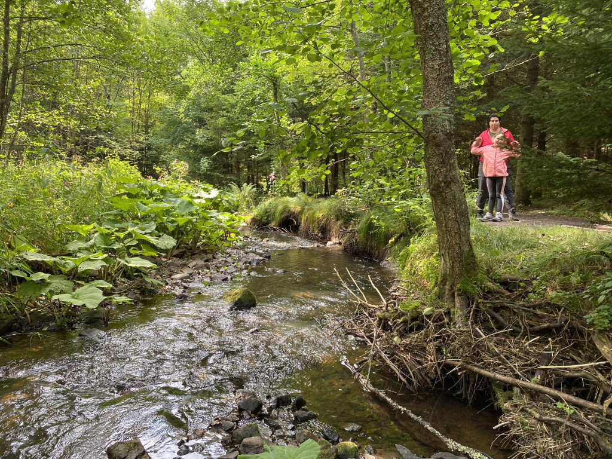

Op een mooi plekkie lunchen we op een bankje.

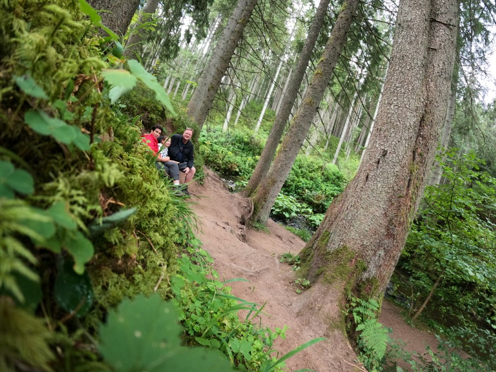

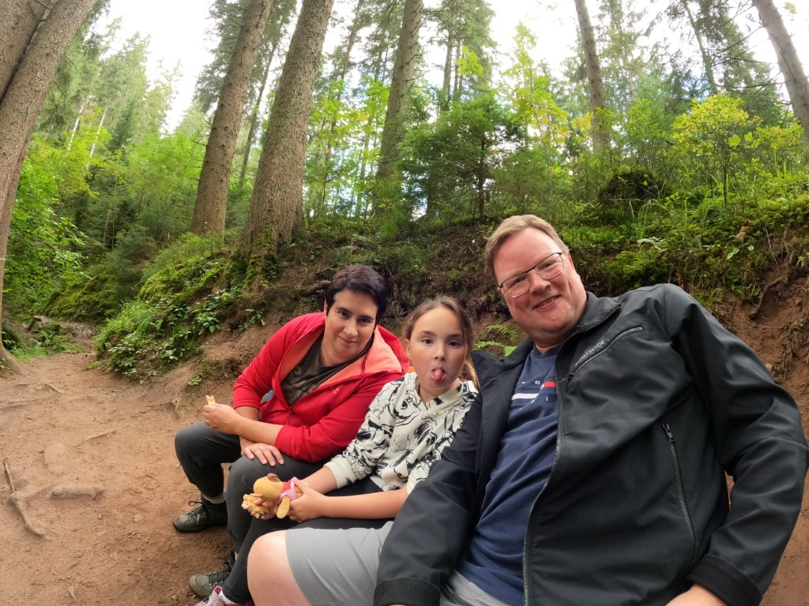

Na de boterham ravotten we nog even in het beekje, en een niet nader te noemen persoon (Sofie dus) krijgt het voor elkaar om natte voeten te halen. Dus diezelfde, niet nader te noemen persoon (Sofie dus), moet verder wandelen met natte sokken in de natte schoenen :-)

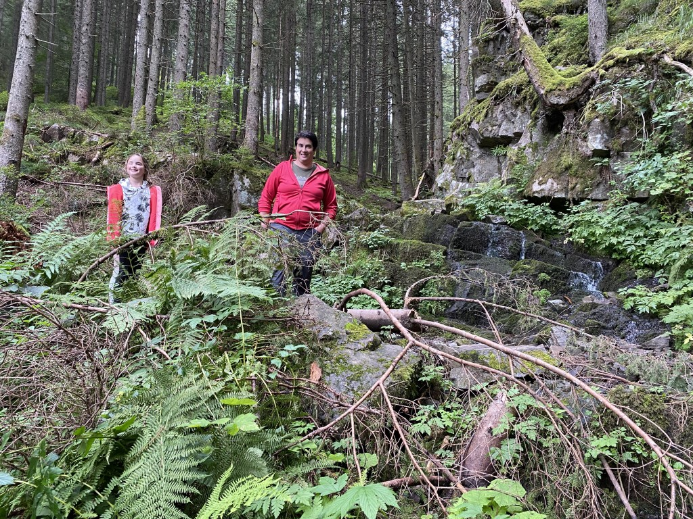

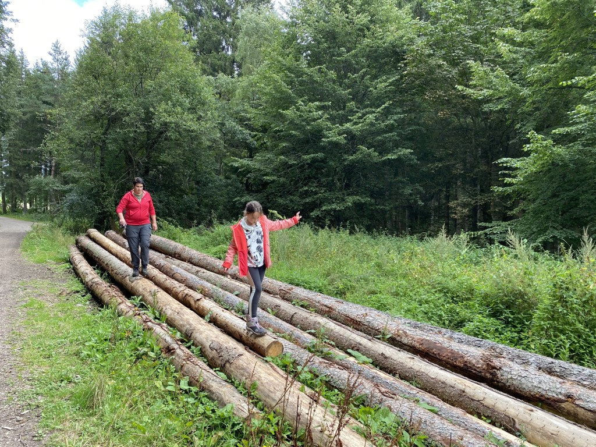

Als klap op de vuurpijl mogen we aan het einde van het pad nog op de foto met Amina, de reuzenmier.

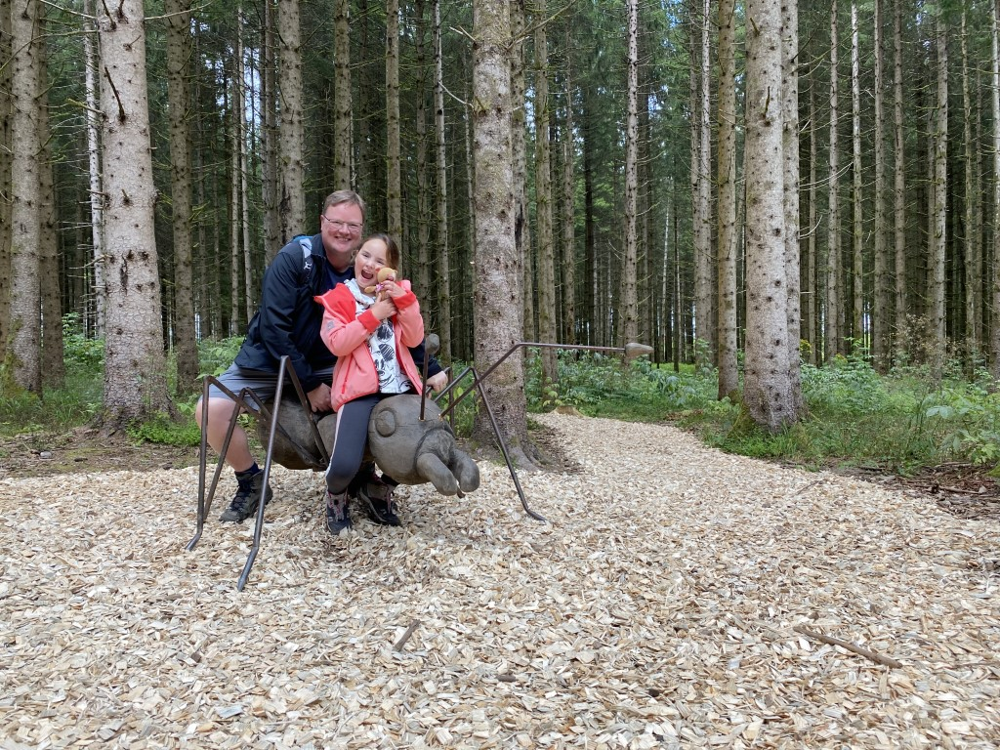

Omdat het maar een korte wandeling was, hadden we tijd om nog wat boodschappen te doen om 's avonds in het bos te gaan grillen. We gaan weer naar Grillplatz Felsele in Titisee, hier waren we vorig jaar ook al. Er is hier een leuke speeltuin, dus is het ook voor Sofie interessant.

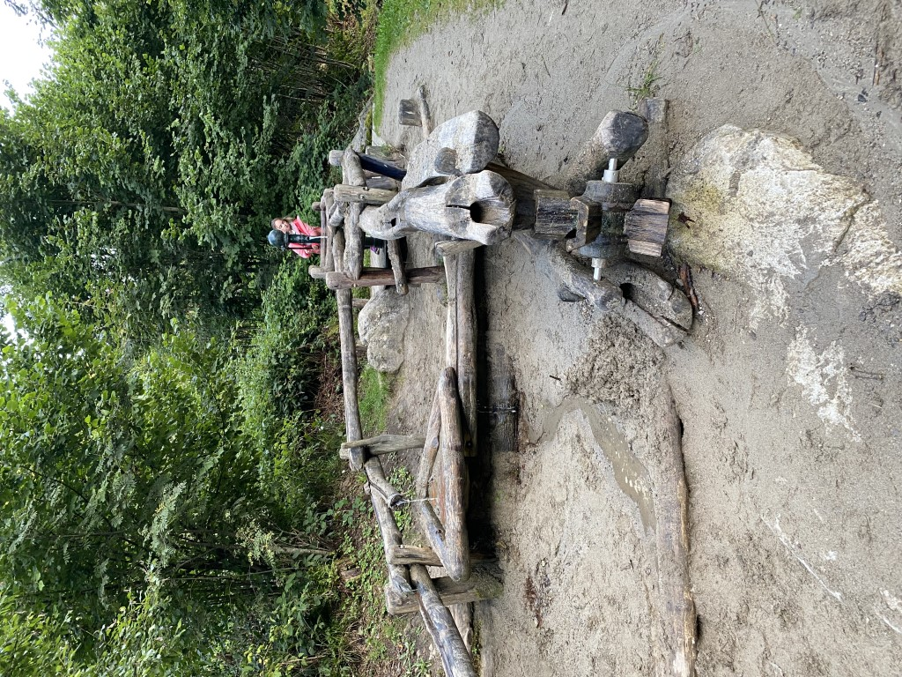

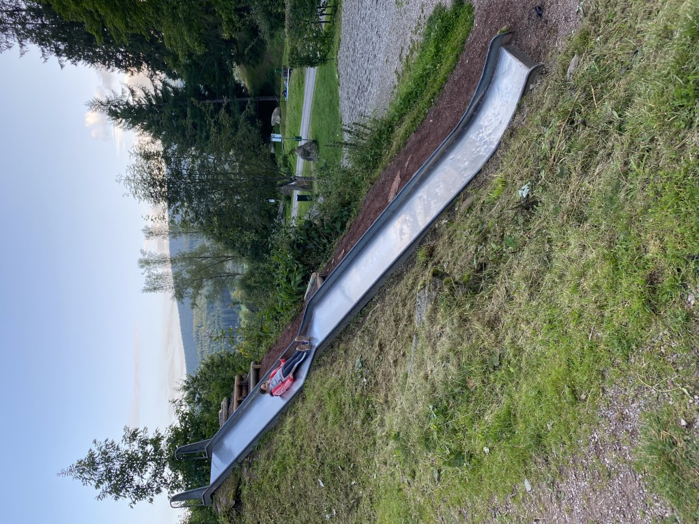

De eigengemaakte sate smaakte meer dan prima, zo in het bos!

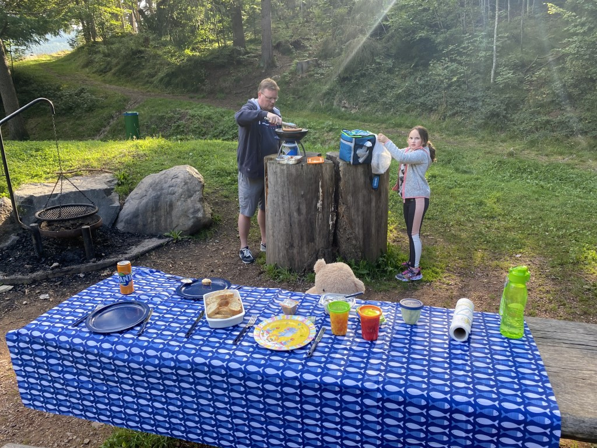

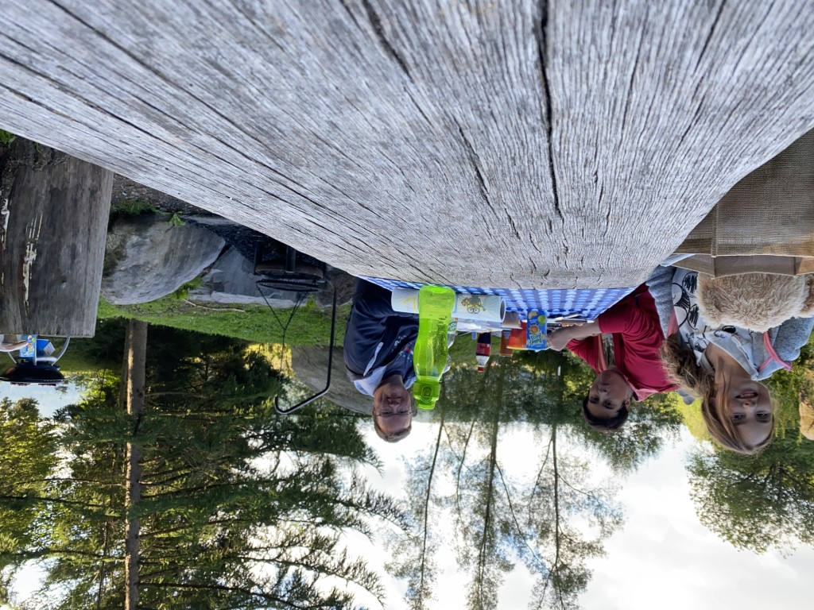

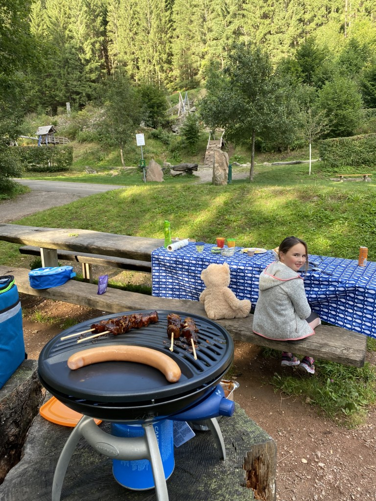
