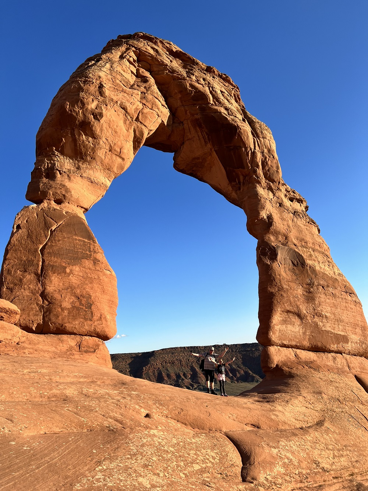

Toen we wakker werden, zagen we redelijk tot onze verbazing dat Delta al een mail heeft gestuurd dat onze koffers inmiddels zijn aangekomen in Salt Lake City. Dus ben ik de auto ingesprongen en weer terug gereden naar het vliegveld. Een ritje van zo'n 40 minuten. Op deze vroege zondagochtend was er nog niemand op de weg. Ook in de aankomsthal was het heel erg rustig, zodat ik om 7:20 al weer op weg terug was naar het hotel.

Nadat we de koffers opnieuw hebben gerangschikt, zijn we op pad gegaan richting Moab. Dat wordt onze standplaats voor de komende drie nachten. Onderweg bij de Walmart in Price hebben we wat proviant ingeslagen voor de lunch en voor ons avontuur van vanavond.



We moeten ons vandaag tussen 15 en 16 uur bij de ingang van Arches National Park melden. Sinds dit jaar moeten bezoekers van te voren een tijdslot van aankomst boeken. We moeten nog redelijk haasten om onze spullen te droppen in hotel Aarchway Inn, en op tijd bij het park te zijn. Gelukkig sluiten we op tijd aan in de rij voor de ingang. De rangers zijn streng: geen tijdslot geboekt, dan wordt je teruggestuurd.

Op het programma staat vandaag iets heel leuks: de zonsondergang bekijken bij Delicate Arch. Maar voor het zover is hebben we nog ruim de tijd om Balanced Rock te bekijken.



Na het mini wandelingetje rondom de balanced rock, zijn we naar de parkeerplaats gereden waar de wandeling naar Delicate Arch begint. De eerste 500 meter zijn makkelijk over een vlak en breed pad. Daarna wordt het al snel klimmen en klauteren geblazen, waarna je tegen een imposante, vlakke, maar stijl omhoog gaande plaat van rots kijkt. Het is maar een paar honderd meter lopen, maar het is een behoorlijke inspanning. Na deze kuitenbijter wordt het gelukkig weer wat makkelijker.





Vlak voordat we bij de arch kwamen, had je na wat klimwerk, een fantastisch mooi uitzicht.





Delicate Arch is een 16 meter hoge vrijstaande natuurlijke boog van zandsteen. De arch is het meest bekende monument uit Arches National Park en een belangrijk symbool voor de staat Utah. Het staat bijvoorbeeld op postzegels, maar ook op de kentekenplaten van auto's die geregistreerd staan in Utah.

Na de avondboterham werd het al snel donkerder, en veranderden de kleuren van minuut tot minuut. Het was een prachtig schouwspel!





Toen de zon echt onder was, werd het tijd om de wandeling naar beneden te aanvaarden. Naar beneden ging het allemaal een stuk vlotter gelukkig.





Tijdens de laatste kilometer was het echt donker, en moesten de rode hoofdlampen aan. Rood, want dan kun je goed voor je kijken, maar ook naar de sterren. En die sterrenhemel hier is werkelijk fantastisch! Zelfs met een "gewone" iPhone kun je 'm prachtig vastleggen!


