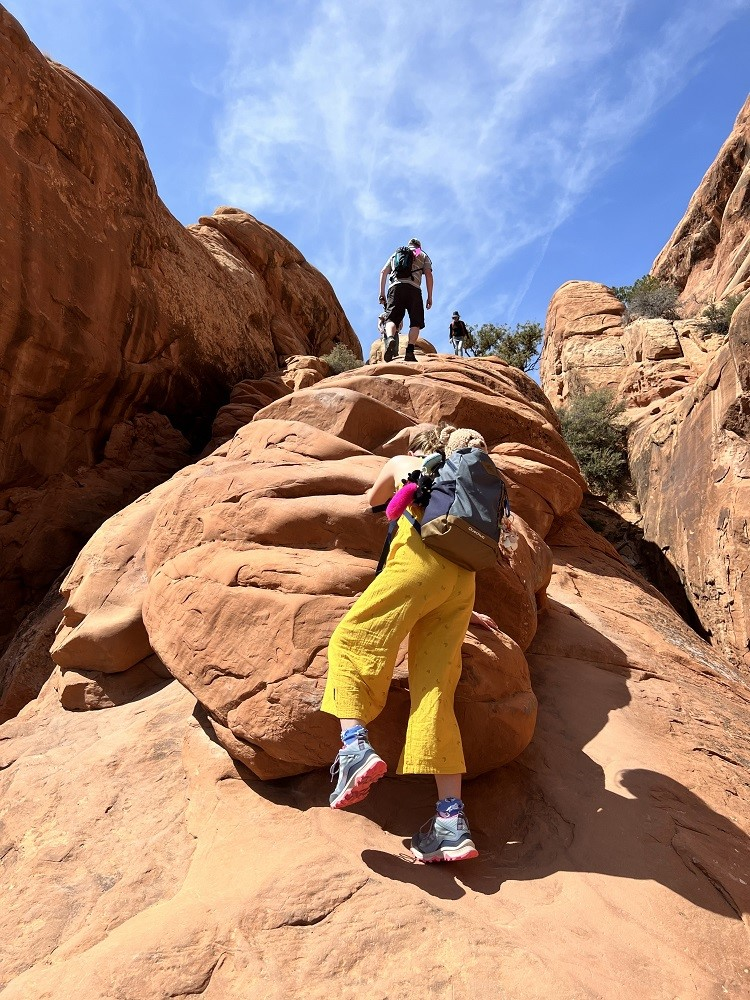
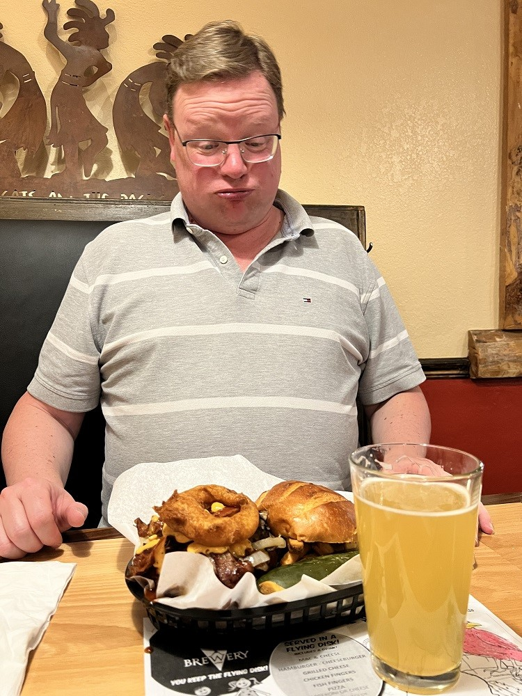

We hadden een beetje geluk: we konden voor vandaag nog een timed-entry boeken voor 12 uur. Dus hebben Chantal en Sofie in het hotel het Junior Ranger boekje afgemaakt. Net na het middaguur mocht Sofie bij de ranger in het bezoekerscentrum de Badge ophalen. Trots als een pauw heeft ze wat vraagjes beantwoord, inclusief een keurig Amerikaans accent :-)



Na deze formaliteiten zijn we helemaal naar het einde van het park gereden, naar de Devils Garden Trailhead. Na een stukkie lopen komen we aan bij Landscape Arch, met ruim 93 meter de langste natuurlijke boog van Noord Amerika.



Met uitzicht op de boog hebben we geluncht.



Vanaf dit punt wordt de wandeling even wat uitdagend, nu we een stijle rotswand moeten trotseren.

Gelukkig komt iedereen heelhuids boven. Vanaf daar heb je namelijk een fantastisch mooi uitzicht. Op de bergen aan de horizon ligt nog sneeuw.



Na een bezoek aan de Partition en Navajo arches, keren we weer terug naar de auto. Het was best warm vandaag, en we hebben flink gewandeld, dus een duik in het (verwarmde) zwembad hebben we verdiend.



Wat we ook verdiend hebben, is een lekkere hamburger in de Moab Brewery. Onder het genot van een goede IPA, krijg ik een beste hamburger voorgeschoteld...

