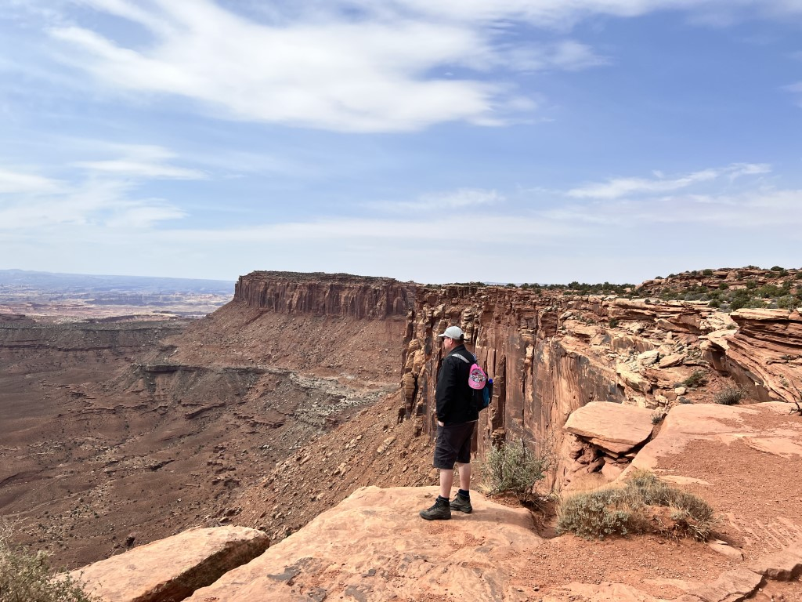
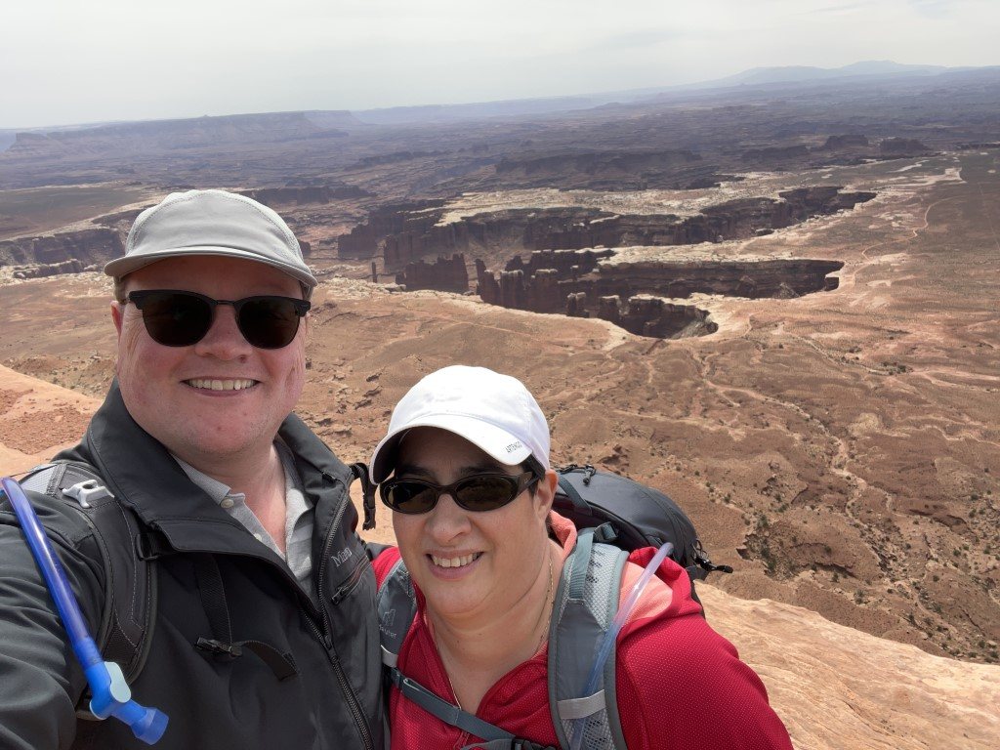
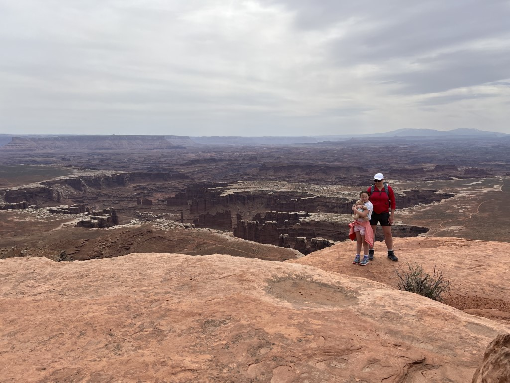
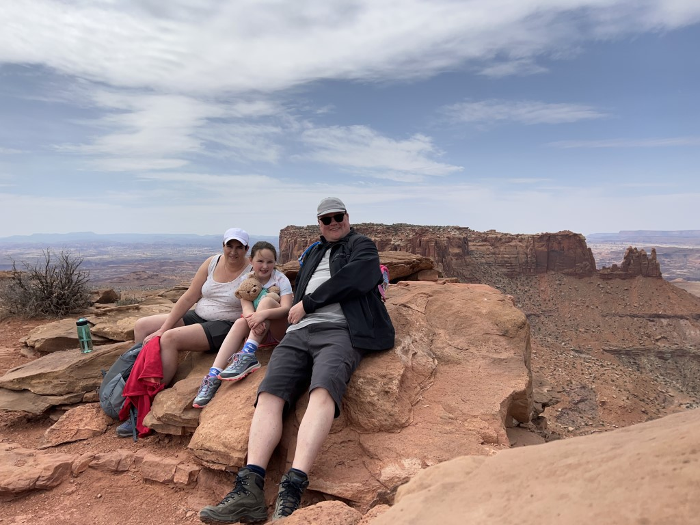
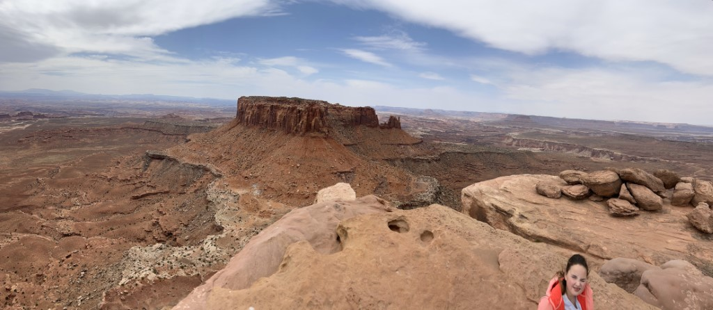
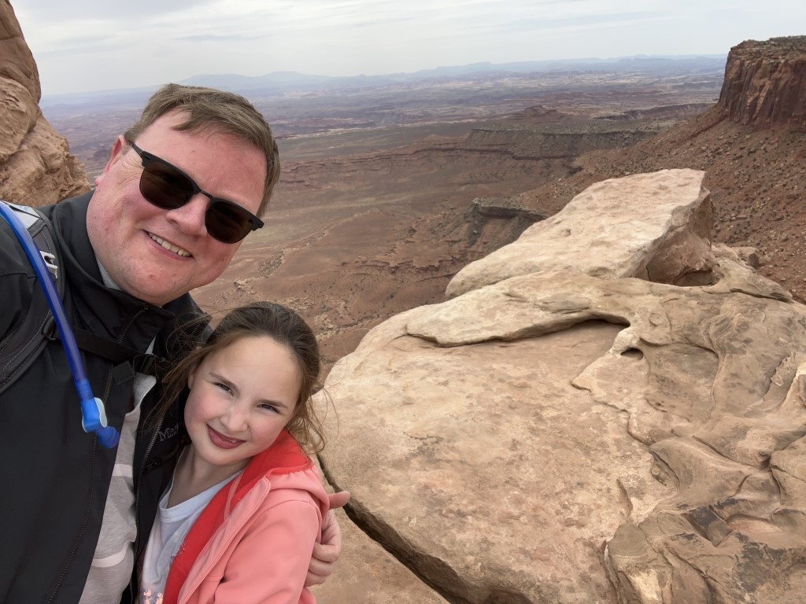
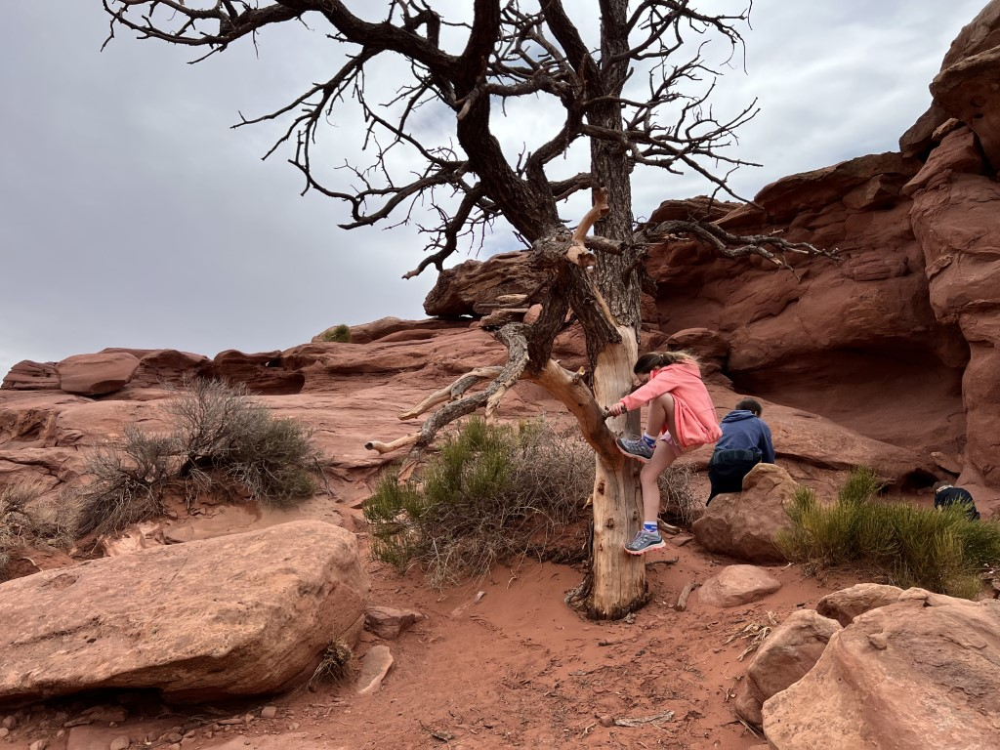
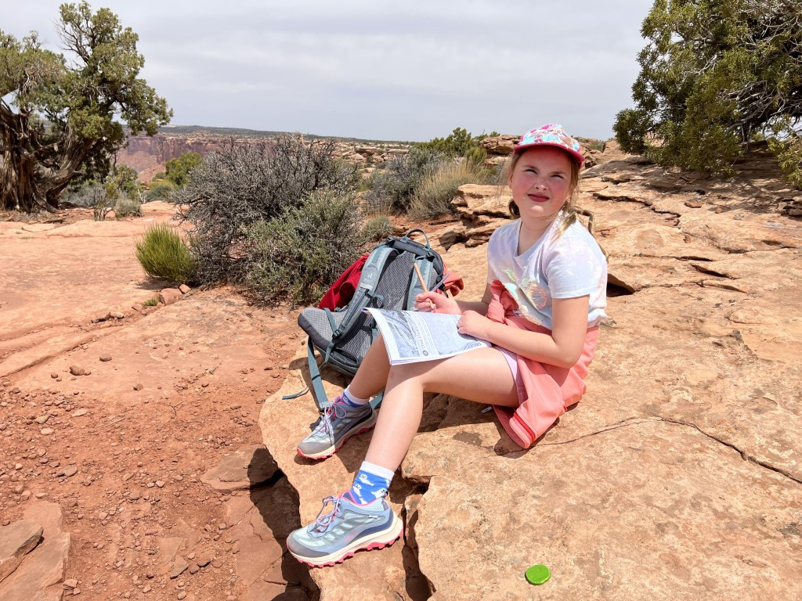

Na het ontbijt in het hotel, stappen we in de Chevy en rijden in ongeveer 45 minuten naar Canyonlands National Park. Sinds de timed entry in Arches is het hier merkbaar drukker dan bij voorgaande bezoeken. Het is nog altijd niet druk hoor, maar we zien nu wel enkele parkeerplaatsen die nagenoeg vol zijn.

We besluiten direct door te rijden naar de trailhead van de Grand View Point Overlook. Ranger Rachel begint net een praatje over het ontstaan van kloven en bijzondere rotsformaties. We luisteren aandachtig naar haar leuke en interessante verhaal.

Het eenvoudige pad loopt langs de rand van de afgrond in zo'n anderhalve kilometer naar een uitkijkpunt.

Bij het eindpunt zoeken we een rustig plekje om onze boterhammetjes te eten. Het uitzicht is indrukwekkend.

Na de boterhammetjes klimmen we nog op de lokale rots voor een 360 graden overzicht.

Na al dit vertier is het weer tijd voor serieuze zaken: enkele opdrachten uit het Junior Ranger boekje moeten nog worden afgemaakt.

Bij het visitor center vlak bij de ingang van het park heeft Sofie haar boekje overhandigd aan de ranger en plechtig beloofd goed voor de natuur te zorgen (en haar tanden tweemaal daags te poetsen, ze maken er een hele happening van :-)). En weer een mooie badge in de pocket!

's Avonds hebben we pizza laten bezorgen in het hotel die we bij het zwembad hebben opgegeten. Het is onze laatste avond in Aarchway Inn hotel. Een prima plek voor een paar dagen Moab. We hebben ervan genoten.
