Doodsangsten heb ik vandaag uitgestaan, doodsangsten!

Vandaag hebben we de Peek-a-boo slot canyon verkend. Een slot canyon is een lange en smalle soort gang in een rotsformatie, weggeërodeerd door water. De nadruk ligt hierbij op het woordje smal.

Vanuit onze yurt in Escalante is het een klein stukje terug naar het oosten, waarna we een 38 km lange onverharde weg op draaien. De weg is prima te rijden, je moet harder rijden dan je gevoel zegt. Dan vallen de hobbels mee, en trilt de auto een stuk minder omdat je min of meer over de wasborden heen vliegt. Gelukkig gaat het merendeels rechtuit, bij de bochten moeten we wel rustig aan doen, want anders ga je slippend door de bocht. Onze auto heeft gelukkig 4 wielaandrijving, dus het gaat allemaal prima.

Helemaal aan het einde van de weg is een parkeerplaats en de trailhead voor de wandeling. De wandeling is een rondje: stukje woestijn, Peek-A-Boo slot canyon, stukje woestijn, dan de Spooky slot canyon, en dan weer door de woestijn terug naar de parkeerplaats. Ik heb begrepen dat de namen van de slot canyons zijn verzonnen door een groep schoolkinderen die de canyons ooit hebben bezocht. De eigenaar van de yurts zei gisteren tegen me dat Spooky een heel stuk smaller is, en twee afdalingen bevat die "uitdagend" zijn. Hij adviseerde om alleen Peek-A-Boo te doen, en Spooky over te slaan. Bovendien is Spooky op een bepaald punt ECHT smal. Om minder smalle mensen als ik niet in de problemen te brengen, staan bij de parkeerplaats twee palen in de grond, zodat je kunt passen of je in de tweede slot canyon past. Conclusie: ik pas niet :-)

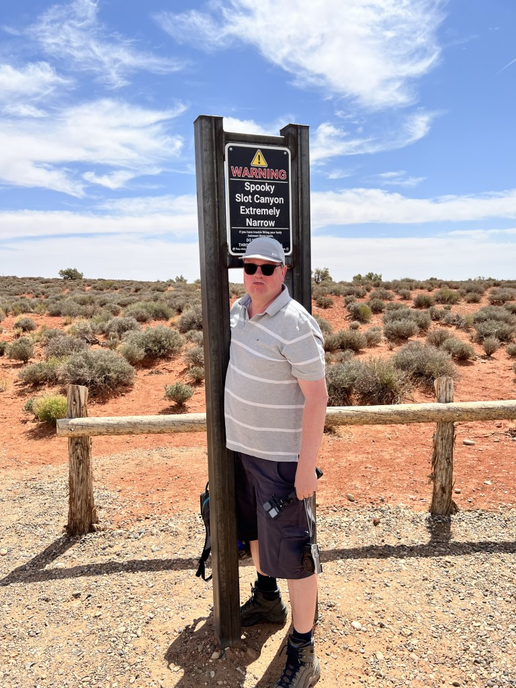

Maar niet getreurd, volgens de berichten op internet is Peek-A-Boo sowieso de mooiere van de twee. Dus vol goede moed gaan we op pad. Het begint allemaal eenvoudig. Via een mooi paadje lopen we langs de rand van de afgrond, met prachtige vergezichten.

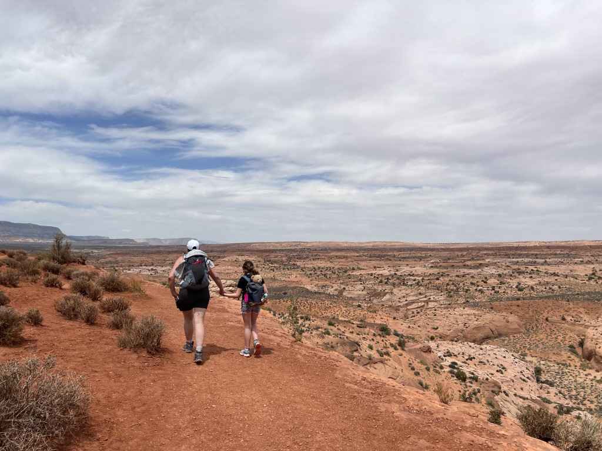

Het is vandaag warm, maar er staat gelukkig wel een verkoelend briesje. Sofie was een beetje in de mopperstand: "Normale papa's en mama's nemen hun kind mee naar een zwembad, en niet naar de woestijn om te wandelen". Misschien heeft ze wel een beetje gelijk :-)

Al vlug moeten we zeer steil naar beneden om richting de ingang van de slot canyon te gaan.

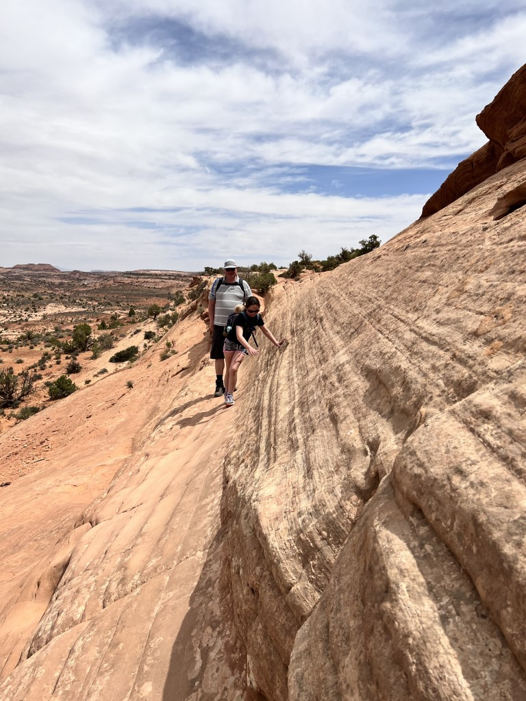

En al gauw doemde de eerste te nemen hindernis op: om in de canyon te komen moet een muur beklommen worden van 3 meter!

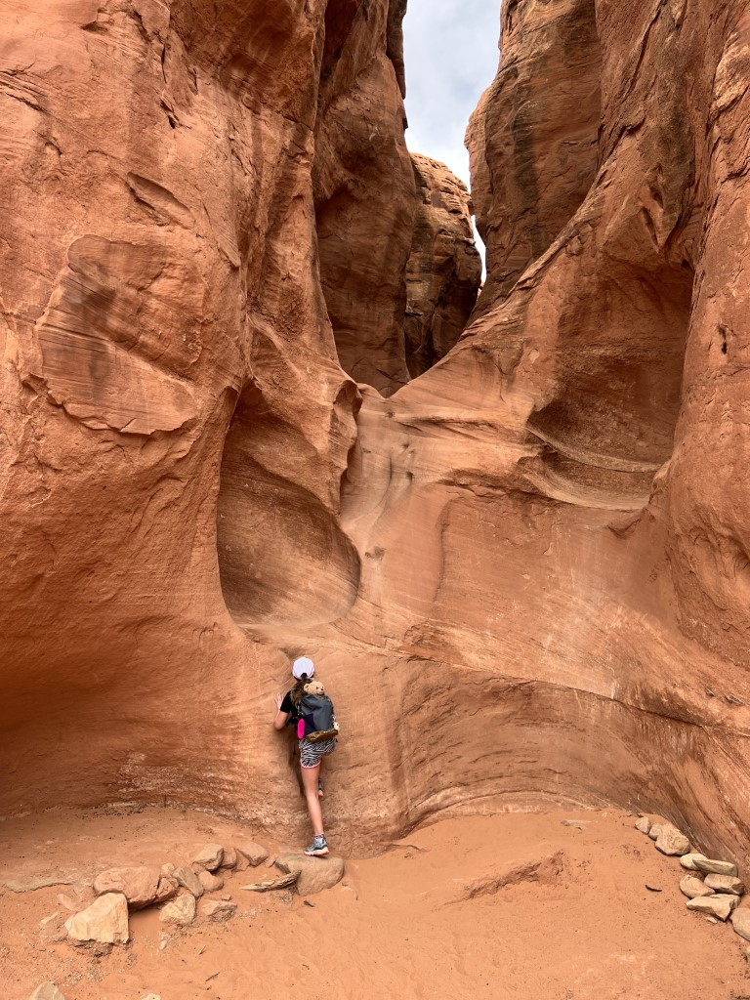

Je kunt je niet echt goed vasthouden, dus de eerste schaafwonden zijn een feit.

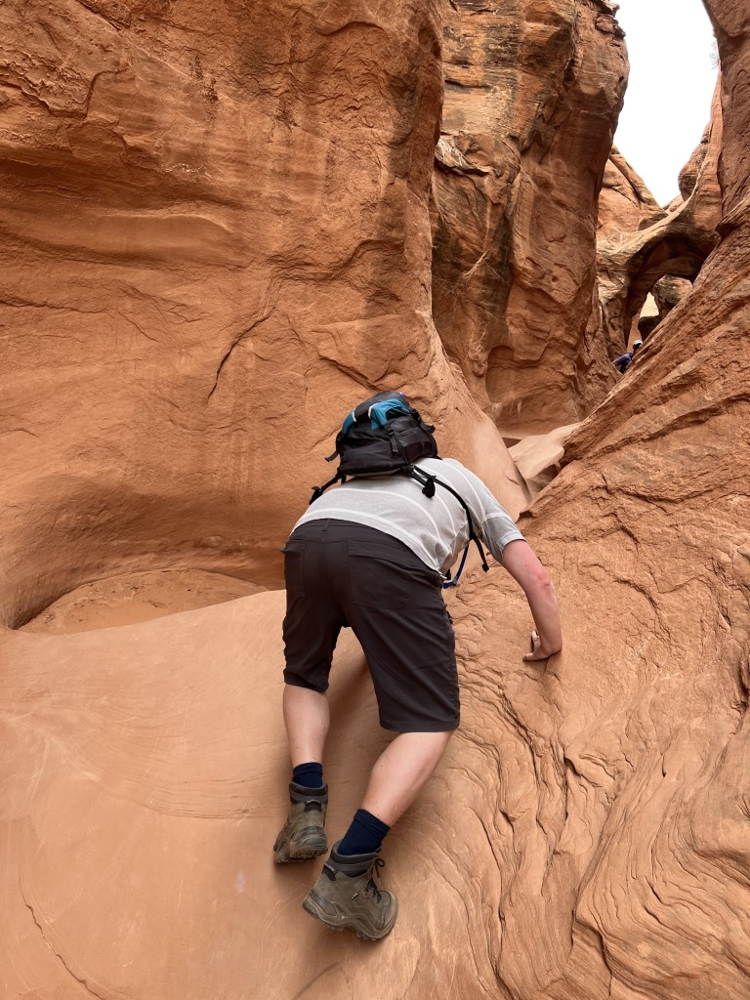

Na dit eerste obstakel wordt het gelukkig wat eenvoudiger, maar het blijft passen en meten.

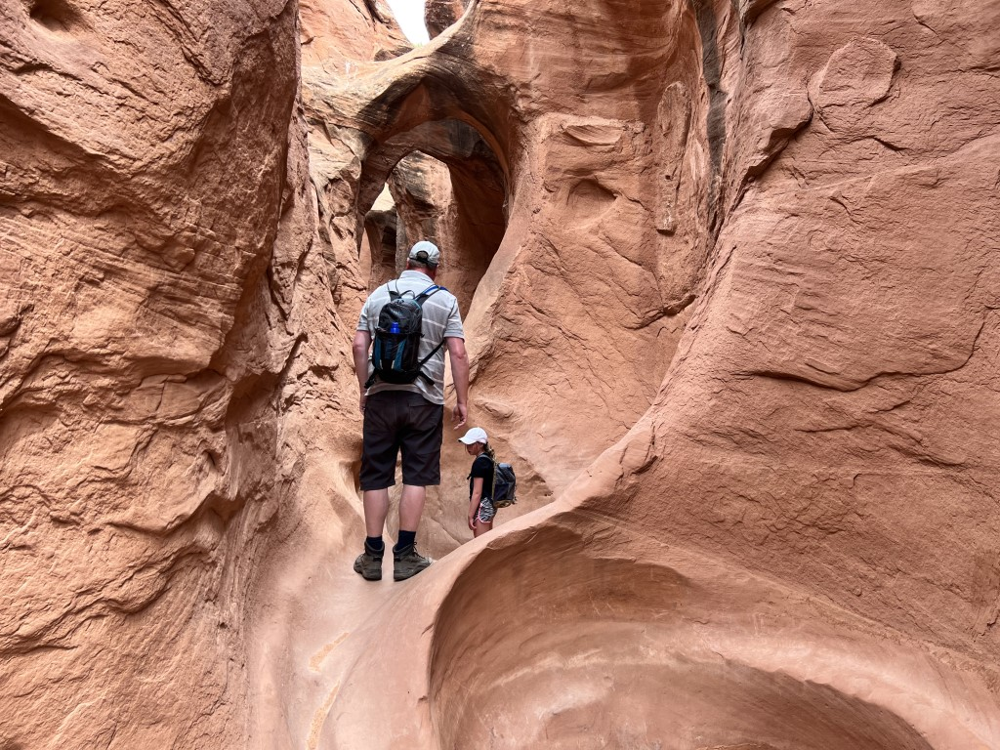

Soms moeten we zelfs onder mini-arches door kruipen...

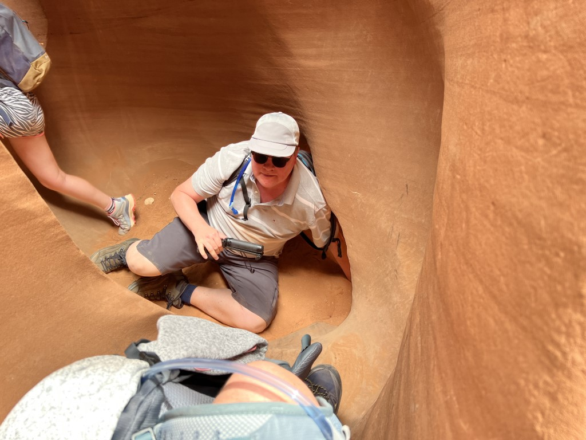

... om vervolgens door een soort pijp naar boven te klauteren.

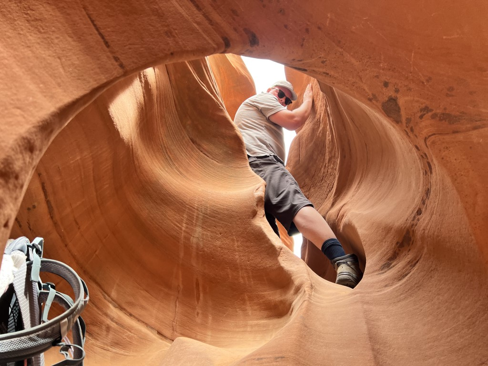

Echt onprettig smal wordt het gelukkig maar heel even, ik moest heel even wat stroef tussen borst en schouders zijwaards voortbewegen.

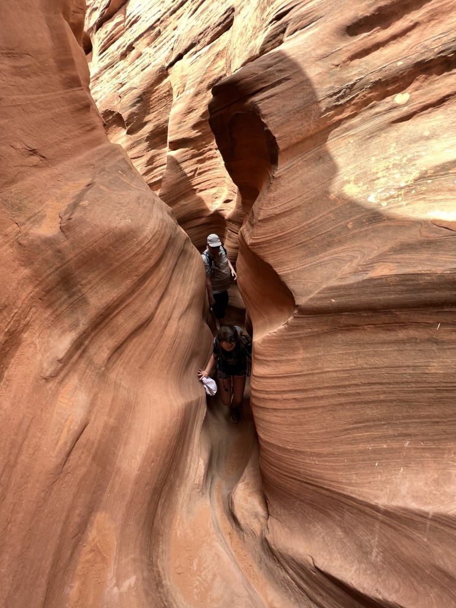

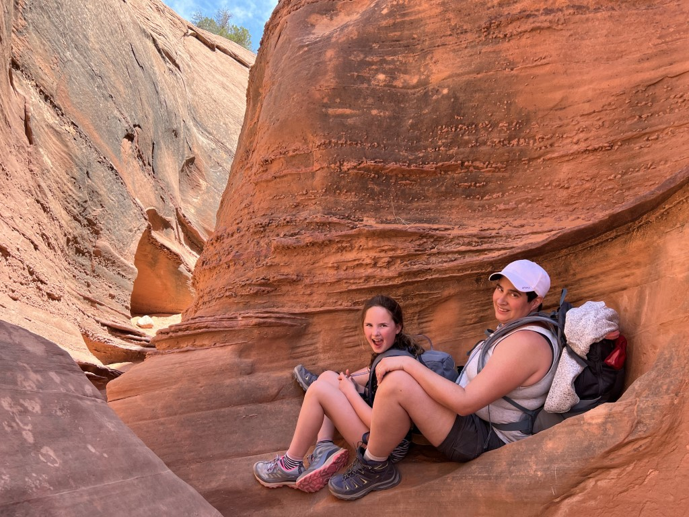

De mopperstand van Sofie was, na de overwinning van de 3 meter klim bij de entree, helemaal over en ze had veel plezier in het klimmen en klauteren. Diezelfde mopperstand kwam redelijk snel na de uitgang van de canyon weer terug, want nu moesten we een behoorlijk eind door de woestijn terug wandelen richting de auto. Bovendien moesten we het steile stuk nu naar boven. Wat we on-Amerikaans vonden, was dat het pad niet duidelijk stond aangegeven. Gelukkig konden we met behulp van een navigatie app met een goed gevoel tussen de rotsen en struiken laveren.

Op deze foto is goed te zien waar de ingang van de canyon is.

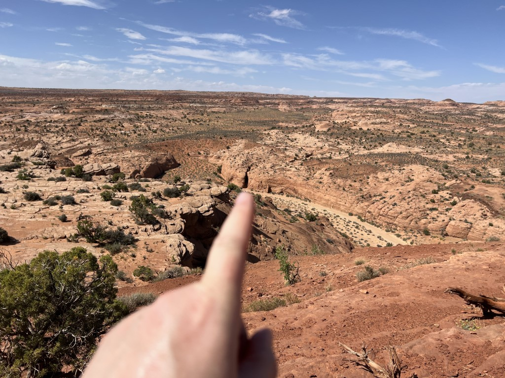

Uiteindelijk hebben we een kilometer of 10 gewandeld. Best een eind, met veel stukken mul zand. Moe maar voldaan rijden we de weg weer terug naar de bewoonde wereld. Onderweg stoppen we nog even bij Devils Garden waar we nog meer moois bekijken.

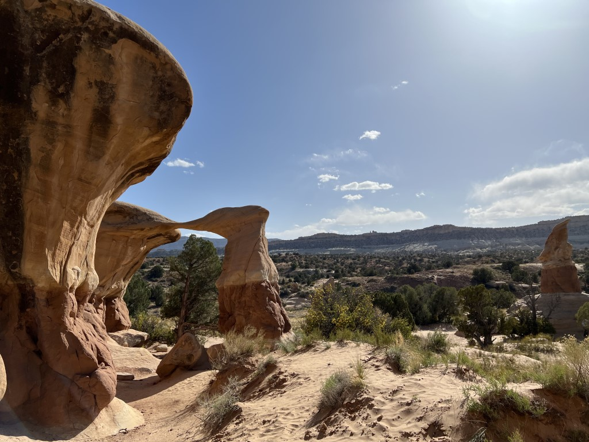

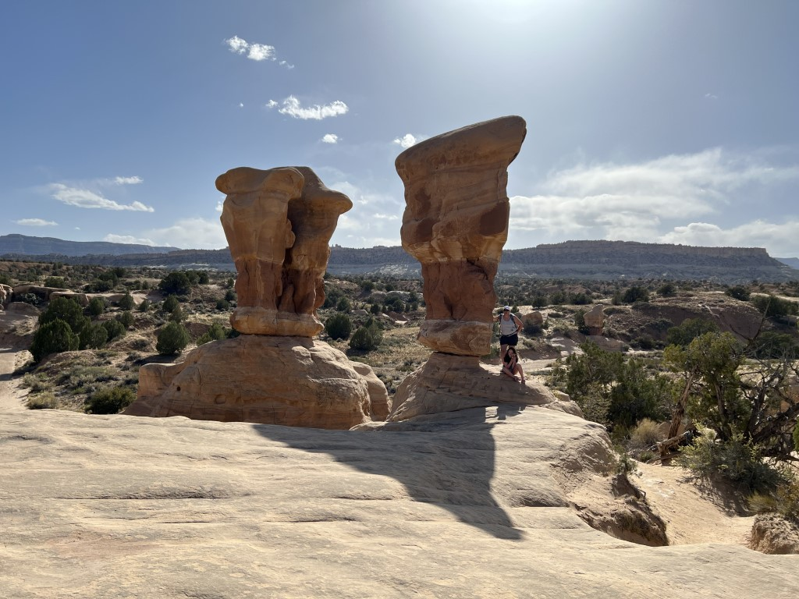

Na al deze inspanningen is het tijd om in anderhalf uur naar Bryce Canyon National Park te rijden. Het park zelf gaan we niet bezoeken, we overnachten enkel in Ruby's Inn (note to self: volgende keer NIET meer in dit hotel. Onaardige mensen, geen wifi in de kamer, koud zwembad, enorm druk en DUUR).
