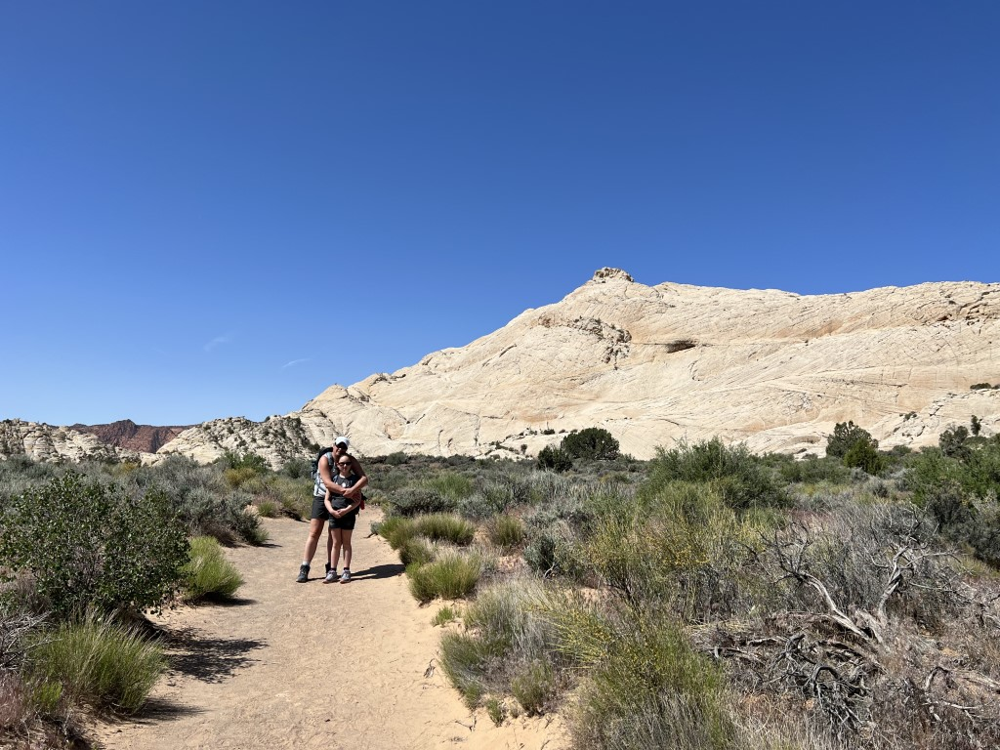
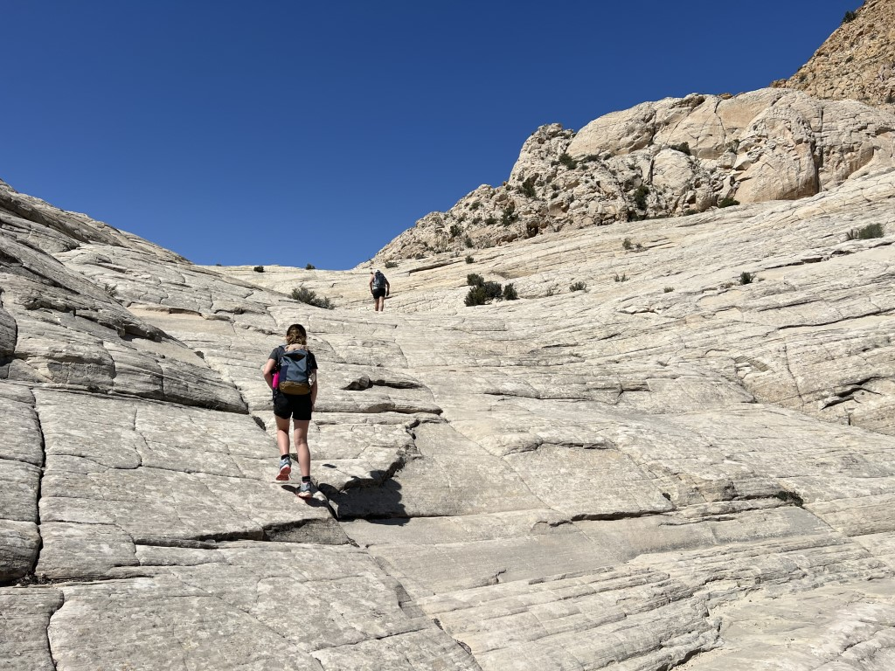
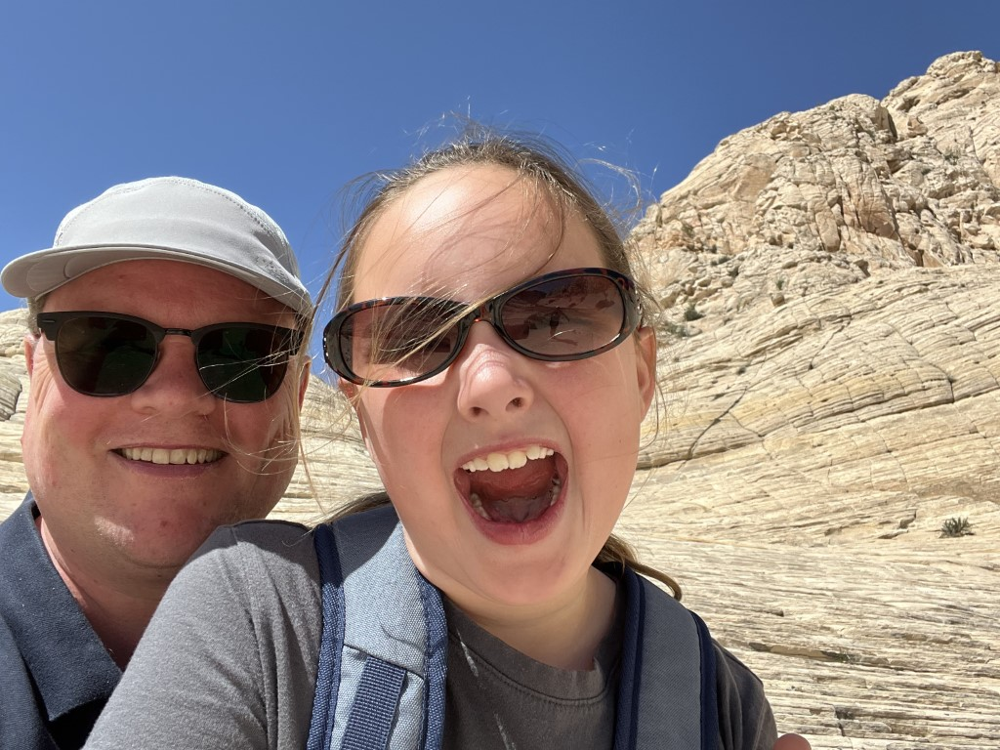
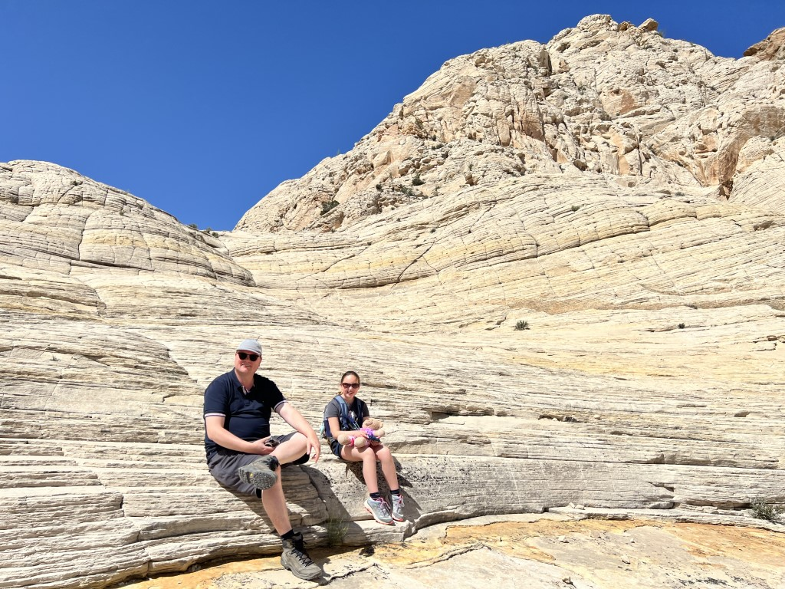
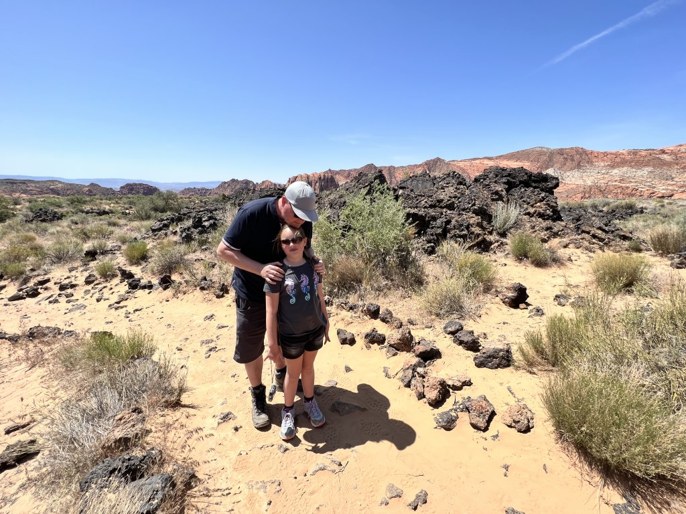
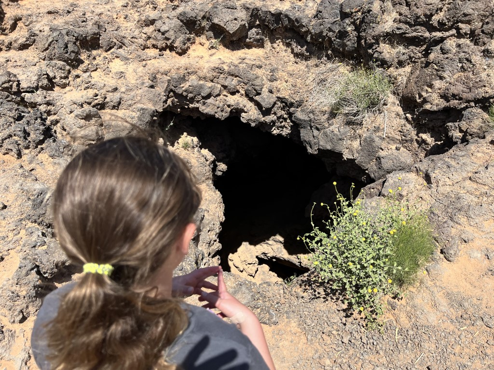
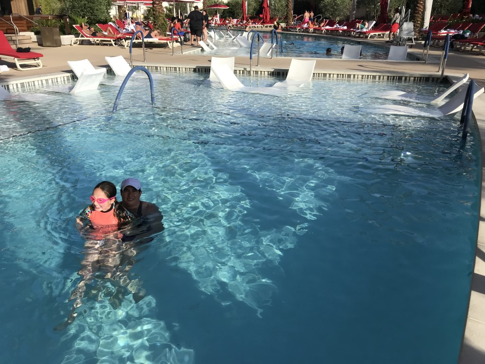

Vernoemd naar Lorenzo en Erastus Snow, prominente Utah pioneers, ligt dit mooie state park iets ten noorden van St George. Aangezien we pas na vieren kunnen inchecken in ons hotel in Las Vegas, geeft het ons mooi de tijd om dit park te bezoeken. Volgend weekend is hier in de buurt de Iron Man race (2 km zwemmen, 67 km fietsen, 20 km hardlopen) en het fietsgedeelte wordt al driftig geoefend in het park. We beginnen de dag met een bezoek aan de (slapende) Santa Clara vulkaan. Deze is minder spectaculair dan verwacht, dus gaan we snel naar de trailhead voor de wandeling naar het Amphitheater. Dit is een heel aardig, zij het kort, wandelingetje. Eerst een stuk door de woestijn...

en dan weer lekker klimmen en klauteren over de rotsen.

Het is heerlijk weer, en we zijn lange tijd helemaal alleen.

Na een kwartiertje of zo komen we aan bij het amphitheater. Mooi om alle kleuren en geuren in je op te nemen. We worden er helemaal blij van.

Er wordt zelfs een klein vreugde dansje gedaan, daar is helaas ook bewijsmateriaal van.



Je ziet het, een man van vele talenten. En schaamteloos bovendien.

Na alle loftuitingen in ontvangst genomen te hebben voor het ongekende, welhaast epische, danstalent, zijn we op pad gegaan om de lavatubes te bekijken. Een lava tube is een soort tunnel die door de lavastromen zijn gevormd. De buitenste rand is al weer verhard, terwijl binnenin de lava blijft stromen.

De ingang van de tube is een donker en vooral diep gat. Je mag er in, maar dat lijkt ons niet zo'n best plan. Ook al omdat Sofie het handig vond om vlak voor de ingang te struikelen op de lava stenen, met kapotte handen en een knie tot gevolg.

Na de lunch in het park, hebben we de Chevy op de Interstate 15 zuidwaarts gezet richting Las Vegas. Het blijft toch bijzonder: vele tientallen kilometers lang zie je niks anders dan zand en een verloren cactus. Dan rij je over een heuvel en zie je in de verte de skyline van Las Vegas. Het is dan nog bijna 30 kilometer rijden voor je in de stad bent.

We blijven twee nachten bij de Hilton At Resorts World. Het is een enorm complex en heeft een gaaf zwembad. Dat zwembad moet natuurlijk als eerste worden uitgeprobeerd.

Op de zijkant van het hotel is een enorm groot scherm gemaakt waarop allerlei filmpjes worden getoond. Indrukwekkend!

 uitkijken over het zwembad en een deel van de beroemde Strip. Met name 's avonds levert dat mooie plaatjes op.

 naar huis maar een klein stukje, in de praktijk valt dat echter vies tegen. Zolang je op de Strip loopt is het allemaal prima, maar zodra je daar een stap van af bent, is het een stuk grimmiger. We besluiten snel weer terug naar Westgate te gaan en een taxi te nemen.
