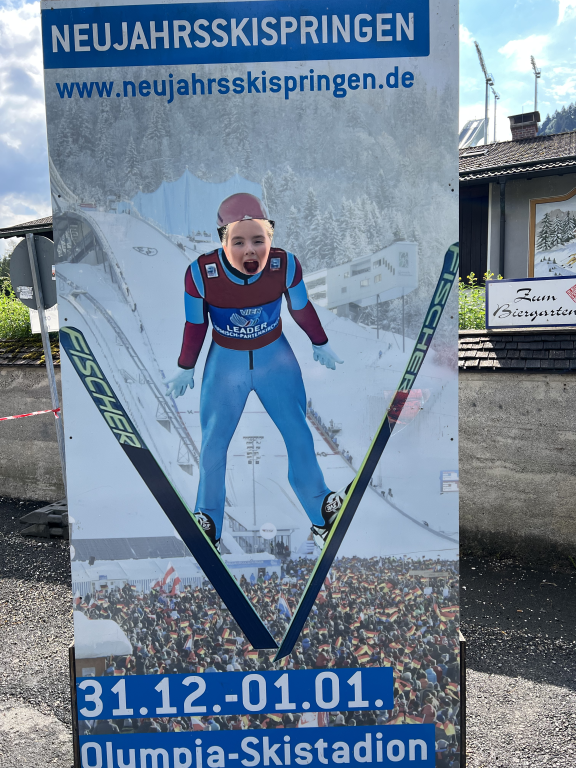
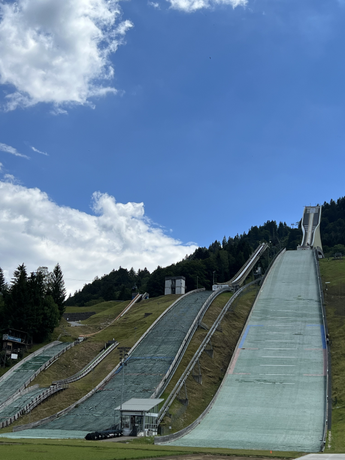
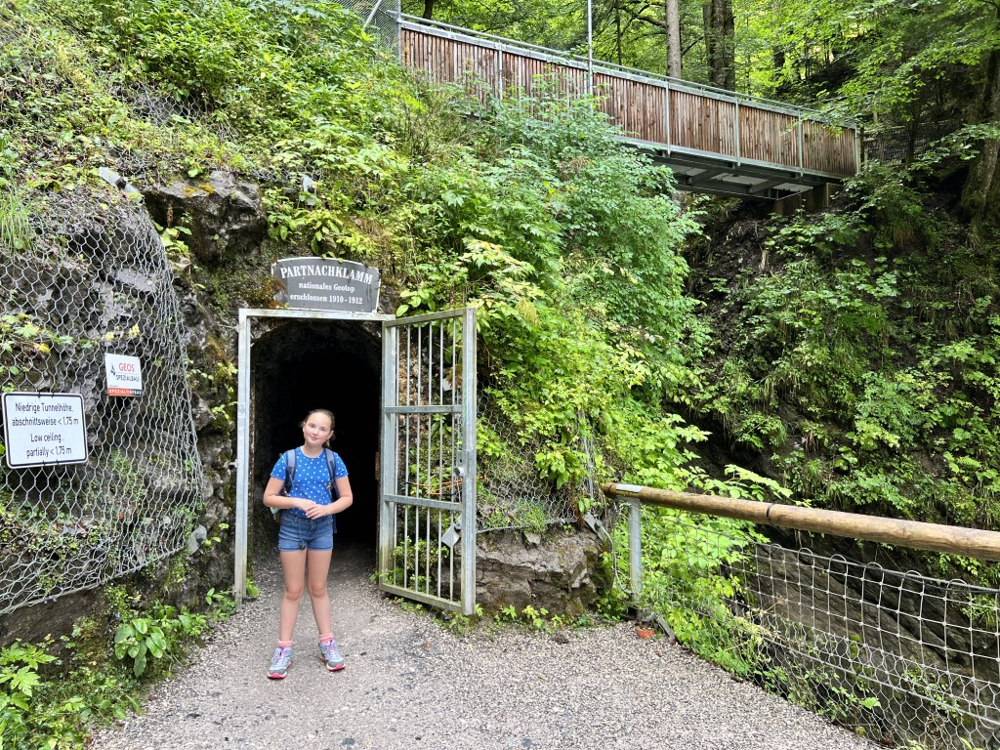
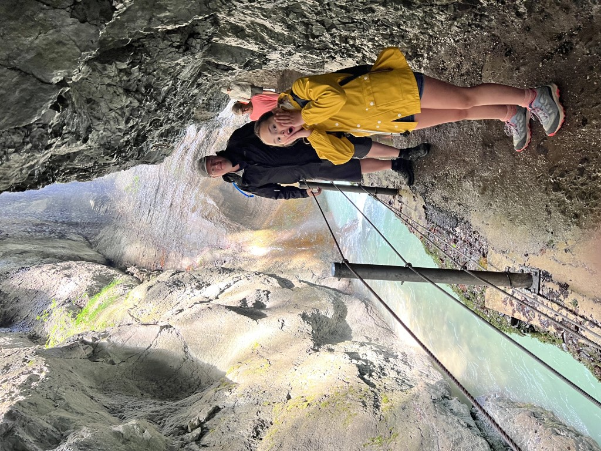
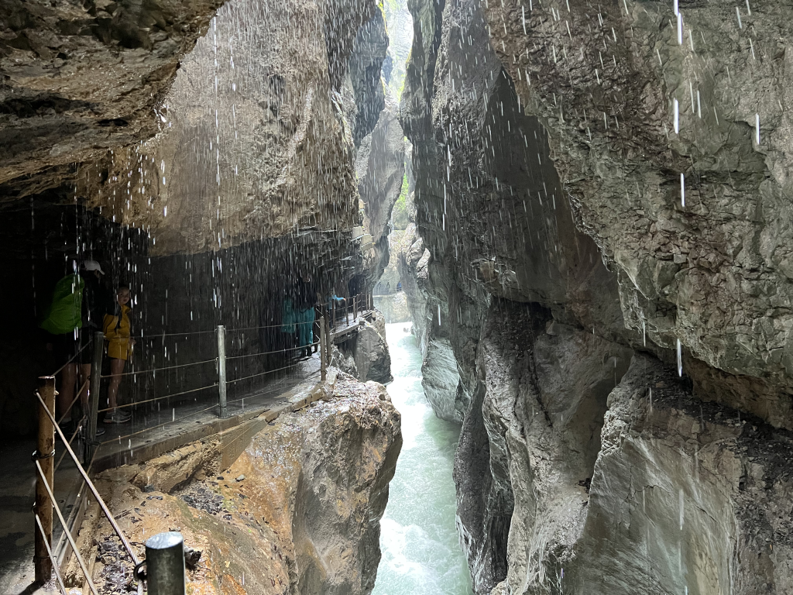
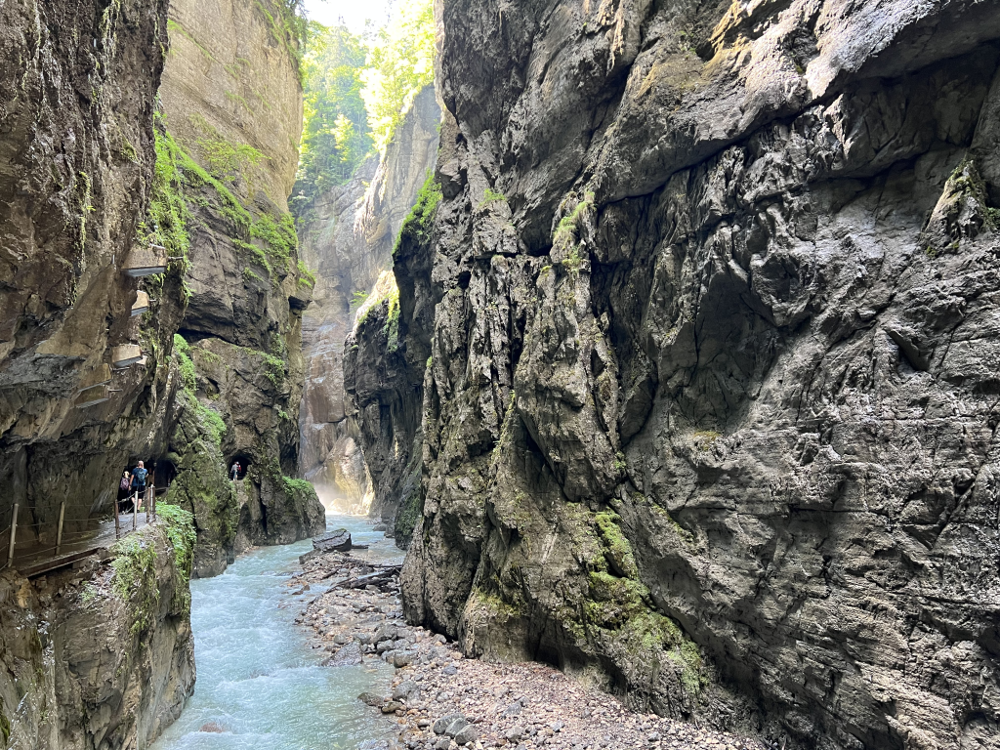
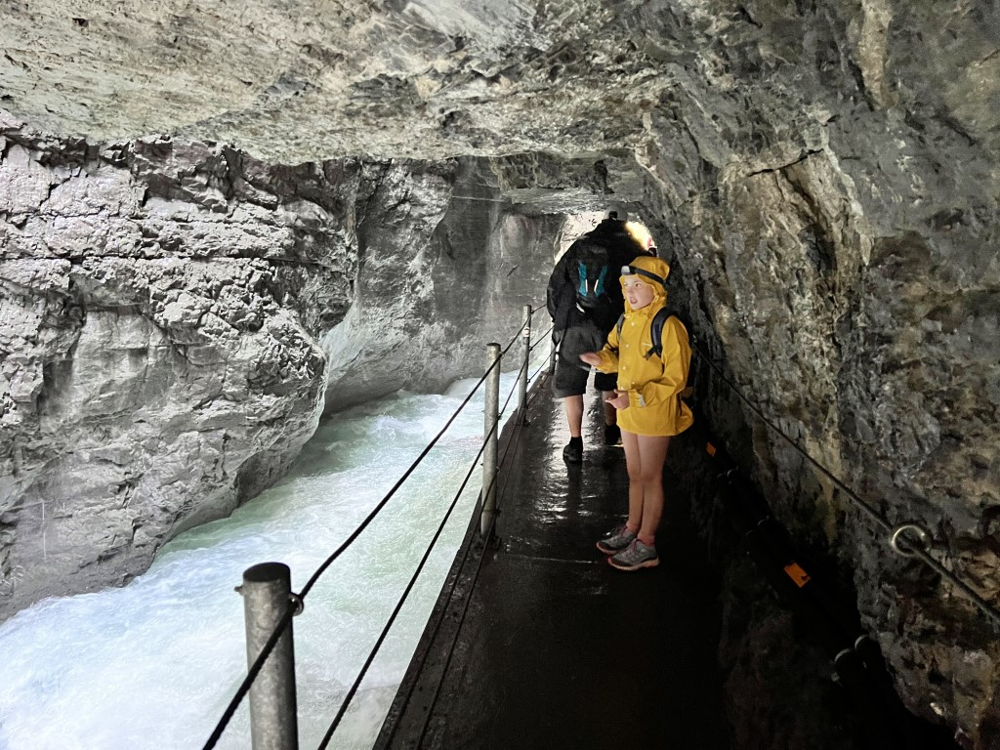
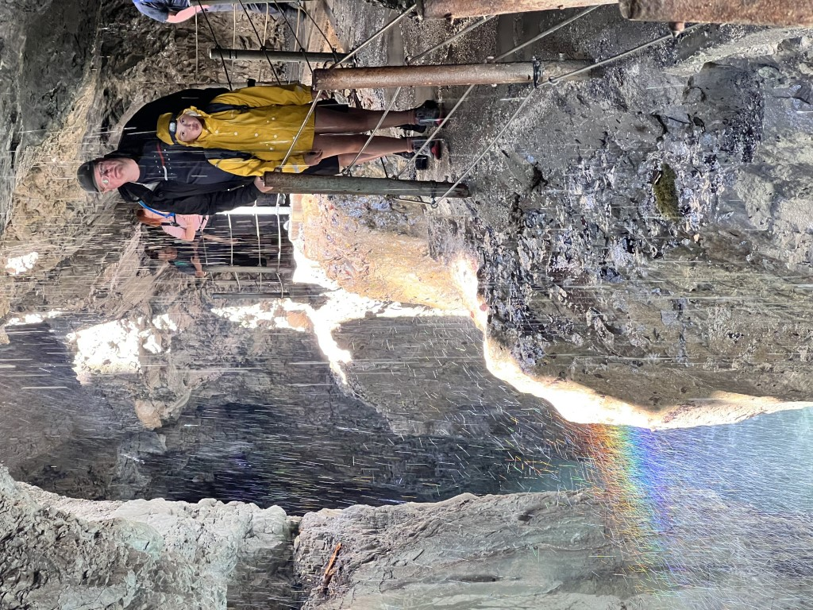
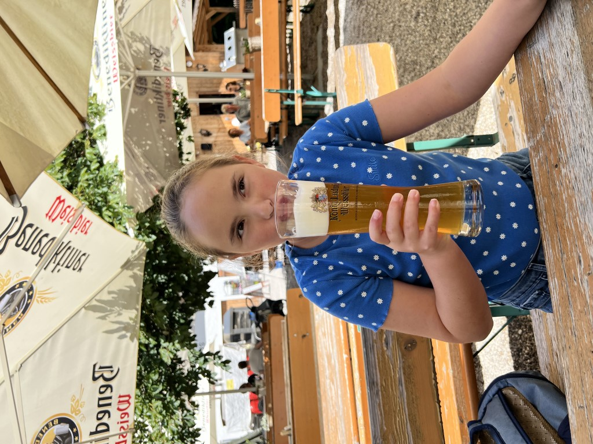

Wanneer we wakker worden blijkt het behoorlijk te regenen. Een vlugge blik op de weer-app leert ons dat het vanaf 10 uur droog wordt. En dus hebben we alle tijd om op ons gemak te ontbijten. Bijna op loopafstand van ons appartement bevindt zich de Partnachklamm. Deze kloof is ruim 700 meter lang en heeft rotswanden van 80 meter hoog. De Partnach rivier voert smeltwater van gletsjers mee wat zorgt voor een kolkende watermassa in de smalle doorgang. Het water is afkomstig van de gletsjers op de Zugspitze. Het water verdwijnt onderaan de gletsjers in de bodem en komt op 1500 meter hoogte bij de bron weer naar boven, waarna de rivier zijn weg zoekt naar het lager gelegen Reintal. Hierdoor zijn meerdere kloven ontstaan maar de Partnachklamm is de bekendste.

We parkeren onze voiture bij het parkeerterrein van de welbekende springschans.

Vanuit hier is het zo'n 20 minuten wandelen naar de ingang van de kloof. Ook hier moet je toegangskaartjes kopen, maar dat hebben we al online gedaan. We hoeven dus niet in de rij te staan bij de kassa (het kan hier erg druk worden namelijk) en kunnen direct doorlopen naar de poort.

Maar goed dat we de regenjasjes meegenomen hebben, want het water druppelt overal vanaf. Op sommige plekken lijkt het alsof je onder de douche staat.

Het pad blijft eigenlijk de hele tijd vlak, en is volledig van beton. Het loopt dus een stuk aangenamer dan het pad door de Höllentalklamm, waar we een paar dagen geleden waren. Hier zijn de tunnels echter niet verlicht, dus af en toe is het behoorlijk donker.

Het blijkt dat meer mensen vanmorgen de bui hebben afgewacht, want op de weg terug is het enorm druk met tegemoetkomend verkeer. We waren dus op tijd vertrokken. We hebben geluncht bij Klammhaus an der Partnach op het terras. Er zat een meneer met een accordion hoempapa liedjes te spelen. De Currywurst mit Pommes bleek van reuzenformaat, en smaakte bijzonder lekker.

's Middags zijn we gaan zwemmen in het Alpspitz-Wellenbad in Garmisch, gelegen aan de andere kant van het spoor, dus we kunnen er naar toe lopen. Het gebouw ziet eruit alsof het uit de hoogtijdagen van de nazi's komt, maar de toegang is voor ons gratis (we hebben een Gästekarte van het appartement ter beschikking gekregen) en er is een aantal zwembaden waarin we de nog resterende energie kwijt kunnen.

's Avonds hebben we weer in het eigen appartement gegeten. Nadat Sofie sliep hebben we de tassen weer allemaal ingepakt, want morgen gaan we Garmisch verlaten. Op naar de volgende bestemming: Pozzolengo, aan de zuidkant van het Gardameer.
