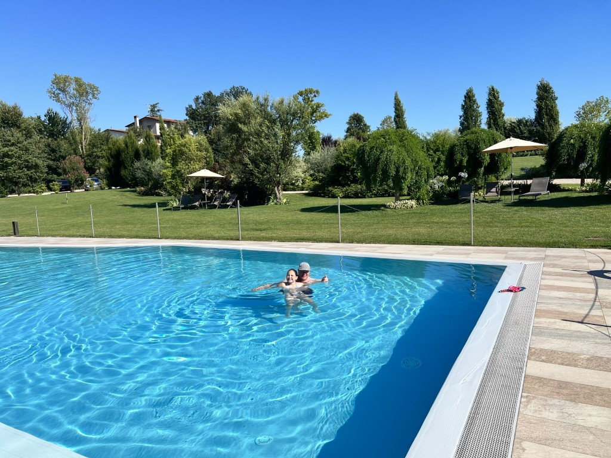
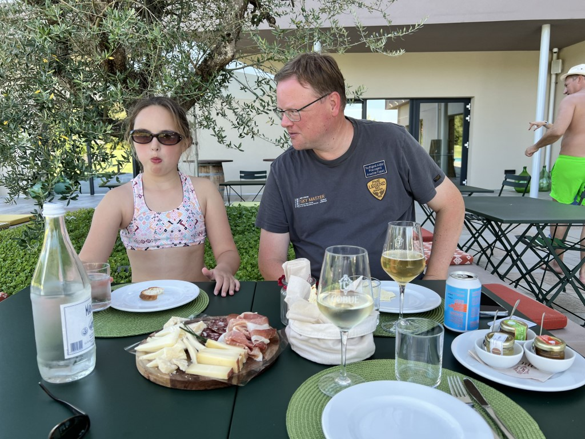
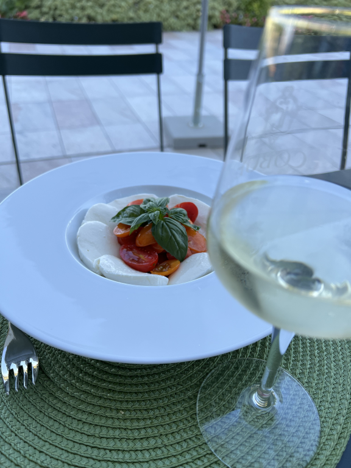

Er wordt drukte voorspeld op de wegen naar het zuiden, dus we vertrekken om 8:30 vanuit Garmisch Partenkirchen. Met pijn in het hart, want we hebben het hier heel erg naar onze zin gehad. Het appartement is prima bevallen, zowel qua locatie als qua mensen. De beheerders zijn super vriendelijk, en ook de inpandige bakker is goed.

Het eerste stuk door Duitsland en Oostenrijk gaat zonder enig oponthoud. Vanaf dat we aansluiten bij de tolpoortjes voor de Brennerpas, is het echter zo'n beetje de hele weg tot onze bestemming file rijden. We staan niet echt stil, maar het is iedere keer van 80 naar 30 km/u. Heel vervelend rijden dus.

Uiteindelijk komen we om 14 uur aan bij wijngaard [Cobue](https://www.cobue.it) in Pozzolengo. We worden zeer hartelijk ontvangen door Francesca die ons uitlegt hoe alles te werk gaat (in perfect Engels gelukkig). Het landgoed beslaat 18 hectaren. De wijnboer heeft slechts 6 appartementen te huur, dus het is allemaal erg kleinschalig. Het is allemaal brandschoon. In de enorme tuin is een prachtig mooi zwembad, dus daar duiken we als eerste in.

Bij het zwembad is een aantal tafeltjes waar we in de schaduw van een olijfboom een plankje kaas en worst eten onder het genot van een goed glas wijn, en een heerlijk artisanaal biertje. Het plankje was vlot leeg, dus we bestelden ook nog een overheerlijke caprese.

