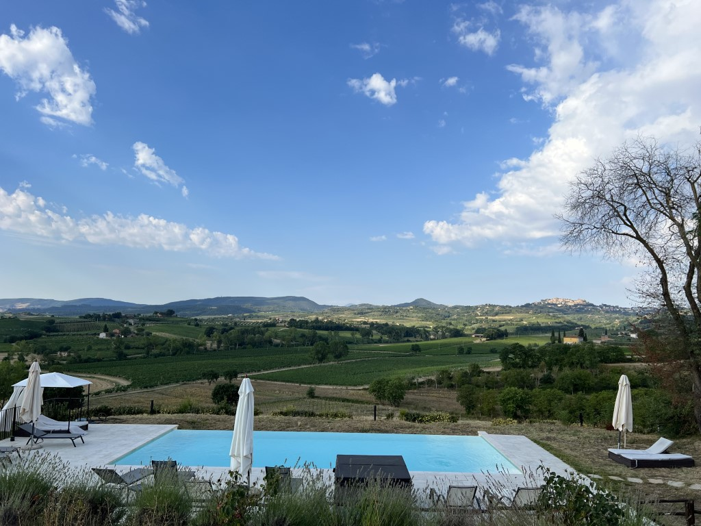
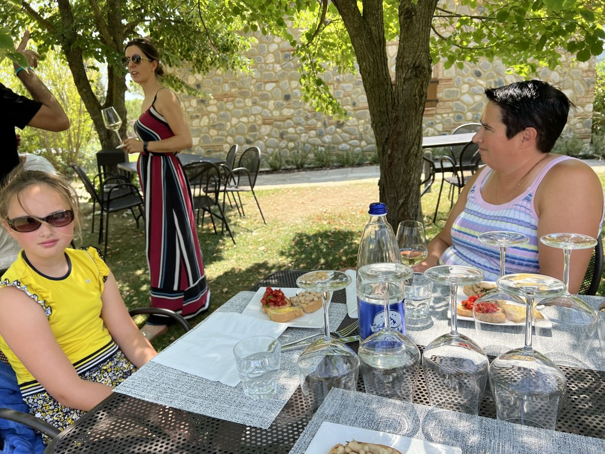
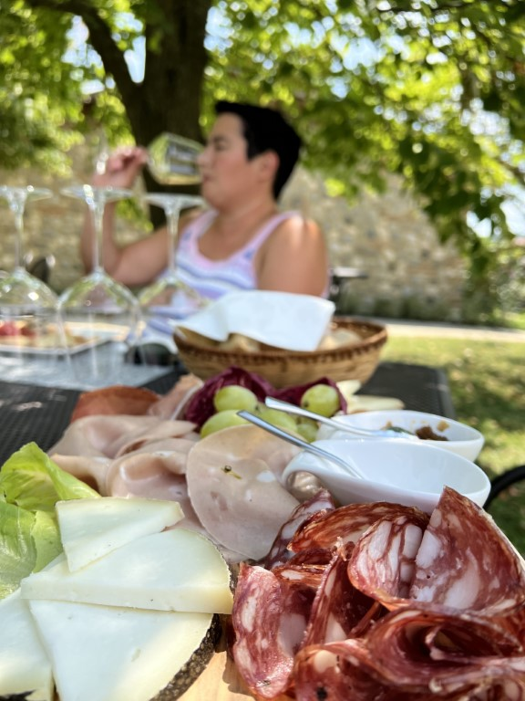
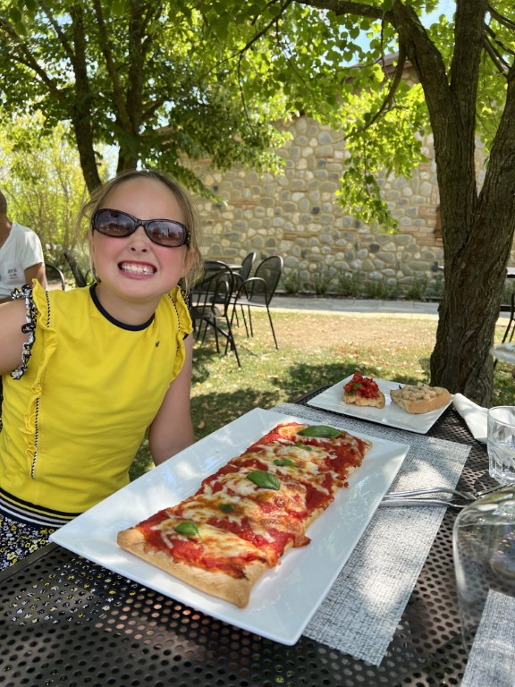
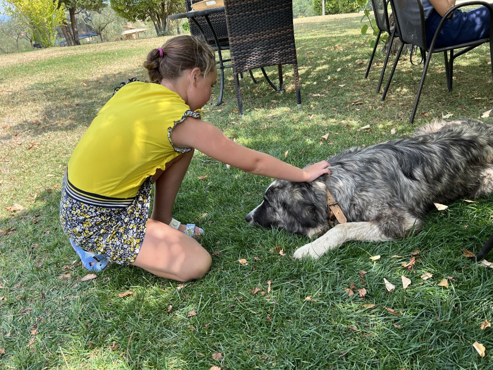
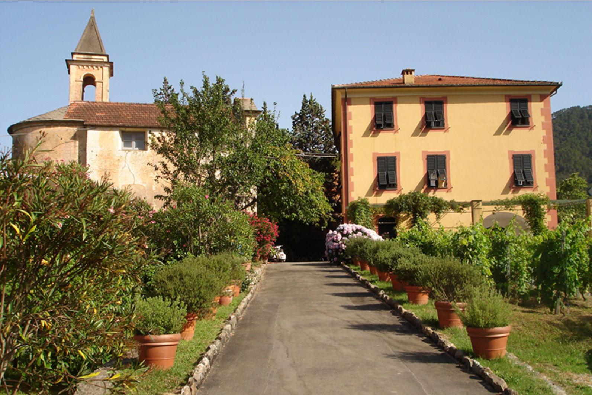
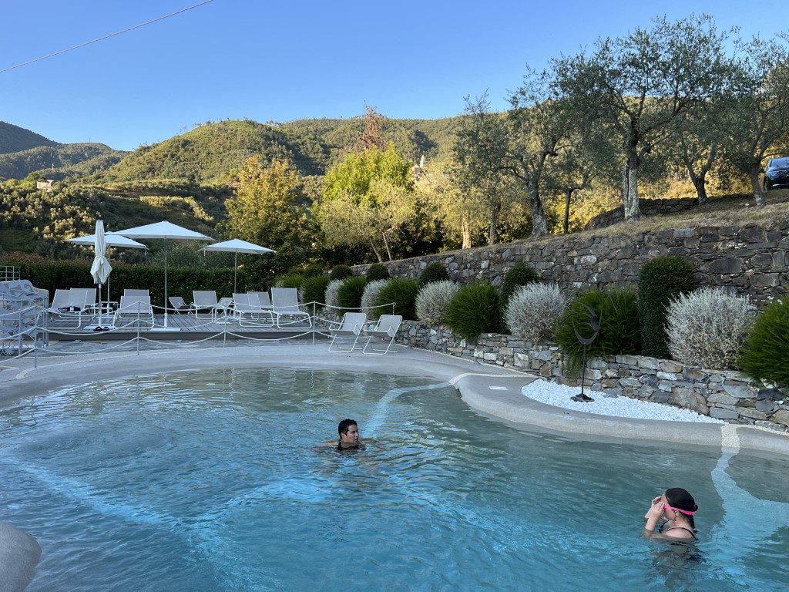

Via Anita hebben we een late checkout en een wijnproeverij geregeld bij het wijnhuis Terra Antica (de eigenaar van ons appartement). Na nog een laatste blik op het zwembad en het achterliggende landschap, stappen we in de auto en rijden naar het hoofdgebouw.

Na de korte rondleiding door de wijnkelder en uitleg over het proces, lopen we naar de tuin waar de tafels al gedekt klaarstaan. We gaan zitten en er wordt een plank met worst en kaas neergezet, en een trio van bruchetta. Het is erg verleidelijk om meteen te eten, maar Sofia wil dat we eerst luisteren naar haar uitleg over hoe je wijn moet proeven :-(

Ze legt uit hoe de kleur iets kan zeggen over de leeftijd en of de wijn opgeslagen is geweest in houten vaten of niet. Aan de boogjes in het glas kun je het alcoholpercentage afleiden: hoe kleiner de boogjes, hoe meer alcohol. Een leuk en informatief lesje wijnproeven. Daarna moeten we ruiken en alle geuren noemen die we herkennen. Dat blijft erg moeilijk. Ook hebben we geleerd dat je bij wijnproeven geen gezicht hoeft te trekken alsof je Einstein's relativiteits theorie moet uitleggen: je moet er vooral van genieten.

We proeven in totaal vijf verschillende wijnen. Chantal heeft zich opgeofferd als BOB, dus ik mocht extra drinken. Bij iedere wijn kregen we uitgelegd welke worst, kaas of bruchetta uitermate geschikt is.

Sofie kreeg een voortreffelijke pizza voorgeschoteld.

En daarna heeft ze nog een nieuw vriendje opgedoken: de hond van de buren :-)

Na anderhalf uur proeven en eten was het tijd om Toscane voor nu even achter ons te laten. Chantal stuurt de voiture richting Levanto, de ideaal gelegen toegangspoort tot Cinque Terre. Agriturismo [Villanova](https://www.agriturismovillanova.it/en/) is ons verblijf voor de komende 4 nachten. De laatste 200 meter zijn trouwens nogal spannend: de toegangsweg naar Villanova is super smal, super steil omhoog, en bij de 2 haarspeldbochten moet je maximaal en vooral op tijd insturen, anders kun je achteruit steken, en dat is niet zo handig.

We worden hartelijk ontvangen door eigenaar Giancarlo. Villanova heeft in totaal 13 kamers/appartementen. Ons appartement bevindt zich in het 300 jaar oude hoofdgebouw. Dat belooft wat voor de wifi-verbinding... Ook hier worden we weer omringd door druiven en olijfbomen. Het uitzicht rondom is waanzinnig.

Snel zetten we al onze spullen in de kamers, trekken de zwembroek aan en duiken in het heerlijke zwembad.

Het appartement is trouwens prima. Alles kraakt en piept zoals het hoort in zo'n oud gebouw. We missen alleen opbergruimte, 's avonds pakken we de helft van de bagage weer in de tas en zetten die in de auto.
