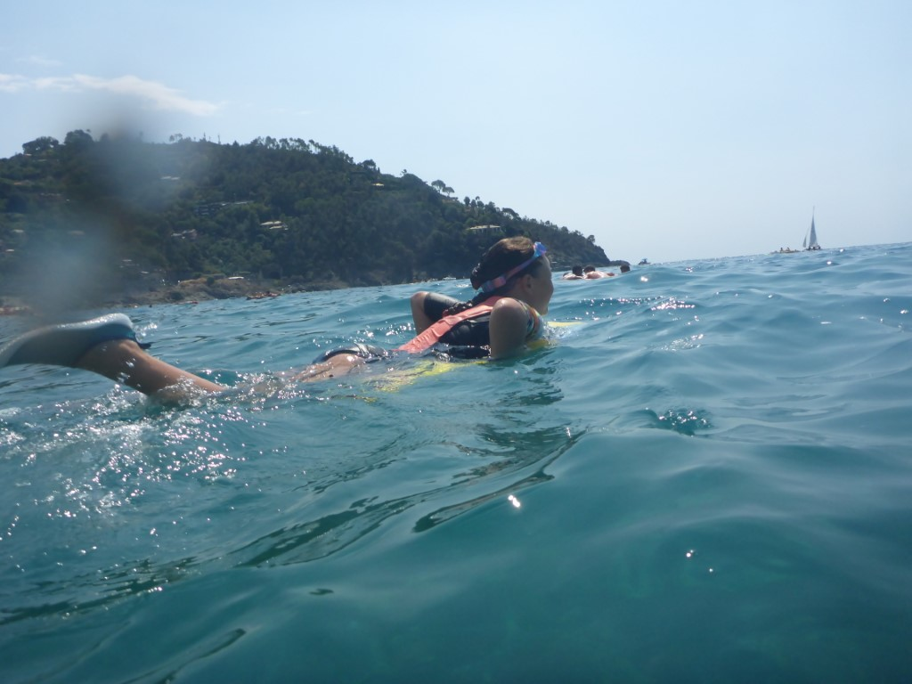
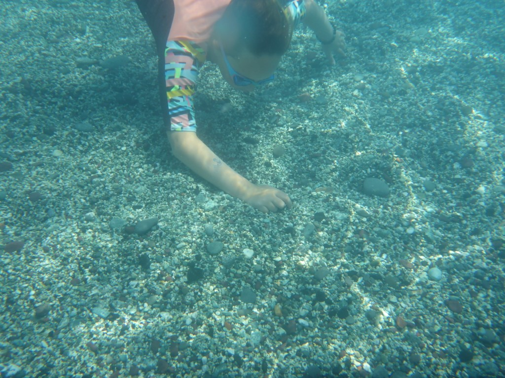
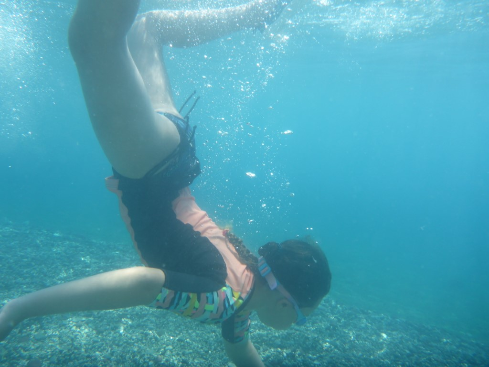

De dag waar Sofie zo naar uitkeek, is eindelijk aangebroken: vandaag gaan we naar het strand! We hebben begrepen dat het strand in Bonassola rustig is, dus we nemen de auto en rijden naar het eerstvolgende dorpje noordelijk van Levanto. De reden dat het strand rustig is, komt doordat je werkelijk nergens je auto kunt parkeren :-) Na een kwartier op en neer gereden te hebben, besluiten we dat Chantal en Sofie alvast een plekje gaan zoeken op het strand terwijl ik ga proberen de auto ergens kwijt te komen. Na een half uur wachten heb ik geluk en rijdt er iemand vlak voor me weg.

We zitten heerlijk onder de parasol en op onze mini opvouwbare stoeltjes. Sofie kan maar geen genoeg krijgen van de zee.

Bij Focacceria Antica Liguria (alleen die naam al!) halen we heerlijke lunch en die eten we op het strand op. Genieten!

's Avonds hebben we weer gegeten bij Bistrot Le Clarisse, waar we afgelopen dinsdag ook al waren. De Ravioli di Coniglio (ravioli met konijn, olijf, tomaat en kappertjes) was voortreffelijk! Het was een waardige afsluiter van ons verblijf in Cinque Terre. Morgen vertrekken naar de volgende bestemming: Toscane.
