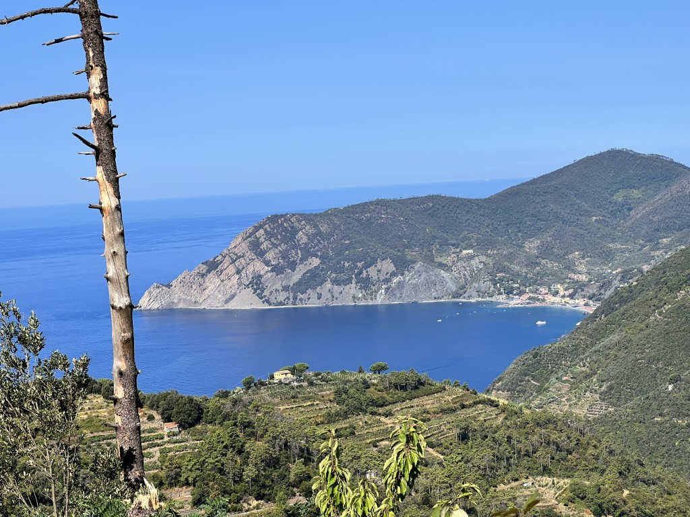
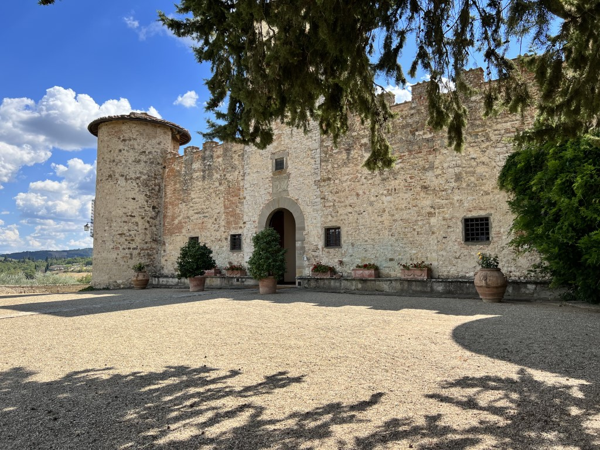
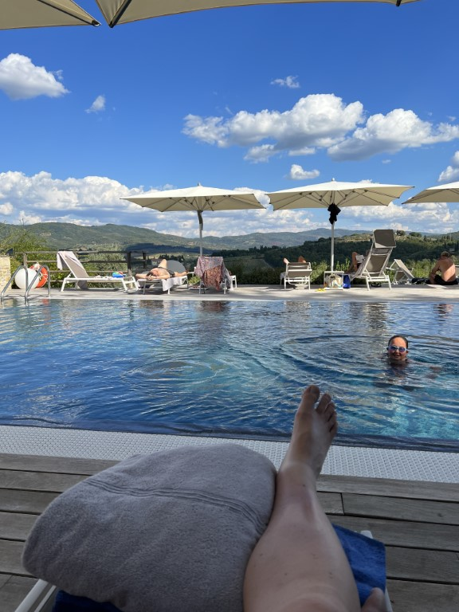
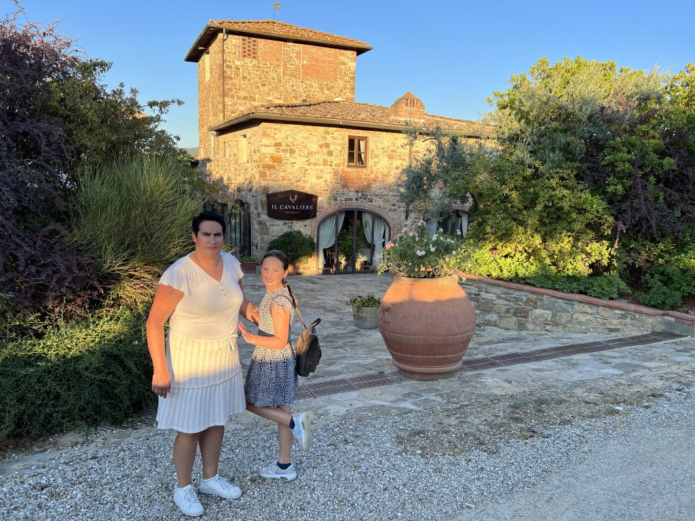
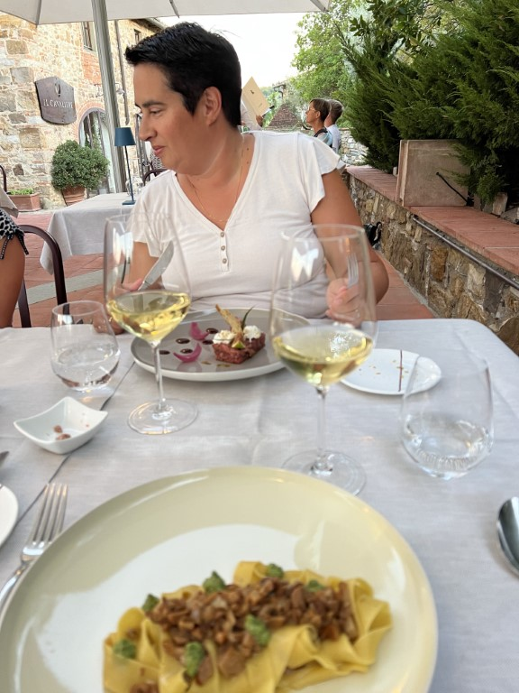

Na het ontbijt verlaten we Villanova in Levanto. Via de fantastische slingerweg rijden we een stuk langs de kust naar het zuiden. De uitzichten zijn fenomenaal.

Na iets meer dan 2 uur rijden komen we aan bij de volgende bestemming: [Castello di Gabbiano](https://www.castellogabbiano.it/) in de bekende Chianti streek.

Het kasteel stamt uit de 13e eeuw en is sinds een aantal jaren een hotel. We worden zeer hartelijk ontvangen door Barbara. Ons appartement ligt 100 meter de heuvel af en is een oude boerderij. Ons appartement bestaat uit drie verdiepingen: woonkamer/keuken/badkamer, slaapkamer en een "chill room" in de toren. Vlug halen we alle spullen uit de auto en gaan zwemmen. Hiervoor moeten we terug lopen naar het kasteel, maar dat hebben we er graag voor over.

Vanuit het zwembad heb je een prachtig uitzicht over de 140 hectaren aan druiven en olijfbomen die bij het kasteel horen.

Bij het hotel is ook een erg goed restaurant [Il Cavaliere](https://www.castellogabbiano.it/il-cavaliere/restaurant/). We hadden eigenlijk bedacht om zelf te koken, maar een vlugge blik op de menukaart heeft ons overtuigd.

We nemen plaats op het mooie terras, en we drinken fantastisch lekkere wijn. Vooraf voor meneer de Parpadelle met ragout van paddenstoelen en pesto, en voor mevrouw senior de beef tartare. Mevrouw junior knaagt een heel bord spaghetti met tomatensaus op. Daarna een super T-Bone steak die we met ons drieën burgemeester hebben gemaakt.

