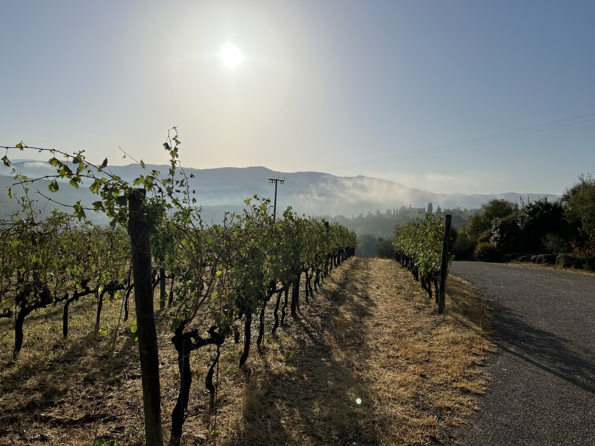
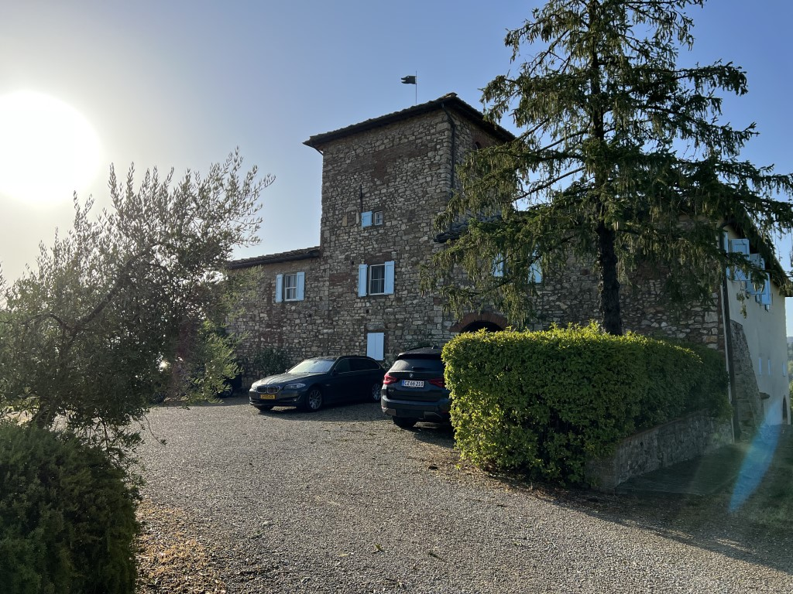
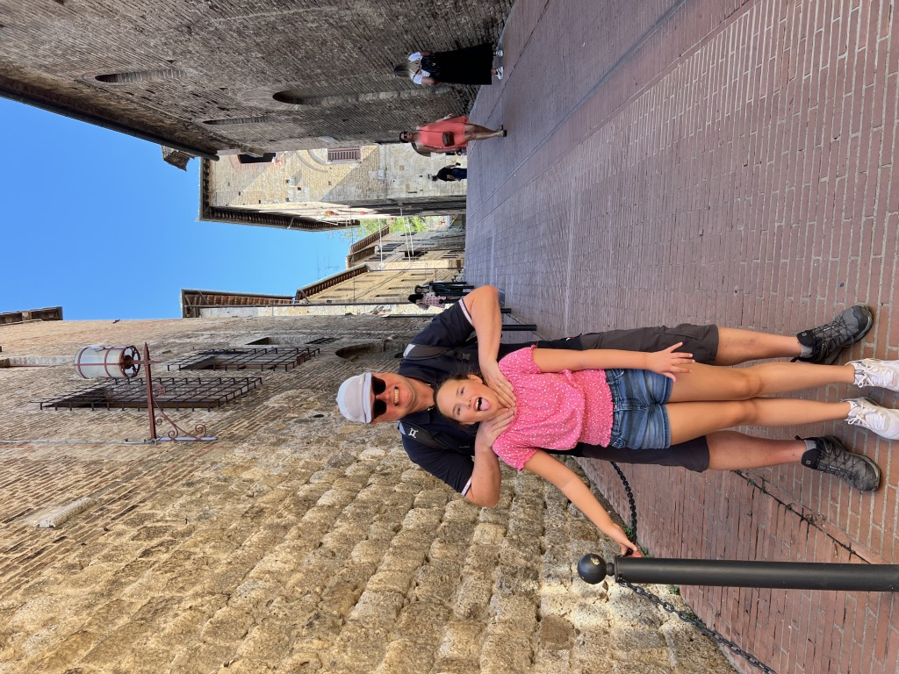
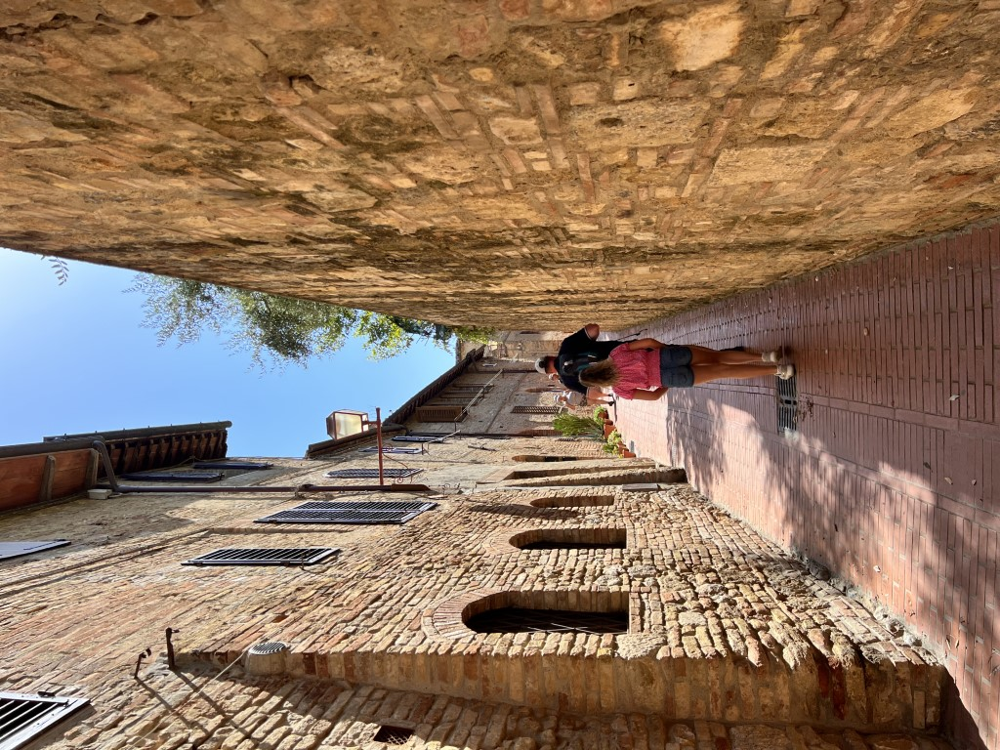
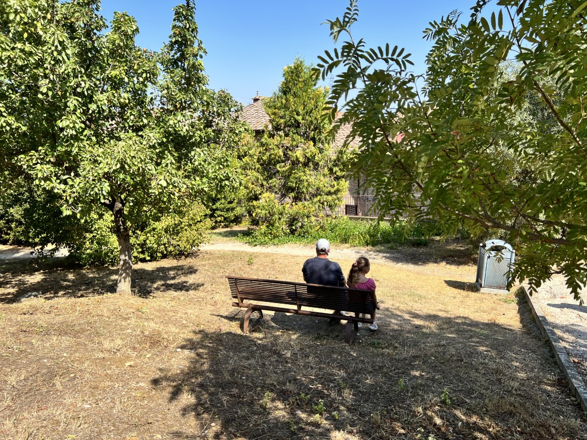
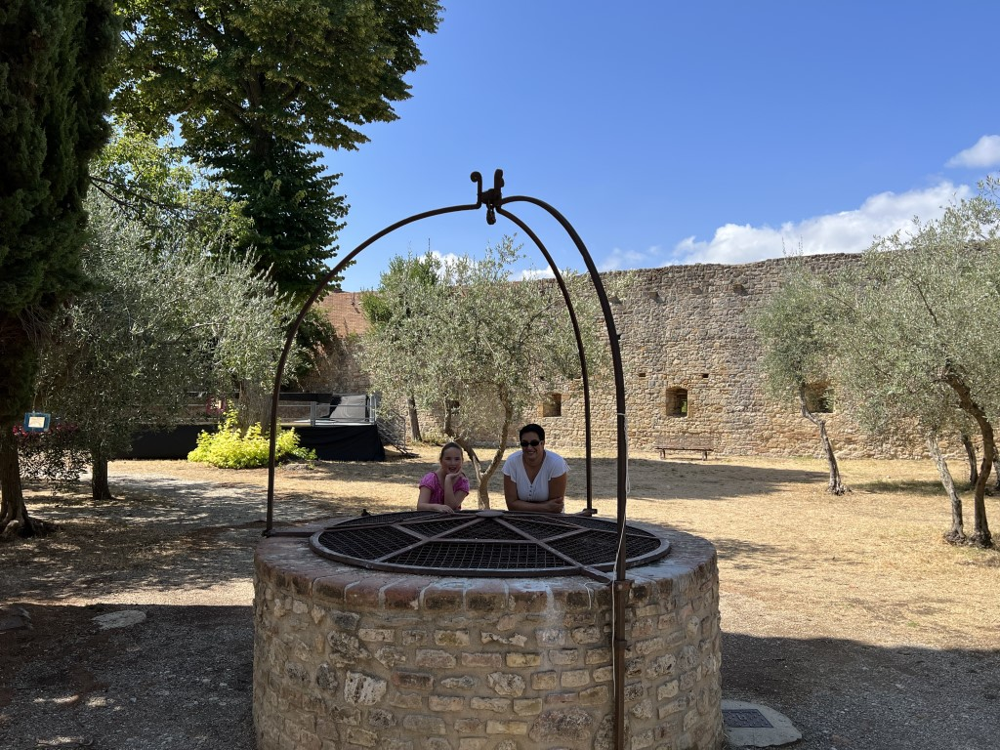
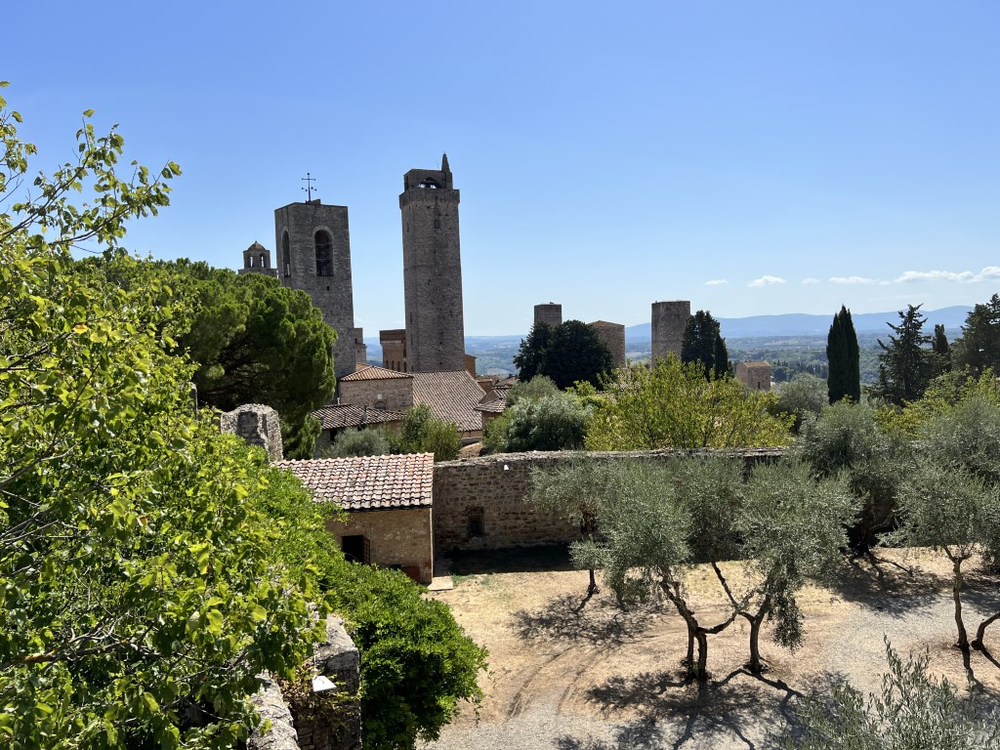
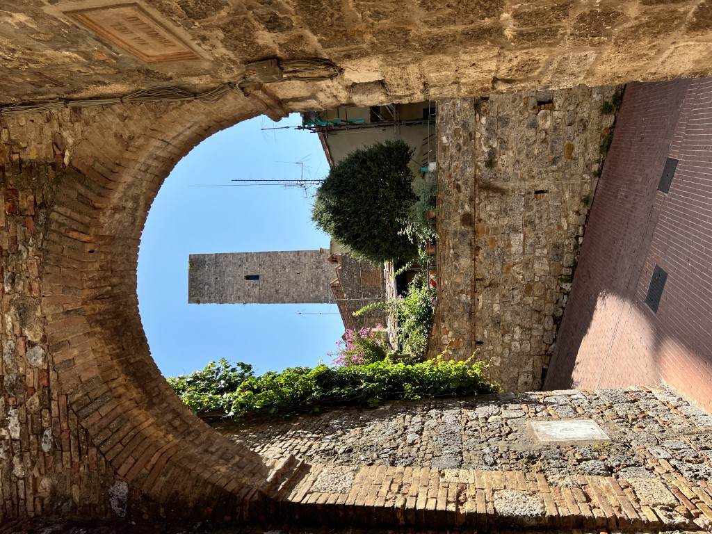
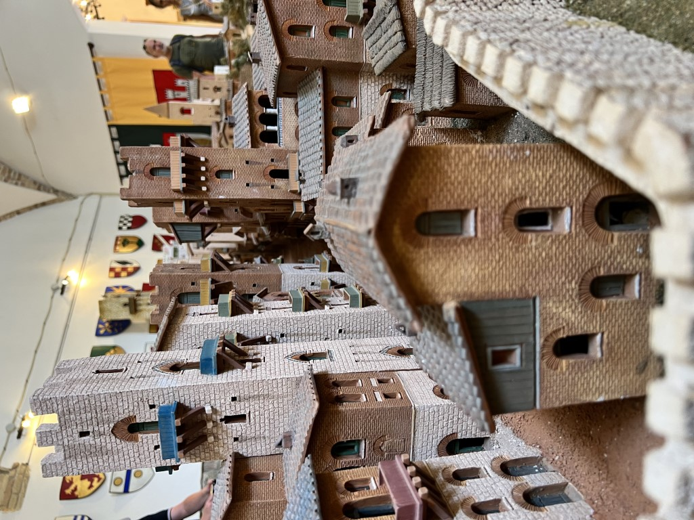
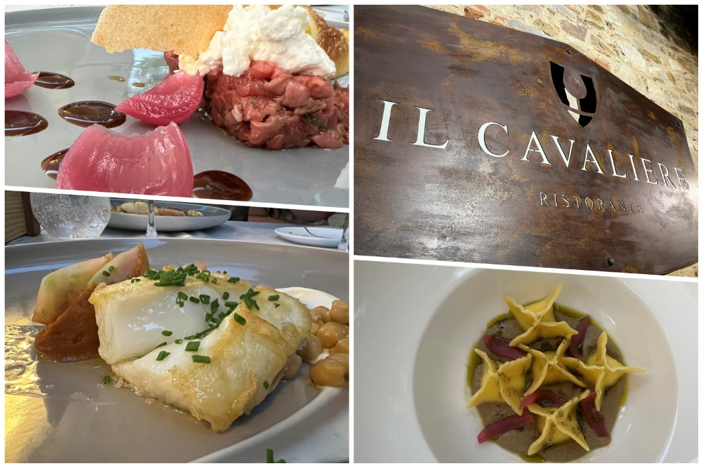

De dag na de enorme storm van gisteren begon goed. Het uitzicht vanuit ons appartement over de wijngaarden en olijfbomen belooft veel goeds voor vandaag. Ik ben natuurlijk geen kenner, maar ik zie links en rechts toch behoorlijk wat gehavende druiven. Met name veel bladeren van de druivenstruiken zijn beschadigd en dat schijnt niet goed te zijn voor de druiven volgens de dame van het hotel. Ze worden dan teveel bloot gesteld aan direct zonlicht.

Maar goed. We ontbijten in rap tempo, want we willen op tijd vertrekken naar San Gimignano: wellicht het bekendste bergdorp van Toscane. In dit dorp waan je je in de Middeleeuwen. Om half tien parkeren we op de half lege parkeerplaats. Na een paar minuten lopen komen we aan bij de toegangspoort tot het dorp. Het is bekend om het feit dat de skyline nagenoeg niet veranderd is sinds de Middeleeuwen. De veertien middeleeuwse torens hebben het dorp de bijnaam "Manhattan van de Middeleeuwen" gegeven.

Vanwege het vroege tijdstip is het heerlijk rustig en kunnen we op ons gemak door de smalle straatjes wandelen.

Op het grote plein halen we een ijs bij meervoudig wereldkampioen Gelateria Dondoli. In de schaduw van de waterput eten we in snel tempo het ijs op (want wespen!). Daarna gaan we via smalle steegjes en een parkje naar het hoogste punt.

Hier hebben we een mooi uitzicht over het dorp en de omgeving.

Rond 12:30 hebben we het wel gezien allemaal en lopen terug richting de auto. De tourbussen zijn inmiddels gearriveerd, en het is een drukte van jewelste in de hoofdstraat. Onderweg bekijken we nog de gratis toegankelijke miniatuurversie van het stadje.

De rest van de middag besteden we aan de koffers inpakken (laatste avond :-() en chillen bij het zwembad. We sluiten het bezoek aan Castello di Gabbiano in stijl af bij het restaurant.

