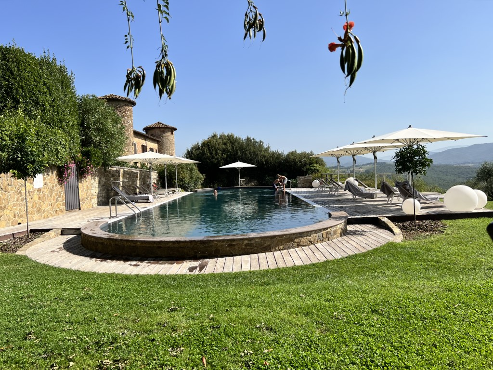
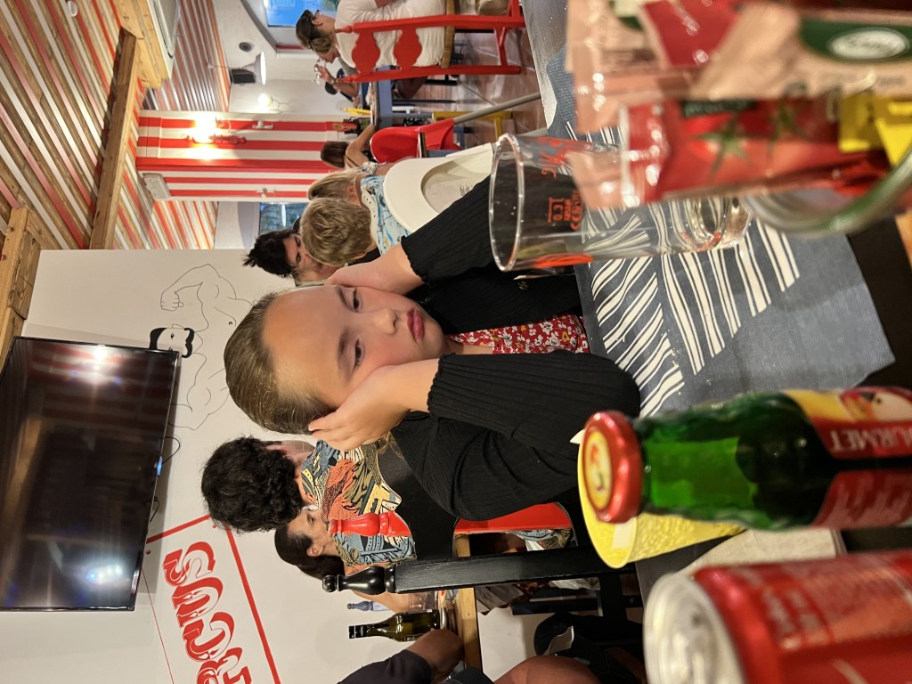

Het is maar iets meer dan drie uur rijden naar Cobue, het appartement waar we 12 dagen geleden ook al waren. Dus we hebben deze ochtend alle tijd om op ons gemak te ontbijten en de auto in te laden. Castello di Gabbiano bleek een voortreffelijke bestemming: hier willen we zeker weten nog een keer terug komen. Sofie duikt nog voor een laatste keer in het zwembad, terwijl wij nagenieten met een croissantje en een espresso danwel cappucino.

De rit terug naar het noorden richting Gardameer verloopt soepel. Klokslag twee uur rijden we in Pozzolengo de mooie oprijlaan op richting Cobue. Het voelt een beetje als thuiskomen. De vorige keer hebben we het hier enorm naar onze zin gehad. We gaan lekker zwemmen en bestellen meteen een plank worst met kaas. En een glas heerlijke wijn, en een lokaal artisanaal bier.

We hebben wel geleerd dat je niet zomaar op aanbevolen restaurants moet vertrouwen. Circo del Gusto blijkt een soort kinderrestaurant te zijn waar je Pizza met ananas (een Italiaan zal je lynchen wanneer je die bestelt) en zelfs pizza met knakworst kunt bestellen. Wij kiezen voor de hamburgers en pizza fungi. We zitten tussen twee zeer luidruchtige lokale families. Zelfs Sofie vindt het volume zeer storend :-)

Het eten is overigens meer dan prima. We hebben echter nog nooit zo snel gegeten in een restaurant als hier. Dus snel afgerekend, en vlug dit gekkenhuis achter ons gelaten.
