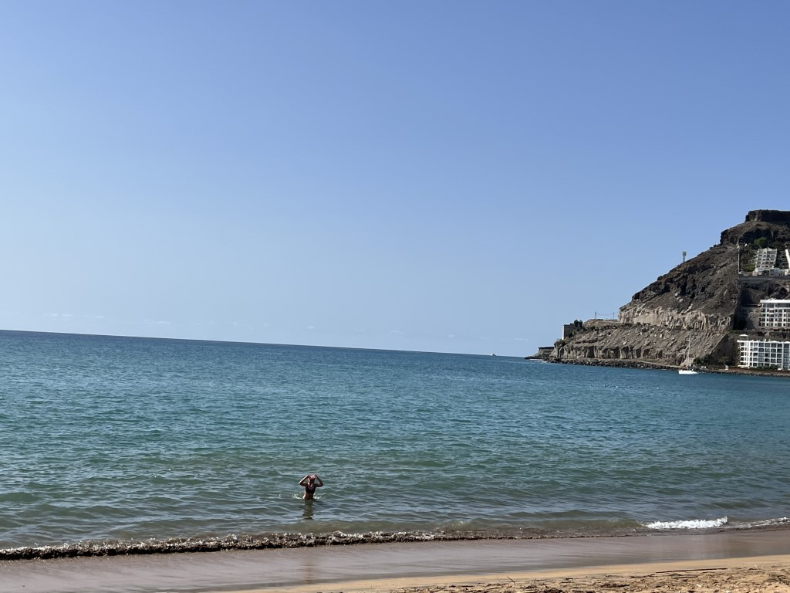
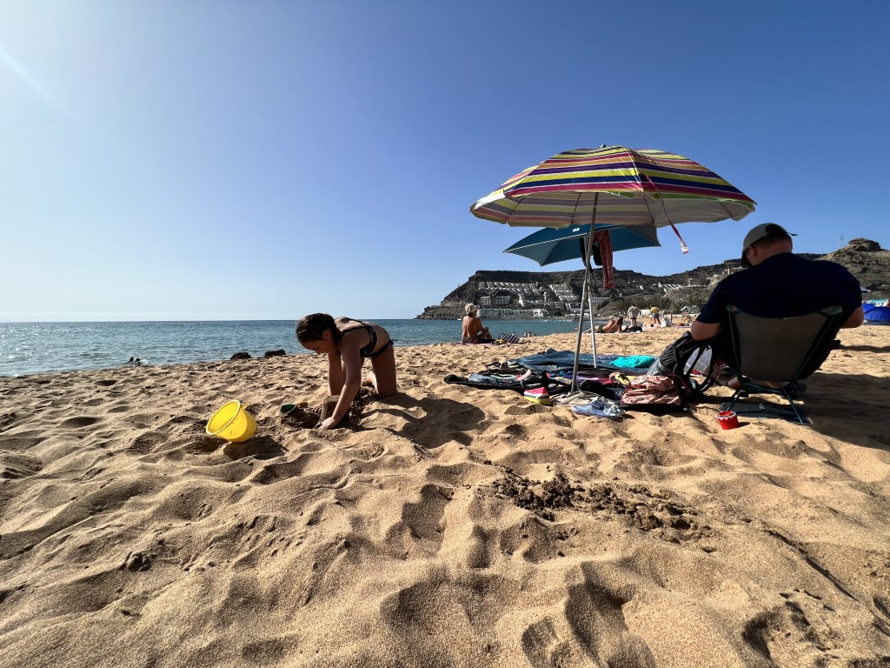
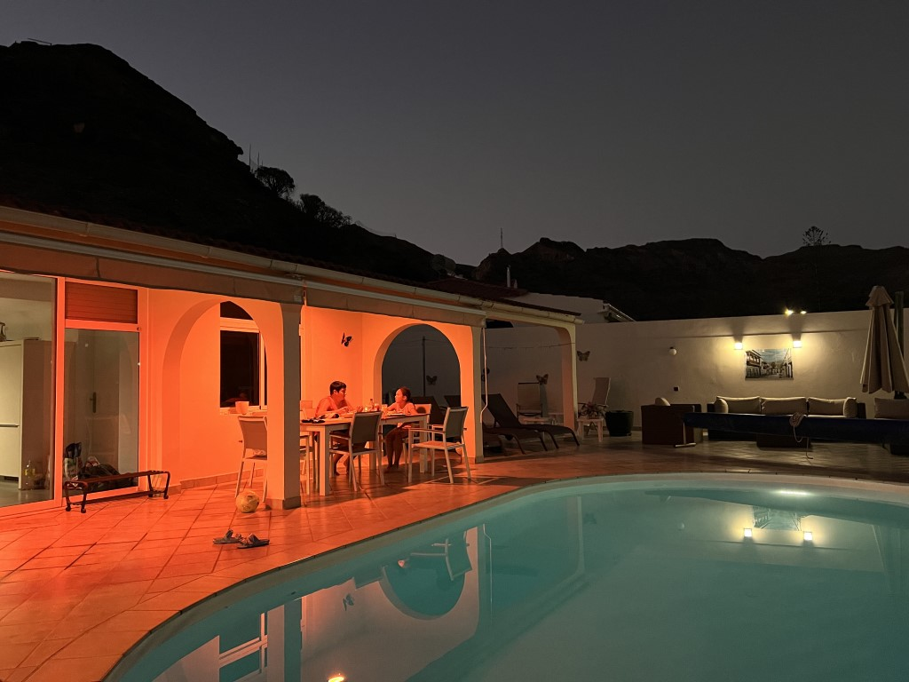

's Morgens doen we weer rustig aan, en gaan even boodschappen doen bij de Mercadona. Na de lunch bij het zwembad, staat Playa de Tauro op het programma. Dit strand ligt aan de andere kant van de parkeerplaats bij Playa de Amadores. Er is slechts 1 bar, in tegenstelling tot de veelvoud aan vertier bij Amadores. Het is daardoor een heel stuk minder druk. We hebben een mooi plekje gevonden vlak bij de waterkant. De zee is hier een stukje wilder.

We kunnen best goed snorkelen hier, hoewel het zicht niet al te best is. 's Avonds eten we weer lekker bij ons eigen zwembad.

