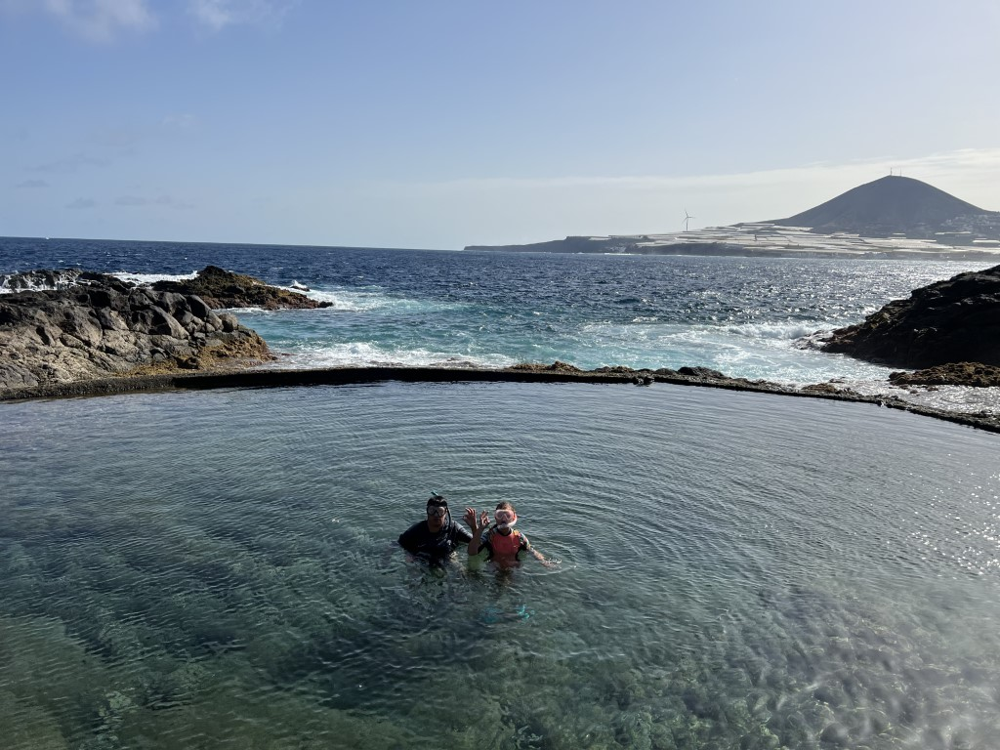
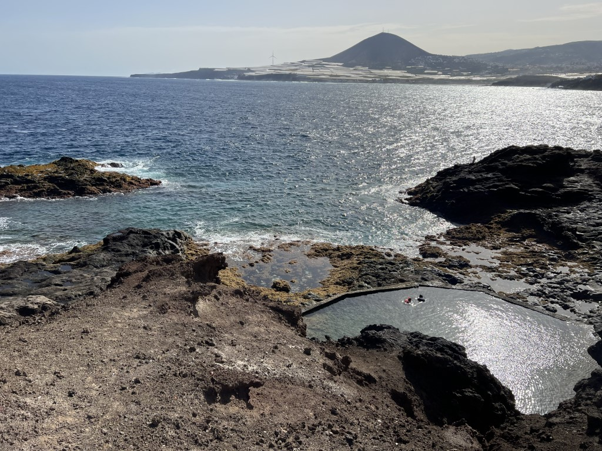
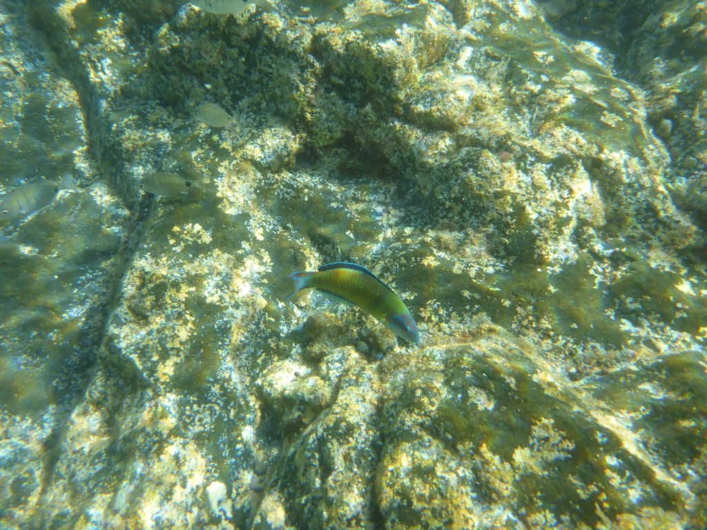
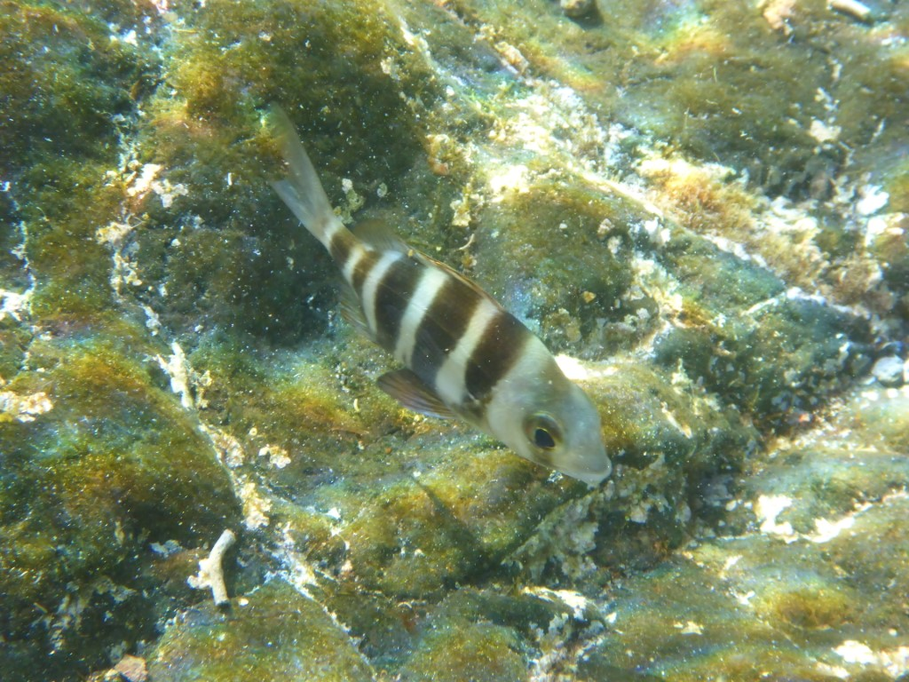
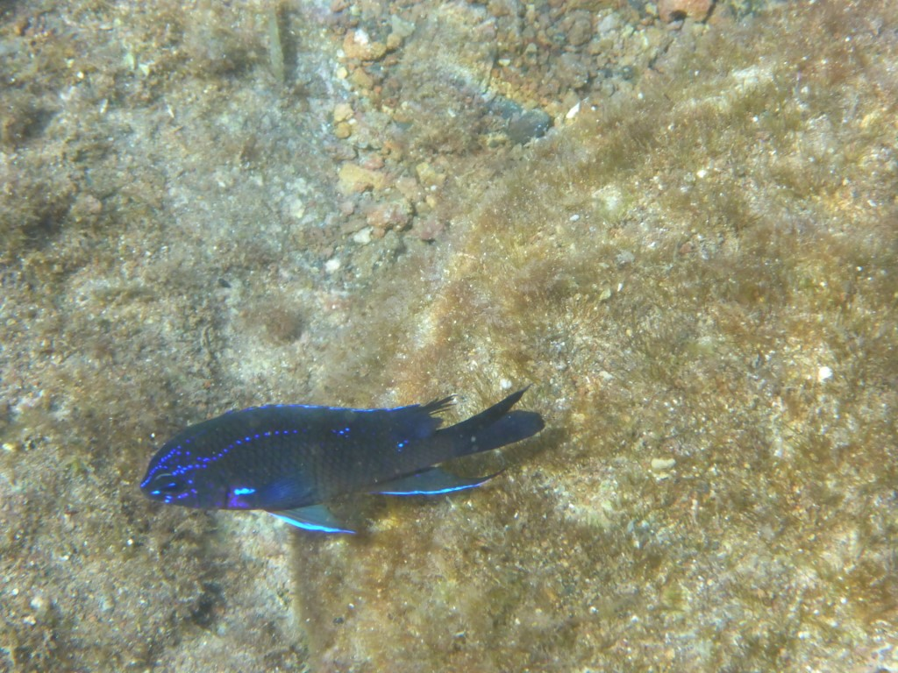
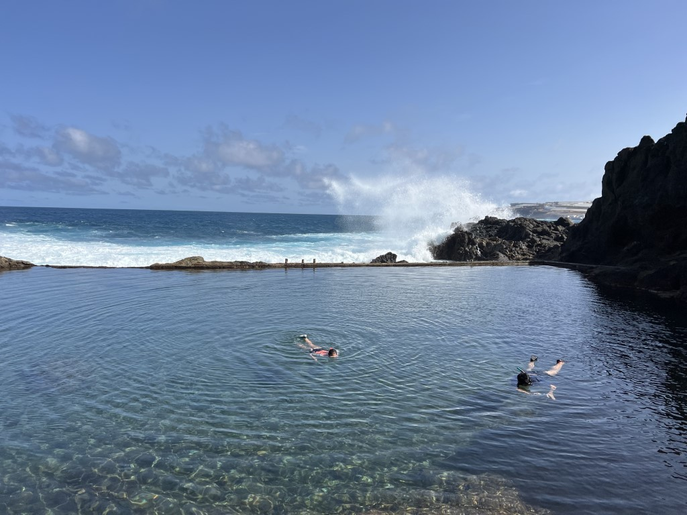
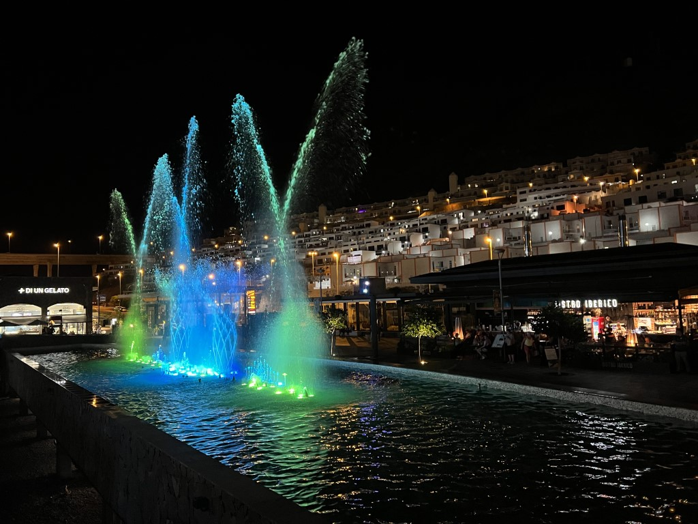

Aan de noordkant van het eiland kun je kennelijk goed snorkelen. Ze hebben daar in wat baaitjes muren geplaatst, en het zwembad wat daardoor ontstaat wordt tijdens hoogwater gevuld met zeewater, maar ook vissen (en krabben en ander gespuis). Je zwemt dus veilig, terwijl op twee meter afstand enorme golven op de rotsen beuken. Het is een spectaculair gezicht!

We bezoeken twee plekken, beide in Galdar. De eerste is maar klein, maar voor Sofie is het wat spannend: het eerste wat ze ziet is een hele kudde krabben, van klein tot behoorlijk groot. Dus mama moet eerst gaan. Al snel volgt Sofie ook, en ze is vervolgens niet meer uit het water te slaan!

Ondanks dat dit badje niet al te groot is, zijn er best veel mooie visjes te zien.

's Avonds hebben we weer gegeten bij Bistro Iberico in ons winkelcentrum. We waren weer mooi op tijd voor de watershow.

