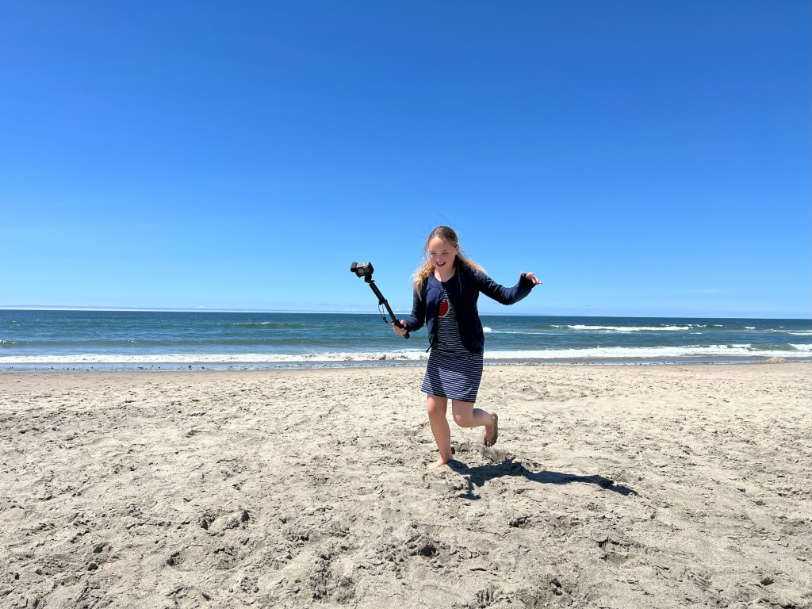
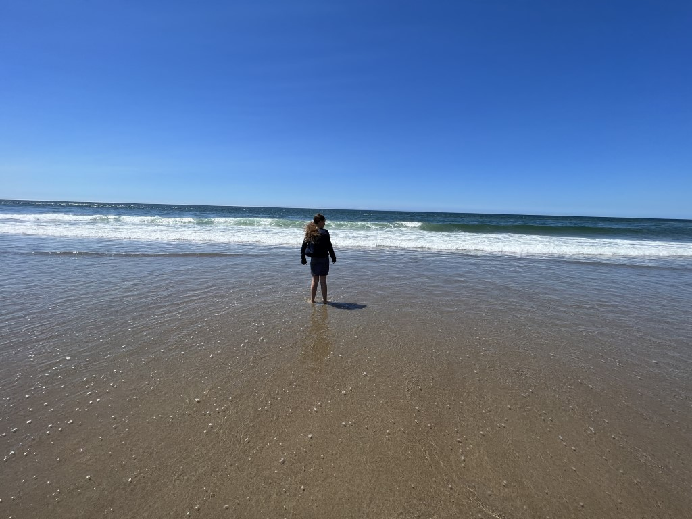
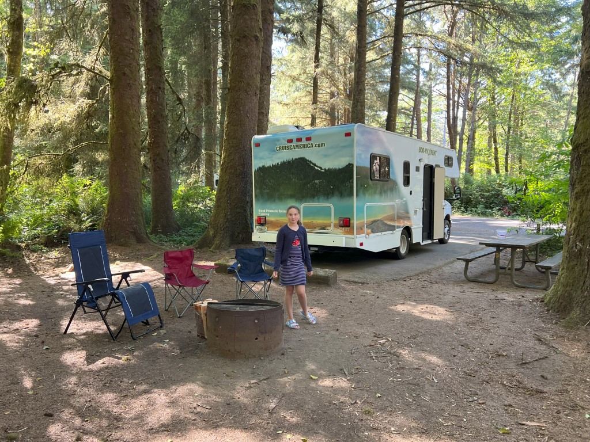
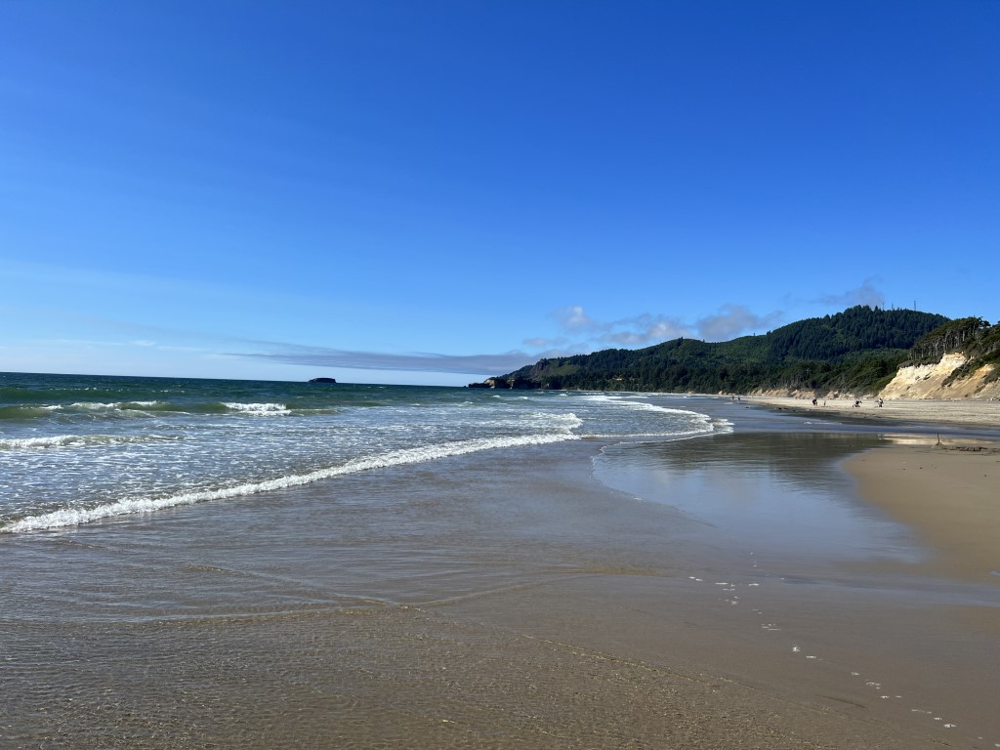
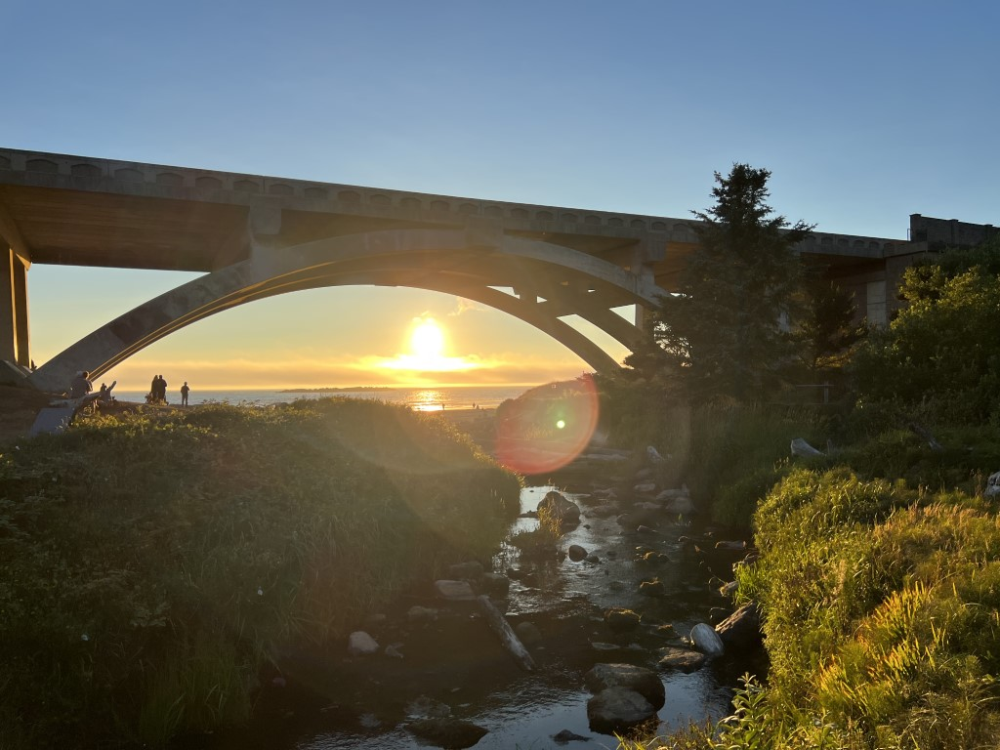
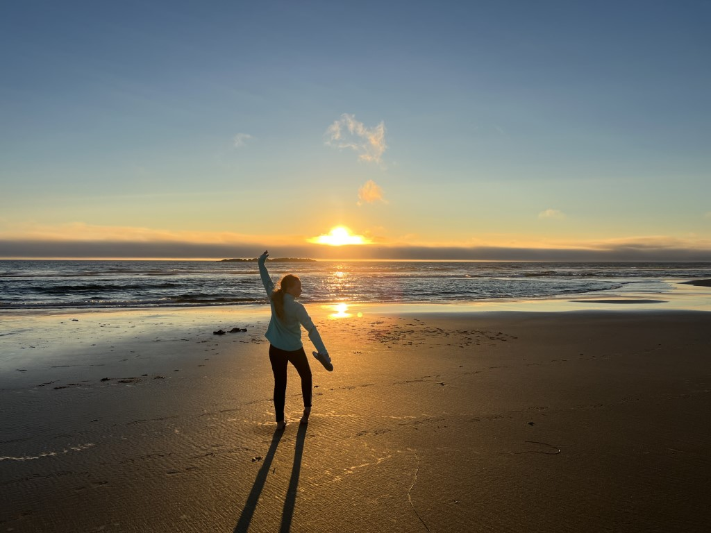

Vanmorgen doen we eerst even boodschappen voor de komende dagen. Daarna rijden we naar de kust. Het is een prachtige weg. We lunchen op het strand van Roads End Recreation Site. De eerste natte voetjes zijn binnen :-)

Aan het einde van de middag komen we aan op de camping van Beverly Beach State Park.

We hebben een prachtig plekje tussen de bomen en aan een beekje. Nadat we alles geinstalleerd hebben, gaan we maar weer naar het strand.

's Avonds is de eerste bbq maaltijd en het eerste kampvuur een feit. Tevens wordt er genoten van de zonsondergang op strand.

