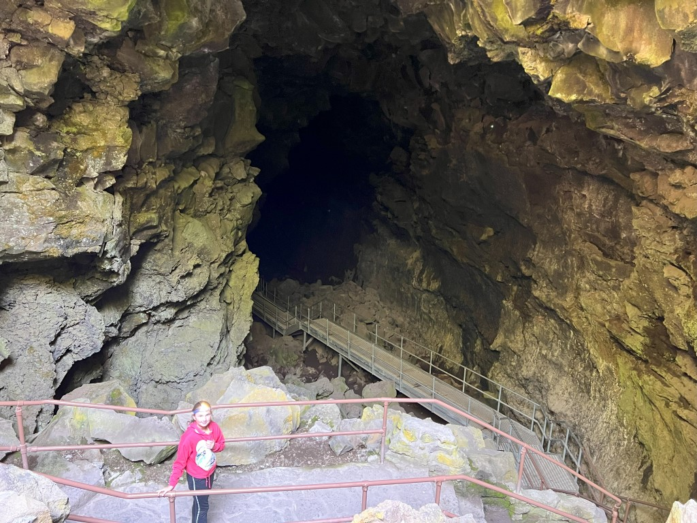
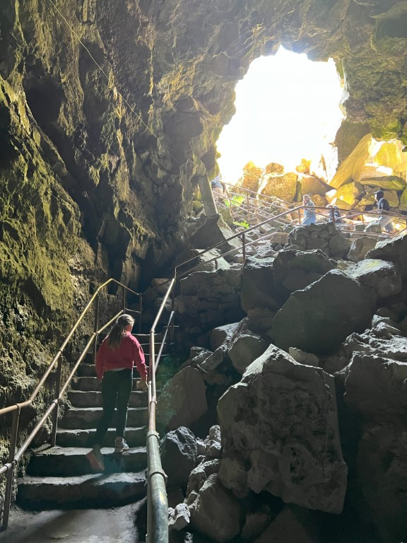
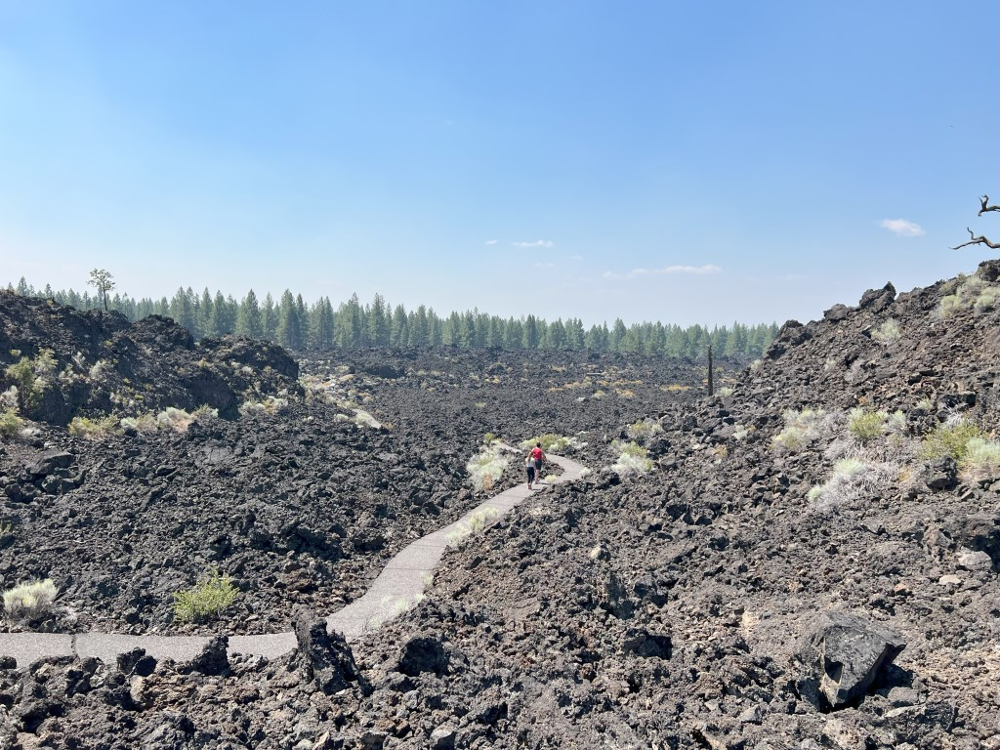
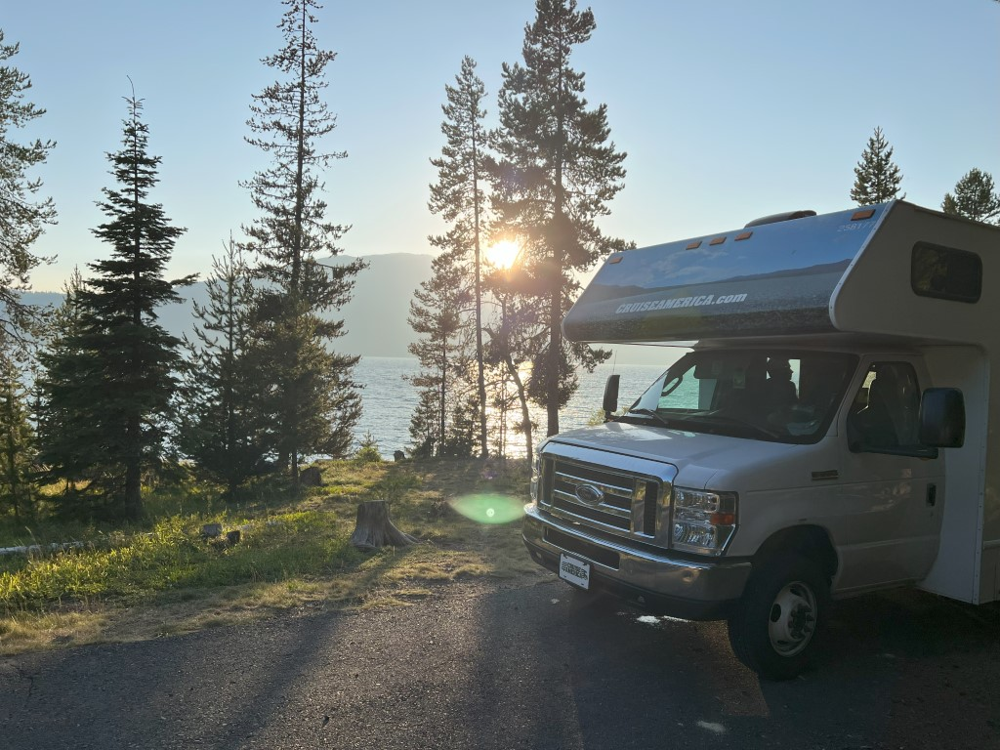
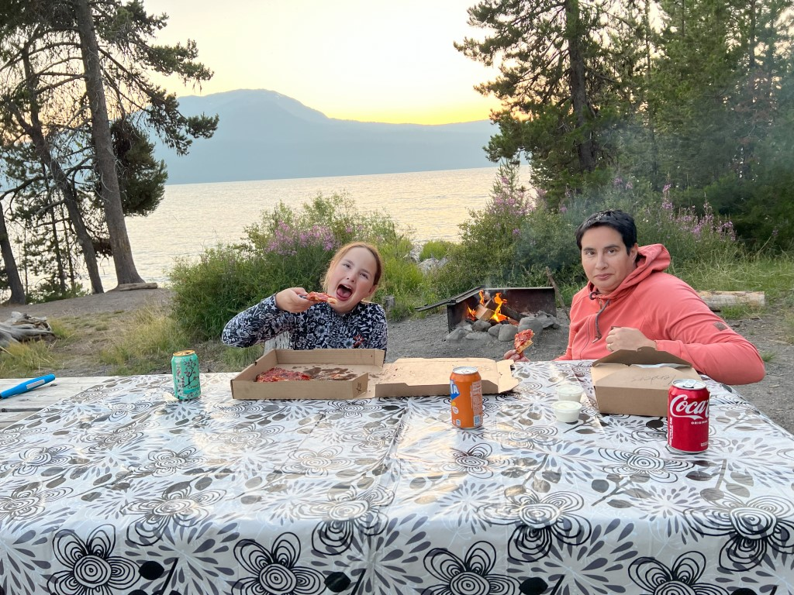
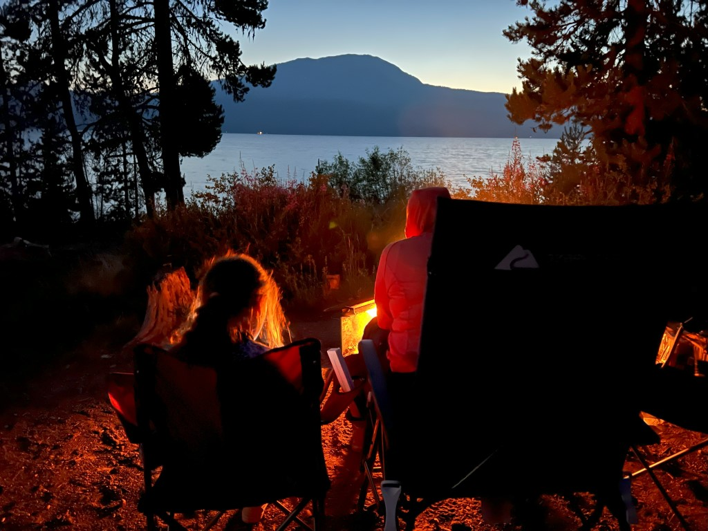

De ochtend spenderen we in Newberry National Monument, iets ten zuiden van Bend. Hier is een lava tube. Dit is een tunnel die wordt gevormd door lava stromen. De bovenkant van die stroom koelt sneller af dan de binnenkant en wordt dus hard. Hierdoor ontstaat een tunnel die we kunnen bezoeken.

Bewapend met zak- en hoofdlampen melden we ons bij de ranger die, geheel in Amerikaanse stijl, eerst een safety talk doet. Lang verhaal kort: je moet uitkijken dat je niet uitglijdt en niet je bulles stoot. Duh... tien minuten van je leven die je nooit meer terug krijgt.

We dalen met een trap de diepte in, en het wordt al heel snel heel erg donker.

Naast dat het donker wordt, wordt het ook al snel koud. 4 graden Celcius om precies te zijn. We lopen een minuut of 10 de tunnel in, en staan even om ons heen te kijken. Dan zet voor ons in de tunnel een groep jongeren die op bijbel kamp zijn een traag en treurig lied in het Latijn in over Here Jezus. Zo in het donker klinkt het bijzonder spooky! Hahaha, het lijkt zo uit een horror film te komen!

Snel maken we rechtsomkeer naar de uitgang.

Weer veilig bovengronds wandelen we door de lava gesteenten en maakt Sofie haar junior ranger boekje af. Weer een badge in de pocket!

Na de lunch rijden we naar Sunriver Sharc. De dames gaan lekker plonzen in dit buiten en binnen zwembad. Ik mag bij de camper blijven en de eerste berichtjes schrijven van deze vakantie.

Na het zwemmen rijden we in anderhalf uur of zo naar onze camping aan Diamond Lake. Qua locatie is dit een van de mooiste die we ooit hebben gehad. Pal aan de oever van het meer!

Ondanks dat we in the middle of nowhere zijn, is op loopafstand van de camper een "restaurant" waar we een verrassend lekkere pepperoni pizza en chicken strips halen. Bij het kampvuur genieten we van het eten, de muggen, en de muziek van onze buren. Amerikanen willen namelijk heel graag muziek bij het kamperen, en willen ook heel graag dat de halve camping daarvan mee kan genieten.

