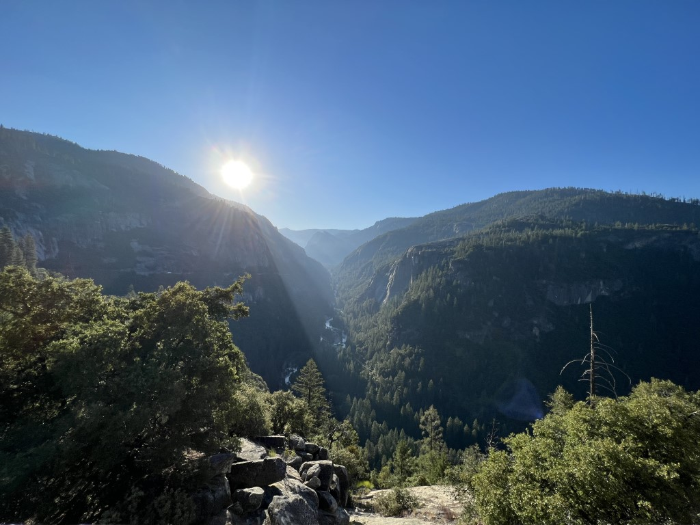
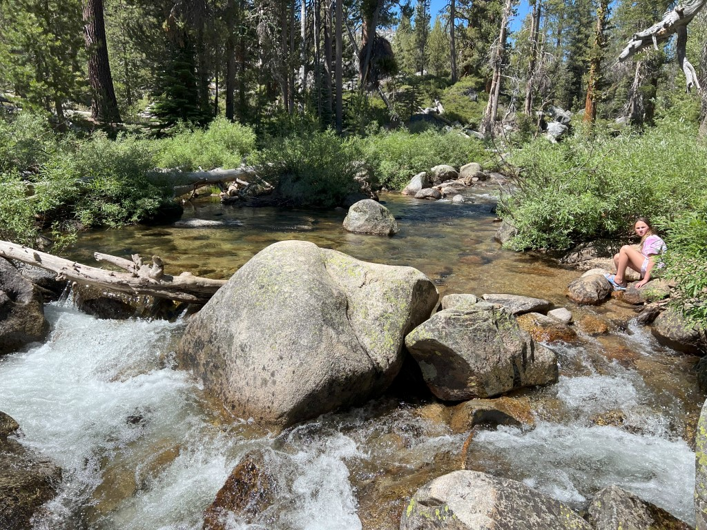
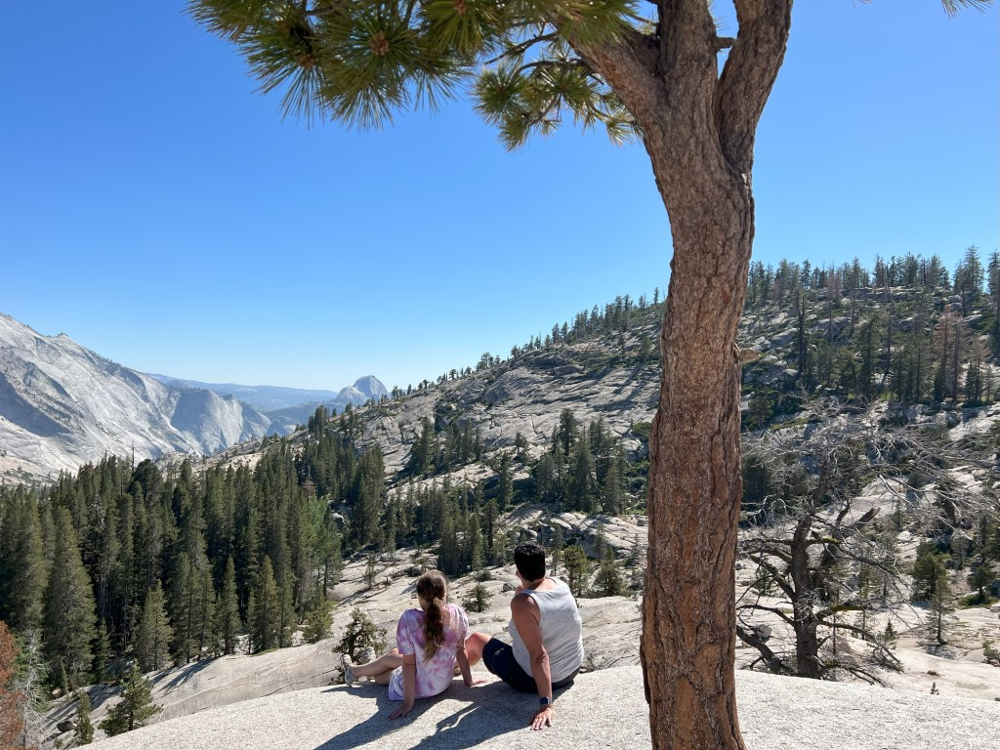
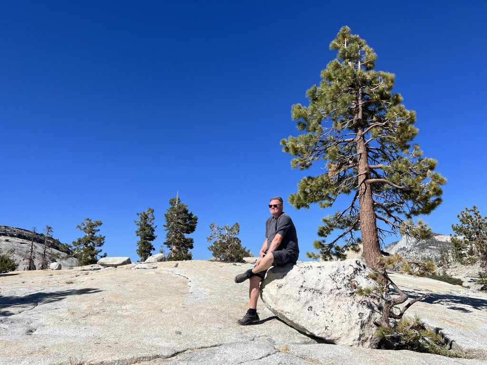
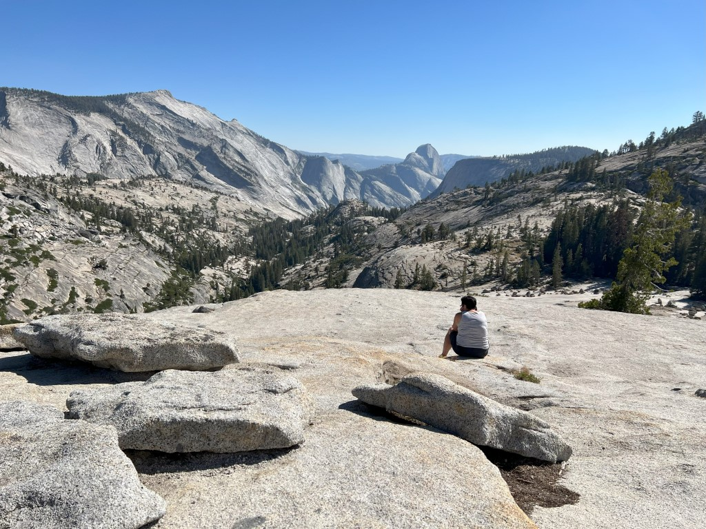
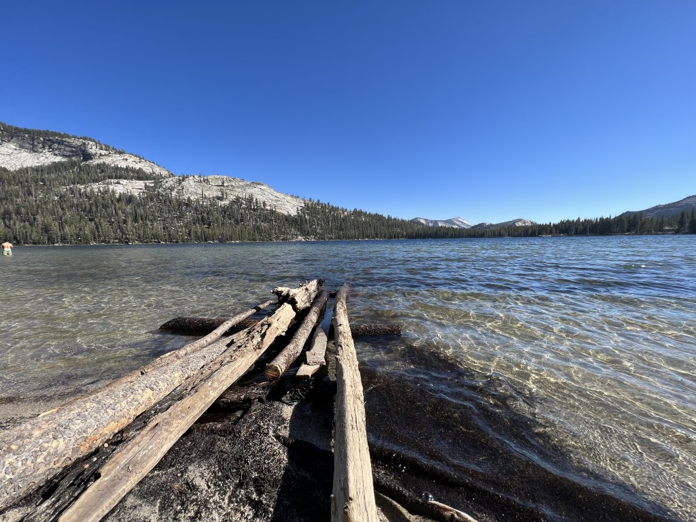
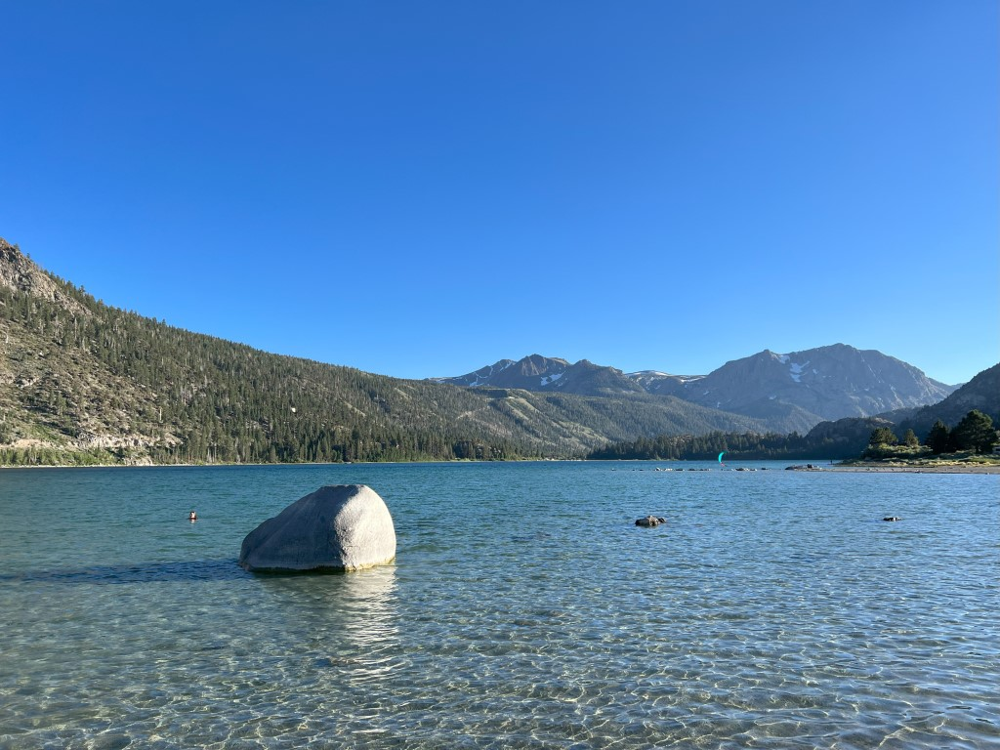
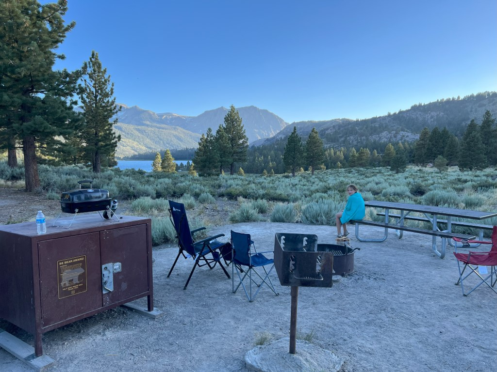

Omdat het gisteren een beetje later is geworden dan eigenlijk de bedoeling was, doen we deze ochtend maar rustig aan. We doen even snel wat boodschappen bij de Safeway in Oakhurst en rijden dan weer Yosemite National Park in. Min of meer per ongeluk (ik reed via een andere afrit bij de supermarkt weg, en had te laat door dat we op een andere weg reden dan de bedoeling was) via El Portal deze keer. De weg naar deze ingang hebben we al lang niet meer gereden, dus we konden weer mooi genieten van al het natuurschoon.

Yosemite Valley laten we vandaag links liggen, en rijden meteen door richting de Tioga Road. De weg is pas een week of twee open vanwege de enorme hoeveelheid sneeuw die dit jaar is gevallen (bijna drie keer meer dan normaal). Het is rustig op de weg. We lunchen ergens halverwege de pas aan een beekje.

Na de boterham rijden we nog een stukje verder naar Olmsted Point. Vanaf hier heb je prachtige uitzichten over vallei en omliggende bergen. Ook hier is het relatief rustig.

Via de Nature Trail vanaf de parkeerplaats kom je op een mooi plekje uit, waar we zeker een half uur helemaal alleen op een rotsblok kunnen zitten om te kijken naar de omgeving.

In de verte is de Half Dome te zien.

We nemen nog een vlugge blik bij het prachtige Tenaya Lake...

... maar rijden dan door naar onze eindbestemming van vandaag: Oh Ridge Campground bij June Lake. Terwijl Chantal het avondeten voorbereidt, gaan Sofie en ik naar het meer. Want er moet en zal natuurlijk wel nog gezwommen worden vandaag!

Het water is koud, maar dat deert niet blijkbaar. Vanaf onze site hebben we uitzicht op het meer.

Zodra de zon onder is, wordt het al snel erg fris. Met de vestjes en het kampvuur aan eten we en als het donker is genieten we van de prachtige sterrenhemel.

