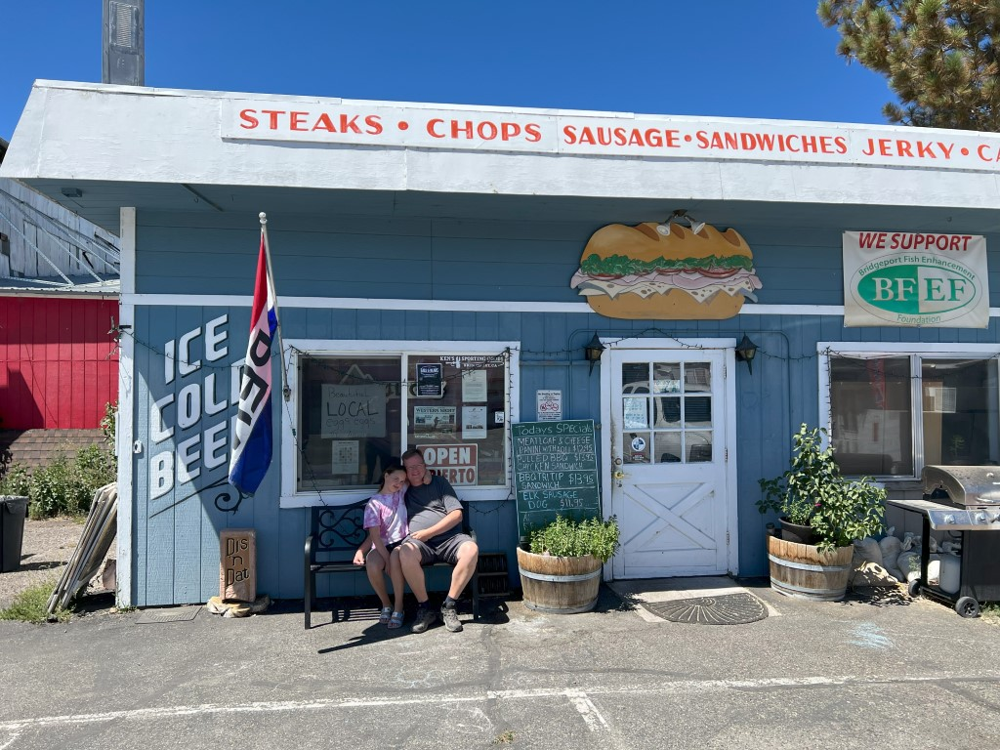
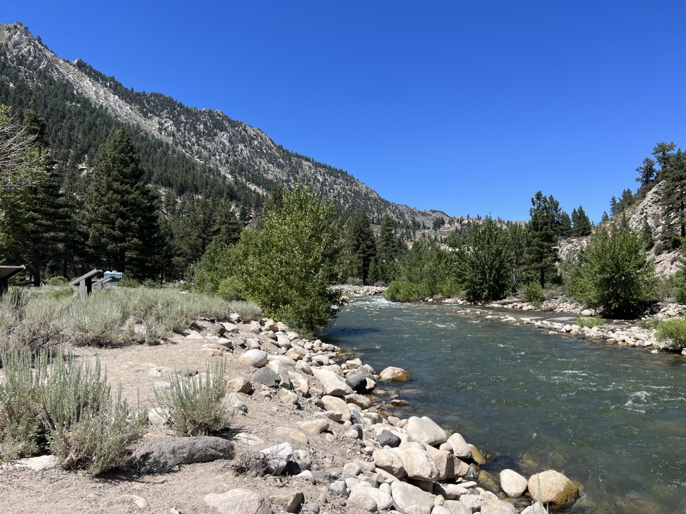
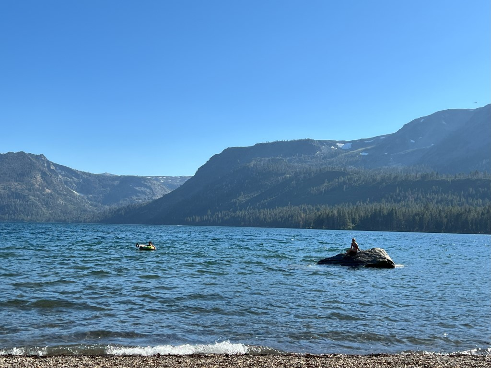
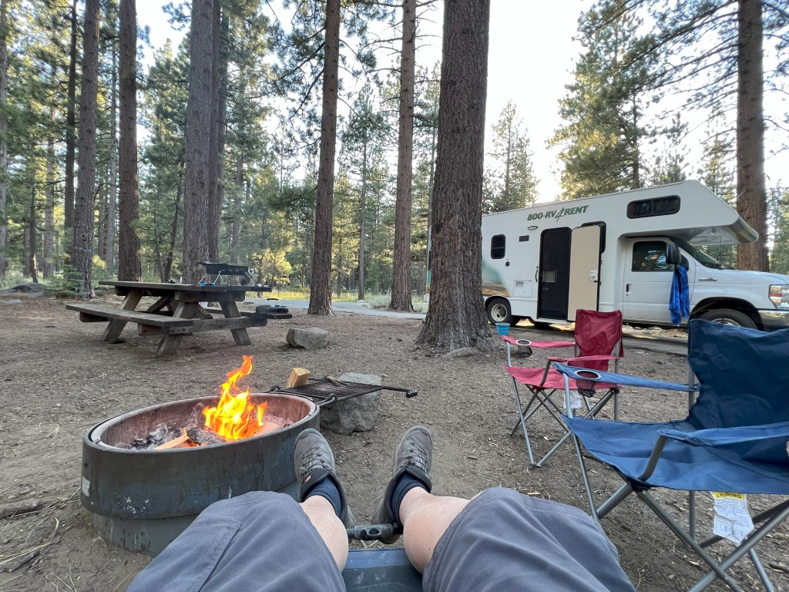
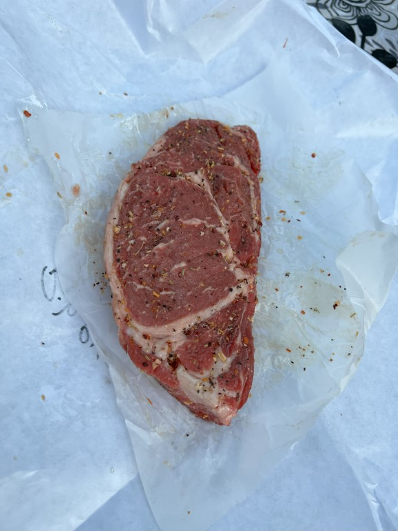
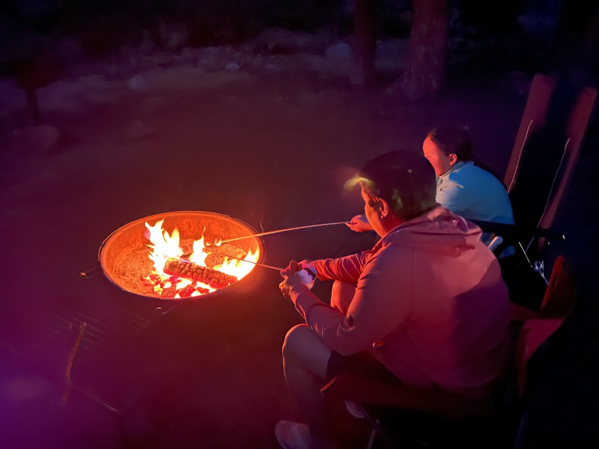

Via de CA-395 rijden we richting het noorden. Rond lunchtijd rijden we door het pitoreske dorpje Bridgeport. Van de 553 inwoners is in ieder geval een meneer slager, en nog wel een goede ook. We kopen er een ribeye steak en een heerlijk broodje pulled chicken.

Halverwege Bridgeport en Walker lunchen we aan de Walker River.

Iets voorbij Topaz nemen we de scenic byway CA-89 om via Markleeville naar onze eindbestemming voor vandaag te rijden. Deze weg is echt fantastisch. Het kronkelt en gaat op en neer dat het een lieve lust is. Enige nadeel: er zijn werkzaamheden, en we staan 20 minuten stil in de hitte.

Het inchecken bij de camping Fallen Leaf Campground gaat vlot, maar we worden wel gewaarschuwd dat er veel beren activiteit op de camping is. En dus mogen we buiten geen eten onbewaakt laten staan. Na aankomst hebben we direct de zwembroek aangetrokken en zijn naar het meer gewandeld.

De douches op de camping zijn zeer schoon, dus we maken daar graag gebruik van. De douche in de camper is op zich prima, maar toch wel erg klein.

Vanavond gaat de ribeye op de grill!

Hij smaakt gelukkig verrukkelijk! Het was nog even spannend of 'ie gelukt was, want precies na 10 minuten grillen was m'n gasfles leeg :-)

