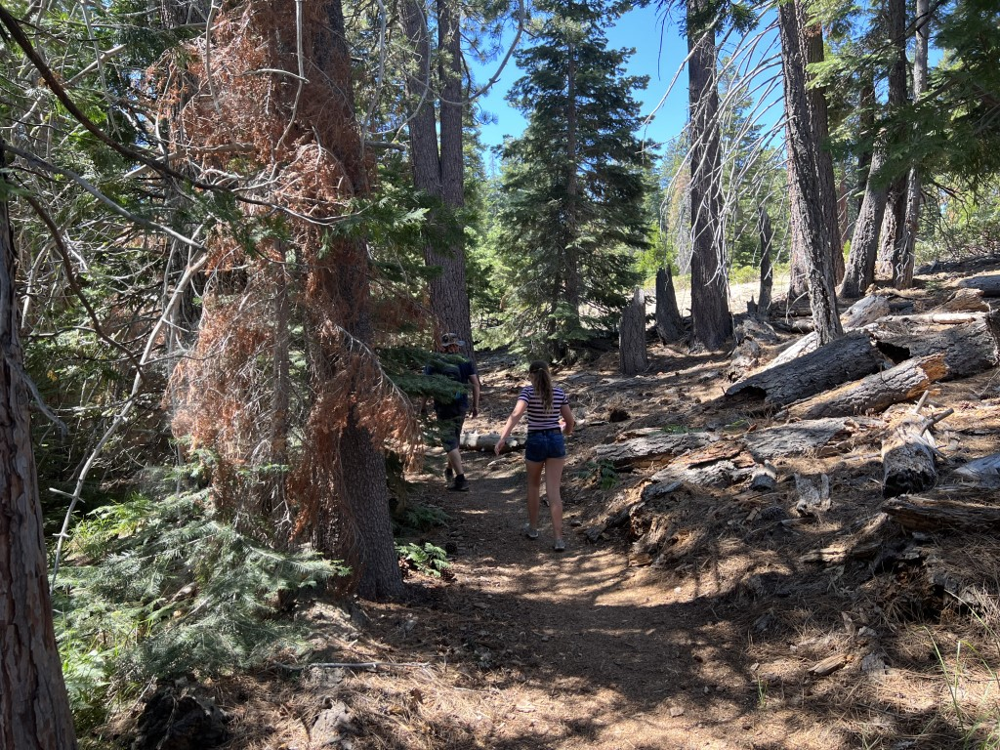
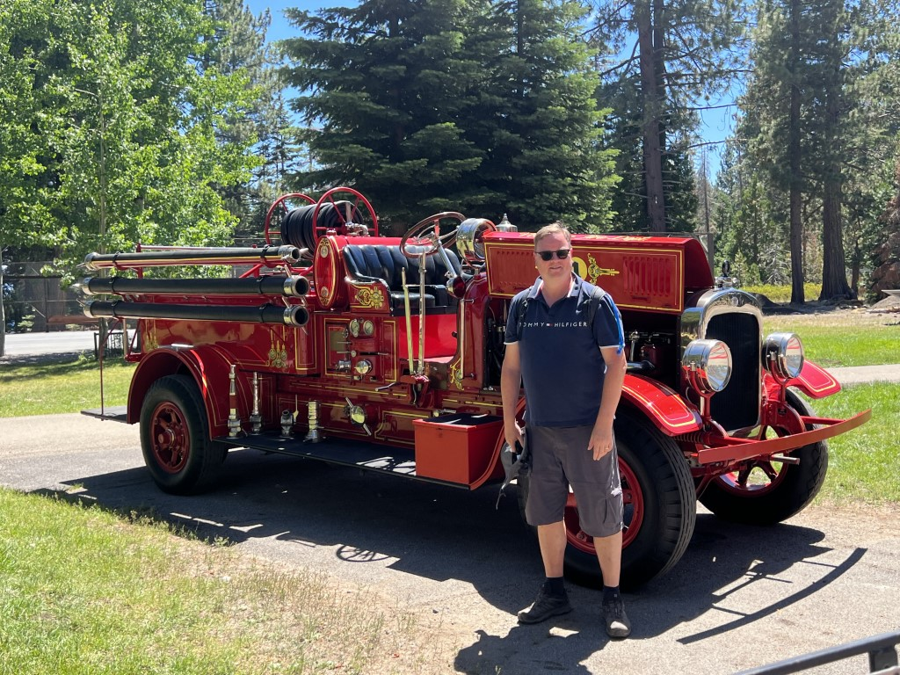
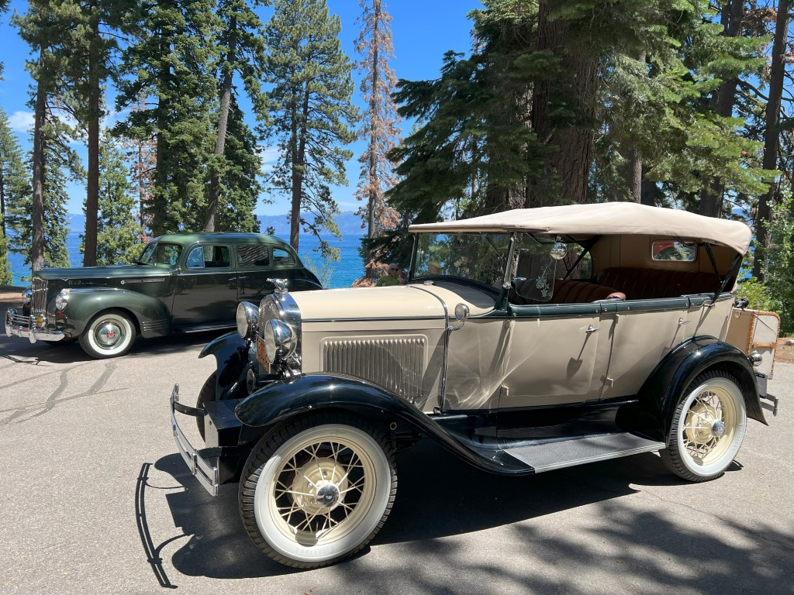
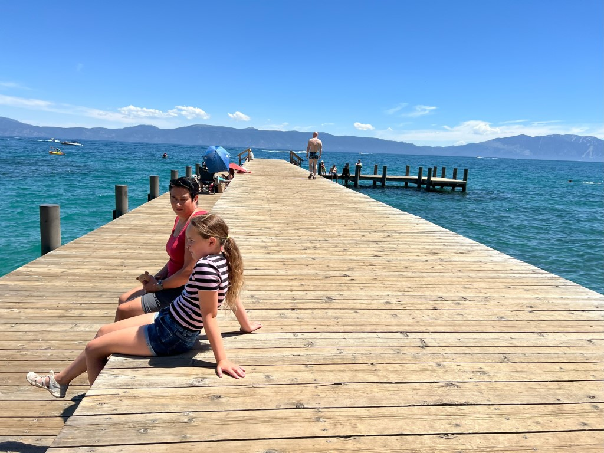
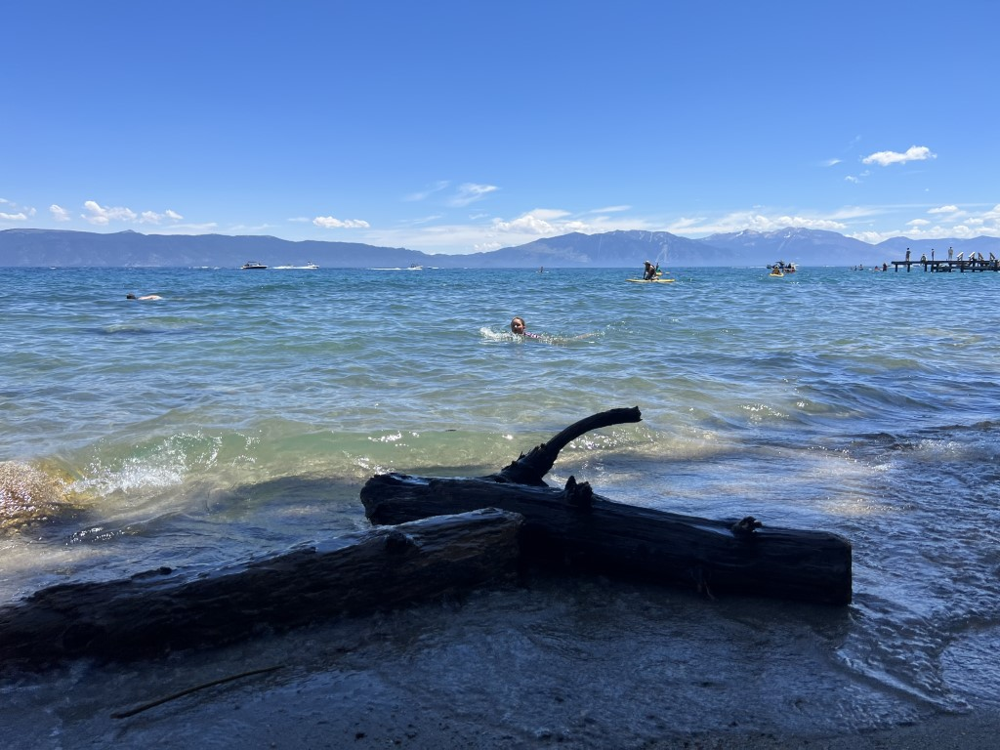
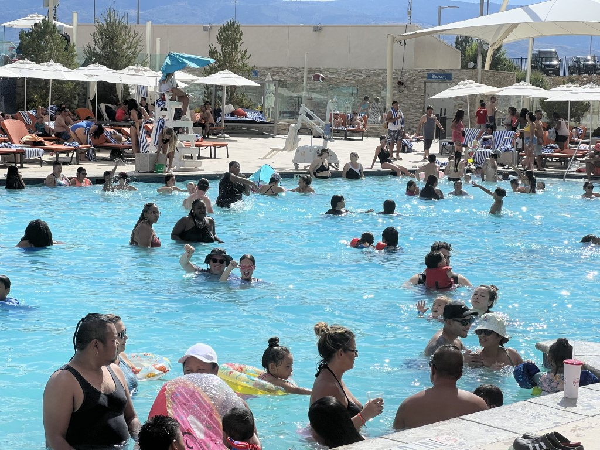

De ochtend begint rustig. Eerst moeten alle spullen uit de bear proof container weer ingeladen worden in de camper. We parkeren vervolgens de camper bij de day use parking van de camping. Vanaf daar wandelen we over een mooi en kort paadje naar het strand van Sugar Pine Point.

Vanaf het strand lopen we verder richting het Nature Center. Het paadje is smal en vol met laag struikgewas, dus we zijn op onze hoede voor eventuele beren.

Bij de Nature Center aangekomen, blijkt dat het park zoveel jaar bestaat en dat vieren ze met wat auto's uit de oude doos.

Bij de lodge lopen we even de pier op. Er volgt al snel de vraag of je hier mag zwemmen...

En ja hoor, in onderbroek en t-shirt duikt Sofie in het water.

We wandelen weer terug naar de camper, want we moeten langzaamaan richting Reno. We slaan ons kamp op bij Grand Sierra Resort. Reno is een soort Las Vegas, maar dan veel minder groot en massaal. Hoewel, minder massaal.... dat blijkt niet helemaal te kloppen als je naar ons zwembad kijkt.

We duiken er in om even af te koelen, want het is bijzonder warm. Zelfs voor Sofie is het te druk, en na een half uur houden we het al voor gezien. Komt eigenlijk goed uit, want we moeten om 5 uur onze huurauto ophalen op het vliegveld. Met de hotel-shuttle rijden we naar de vluchthaven, en halen onze auto op. Een Nissan Rogue (bij ons de x-trail) gaat ons de resterende tijd vergezellen. Het ophalen in Reno en terugbrengen in Las Vegas is veel goedkoper dan ophalen en terugbrengen in Las Vegas zelf...

Direct na het wegrijden bij de rental station gaan we dineren bij de Cheesecake Factory.
