June Lake ligt iets ten oosten van Yosemite National Park. In drie kwartiertjes rijden we naar de Tuolumne Meadows. We parkeren de voiture bij Dog Lake Parking. We wandelen via een mooi paadje naar de Lembert Dome.

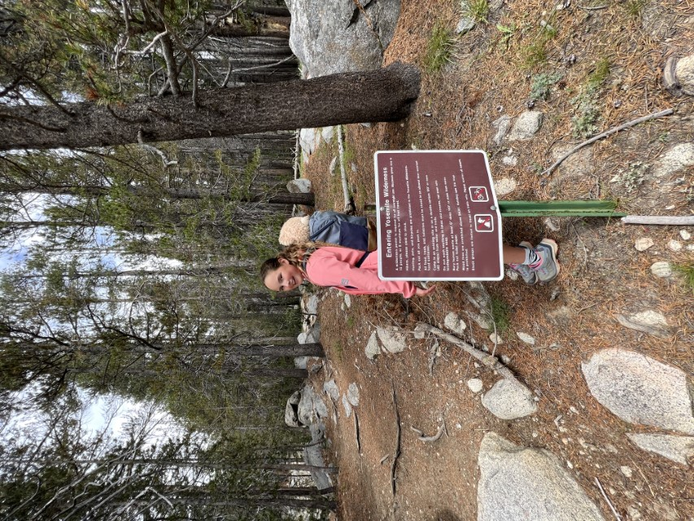

Het eerste stuk gaat door het bos...

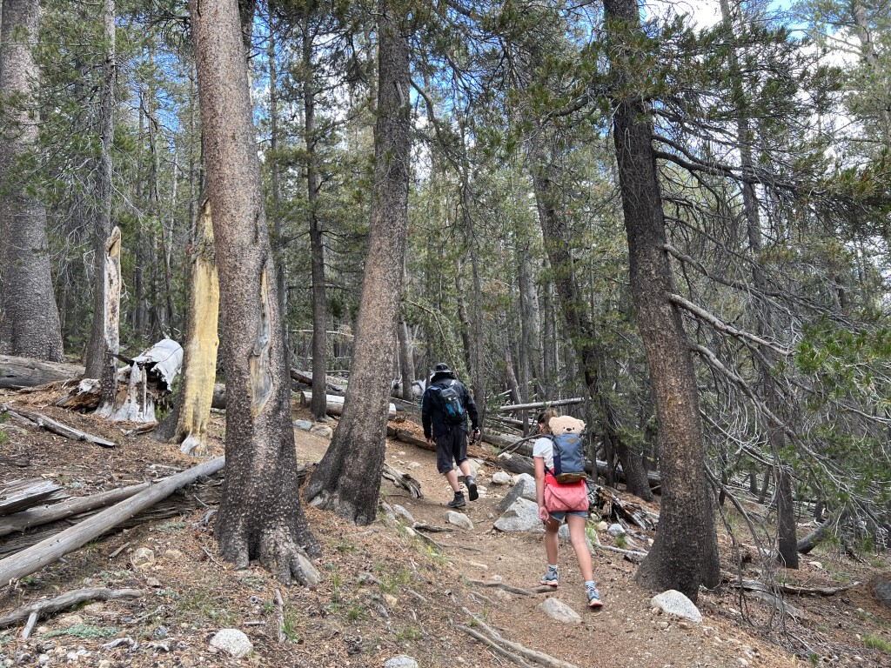

... maar daarna moeten we met halsbrekende toeren over de steile rotsen naar boven klauteren.

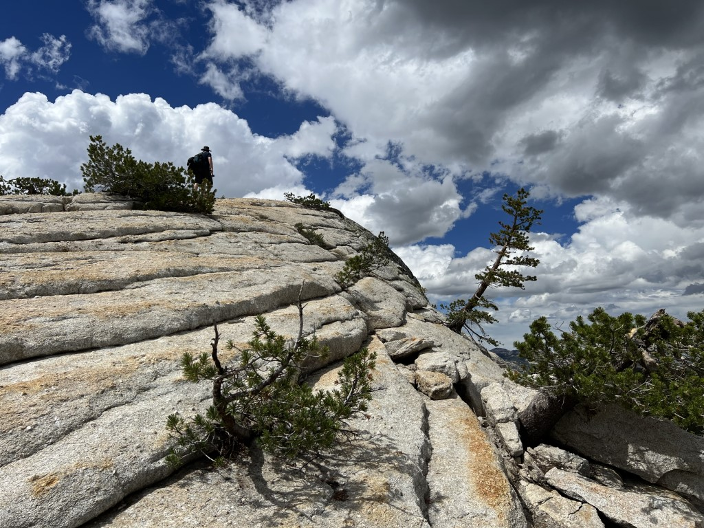

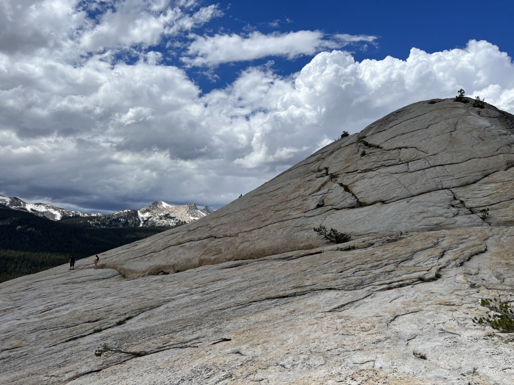

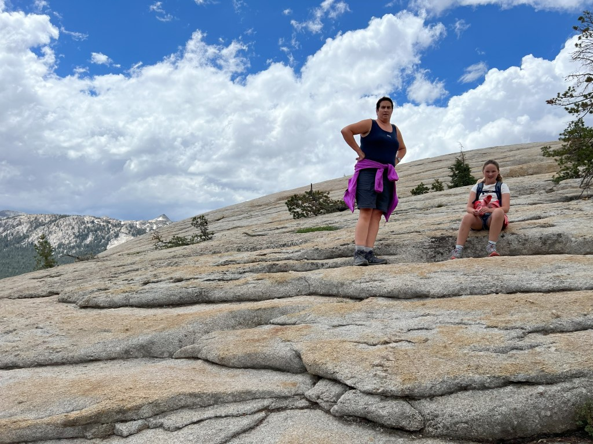

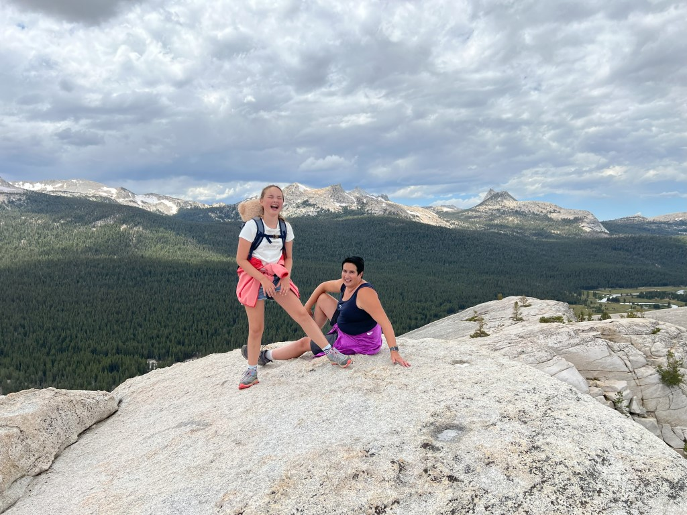

De uitzichten vanaf de top zijn fantastisch!

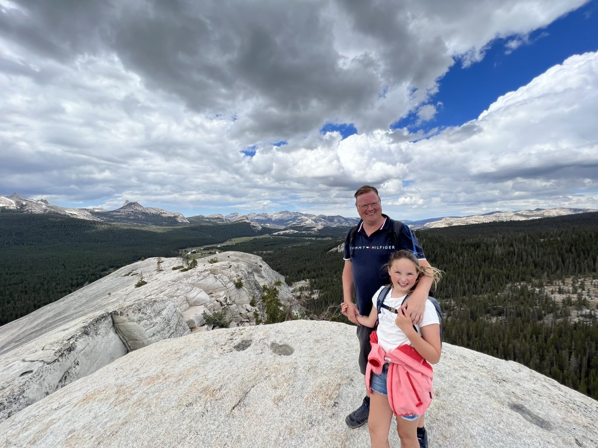

Het begint wat te betrekken, en we willen niet over natte rotsen naar beneden, dus we pakken onze spullen en wandelen terug naar de auto. De laatste 400 meter lopen we in de stromende regen, en precies bij de auto aangekomen stopt het weer.

Bij het tijdelijke visitor center op Tuolumne Meadows stoppen we zodat Sofie de junior ranger badge kan ophalen.

De rest van de middag is het gelukkig weer zonnig, en dus maken we een wandelingetje over de meadow. Het is heerlijk rustig, we zijn bijna helemaal alleen.

Bij de rivier rusten we even lekker uit.

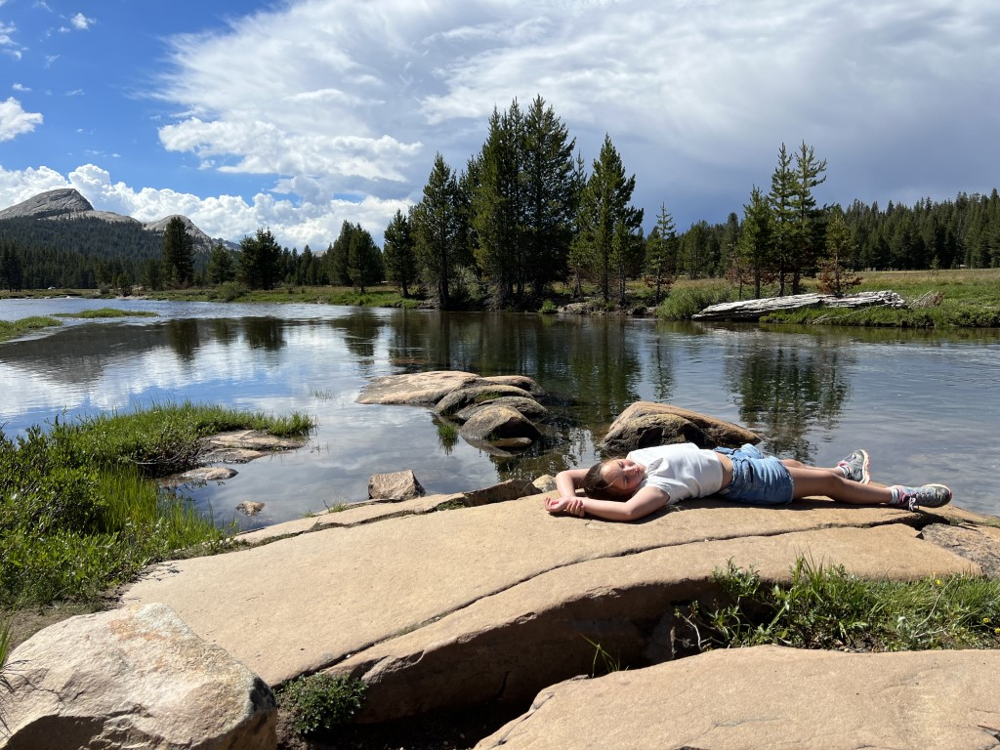

Lembert Dome is die grijze berg achter Chantal.

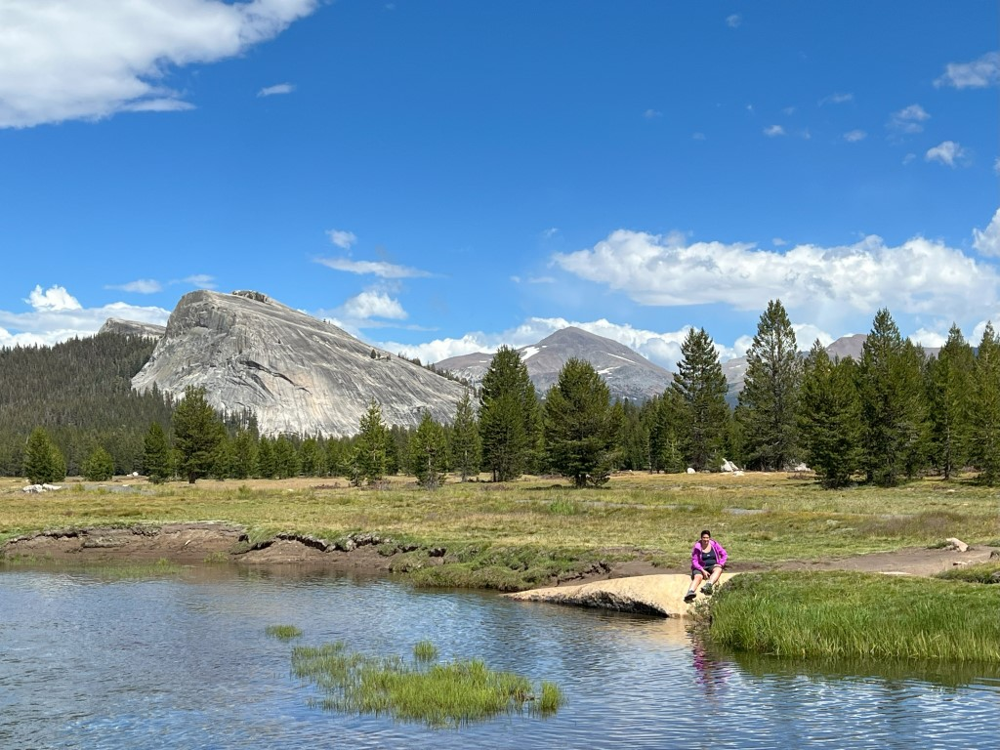

Sofie wil nog even chillen bij June Lake, dus we rijden weer terug naar de camping.

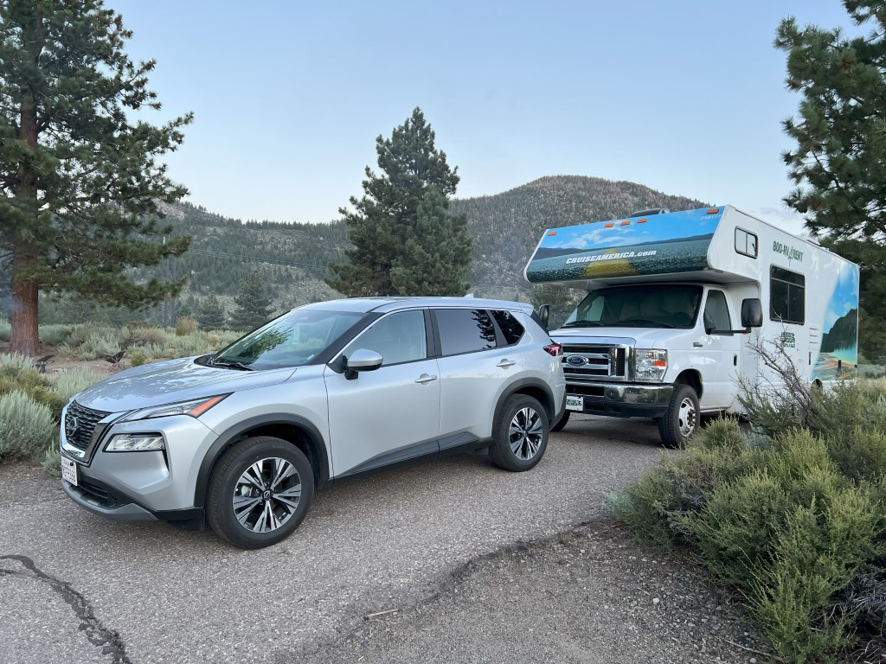

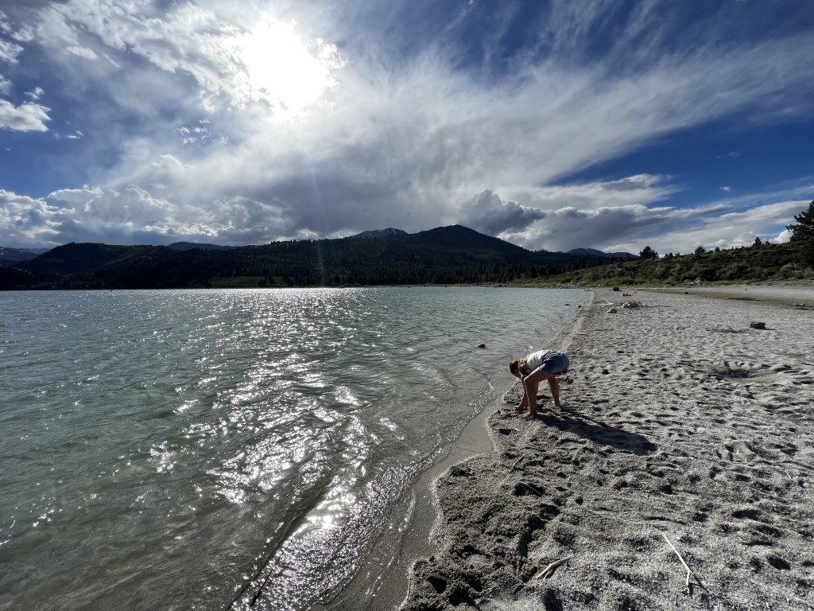

's Avonds gaan we bij het meer sterren kijken. Het is ongelooflijk hoeveel sterren je hier kunt zien.
