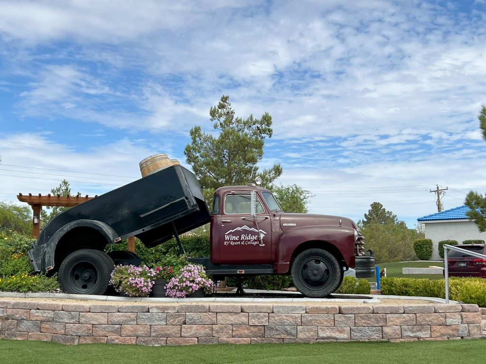

De ochtend in Pahrump vult zich met de laatste spullen in de auto zetten, camper schoonmaken, zwemmen, en spullen wegbrengen naar Goodwill. Al onze borden, bestek, glazen, pannen, opbergdoosjes die we 4 weken geleden bij Ikea hebben gekocht gaan naar deze kringloop winkel.

We hadden trouwens nog een akkefietje met de Walmart: we hadden voor aankomst in Amerka al online een fatsoenlijke tuinstoel besteld voor Chantal. Bij het ophalen in Portland bleek dat die stoel niet op voorraad was, en ze boden een niet zo goede alternatieve stoel aan. Die hebben we geweigerd, en we zouden ons geld teruggestort krijgen. Na 4 weken wachten en 2 telefoontjes hadden we nog steeds ons geld niet terug. Inmiddels hadden we in een andere Walmart al een goede stoel gekocht. Van puur gif hebben we die stoel schoongemaakt, in de tas gestopt en vanmorgen terug gebracht naar de Walmart in Pahrump. De mevrouw vroeg niet eens waarom de stoel terug kwam, en ik kreeg direct het geld terug.

Stipt om 3 uur melden we ons na 4600 kilometers gereden te hebben met de camper bij Cruise America in Las Vegas. Bij het inleveren loopt iemand dan met je door de camper om eventuele beschadigingen op te nemen, en mankementen te noteren. We krijgen ongevraagd 2 dagen camperhuur terug :-) Dus twee mooie meevallers op 1 dag!

Nu nog 2 uurtjes rijden naar Saint George, net over de grens in Utah. We hebben hier een vakantiehuis gehuurd. Het is gloednieuw, 3 verdiepingen hoog en fantastisch mooi. Superschoon, en van alle gemakken voorzien.

Hier verblijven nog 4 dagen tot we zondag naar huis vliegen.
