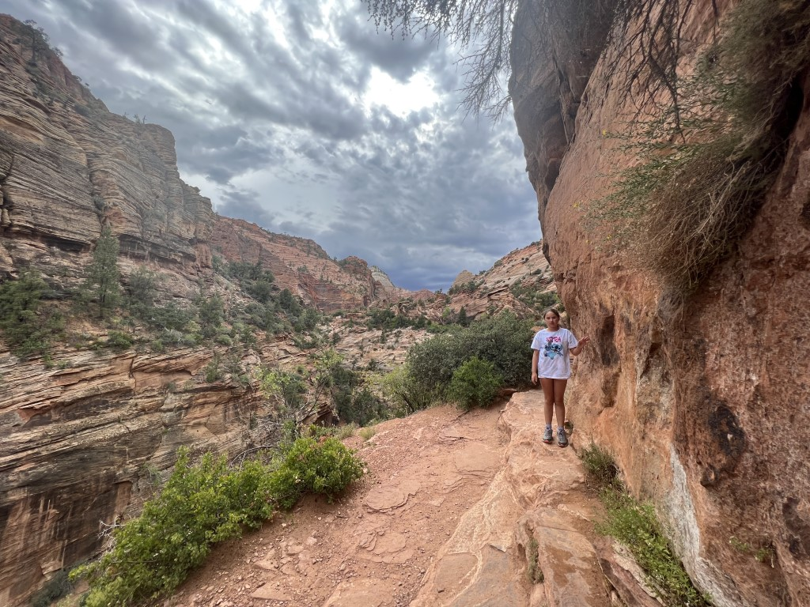
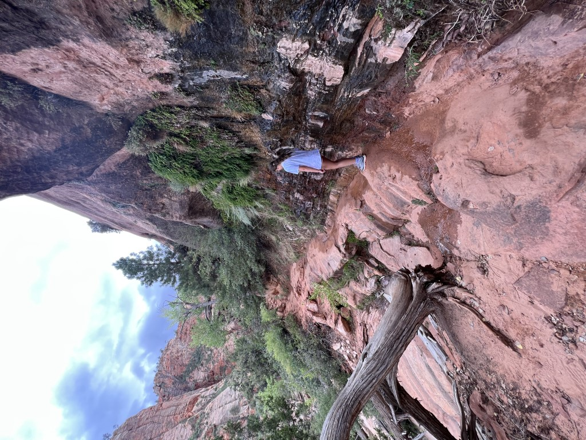
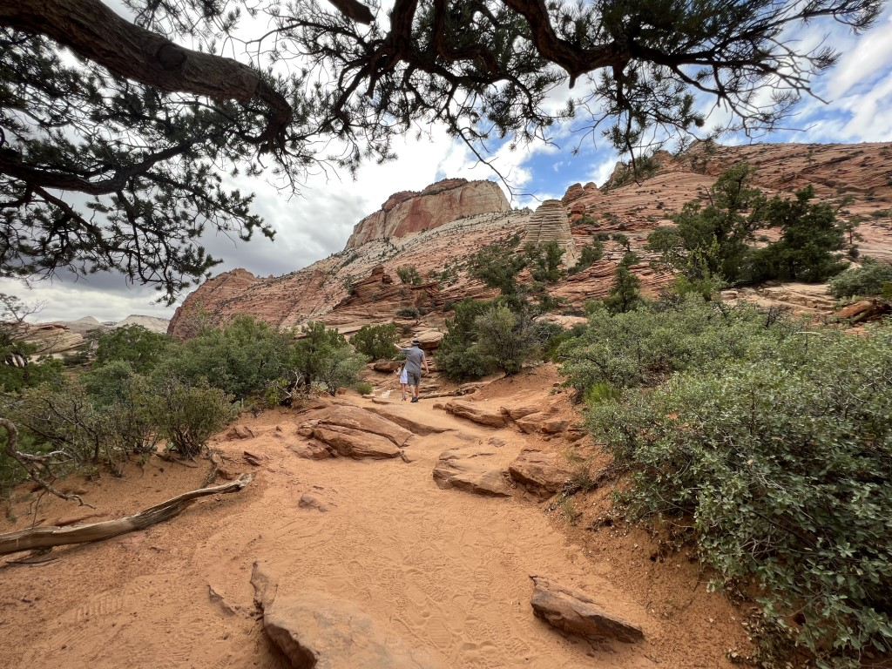
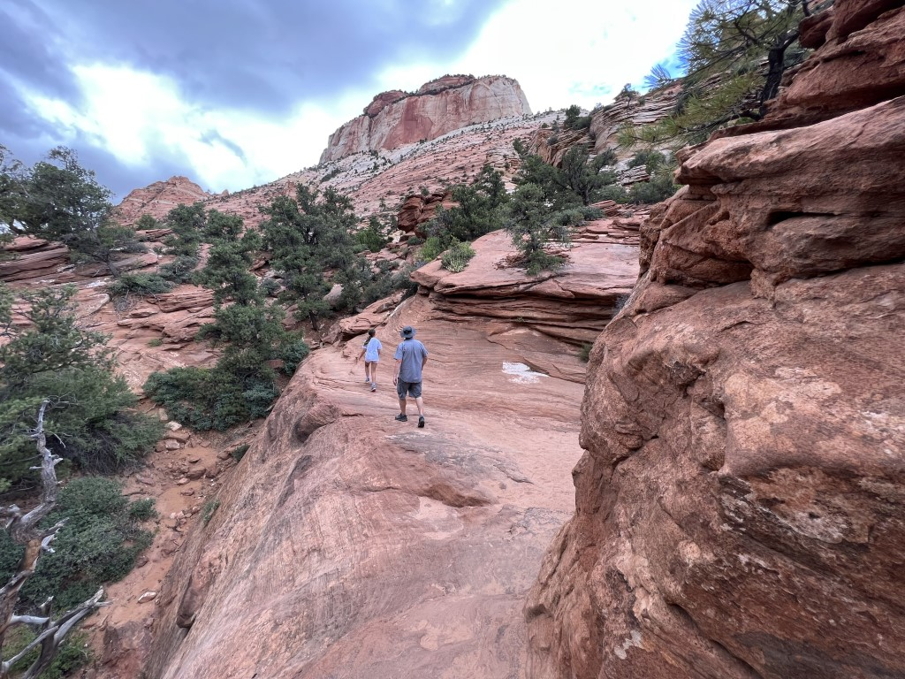
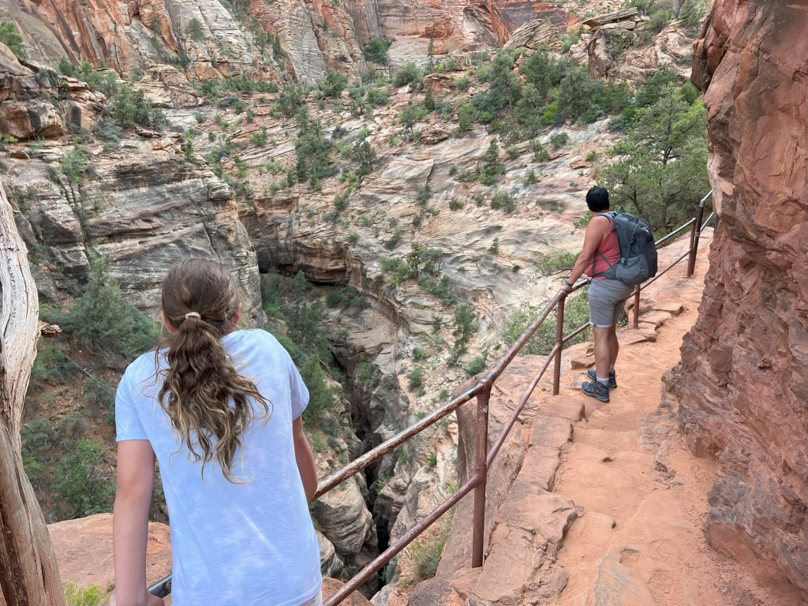
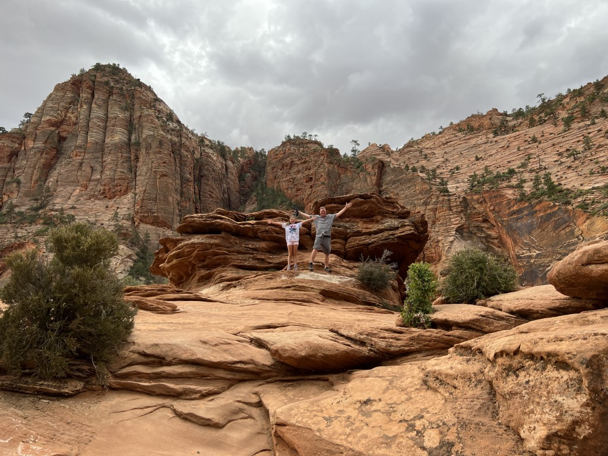
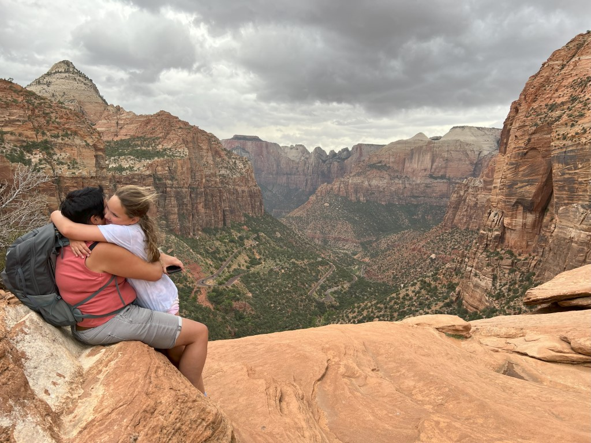
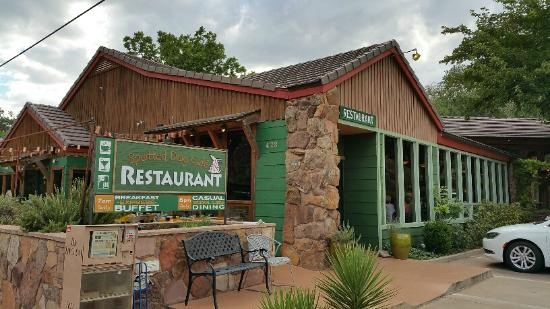
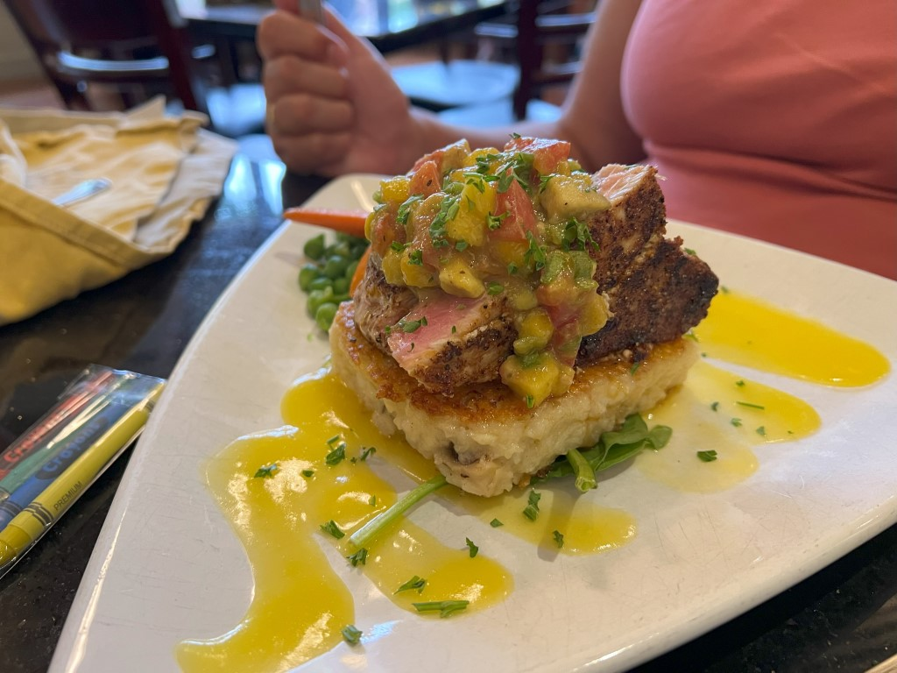

De ochtend beginnen we weer met zwemmen in de lagoon. Na de lunch gaan we naar huis om te lunchen. Het plan is om in Red Cliffs Recreation Area de Red Reef trail te wandelen. Bij aankomst blijkt de toegangsweg afgesloten, en dus moeten we een ander plan bedenken. We kiezen er voor om naar Zion National Park te rijden, dat ligt hier namelijk vlak bij. Inmiddels is het al ruim na 4 uur 's middags, dus heel veel kunnen we er niet doen. Via de fantastische slingerweg door het park, rijden we naar de tunnel die richting de oostelijke uitgang van het park gaat. Direct na de tunnel parkeren we de auto op het kleine parkeerplaatsje. Hier begint de Zion Canyon Overlook Trail.

Het paadje is kronkelig, en soms wat smal. De uitzichten zijn echter prachtig. We worden er weer aan herinnerd waarom Zion een van onze favoriete parken is.

Het is trouwens opvallend rustig, wellicht komt dat door het tijdstip, en de voorspelde regen?

Na een paar honderd meter komen we aan bij het uitzichtpunt over de vallei. We zijn opgelucht dat we het droog hebben weten te houden. Wel waait het erg stevig hier, dus we komen maar niet al te dicht bij de afgrond.

Na al dit moois is het tijd om de auto weer op te zoeken. We willen namelijk een beetje op tijd bij The Spotted Dog zijn in Springdale. Iedere keer als we in Zion zijn, proberen we daar namelijk te eten. Een soort van traditie dus, en die houden we met alle liefde in stand.

