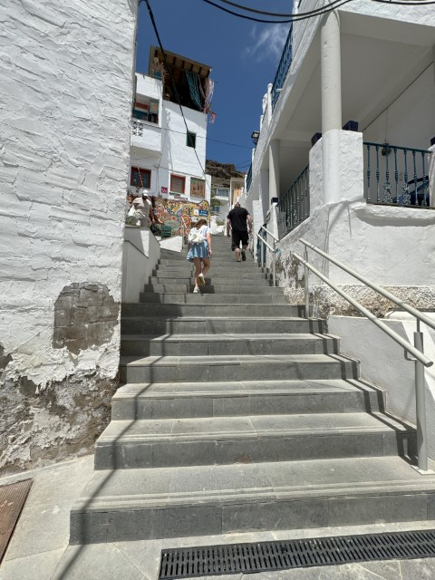
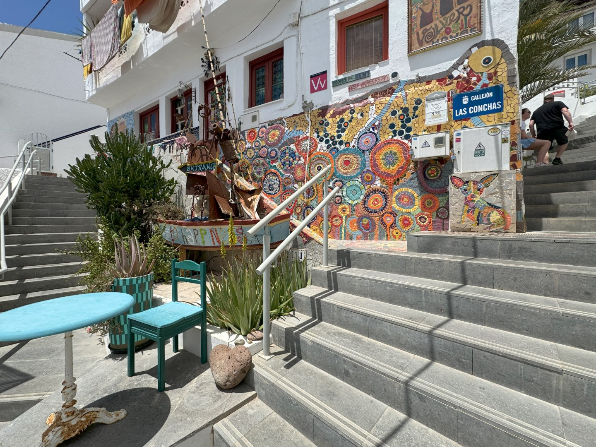
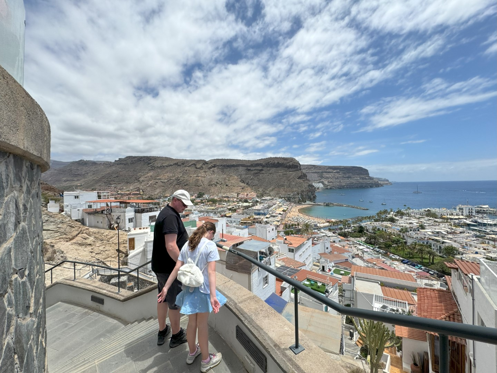
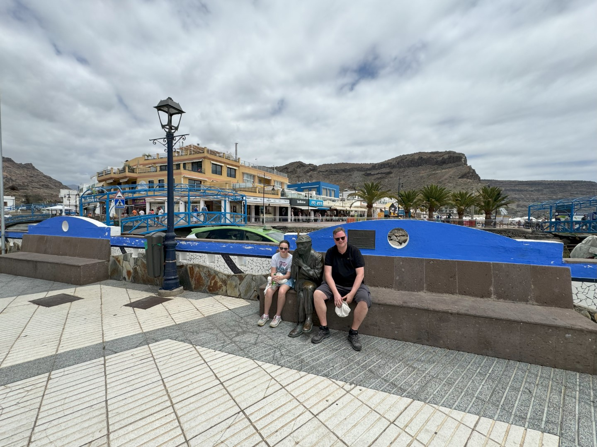
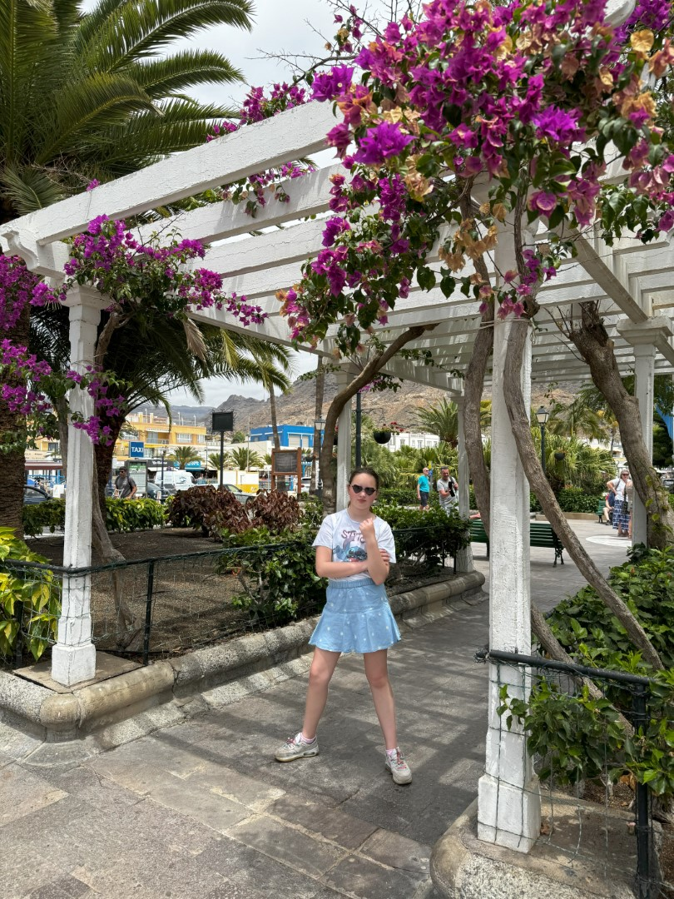
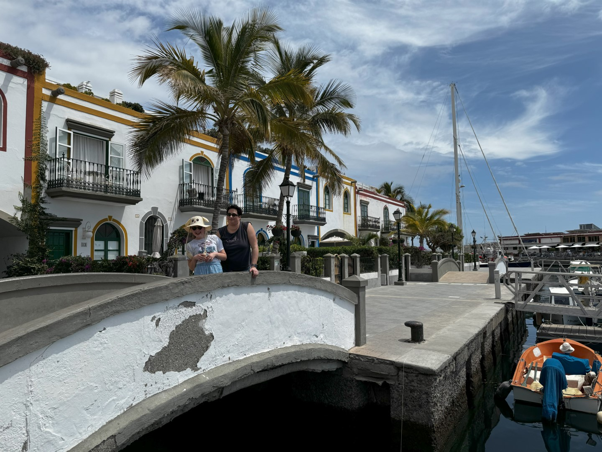
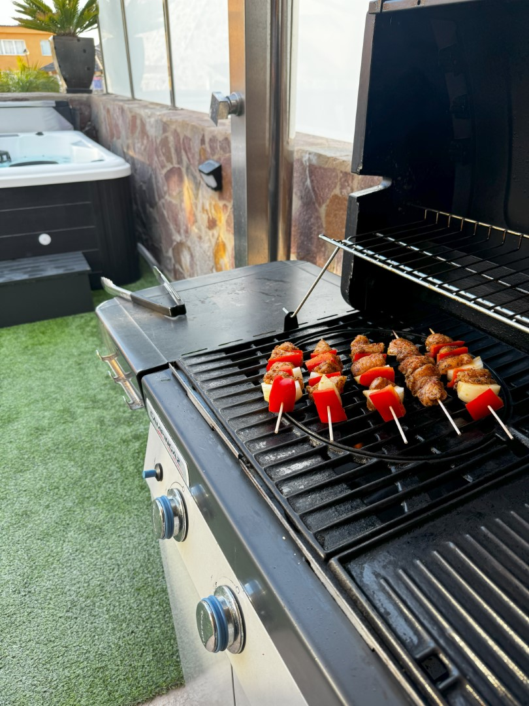
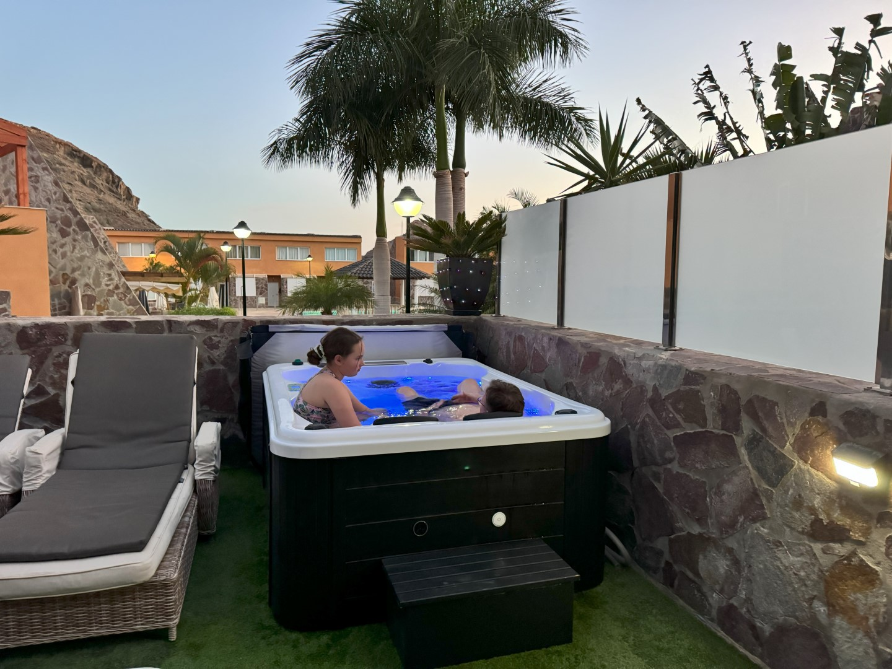

Het is vanuit ons huis slechts een kwartiertje rijden naar de haven van Mogan. We kunnen parkeren bij de haven en maken een wandelingetje door het alleraardigste dorpje. Het is best druk eigenlijk. Het havengebied is doortrokken met kanalen en wordt daarom soms "het Venetië van Gran Canaria" genoemd. Dat vinden wij iets te veel eer, maar zoals gezegd: het is prima toeven in de smalle straatjes.

Wij nemen de trap richting Mirador de Puerto de Mogan.

Het is een hele klim. Boven aangekomen kunnen we genieten van een heel mooi uitzicht over de haven en de zee.

Weer beneden aangekomen genieten we eerst van een welverdiend ijs op het terras van Heladeria Martonela. Hierna wandelen we nog even door het havengebied.

's Avonds eten we lekkere huisgemaakte kipspiezen van de gril, en duiken daarna in de hot tub.

