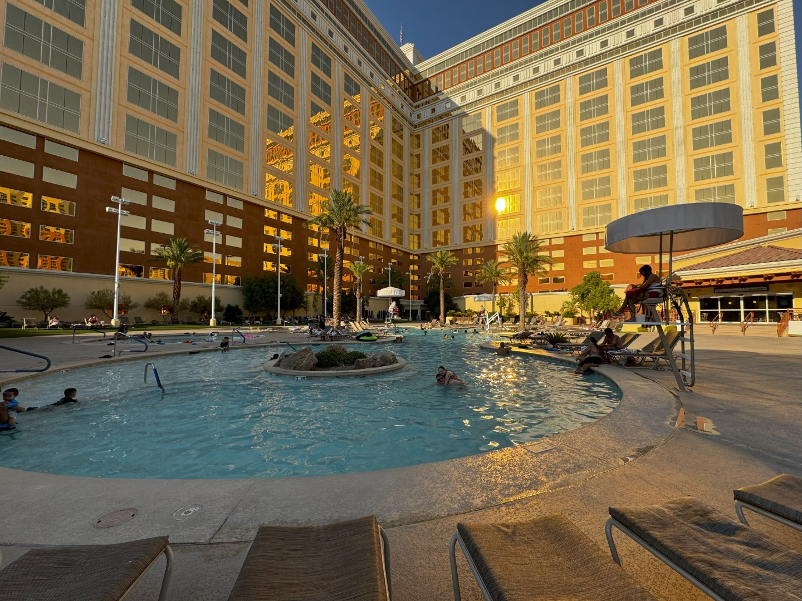
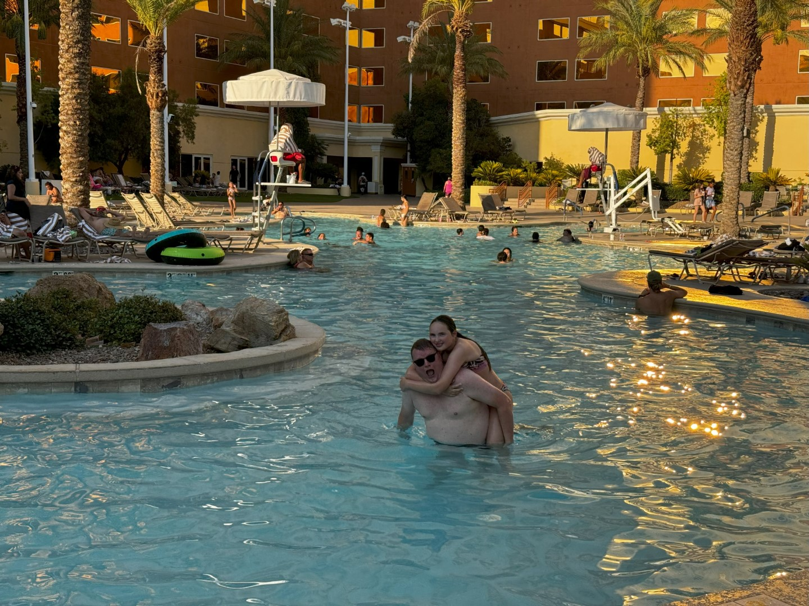

Vanmorgen om zes uur ging de wekker. We hebben snel aangekleed en alle tassen in de auto gezet. Rond kwart voor acht konden we op pad. Je kunt al goed merken dat de vakantieperiode is begonnen, want de rit ging probleemloos. Het inchecken ging supersnel, we hebben zelfs met gemak het tijdslot voor de security check gehaald. Dus daar hebben we zelfs helemaal niet hoeven wachten. Helaas was de rij bij de douane idioot lang. Het heeft ons uiteindelijk bijna drie kwartier gekost om ons paspoort te laten controleren. Gelukkig waren we ruim op tijd, dus we hebben nog wat gegeten en gedronken bij Starbucks.

We werden prima verzorgd door de KLM, maar desondanks duurde de vlucht voor ons gevoel toch erg lang. 10 uur is natuurlijk ook niet niks he.

Stipt 14 uur landden we op Harry Reid International Airport. Omdat ze de slurf niet goed aangesloten kregen, duurde het nog ongeveer een minuut of 20 voordat we uit het vliegtuig mochten. Ook hier was de rij bij de douane erg lang, en mochten we bijna een uur wachten. Voordeel is dan wel natuurlijk dat na al dit lange wachten, de koffers al op ons lagen te wachten. En toen liepen we voor het eerst de enorme hitte van Las Vegas in: 45 graden!

Met de shuttle bus werden we naar de Car Rental gereden. En na een paar minuten wachten kregen we de sleutels van een Nissan Armada overhandigd. Het ritje naar ons hotel South Point Casino voor de komende nacht is maar kort, maar al met al waren we toch pas om half zes in de hotelkamer. En dit was precies de reden om een hotel te kiezen die niet op de Strip ligt: de zwembaden daar sluiten (overal?) al om zes uur. Bij ons pas om acht.

Het casino is niet super groot, maar de kamer is ruim, schoon en heeft twee goede bedden. Maar we trekken natuurlijk snel de zwembroek aan en gaan even plonzen in het mooie zwembad. Er is bijna niemand!

Na een snelle hap, zijn we gaan slapen. We zijn erg moe na deze lange en warme dag.
