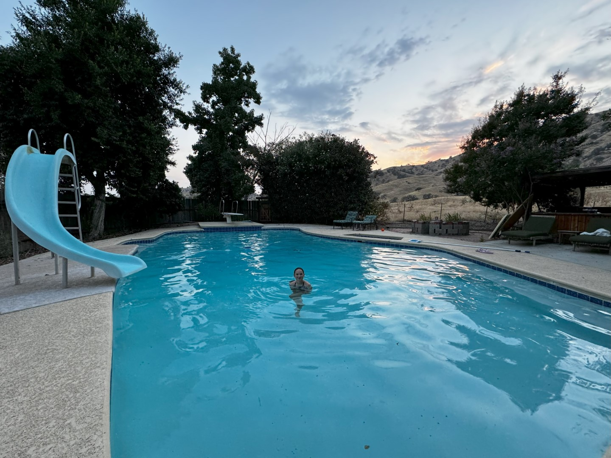

Eigenlijk hebben we prima geslapen. Meestal is de eerste nacht met zo'n groot tijdsverschil (9 uur) voor ons geen pretje, en ben je om 3 uur klaarwakker. Nu zijn we om een uur of zeven opgestaan, en hebben we in het hotel ontbeten.

We hebben vandaag een lange rit voor de boeg: 550 kilometers, waarvan een heel groot deel door de woestijn over de I-15 westwaards. Bij de tankstop bij Boron weer de thermometer 47 graden aan. Gelukkig waaide het redelijk hard, maar het was toch wel erg warm. In Bakersfield hebben de dames boodschappen gedaan en ben ik bij AT&T een Amerikaans simkaartje gaan kopen, zodat we onderweg ook van internet gebruik kunnen maken om wat zaken op te kunnen zoeken.

Vanuit Bakersfield was het nog zo'n 90 minuten rijden naar ons Airbnb huis in Springville, California. We werden zeer hartelijk ontvangen door Michal, een krasse dame van bijna 70. Het is een behoorlijk groot huis, en Michal woont in het ene deel van het huis, en aan de andere kant heeft ze drie slaapkamers die ze verhuurt. Wij zijn de enige huurders op dit moment, dus we hebben alles voor ons zelf. Er is een mooi zwembad, volledige buitenkeuken, een soort boomhut op het dak van de garage met een mooi uitzicht over de omliggende heuvels.

's Avonds hebben we hamburgers gemaakt op de gas bbq en nog heerlijk gezwommen tot het donker werd.
