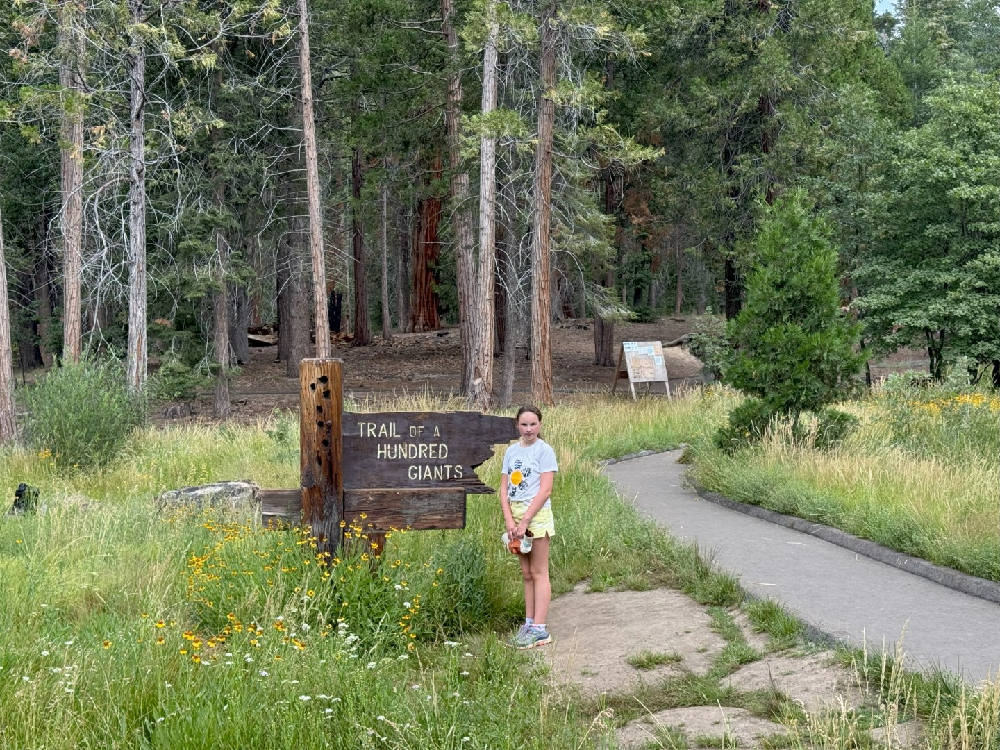
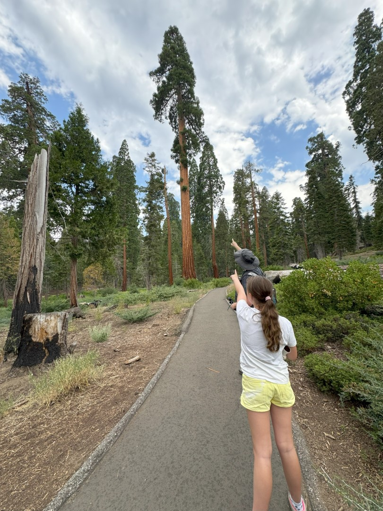
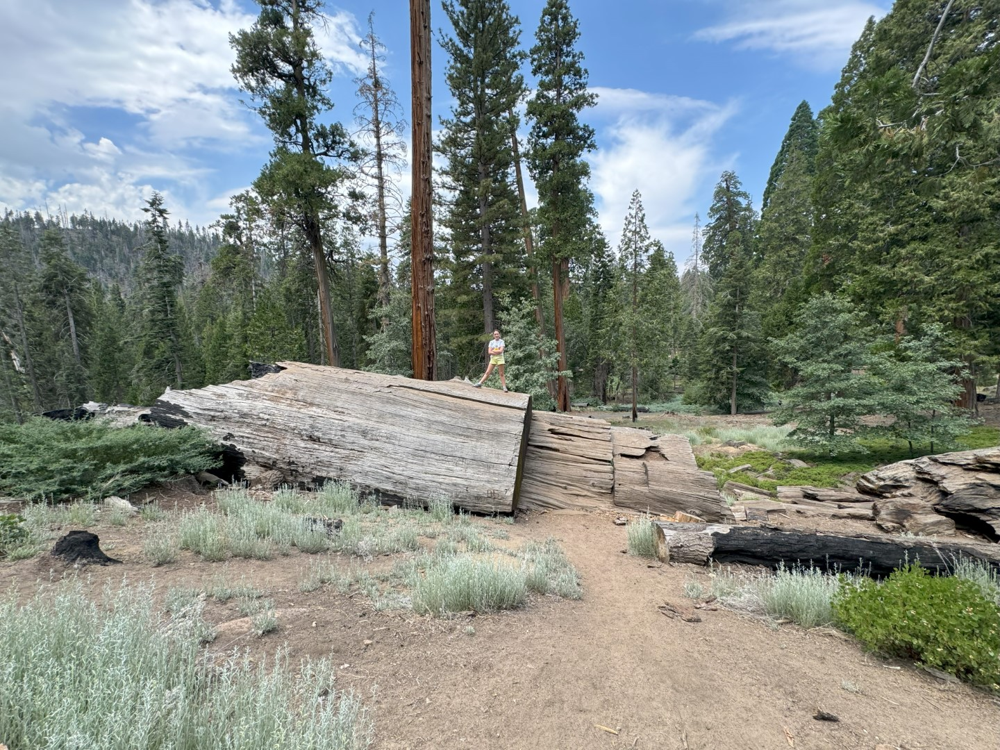
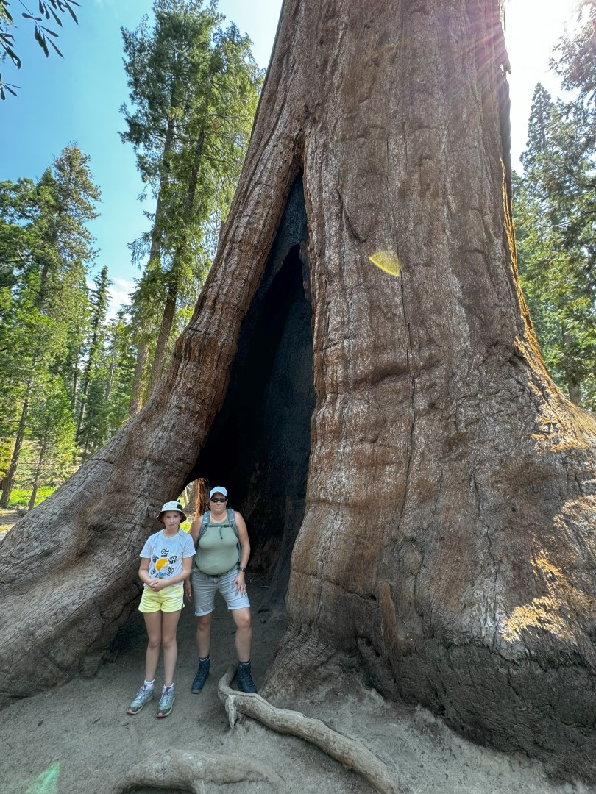
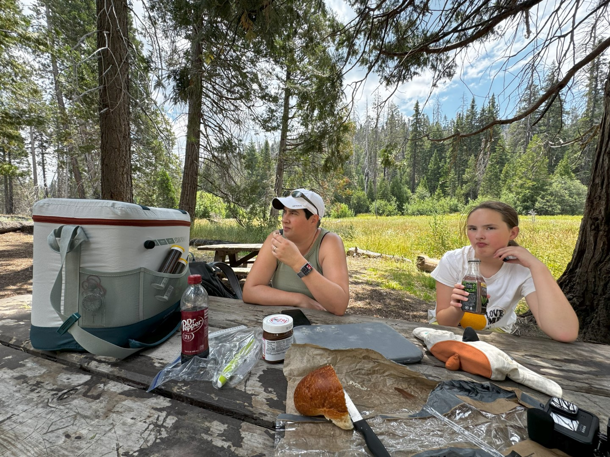
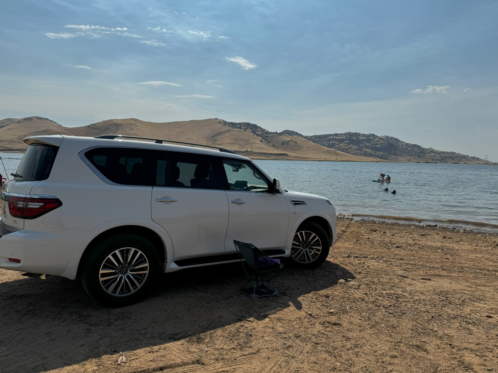
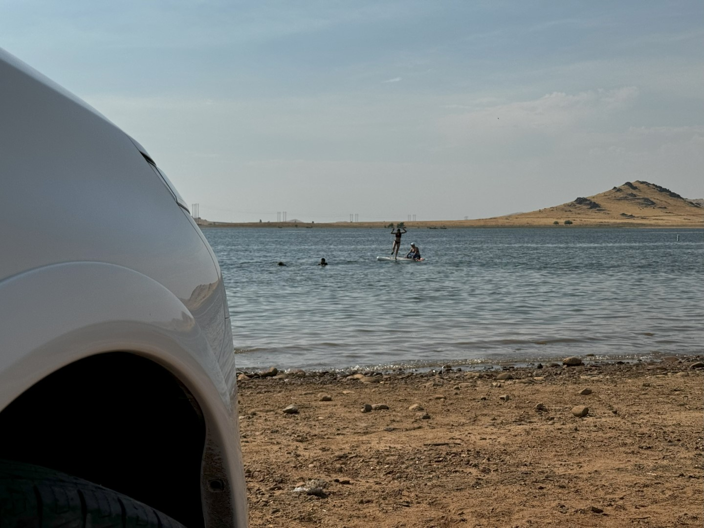
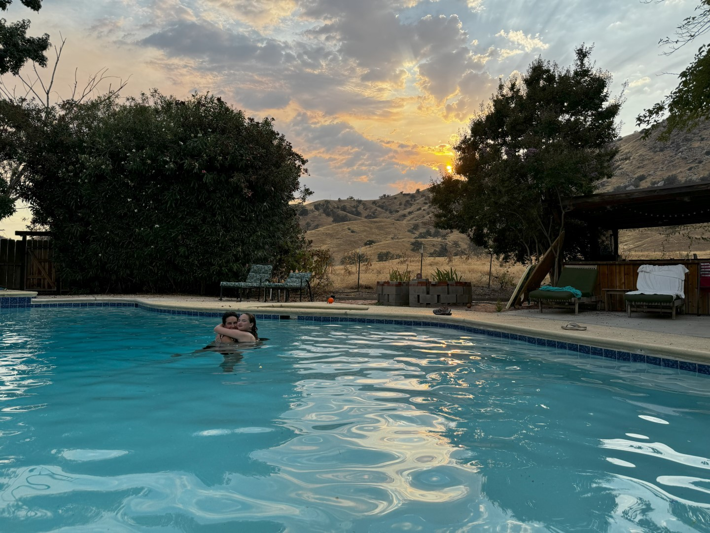

Vanuit ons huis rijden we over de fantastisch mooie CA-190 al slingerend dat het een lieve lust is, in ongeveer 90 minuten naar de parkeerplaats van waaruit de Trail of 100 Giants begint.

Over zeer makkelijk begaanbare paadjes wandelen we tussen de sequoia's. Het blijft een machtig gezicht, deze reuzen van bomen.

Sequoia's groeien op een hoogte tussen 1400 en 2100 meter, in een strook van zo'n 32 km breed en 430 km lang. De bomen hebben een koelere omgeving nodig, en heel veel water.

We spenderen een uurtje of twee in het bos. Bij de parkeerplaats is een aantal tafels geplaatsts. Hier lunchen we met een mooi uitzicht over de omringende bergen.

Na de welverdiende boterham, stappen we weer in de auto en rijden de CA-190 verder door. Na nog meer geslinger, komen we uiteindelijk aan bij Lake Success. Dit stuwmeer ligt vlak bij ons huis. We parkeren de auto op het strand.

Het is tijd om ons in Las Vegas aangeschafte sup board (een opblaasbaar surf board) voor de eerste keer uit te testen. Het was geen pretje om met 40 graden dat stomme ding op te pompen, maar de dames hebben zich kostelijk vermaakt.

's Avonds hebben we bij ons huis gegeten, en tot laat in het zwembad rond gehangen.

