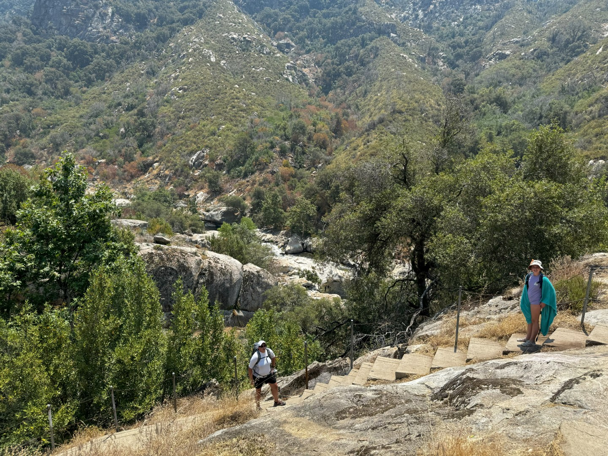
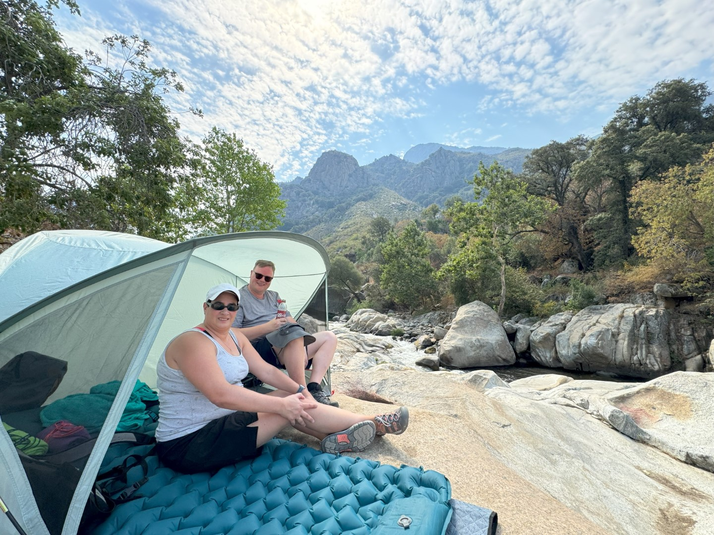
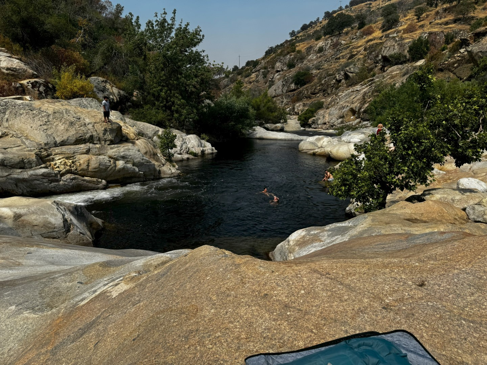
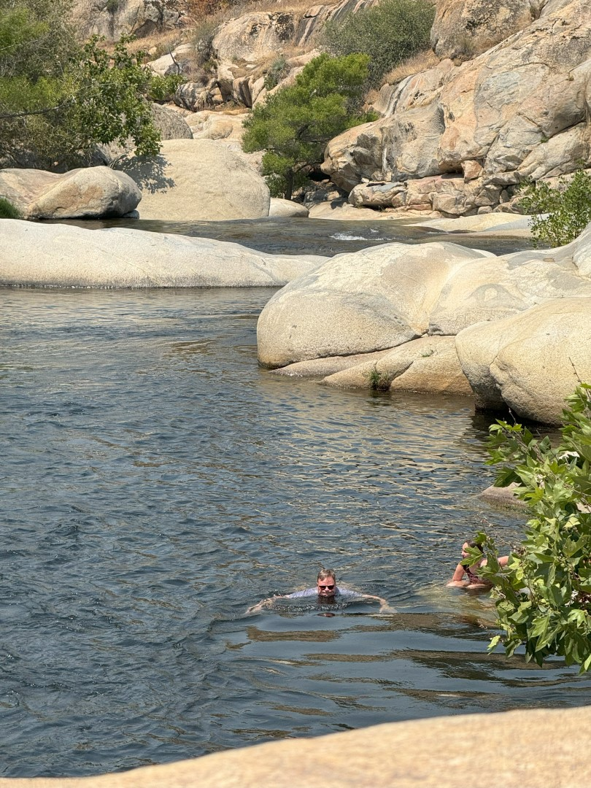
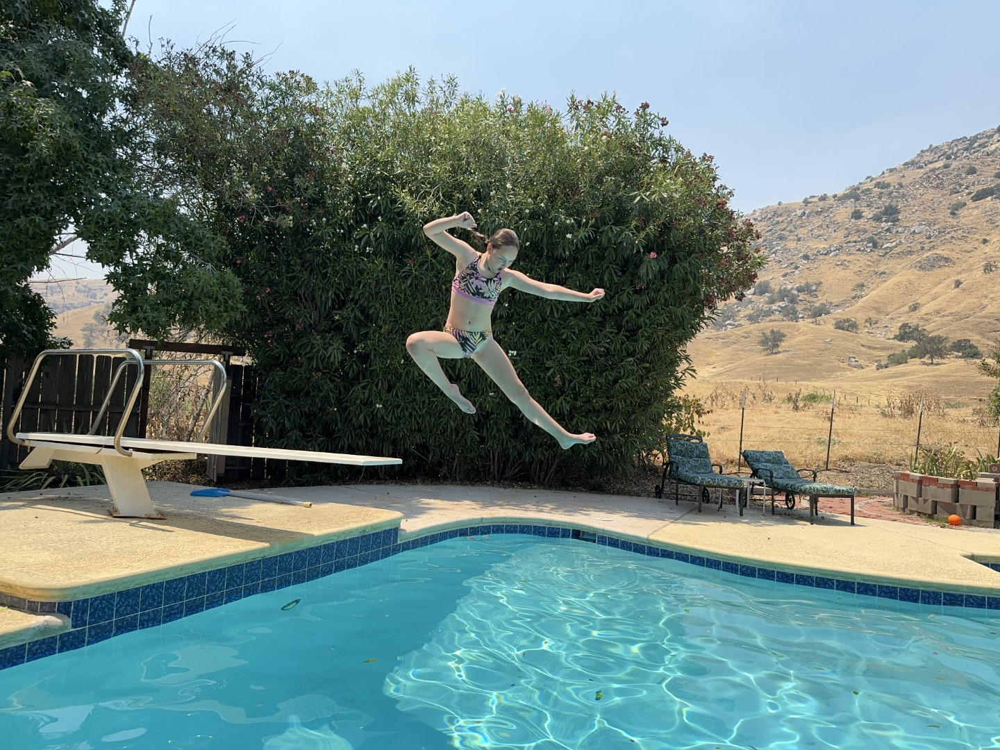
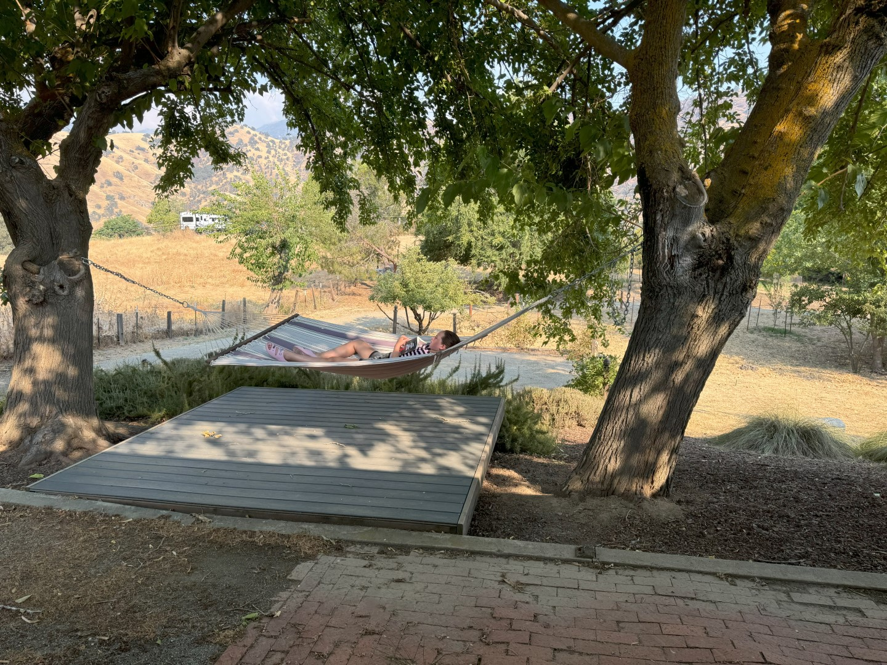

Het is vandaag zondag, dus om de drukte voor te zijn stappen we direct na het ontbijt in de auto. Op een paar minuten rijden van ons huis kun je in diverse zogenaamde swimming holes zwemmen in de Tule River. Zo'n swimming hole ontstaat door het verval van de rivier en opeenhoping van rotsblokken. Tussen twee van die opeenhopingen ontstaat dan soms een stuk water wat niet zo snel meer stroomt, en dus kun je er prima in zwemmen.

Via een heel aantal trappen moeten we naar beneden lopen naar de rivier. We hebben een mooi plekje gevonden bovenop de (mini) waterval.

Het tewatergaan vergt enige lichamelijke behendigheid, de rotsen zijn namelijk spekglad. Dus al glijdend op het zitvlak gaan we het water in. Het is uiteraard steen- en steenkoud. Er zijn wat waaghalzen die van de hoge rotsen willen springen. Bovendien is de stroming redelijk sterk, dus het is wel een beetje uitkijken geblazen.

De rest van de middag en avond spenderen we in het zwembad bij ons huis.

Het is onze laatste nacht hier, dus we genieten tot laat van het zwembad en de omgeving.

