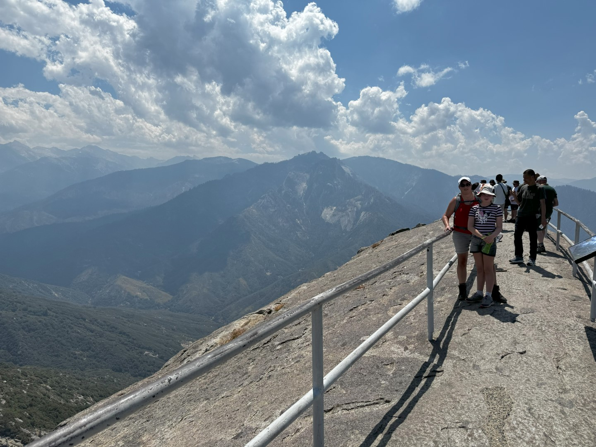
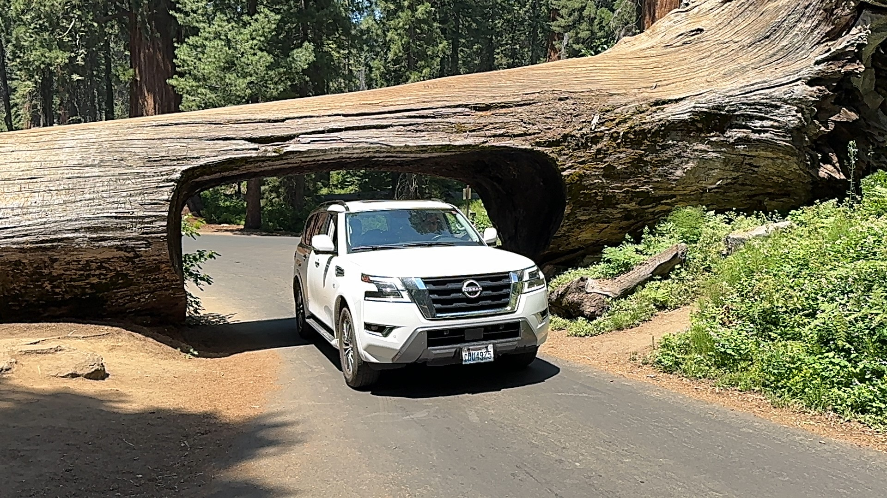
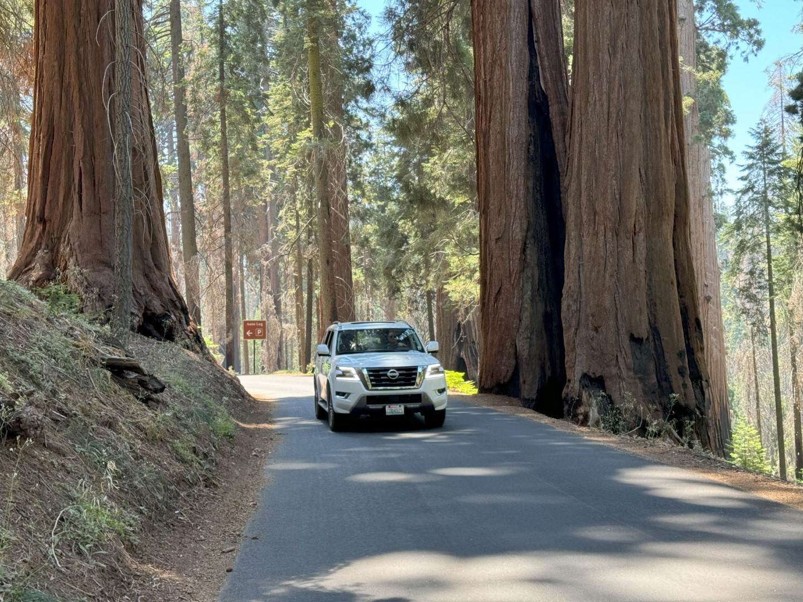
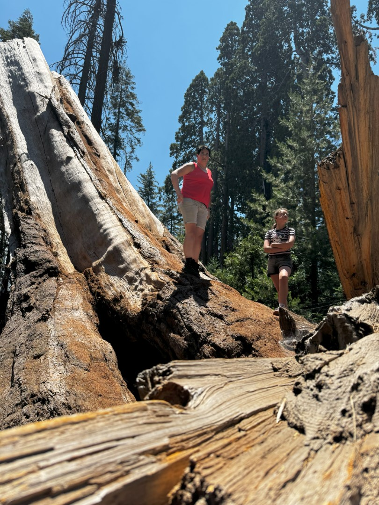
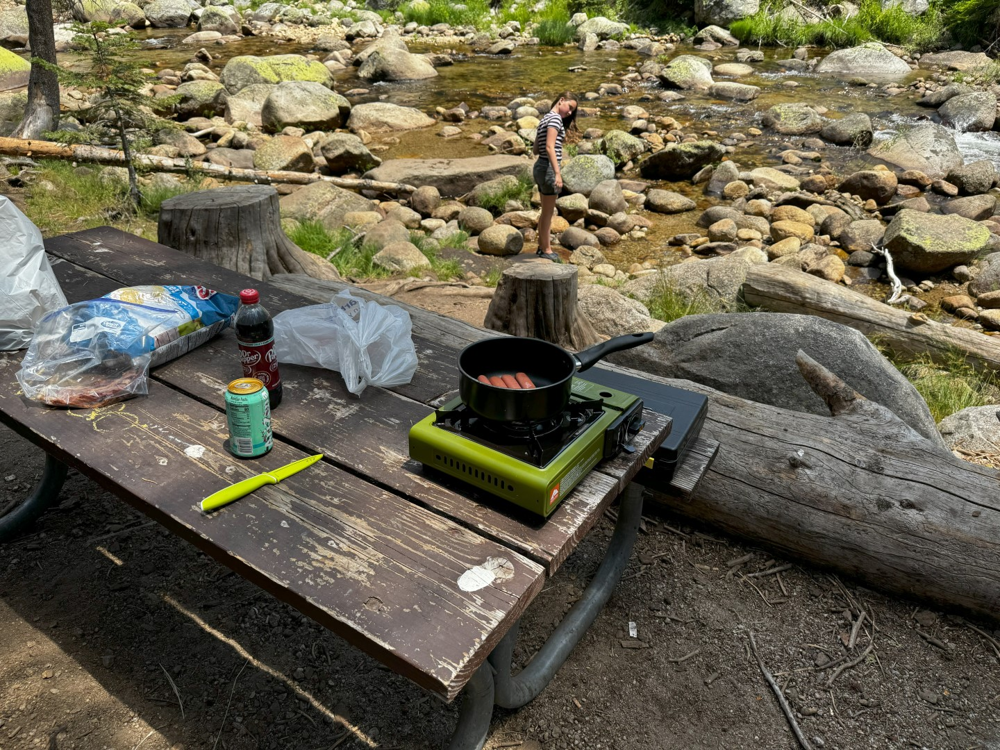

Dit rit vanuit Springville naar San Francisco is wat ver om in een keer te overbruggen, dus we hebben halverwege een hotel geboekt in Madera, California. Dit geeft ons mooi de tijd om dwars door Sequoia National Park te rijden en daar nog het een en ander te bezoeken.

Het is vanuit Springville zo'n 90 minuten rijden naar de zuidelijke ingang van het park. De weg is werkelijk prachtig. We gaan hoger en hoger, en de weg wordt smaller en smaller, de uitzichten mooier en mooier. De eerste stop voor vandaag wordt Moro Rock.

Na een kort maar krachtig klim over smalle trapjes en paadjes kom je bovenop de rots met rondom een heel mooi uitzicht. Vlak bij Moro Rock kun je met de auto onder een omgevallen sequoia (Tunnel Log) doorrijden. Op internet lees je dat het hier vaak file rijden is, maar wij konden direct doorrijden.

Bij de picknick area van Lodgepole parkeren we de auto en nemen het gasbrandertje mee naar het lager gelegen riviertje. Niks is lekkerder dan een huisgemaakte hotdog aan de waterkant.

Helaas vinden steekbeesten van divers pluimage hotdogs ook lekker, dus na de eerste twee happen zijn we weer naar de auto gevlucht. Hier zitten gelukkig geen steekbeesten en kunnen we rustig verder met de lunch.

Hierna rijden we door naar hotel La Quinta in Madera. Een prima hotel voor een nachtje.
