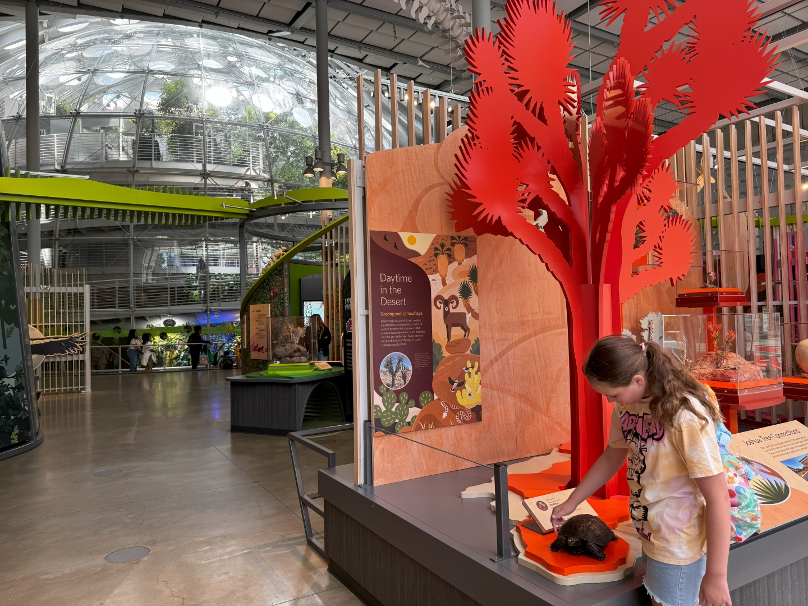
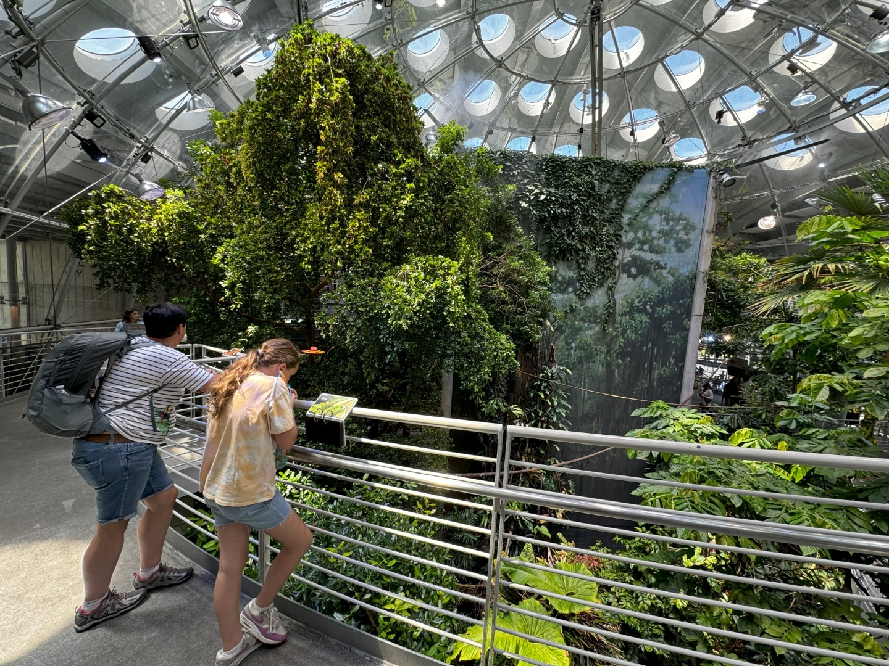
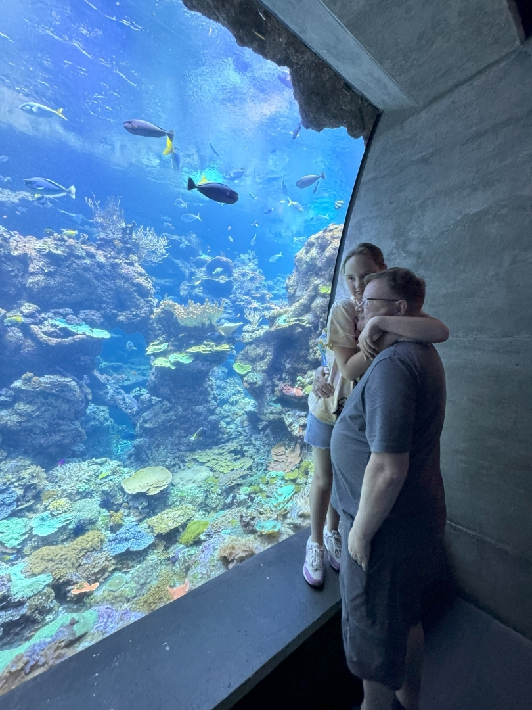
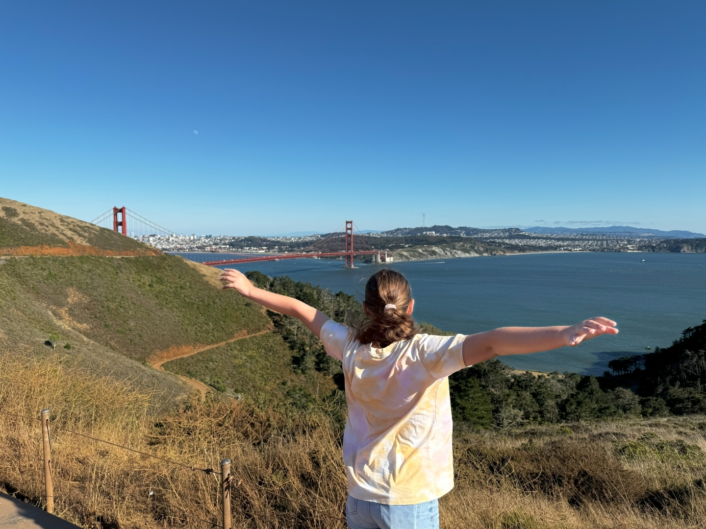
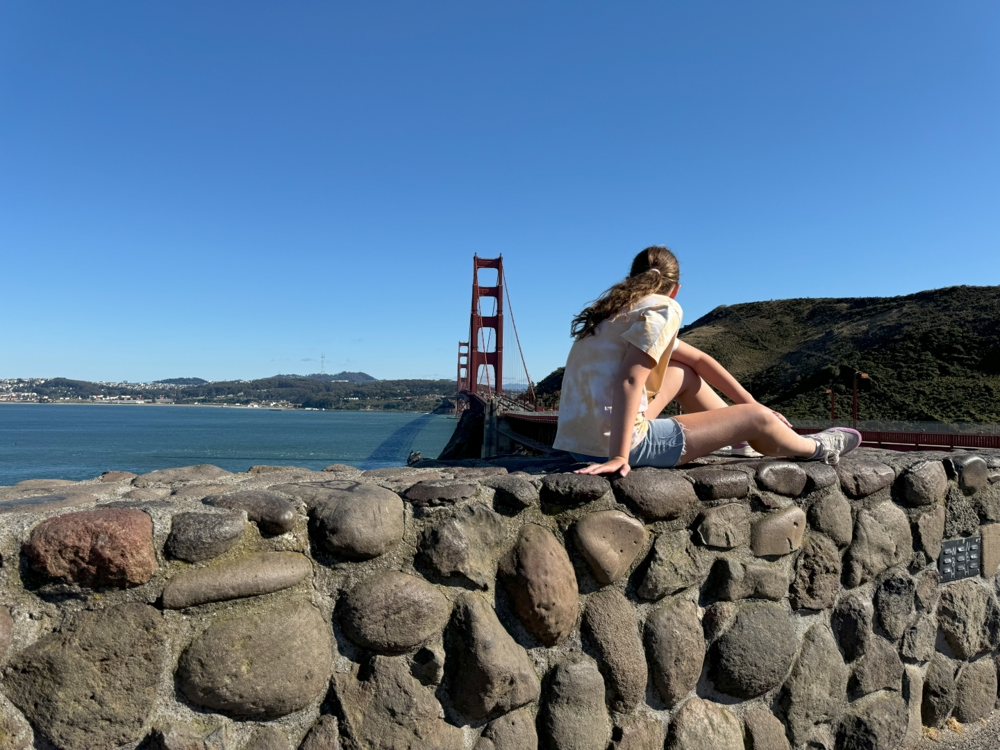

De rit vanuit Madera naar San Francisco verloopt voorspoedig. Om een uur of 1 lopen we uit de parkeergarage van het natuur historisch museum California Academy of Sciences.

We zijn hier al eerder geweest, maar het is best groot en de vorige keren hebben we niet alles kunnen bekijken. Als eerst gaan we het regenwoud in. In een soort reuzen-ei loop je vanaf de bodem van het woud naar de top van een boom en kun je de dieren, insecten en planten bekijken.

Na het regenwoud gaan we naar het aquarium. Het is groots en mooi verzorgd opgezet.

Als laatste bezoeken we nog het planetarium, waarin een mooie (en slaapverwekkende) film over het heelal wordt vertoond.

Om vijf uur worden we het gebouw uitgeschopt en rijden via de Golden Gate Bridge naar onze eindbestemming Vallejo, iets ten noord oosten van San Francisco.

De komende drie nachten verblijven we in het Hampton Inn Discovery Kingdom Napa Gateway hotel.
