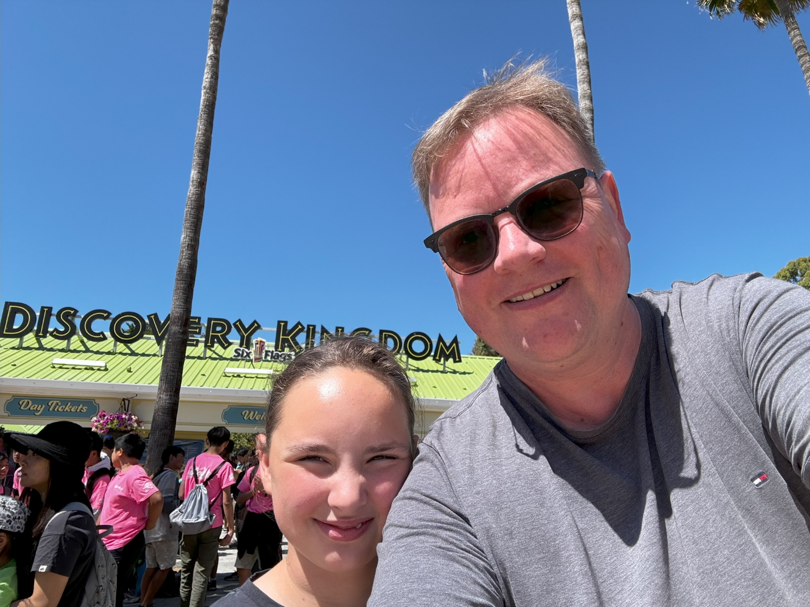
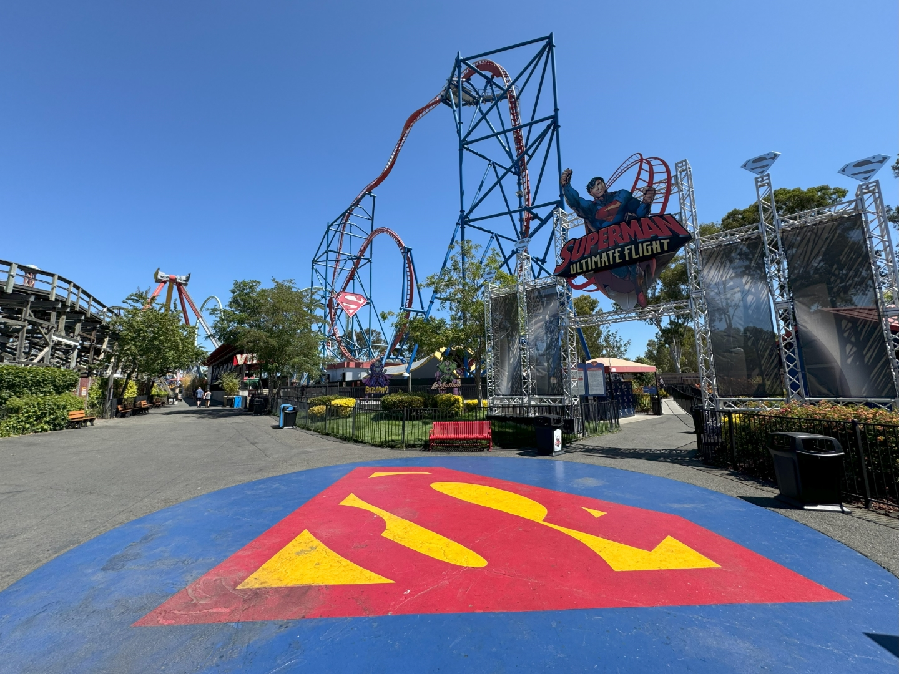
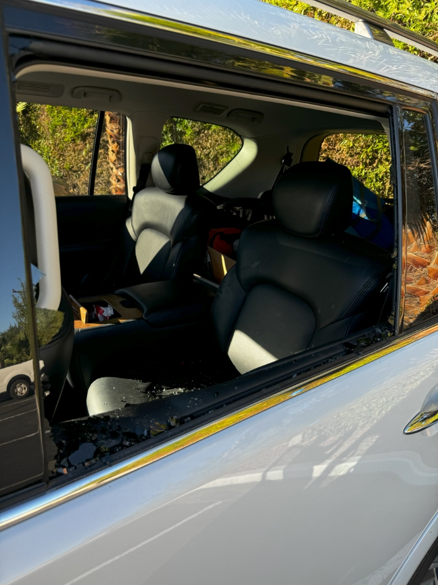
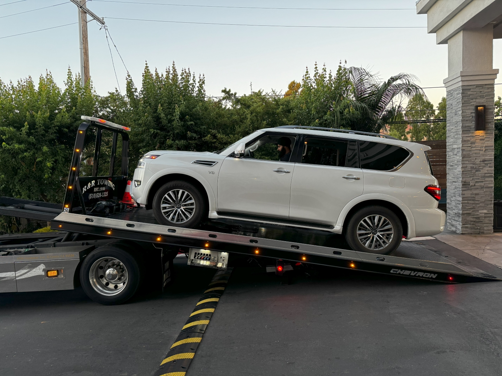

Vandaag hebben we geleerd hoe snel een leuke dag in een niet leuke dag kan veranderen...

We konden rustig ontbijten vanmorgen in het hotel. Vandaag staat het bezoek aan Six Flags Discovery Kingdom op het programma. Ons hotel ligt op 10 minuten lopen van de ingang, dus de auto laten we lekker op de parkeerplaats van het hotel staan. Het park opent om 11 uur. Six Flags is bekend (of berucht, het is maar hoe je het bekijkt) vanwege de vele, vaak spectaculaire, achtbanen.

Het is opvallend rustig in het park, en dat blijft gelukkig de hele dag zo. We weten in dezen niet helemaal wat oorzaak en gevolg is: is het zo rustig omdat de helft van de achtbanen gesloten is, of is de helft van de achtbanen gesloten omdat er zo weinig mensen zijn? De waarheid zal ergens in het midden liggen vermoed ik.

Als eerste gaan Sofie en papa in Superman. Maar goed dat we weinig bedenktijd hadden, want er was geen rij. Wat een rit zeg!

Met ongelooflijk veel kracht worden we de hoogte in geschoten, om vervolgens met meerdere loopings weer tot stilstand te komen.



Na nog meer spektakel bij Madusa en The Joker (wow!), en wat rustigere attracties, zijn de dames nog in de wildwaterbaan (resultaat: beide drijfnat) geweest. Hierna was het al weer aan het einde van de middag en zijn we via de mini dierentuin terug naar het hotel gelopen.

Het is inmiddels zes uur, dus we douchen snel en trekken schone kleren aan om in een restaurant wat te gaan eten. Toen we bij de auto aankwamen, schrokken we ons een hoedje: de ruit links achter is ingeslagen, en er ligt allemaal glas op de bank. De onverlaat heeft de gloednieuwe wandelschoenen van Chantal en waterschoenen gepikt! Mijn wandelschoenen en de sup heeft 'ie laten liggen! Gelukkig lagen al onze andere spullen in de hotelkamer.

Daar ging dus ons plannetje om ergens te eten.

We konden, gelukkig online, aangifte doen bij de Vallejo Police Department en daarna Alamo bellen. Hulde aan Alamo trouwens: er wordt direct een takelwagen en taxi geregeld. Binnen een uur stond een takelwagen voor de deur om de auto op te halen.

Een half uurtje later kwam een taxi voorrijden om mij naar het vliegveld van Oakland te brengen, een ritje van bijna een uur. Daar stond een nieuwe auto op ons te wachten. Het is een maatje kleiner dan de vorige, maar nog altijd erg ruim. Uiteindelijk was ik om elf uur weer bij het hotel.

We hadden toevallig wat restantjes van ons restaurantbezoek van gisteravond meegenomen, dus dat hebben we maar opgewarmd in de hotelkamer.

Al met al dus een enerverende dag...
