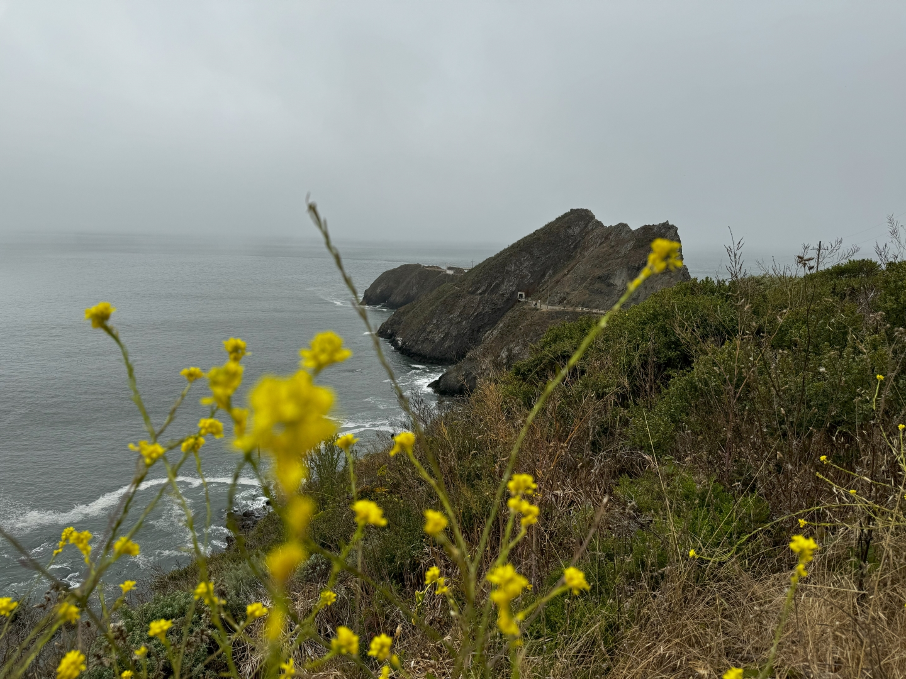
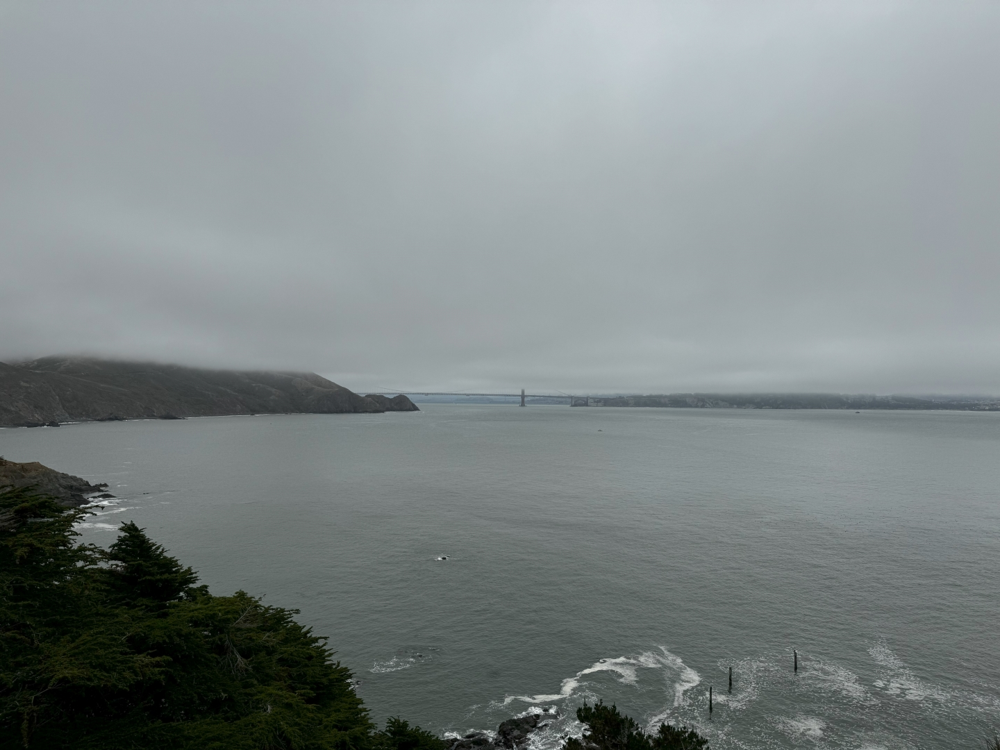
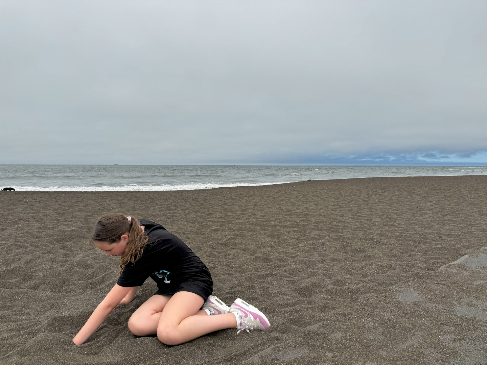
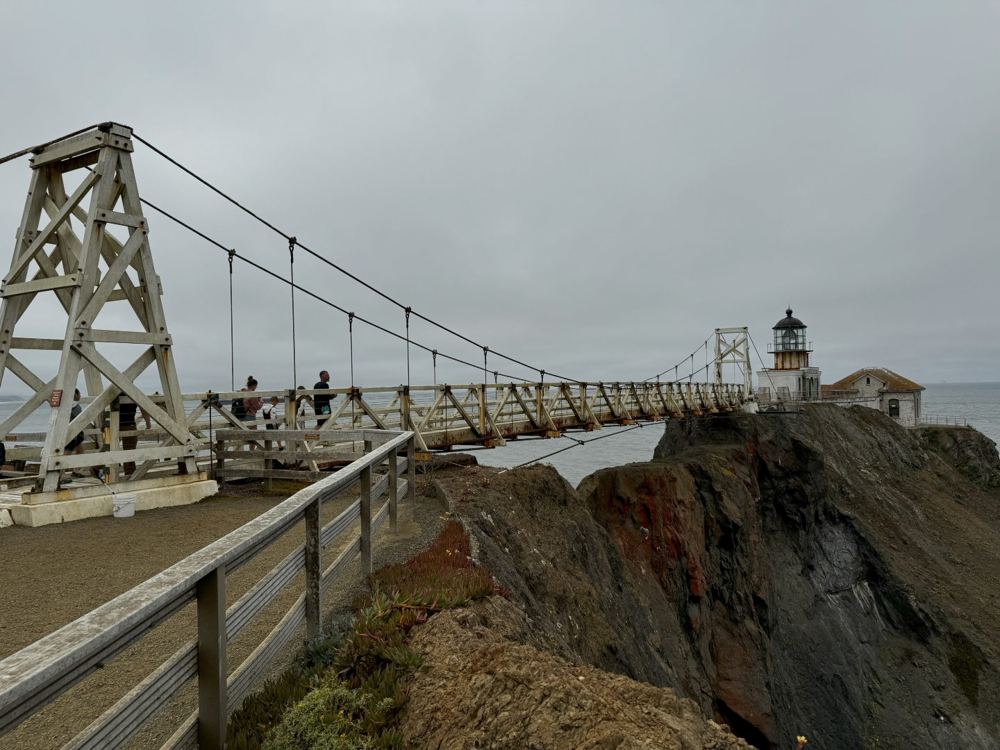
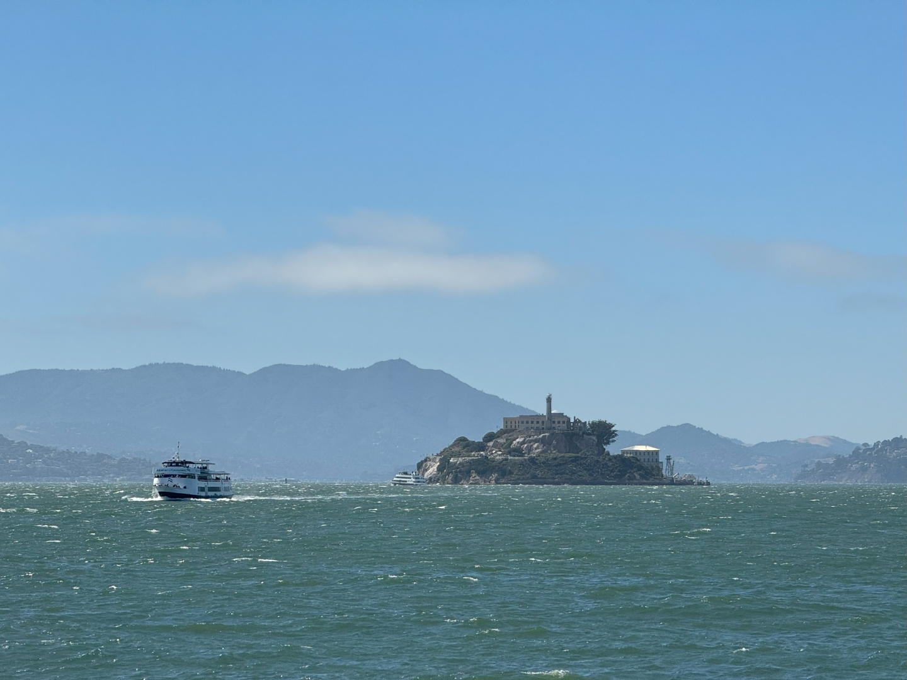
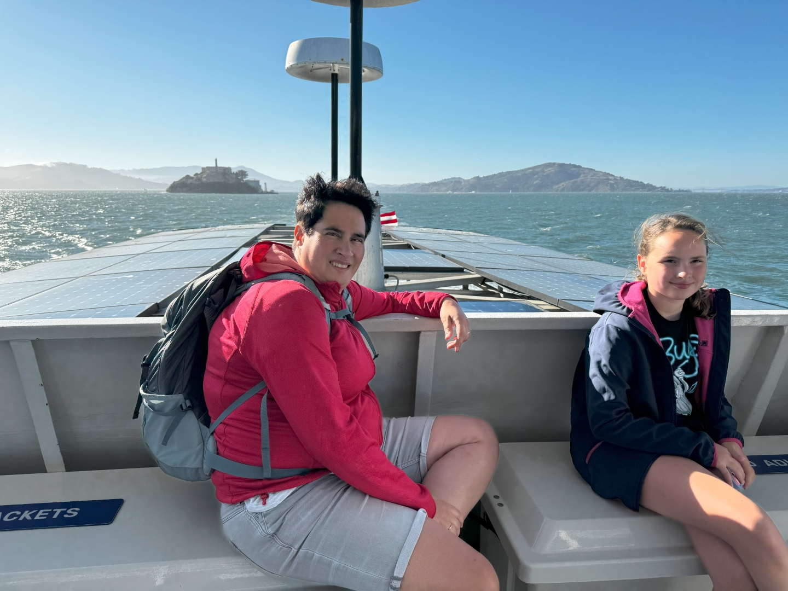
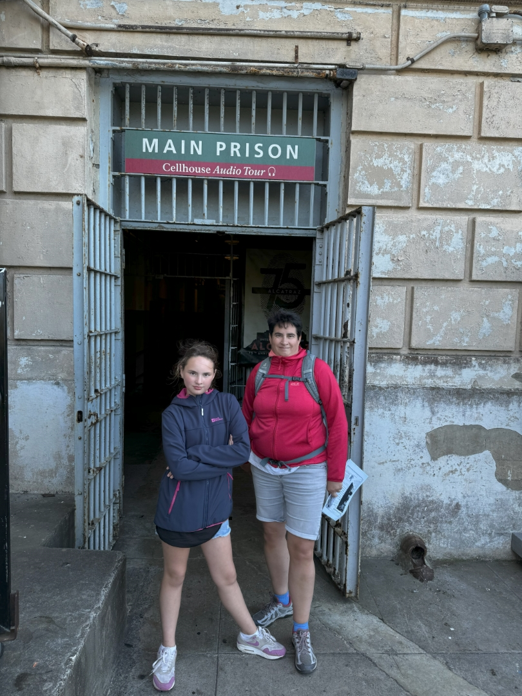
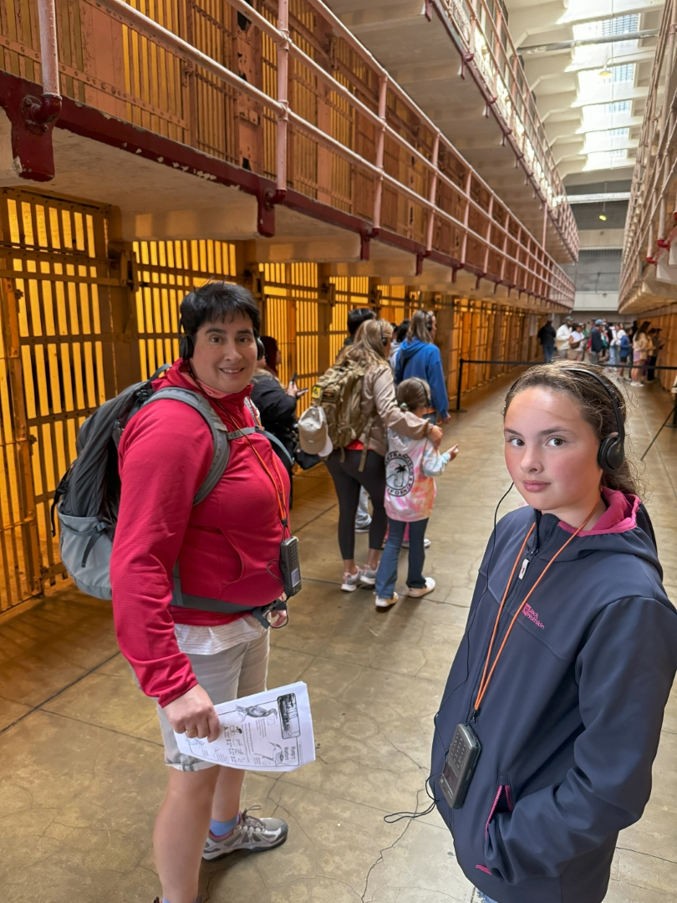

De inbraak heeft veel indruk gemaakt op Sofie. Na een wat onrustige nacht, zijn we met de GMC Acadia naar Point Bonita Lighthouse gereden. Deze vuurtoren uit 1855 wordt nog steeds gebruikt, en ligt aan de noordkant van de Golden Gate Bridge. Het moet samen met een vuurtoren aan de zuidkant en nog een op Alcatraz het scheepsverkeer veilig de San Francisco Bay in loodsen. Point Bonita is te bezoeken via een kort maar leuk en steil wandelpaadje.

Beneden aangekomen blijkt dat de tunnel naar de vuurtoren pas om half 1 open gaat. Als ze die openingstijden nu eens op de website, of bovenaan het paadje zouden vermelden...

De Golden Gate is gehuld in een dikke mist. We horen constant de misthoorns blazen.

Omdat we de vuurtoren dus nog niet kunnen bezoeken, zijn we maar weer terug naar de auto gelopen om even naar het vlakbij gelegen Rodeo Beach te gaan.

Stipt om half een melden we ons weer bij de ingang van de tunnel van Point Bonita Lighthouse. We sluiten aan bij het ranger praatje over de ontstaansgeschiedenis van de vuurtoren, om vervolgens samen met haar door de tunnel te wandelen. Na de tunnel moeten we nog over een bruggetje om bij de vuurtoren te komen.

De vuurtoren zelf is maar klein, dus we zijn snel uitgekeken. De ranger van dienst neemt uitgebreid de tijd om het junior ranger boekje van Sofie te bekijken en de badge uit te reiken.

We duiken snel in de auto, want we moeten ons op tijd melden bij de boot naar Alcatraz. We parkeren bij Ghirardelli Square. Wanneer je in een van de deelnemende winkels een aankoop doet, dan wordt het verschuldigde parkeerbedrag gehalveerd. Goede deal, want parkeren in dit deel van San Francisco is idioot duur (minstens 50 dollar). Het is van hieruit wel nog ruim een half uur lopen voordat we bij de boot aankomen. Onderweg is genoeg te zien en beleven.

De overtocht duurt niet heel lang. We zijn er al eerder geweest zonder Sofie, maar het blijft indrukwekkend. We krijgen allemaal een koptelefoon op, en op die manier krijg je in het Nederlands een volledige tour door het cellencomplex. We zien de cel van Al Capone, en van die drie gasten die mogelijk ontsnapt zijn (uit de film The Great Escape met Clint Eastwood). Vast staat dat ze zijn ontsnapt, alleen zijn ze daarna nooit meer gezien, en wordt algemeen aangenomen dat ze de tocht niet hebben overleefd.

De audiotour vertelt het verhaal van enkele gevangenen en bewaarders. Na de tour kan Sofie haar tweede junior ranger badge ophalen en nemen we de boot terug naar de wal. We zijn moe van de slechte nacht en deze drukke dag, dus lopen we meteen terug naar de auto en rijden terug naar het hotel.
