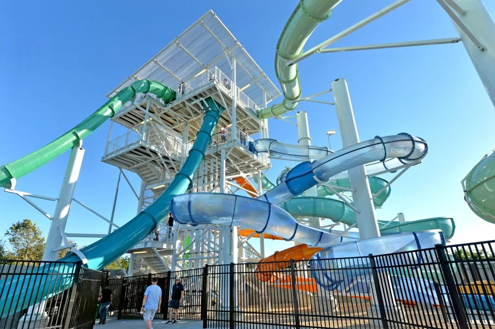
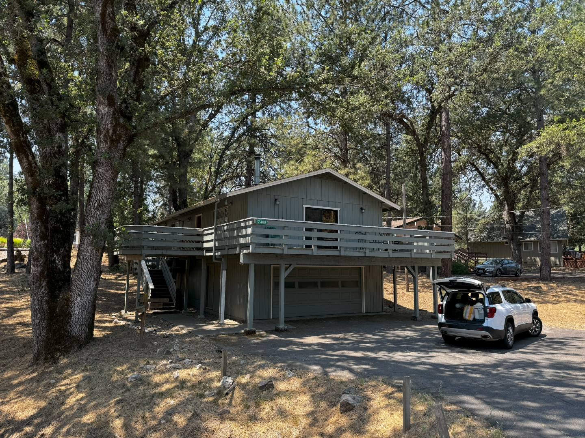

Na alle gedoe rondom de auto zijn we stiekem blij dat we de Bay Area kunnen verlaten. Om de rit naar onze volgende halte te onderbreken, gaan de dames zwemmen in The Dublin Wave Waterpark and Aquatic Center. Dat geeft mij mooi de kans om naar de AT&T winkel te rijden voor een eSim voor de telefoon van Chantal. In hetzelfde stadje koopt Chantal ook meteen nieuwe wandelschoenen bij de REI.

In Sonora doen we boodschappen voor de komende dagen bij de laatste grote supermarkt. De komende paar dagen verblijven we in een Airbnb huis in Groveland. Het huis is groot, schoon, en van alle gemakken voorzien. Het ligt in een zogenaamde "gated community" genaamd Pine Mountain, dus we moeten ons melden bij de toegangspoort voordat we de wijk in mogen. Bij dit complex hoort naast een golfbaan, camping en wat restaurants, ook een meer (heel toepasselijk Pine Mountain Lake genaamd) en een zwembad.

Het is inmiddels behoorlijk laat, dus die faciliteiten gaan we een andere keer bekijken.
