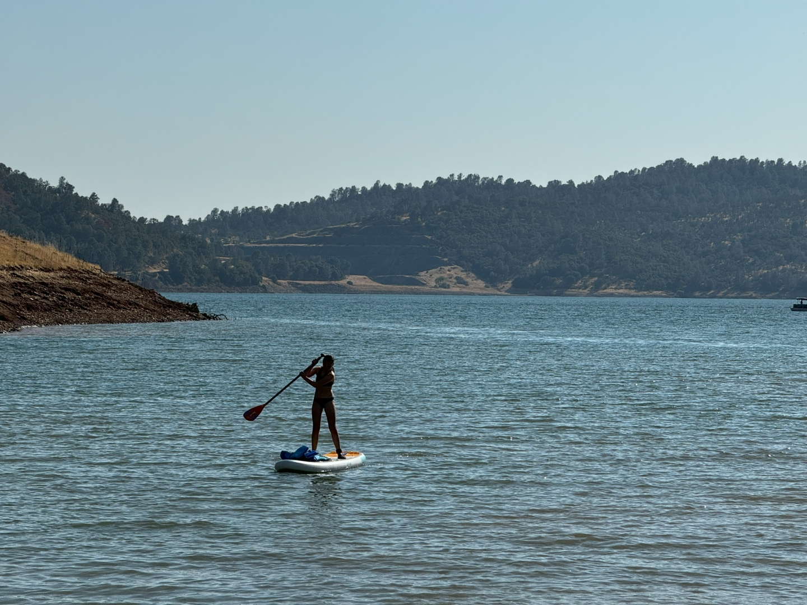

Vanmorgen doen we rustig aan. We willen vandaag met het sup board op een meertje gaan peddelen en wat rondhangen. Met een gevulde koelbox rijden we naar Pinecrest Lake. De rit is erg mooi, maar toen we daar aankwamen bleek dat meer mensen op het idee gekomen waren om lekker te zwemmen bij Pinecrest Lake. Het was idioot hoeveel auto's er her en der geparkeerd stonden. Na een paar rondjes op het parkeerterrein hebben we de moed opgegeven en zijn snel vertrokken. Na nog twee meertjes bezocht te hebben (in een mocht je niet zwemmen, de ander was alleen voor bewoners toegankelijk), kwamen we uiteindelijk uit bij Tuttletown Recreation Area.

Hier was gelukkig voldoende plek. Al snel was het sup board opgeblazen, het strandtentje en stoeltjes opgezet. Sofie was niet uit het warme water te slaan :-)

's Avonds hebben we het gasbrandertje weer aangestoken op het dakterras.
