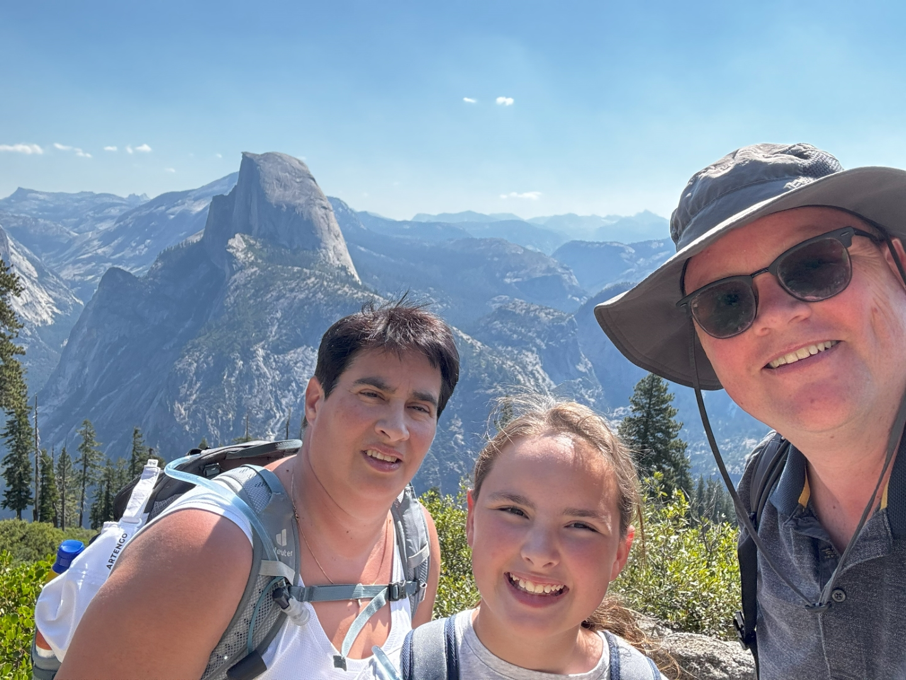
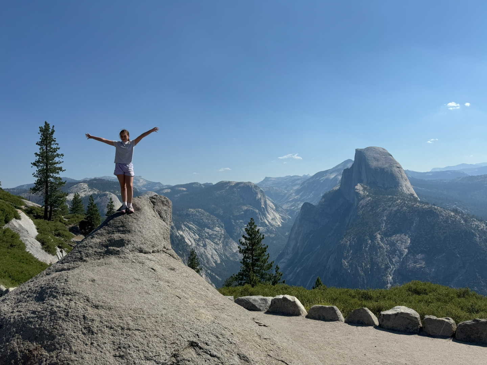
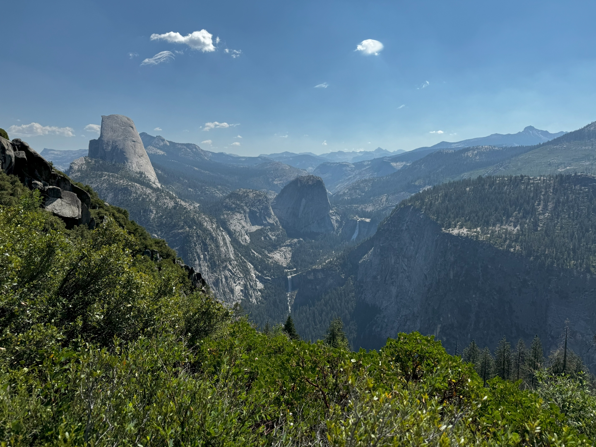
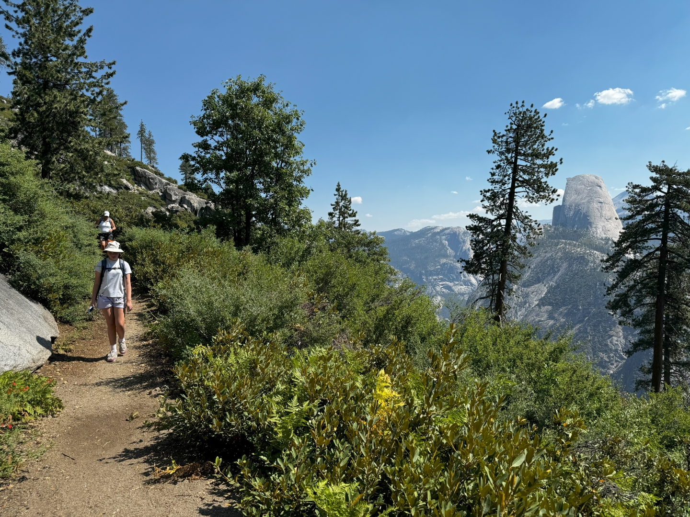
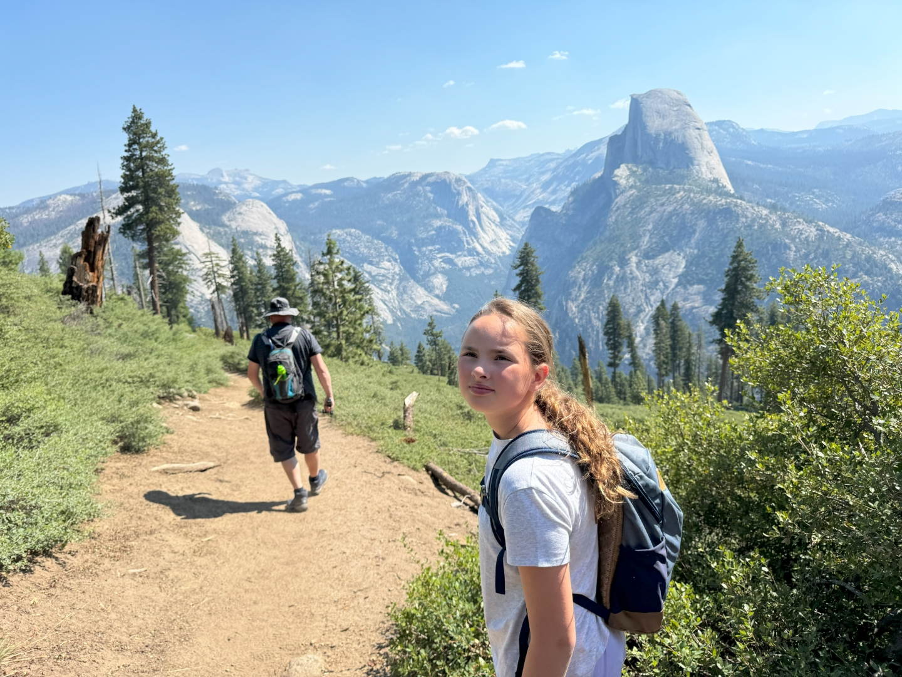
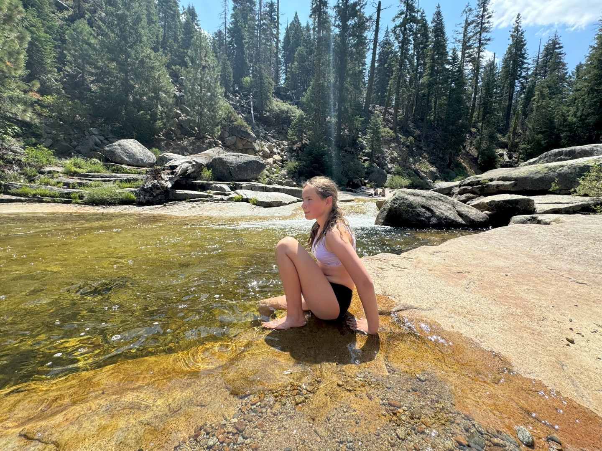
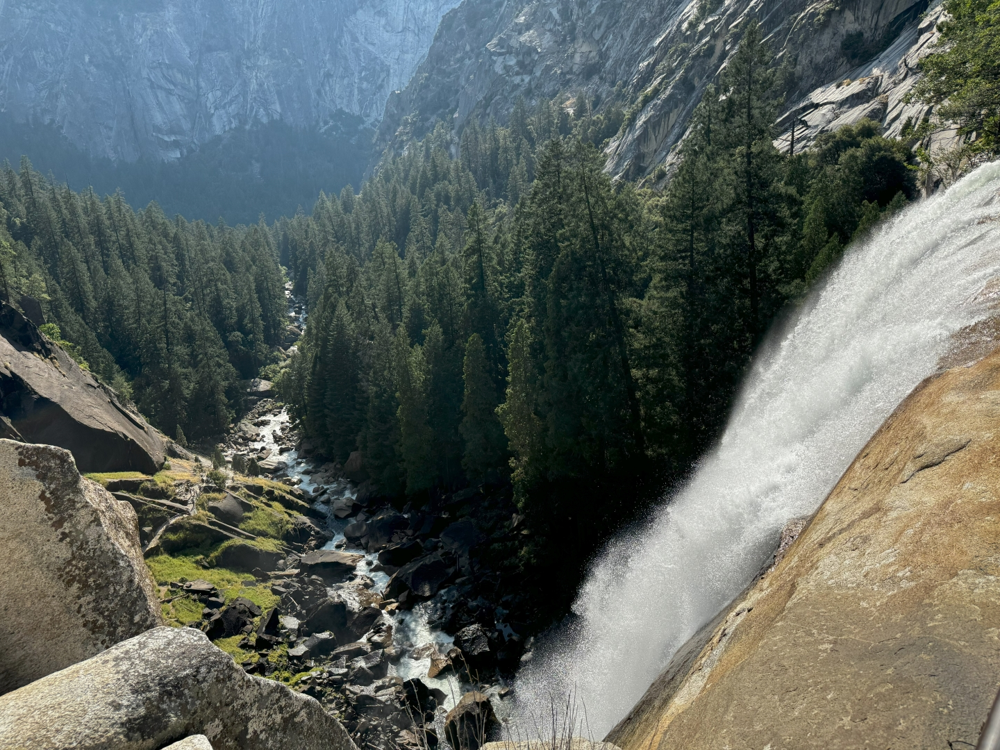
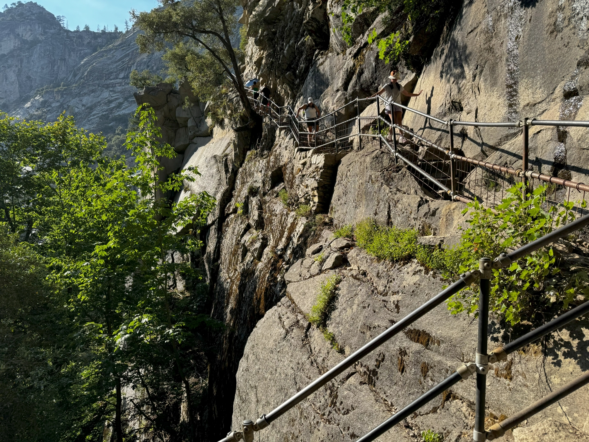
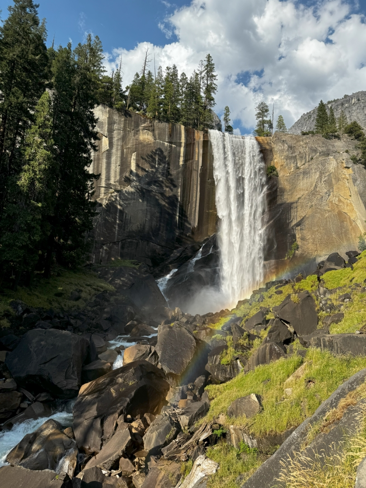

Om vijf uur rammelt de wekker. We moeten ons om acht uur melden bij de Yosemite Lodge in de Valley.  Dat is ongeveer anderhalf uur rijden vanaf ons huis, dus we willen rond zes uur vertrekken. Vanaf de Lodge vertrekt een bus die ons na iets meer dan een uur rijden bij Glacier Point afzet. Wij dachten nog even een klein dutje te kunnen doen, maar de gids heeft ons van begin tot eind bestookt met trivia over Yosemite..

Het wordt vandaag meer dan 40 graden, dus we hebben erg veel water, snacks en lunch meegenomen. Ook hebben we natte bevroren handdoekjes bij ons die we dankbaar in de nek leggen om wat af te koelen.

Het uitzicht vanaf Glacier Point is ongelooflijk mooi.

Vanaf hier kun je ook al twee watervallen zien waar we straks langs zullen gaan lopen.

We slaan vol goede moed rechtsaf het Panorama Trail op die ons uiteindelijk terug naar Happy Isles in de vallei leidt. Het pad gaat, op een stuk van zo'n 2 km na, voornamelijk naar beneden. De uitzichten onderweg op met name de Half Dome zijn verbluffend.

Bij Ilillouette Falls gaan de voetjes voor de eerste keer te water.

Na een uurtje of 2 komen we aan bij Panorama Point waar we in de schaduw lekker lunchen. Het uitzicht is fenomenaal!

Het stuk naar boven hebben we nu bijna gehad. Bij ieder stroompje maken we de handdoekjes weer nat om af te koelen.

Een stuk verder bergafwaarts komen we aan op de top van Nevada Fall. Het water stort hier naar beneden.

Hier rusten we een tijdje, Sofie gaat uiteraard weer in het water. Vanaf hier pakken we de Mist Trail verder naar beneden. Deze loopt langs de Nevada via steile trappen, en komt uiteindelijk uit bij de bovenkant van Vernal Fall. We zijn alle drie kapot, van zowel de hitte als het steile steigen en dalen. En dan komt nu nog veruit het moeilijkste en gevaarlijkste stuk van de wandeling! Met halsbrekende toeren manouvreren we de ongelijke, soms spekgladde traptreden naar beneden.

Uiteindelijk komen we om 18:30 aan bij Happy Isles. En daar wacht ons een verrassing: de shuttlebus die ons terug moet brengen naar de Lodge rijdt hier niet! Chantal en Sofie zaten er helemaal doorheen. Ik ben dus nog naar Curry Village moeten lopen om daar met een bus naar de Lodge te gaan om de auto op te halen.

We hadden Sofie een drankje van Starbucks (nieuw naast de Lodge!) beloofd omdat ze zo goed gelopen had vandaag. Toen we daar uiteindelijk aankwamen, bleek deze gesloten :-( Dat drankje houdt ze dus nog maar te goed!

Wat een spectaculaire dag! Uiteindelijk waren we pas tegen 10 uur 's avonds weer thuis. Morgen maar eens even niks doen...
