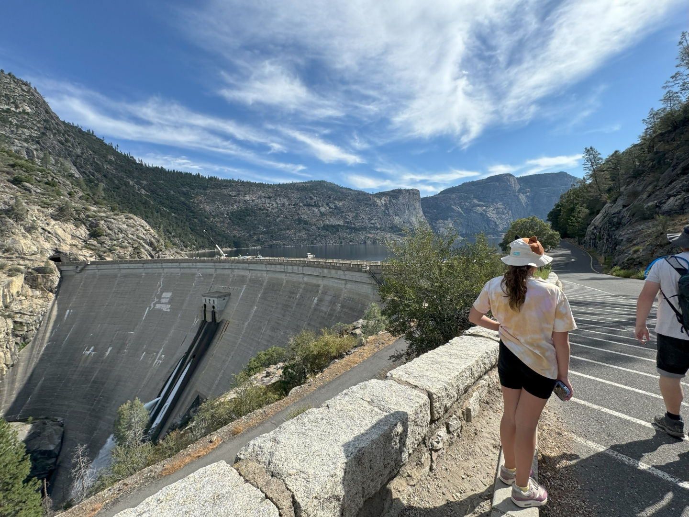
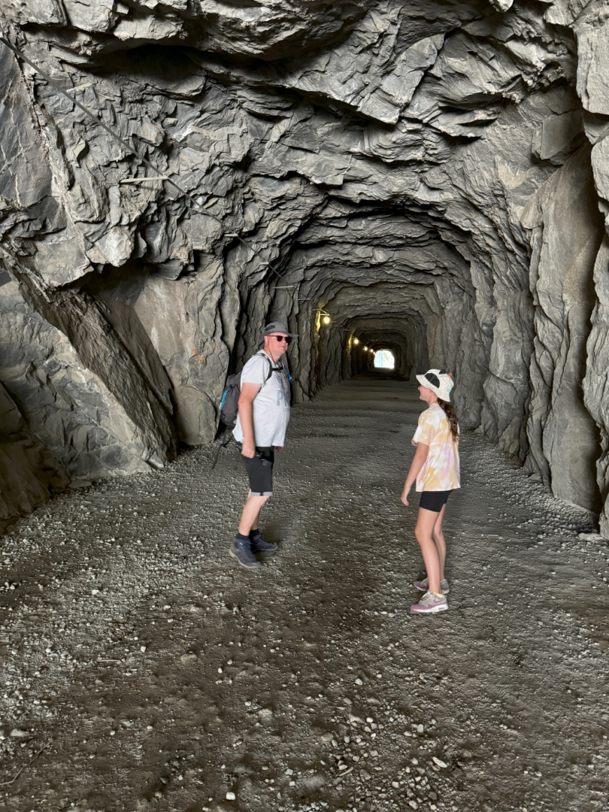
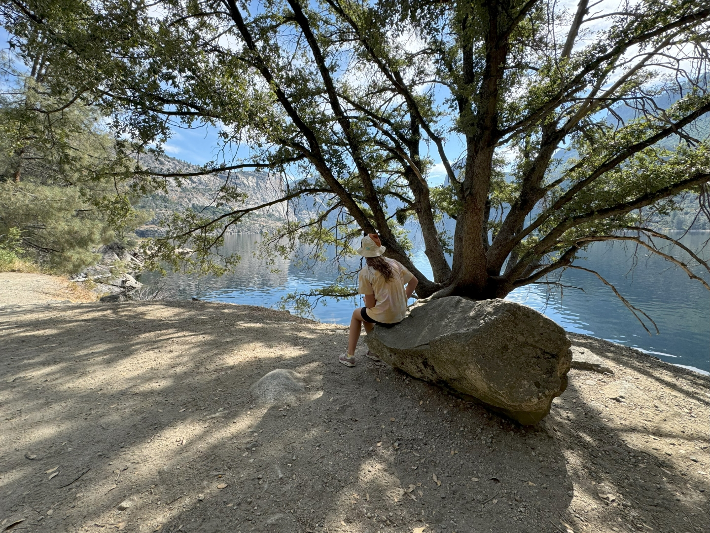
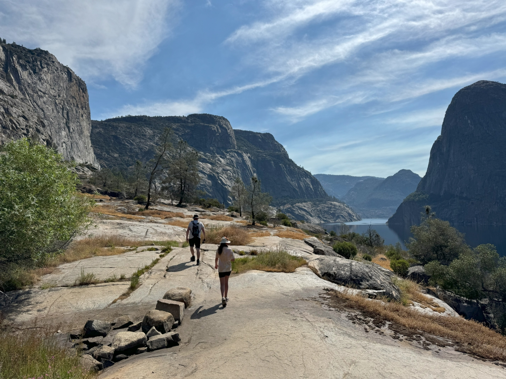
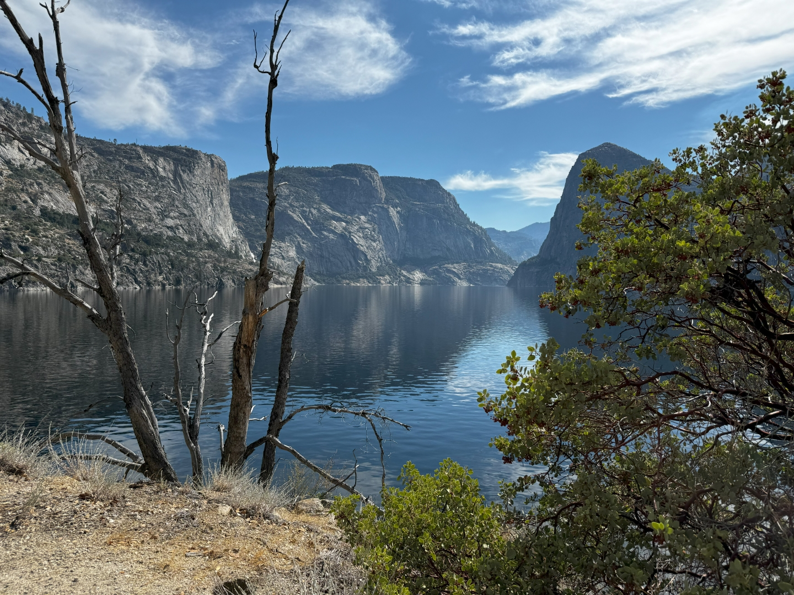
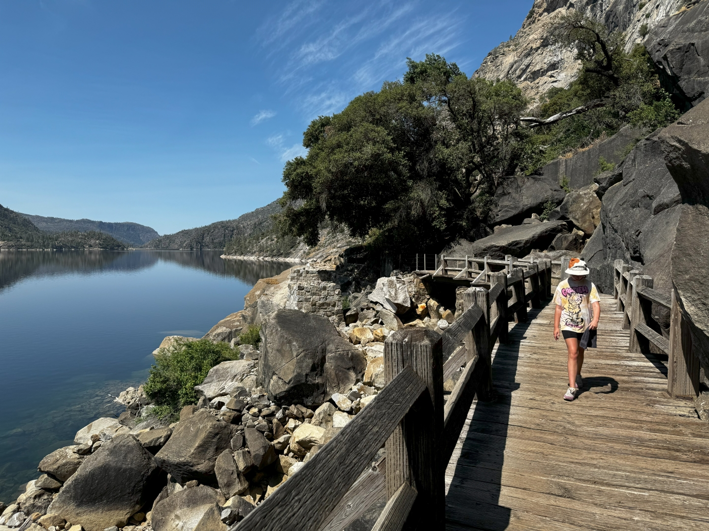
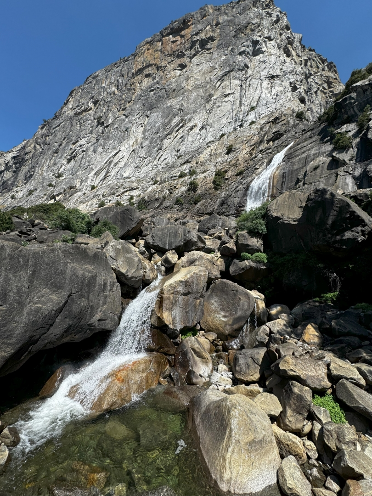
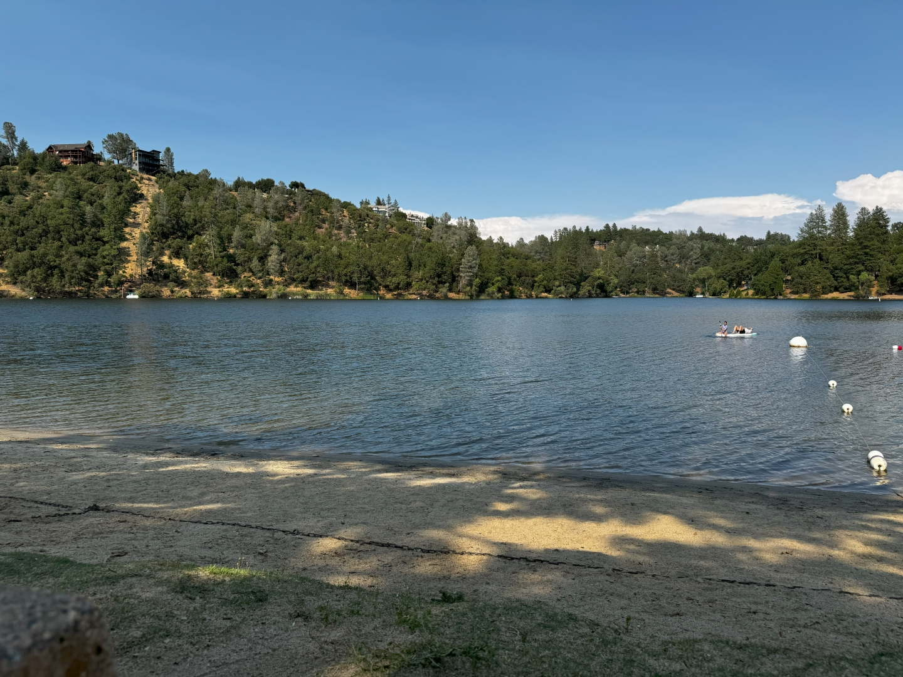

Nu zijn we al zo vaak in Yosemite geweest, maar we hebben nog nooit de kans gehad om het waterreservoir Hetch Hetchy te bezoeken. Op de weg door dit deel zijn geen campers toegestaan, dus we konden er nooit eerder heen. Maar vandaag dus wel!

Tijdens de zware aardbeving die San Francisco in 1906 raakte, zijn veel primaire watervoorzieningen van de stad verwoest. Het stadsbestuur ging op zoek naar een betrouwbaardere bron voor de watervoorziening en vond die in deze vallei. Probleem was dat de vallei onderdeel was van een National Park, dus er mocht niet zondermeer een dam worden gebouwd. Uiteindelijk ging de regering in 1913 overstag en mocht San Francisco het waterreservoir aanleggen door middel van de bouw van een dam.

Het duurde 20 jaar om het complex systeem van tunnels en pijpleidingen te bouwen die het water van hier over een afstand van 270 km naar San Francisco transporteert. En dat alles zonder het gebruik van pompen! Ook nu nog worden zo'n 2.4 miljoen mensen in de Bay Area voorzien van water uit dit reservoir.

Er wordt weer veel hitte voorspeld, dus de drinkzakken zitten weer helemaal vol, en dat bleek niet voor niets. Het is nog warmer dan twee dagen geleden toen we de Panorama Trail liepen. We zijn vroeg, dus we kunnen de auto aan het begin van de trail parkeren. We stappen snel over dam.

Aan het einde van de dam moeten we door een tunnel. Het is er donker, maar wel lekker koel.

Het pad blijft de hele tijd de oever van het meer volgen. Het gaat af en toe een beetje omhoog, maar gelukkig nooit ver. Hier waait helemaal geen wind, en we zweten al snel als een otter.

Het nadeel van deze wandeling is dat er niet veel schaduw is. Dus daar waar we schaduw vinden, rusten we wat, drinken wat en begroeten de zoveelste Nederlander.

De uitzichten blijven fantastisch. Volgens velen was deze vallei, voordat ze 'm hebben laten vollopen met water, minstens zo mooi als de Yosemite Valley.

Vier kilometer, en 1 uur en 3 kwartier later, komen we aan bij het doel van vandaag: de Wapama Falls.

In het vroege voorjaar dondert het water hier naar beneden, en wordt je als het ware onder een douche gezet. Nu komt het water keurig volgens de geldende richtlijnen naar beneden, en vangen wij geen spat water. En dat terwijl dat nog wel heel erg wenselijk was geweest, zo verhit zijn we.

En dus maken we de bevroren handdoekjes maar weer eens goed nat, en lopen weer terug naar de auto. Het is inmiddels 43 graden! Thuis aangekomen trekken we snel de zwembroek aan en gaan weer zwemmen in het meer bij ons huis.

