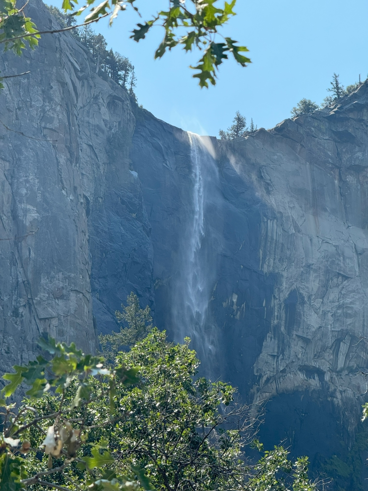
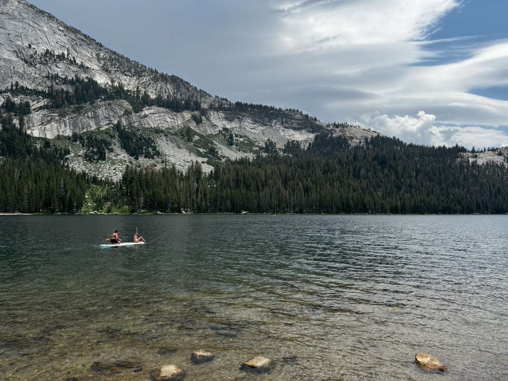
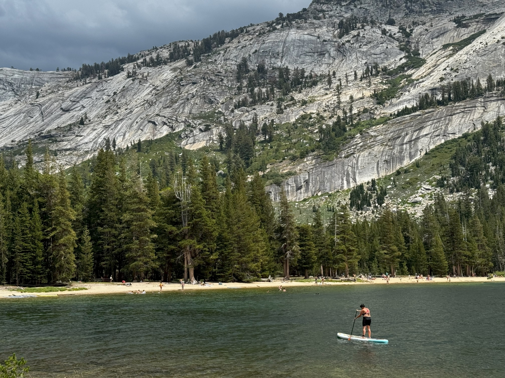

Met pijn in ons hart trekken we de deur van ons huis in Groveland voor het laatst dicht. Wat een mooi en fijn plekje is dit. We hebben erg genoten hier.

Op ons gemak rijden we eerst naar Yosemite Valley om daar een beetje rond te kijken. We stoppen bij de Bridalveil Fall.

Sinds dit jaar moet je van te voren een toegangkaart reserveren om het National Park in te mogen. En dat lijkt wel te helpen met het beperken van de hoeveelheid bezoekers. Het oogt veel minder druk dan vorig jaar, toen was het een grote chaos in de vallei met alle (parkeer)ellende van dien.

We stoppen bij de Lodge voor het beloofde drankje van Starbucks van Sofie op te halen. Daarna rijden we de vallei weer uit, en gaan via de Tioga Pass het park weer uit. Bij Tenaya Lake parkeren we de auto, lunchen wat en pompen het sup board op. De dames gaan het (ijskoude) water op/in. Beide dames hebben de techniek inmiddels heel aardig in de vingers.

Hier boven in de bergen is het qua temperatuur een heel stuk aangenamer.

Ik mag intussen op de auto passen, en neem van de gelegenheid gebruik om wat nieuwe blog verhaaltjes te schrijven.

Inmiddels is het 3 uur geweest. Mooi tijd om het laatste uurtje te rijden naar ons nieuwe onderkomen in Mammoth Lake.

We zijn lui vanavond, en gaan eten bij de Mammoth Tavern. Het smaakt prima!
