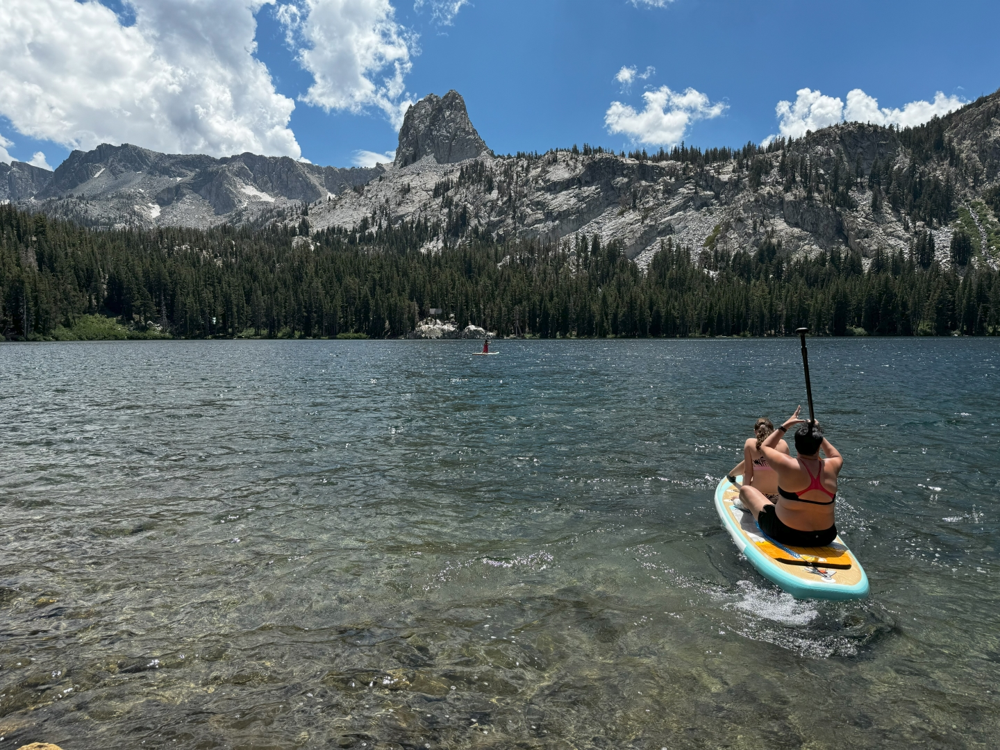
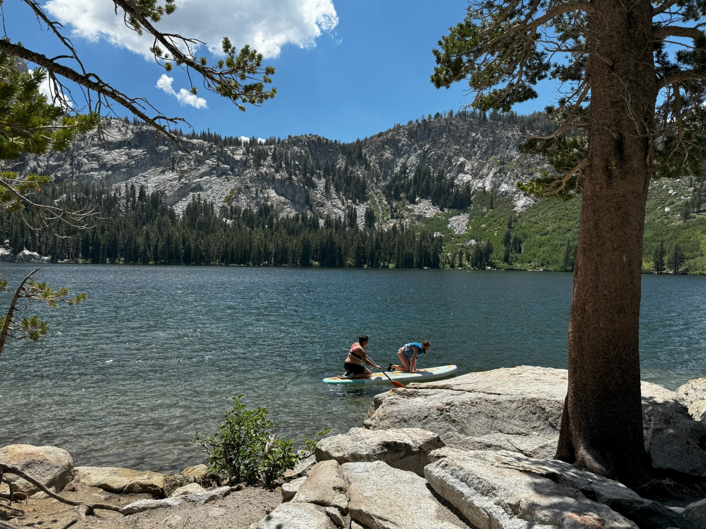

De naam van het stadje Mammoth Lakes is niet heel toevallig gekozen. Het ligt aan de voet van Mount Mammoth en er is een heel aantal Lakes in de buurt. Na een kalme ochtend pakken we onze spullen en gaan op pad naar Lake George. Bij aankomst lijkt het enorm druk, er staan heel veel auto's her en der geparkeerd, maar de uiteindelijke parkeerplaats bij Lake George is bij lange na niet vol. Gelukkig maar, want we vinden een prachtig mooi plekje aan de waterkant. En zitten er nagenoeg helemaal alleen. Wellicht dat de straffe wind de beginnende sup boarders tegenhoudt?

We spenderen hier een paar uurtjes. Aan het einde van de middag rijden we weer naar huis en nemen daar nog een welverdiende duik in het zwembad.
