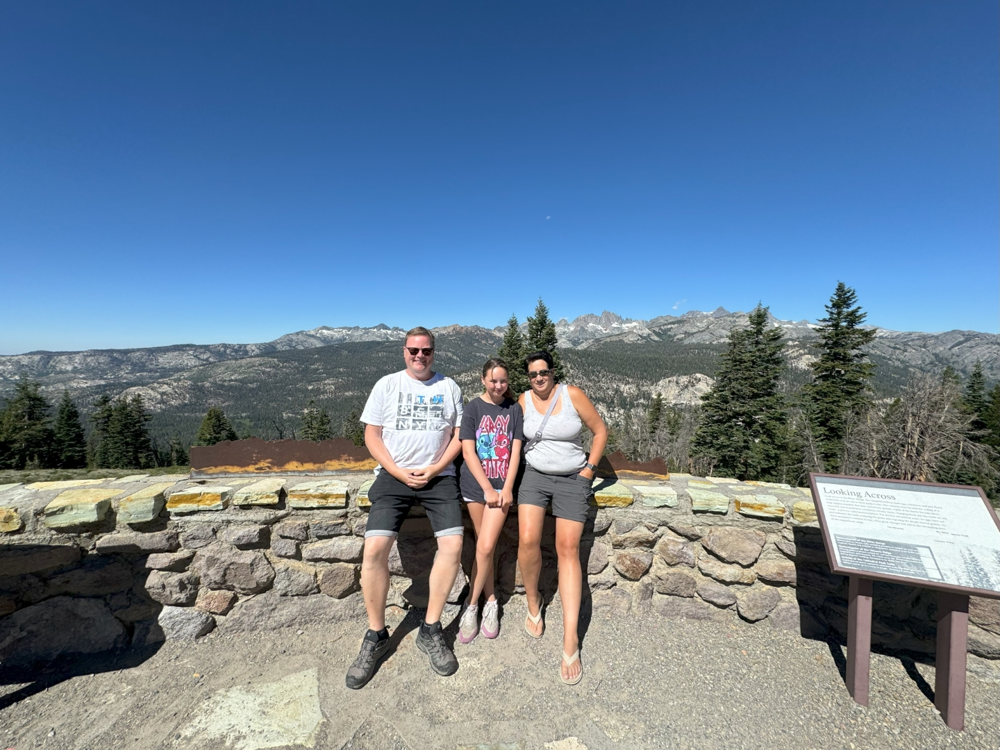
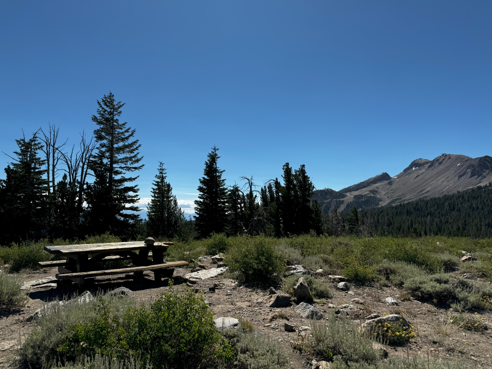
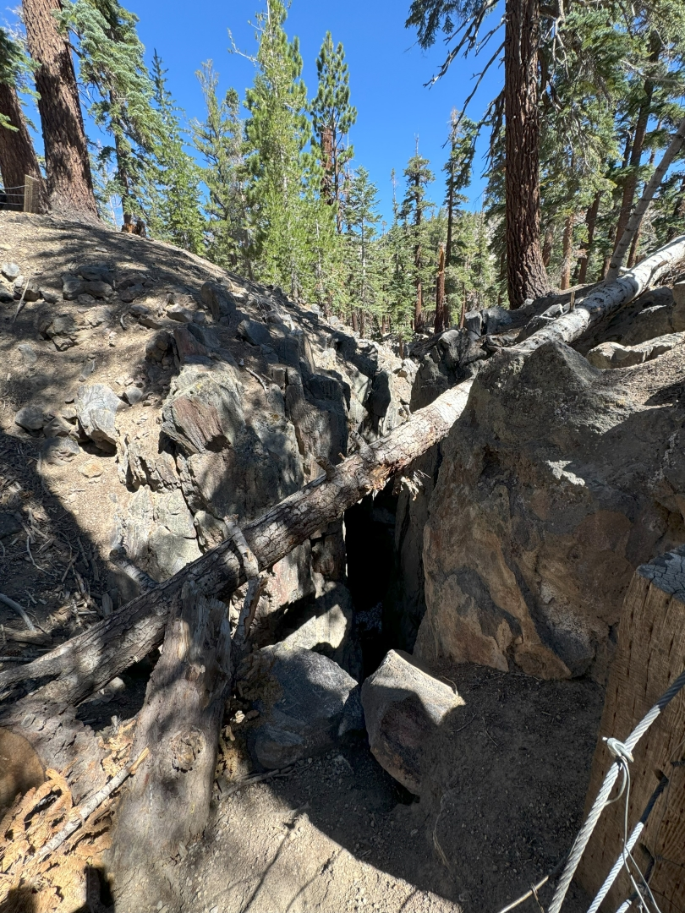
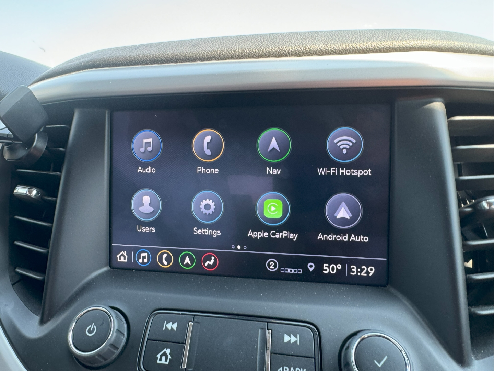
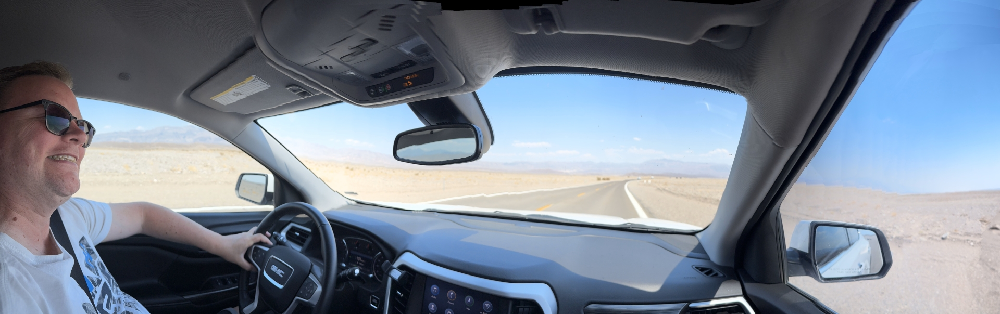
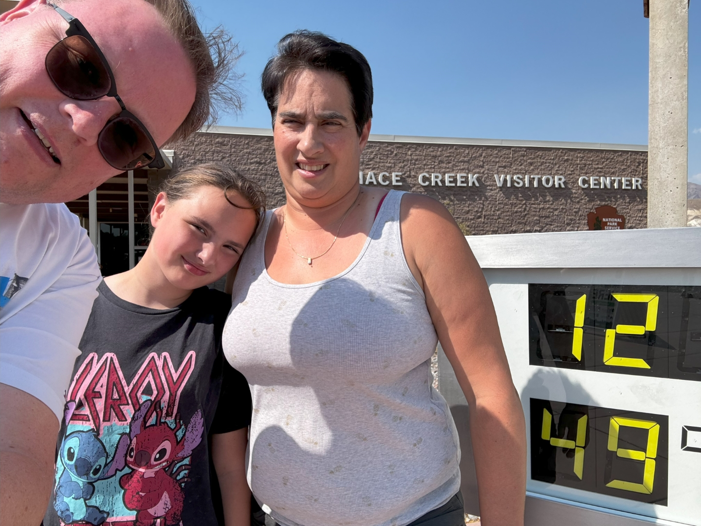

En alweer moeten we afscheid nemen van een mooi huis. Mammoth Lakes is een fijne plek. Het is wel het land van mannen met baarden en verhoogde pickup trucks, maar we voelen ons toch erg thuis. Voordat we de hitte van Death Valley gaan opzoeken, rijden we eerst de voiture naar Minaret Vista. Vanaf hier hebben we een super mooi uitzicht over de scherpe, uitstekende torenspitsen van de Minarets range. Er zitten ook twee hoge knapen bij, ruim 4000 meter!

Na deze korte stop, rijden we de berg weer een stukje naar beneden om bij Earthquake Fault te gaan kijken. Hier is een scheur in de grond te bewonderen.

De naamgeving is een beetje vreemd, want zeer waarschijnlijk is de scheur niet ontstaan door een aardbeving, maar door vulkanische activiteit. Het is een heel leuk, en erg kort, wandelingetje in een prachtig bos.

We stappen weer in de auto, want we moeten vandaag naar Death Valley rijden. Dat is niet super ver, zo'n 220 km, maar het gaat wel warm worden. Via de mooie CA-395 rijden we zuidwaards. Het wordt warmer en warmer, zodra we Death Valley in rijden, en via een mooie slingerweg almaar zakken, stijgt de buitentemperatuur tot 50 graden Celcius!

Het landschap is leeg, op een verdwaalde struik na.

We stoppen bij het Visitor Center in Furnace Creek om naar de thermometer van de National Park Service te kijken.

De hitte is onwaarschijnlijk, alsof je de oven open trekt om je lasagne te controleren.

Snel rijden we 500 meter verder naar ons hotel The Ranch at Death Valley. De airco in de kamer trekt het maar net om het een beetje koeler te krijgen. We springen maar snel in het zwembad. 's Avonds maken we hotdogs.

Het hotel heeft z'n beste tijd wel gehad eerlijk gezegd. Alles is oud en rammelt. Maar de locatie is natuurlijk wel bijzonder.
