De dames beginnen, voordat we uitchecken uit het hotel, de ochtend met een plons in het zwembad.

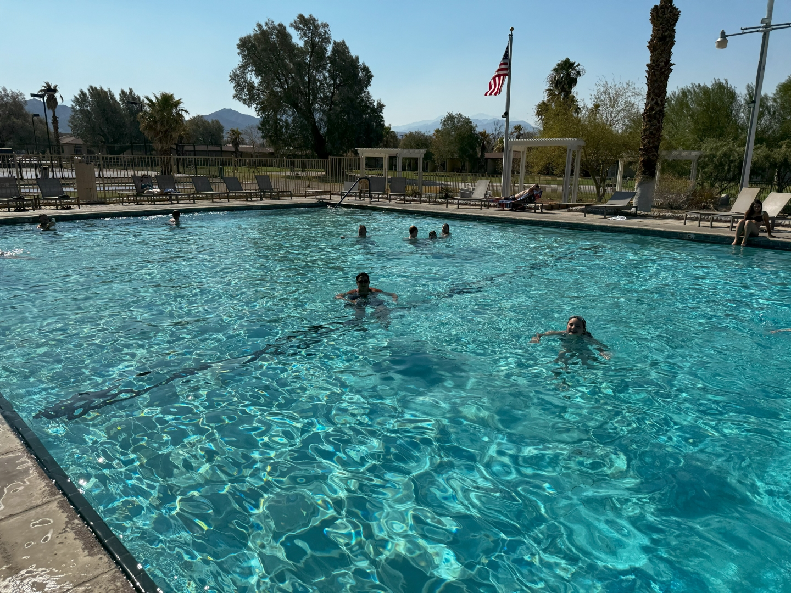

Ik verken de omgeving van het hotel een beetje.

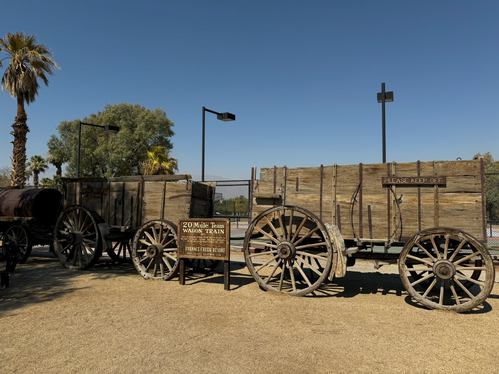

In 1881 werd in deze streek het mineraal borax ontdekt. 18 muilezels en 2 paarden trokken twee karren gevuld met borax, proviand en water over het 270 km lange traject dwars door Death Valley en de Mojave woestijn, de zogenaamde 20 Mule Train Wagon Train.

Men zocht naar allerlei grondstoffen in Death Valley, ook naar goud. Borax bleek uiteindelijk het meest winstgevend. Het werd gebruikt door smeden, huisvrouwen, melkboeren, pottenbakkers en begrafenisondernemers.

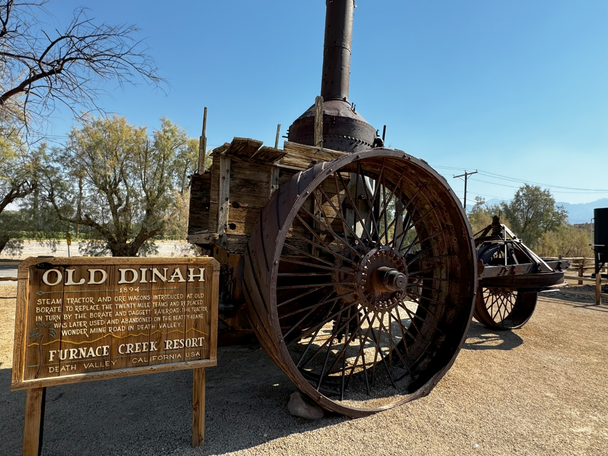

Om stipt 11 uur rijden we het parkeerterrein van het hotel af. Eerst rijden we naar Zabriskie Point, het verplichte nummertje in dit park.

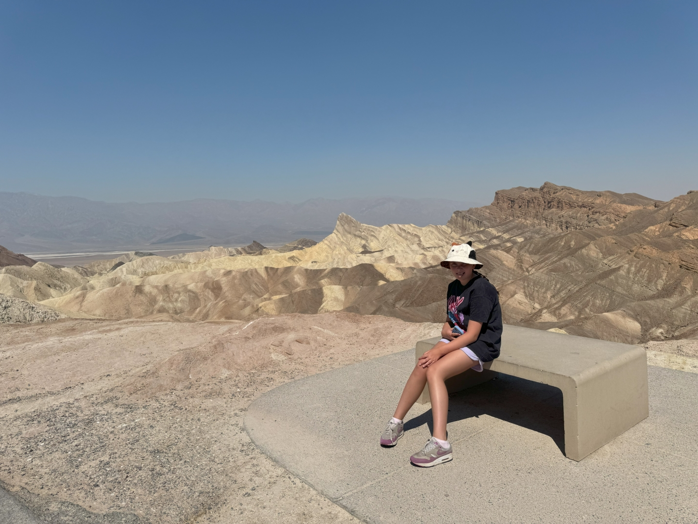

De gele en bruine heuvels zijn uitgesleten door de spaarzame regen en zijn vernoemd naar een van de eerste heren die betrokken was bij het ontginnen van de borax. Hierna kon Sofie bij het visitor center haar Junior Ranger badge ophalen.

Na een half uurtje rijden komen we aan bij het Badlands Basin, met 85 meter onder zeeniveau, het laagste punt van Noord Amerika. Het was ooit een meer, nu rest er alleen een grote zoutvlakte.

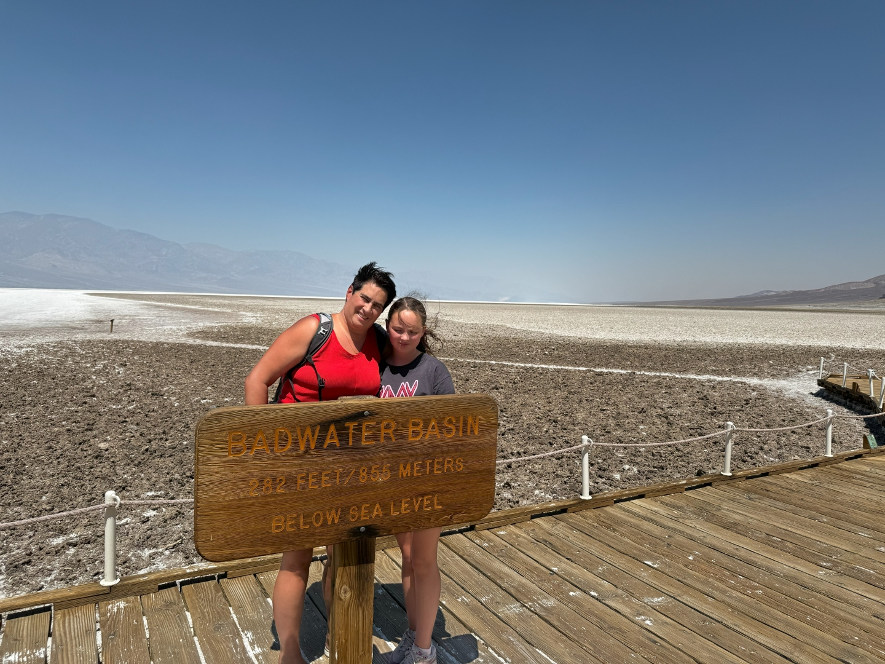

En, heel sneu, er is hier water, maar dat kun je niet drinken.... Het is zout!

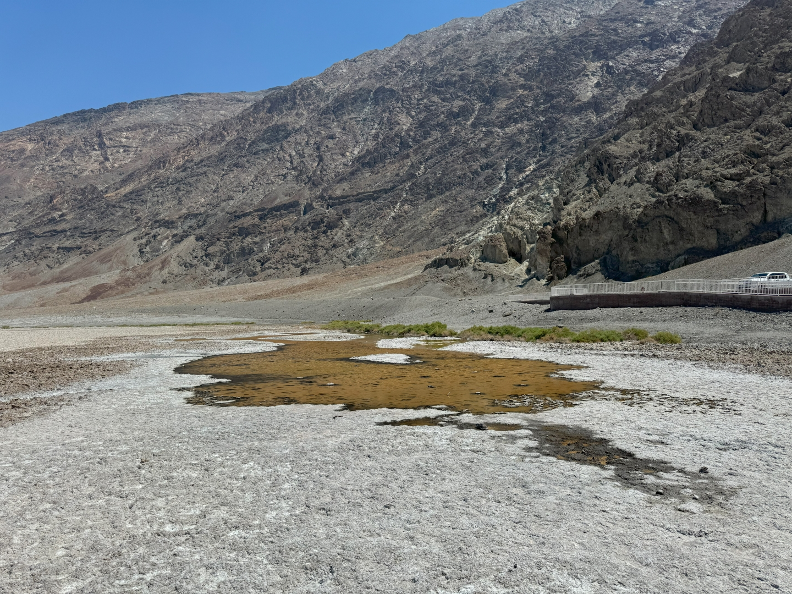

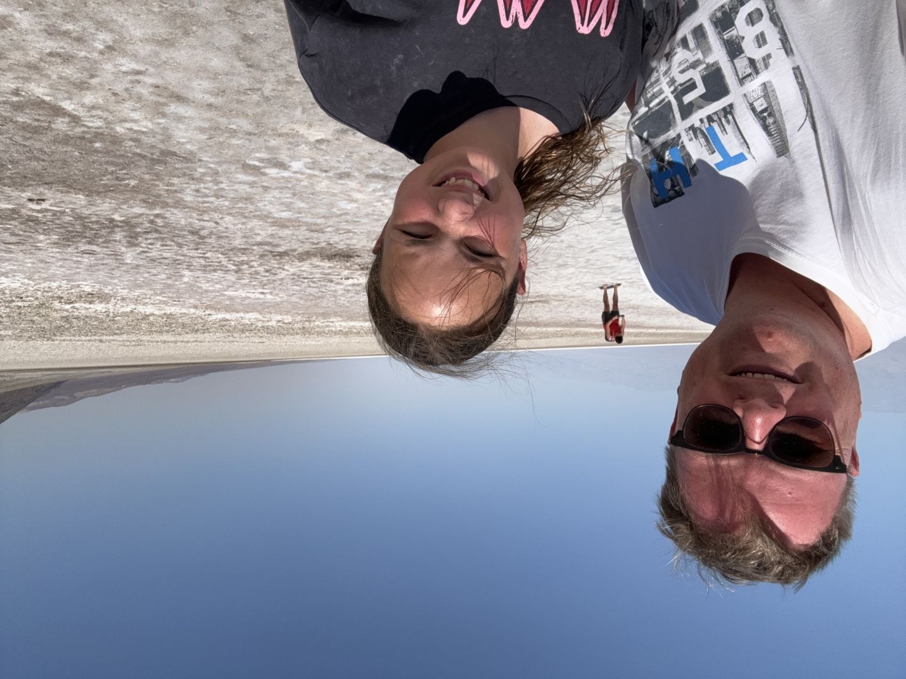

We rijden dezelfde weg weer terug, en slaan een klein zijweggetje in richting Artists Palette. Tussen prachtig gekleurde rotsen slingert de weg van links naar rechts en op en neer.

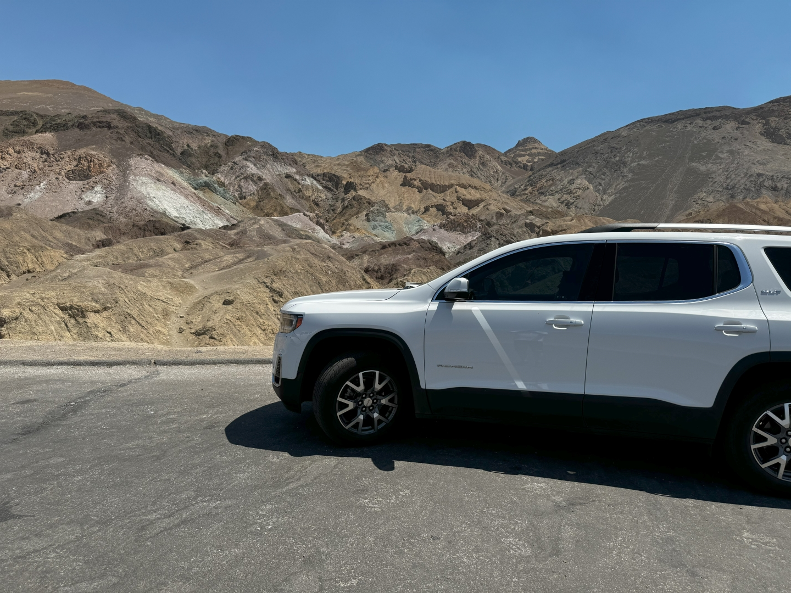

Na al dit moois zetten we koers richting Pahrump. Hier doen we wat boodschappen en lunchen bij de Panda Express. We moeten nog een eind rijden naar Grand Canyon West voor ons volgende avontuur. En een avontuur wordt het: vanavond doen we aan glamping in een tipi!

Op het terrein staan tipi's, huifkarren en stargaze domes. Wij zijn de enige gasten... het is vandaag zaterdag, en dan slapen mensen blijkbaar liever in Las Vegas dan hier. Jammer voor hen!

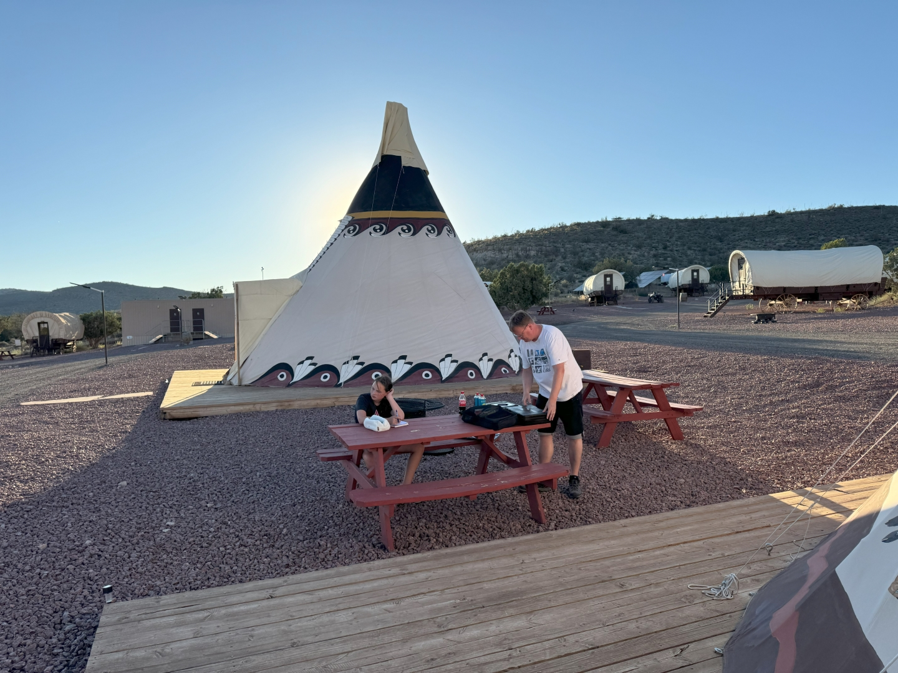

Glamping betekent hier trouwens gewoon een groot 2 persoons bed, een stapelbed, stroom, airco en een toilet.

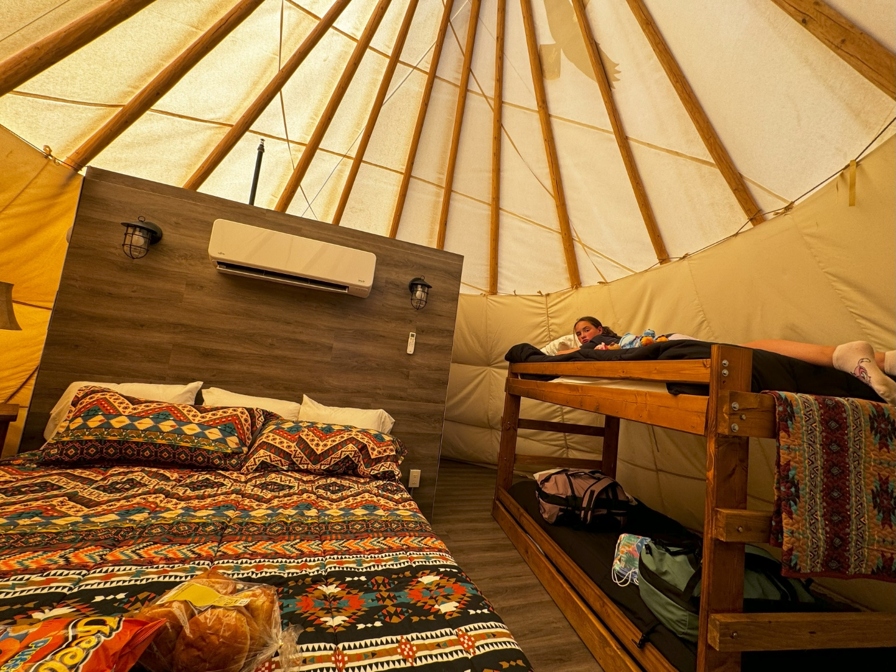

's Avonds maken we een kampvuur inclusief marshmallows en een onovertroffen sterrenhemel.

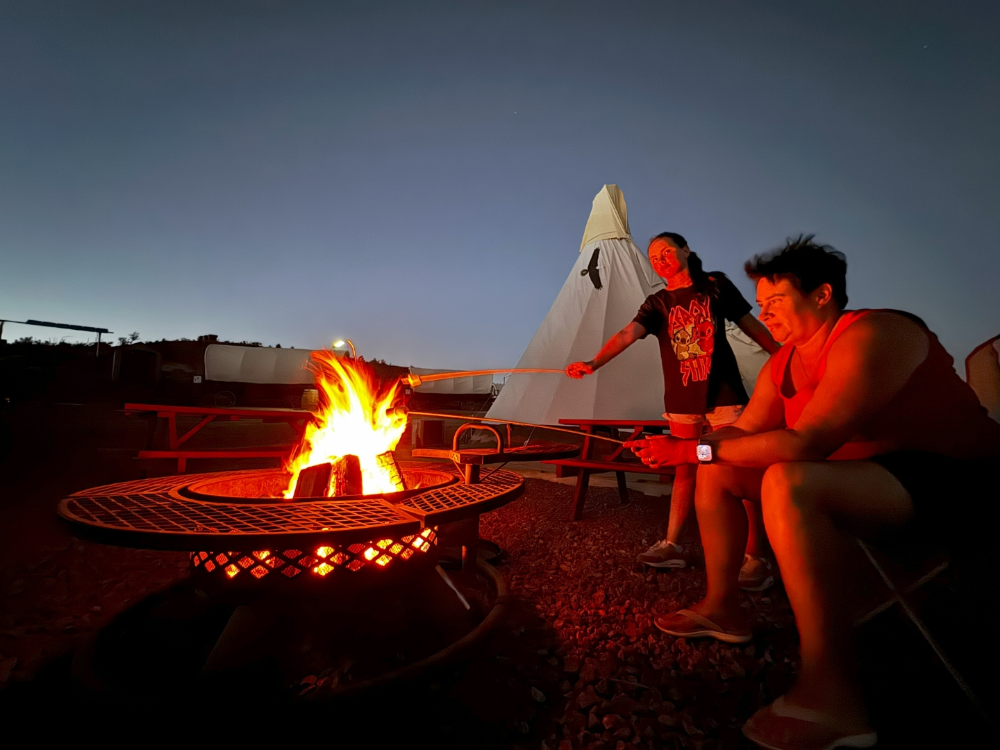

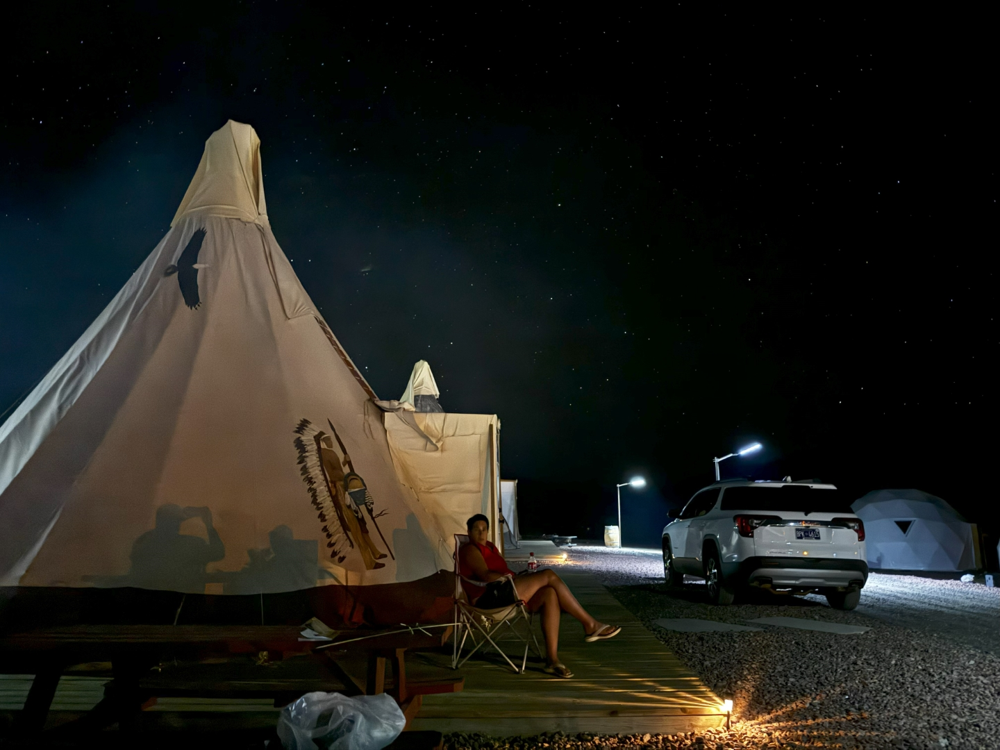

Grand Canyon West heeft trouwens helemaal niks te maken met Grand Canyon National Park, dat ligt ruim 380 km verderop.
