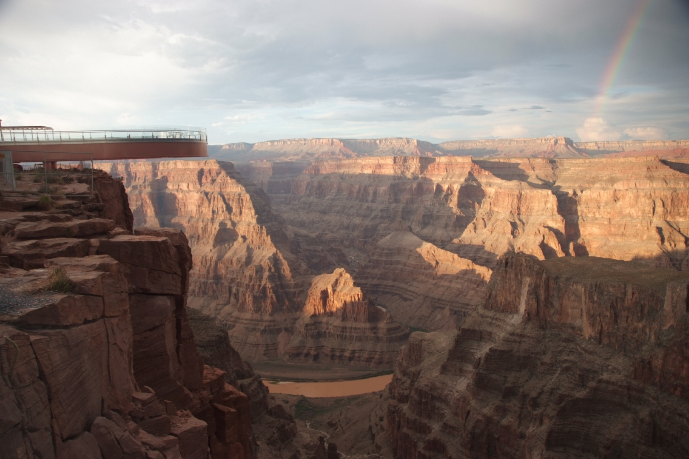
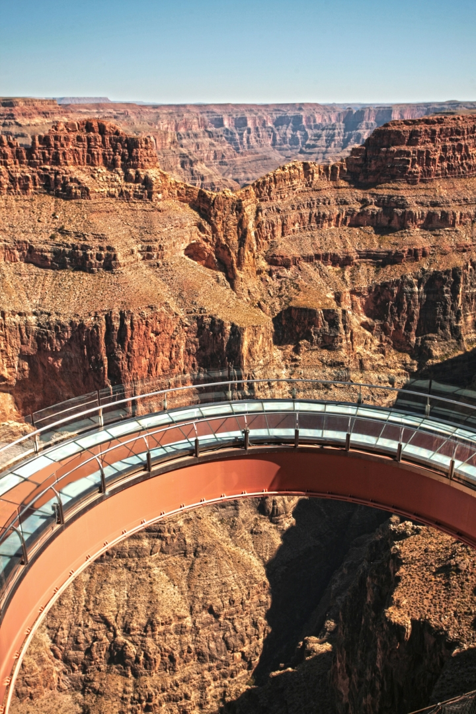
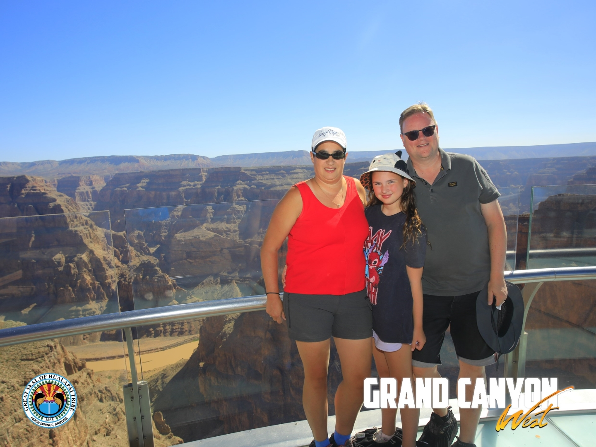
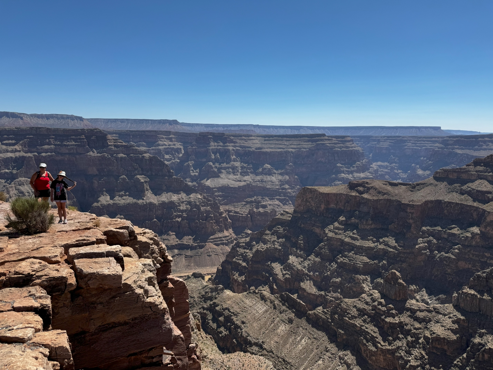
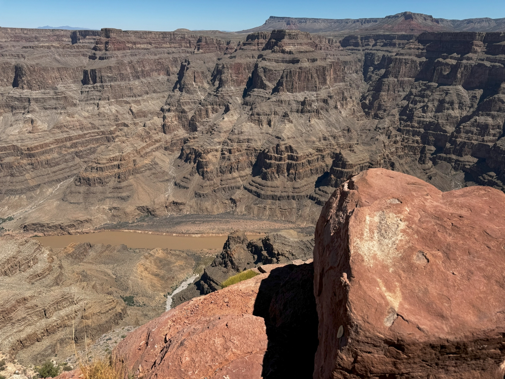

Na een heerlijke nacht in de tipi, melden we ons al vroeg bij de parkeerplaats. Na een korte rit met de bus komen we aan bij de Skywalk: een glazen brug die in een halve cirkel over de rand van de Grand Canyon gaat en je dus heel mooi de diepte in kan kijken. Je mag helaas niet je eigen foto's maken (alles moet in een kluisje), maar gelukkig loopt een "professionele" fotograaf met ons mee die wat kiekjes schiet.

Omdat we lekker vroeg zijn, hebben we de hele brug voor ons drietjes.

De grond recht onder de brug is zo'n 240 meter van ons verwijderd. De Colorado rivier ligt zo'n 1100 meter onder ons. Het uitzicht is prachtig!

Hierna nemen we de shuttle bus weer die ons een stukje verder afzet bij Guano Point. Ook hier zijn de uitzichten over de Grand Canyon fantastisch.

Na al dit natuurgeweld springen we weer in de auto om in 2 uurtjes naar ons hotel Mandalay Bay in Las Vegas te rijden. We checken in, parkeren de auto in de self-parking, en vervolgens kan de volksverhuizing beginnen om alle spullen naar de kamer te krijgen. Bepakt en bezakt marcheren we dwars door het casino naar de lift. Snel trekken we de zwembroek aan om te gaan zwemmen bij The Beach. Mandalay Bay heeft een heus zandstrand met golfslagbad, lazy river en muziek. Heel veel, harde muziek. Iedere vreetschuur heeft zelfs z'n eigen muziek. Omdat ze zoveel muziek hebben, hebben ze blijkbaar geen geld meer voor parasols. En dus zit je in de volle zon te bakken, onder het genot van vier verschillende deuntjes die je oren (en humeur) teisteren.

Maar het water is heerlijk! 's Avonds eten we bij de Cheesecake Factory!
