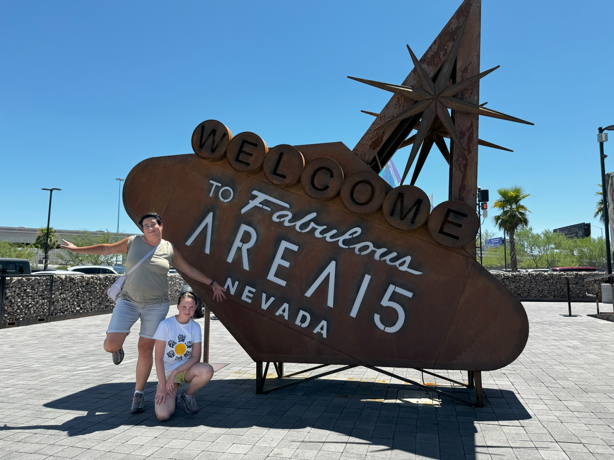
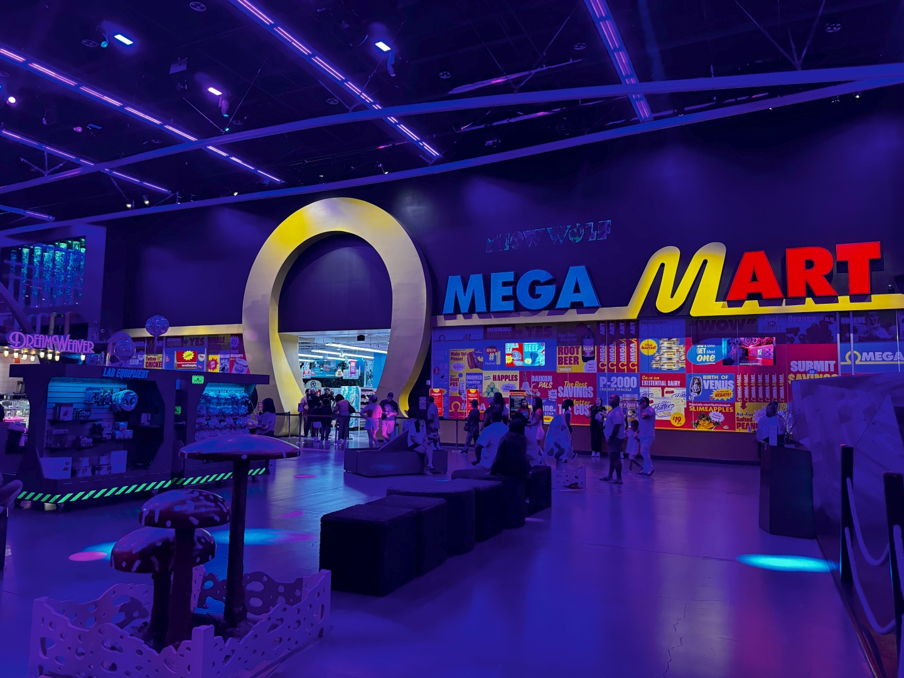
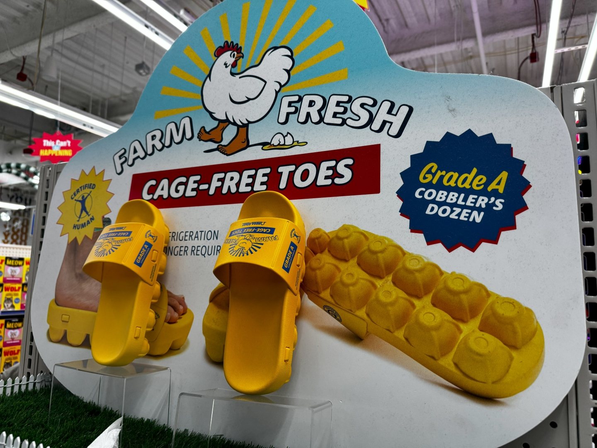
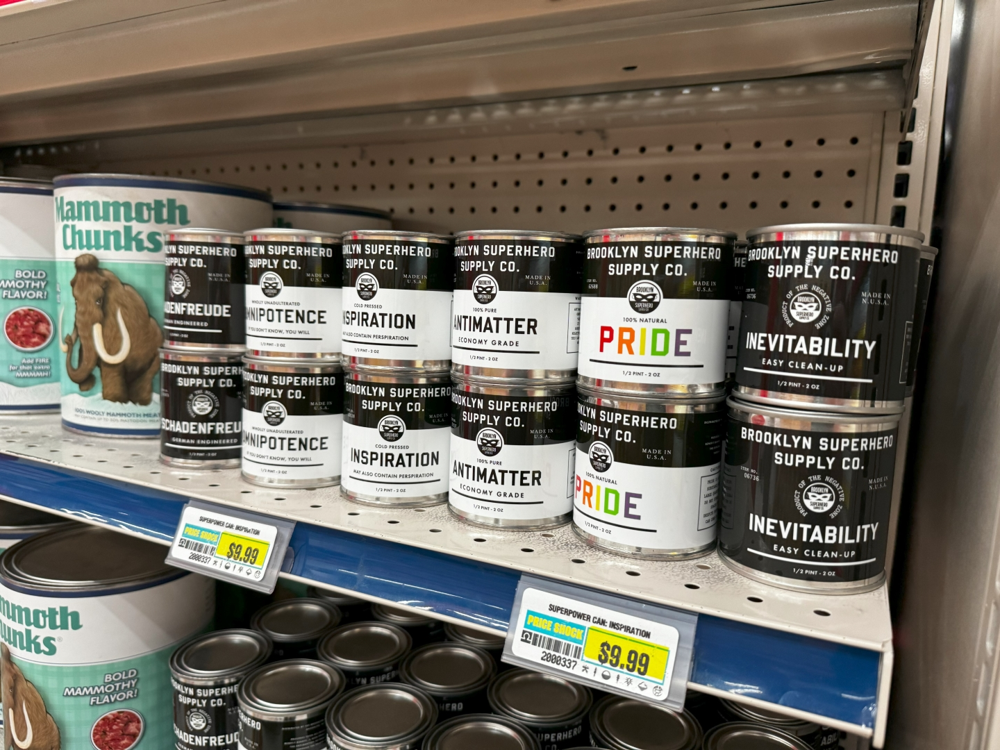
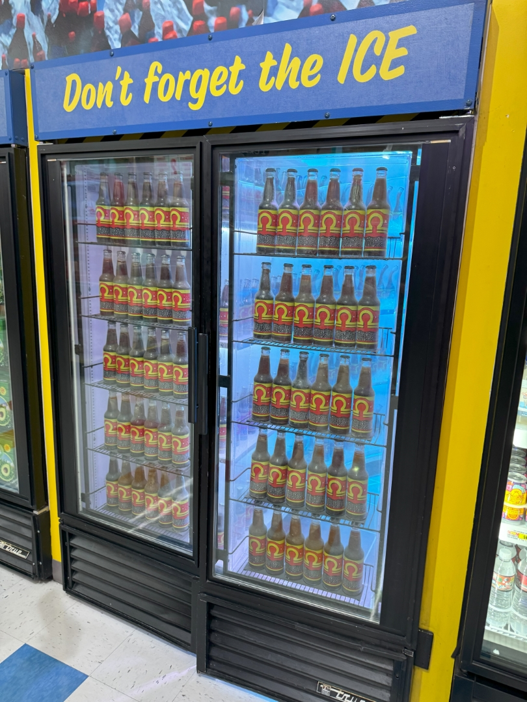
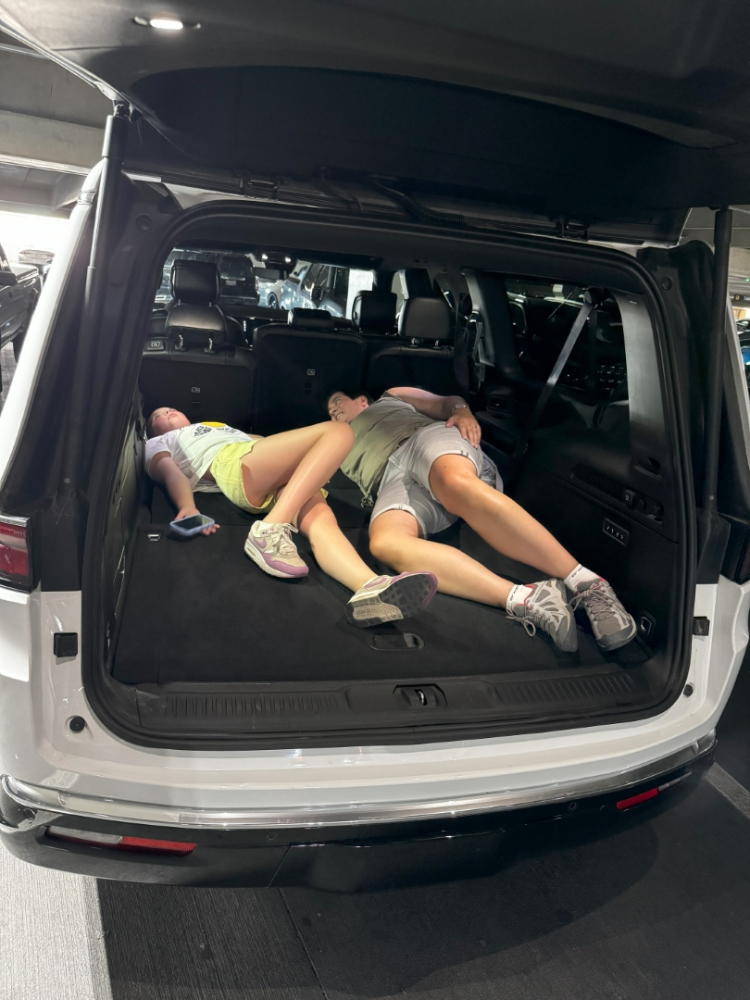
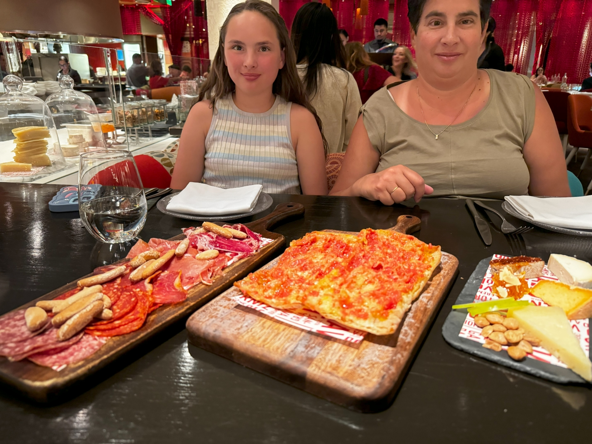

Area 15 in Las Vegas is een gebouw vlakbij Las Vegas Boulevard met allerlei vormen van vertier qua kunst, entertainment en eten. Het is gratis te bezoeken, maar een aantal onderdelen is betaald.

Wij bezoeken vandaag Meow Wolf's Omega Mart. Dit is een niet bestaande supermarkt met de meest vreemde producten, zoals organische mottenmelk, schoenen van eierdozen, body builder's tandenpasta ("for white teeth AND abs!"). Het bedrijf wordt aangevallen door aliens met alle gevolgen van dien. Het klinkt allemaal wat bizar, maar gaandeweg wordt het hele verhaal uit de doeken gedaan. Het geheel is samengesteld door meer dan 300 kunstenaars.

Overal zijn geheime doorgangetjes die je naar de volgende zaal brengt voor nog meer gekkigheid. Zo moeten we vanuit de supermarkt door de koelvitrine lopen om in de fabriek van de winkel te komen. Daar is een audio-visueel spectakel van heb ik jou daar.

Iets verderop lopen we tegen een muur op met allemaal kluisjes. Ze zitten allemaal dicht, op 1 na...



We vinden het alledrie geweldig mooi gemaakt. En omdat we direct bij de opening aanwezig waren, was het ook nog eens erg rustig zodat we alles op ons gemak konden bekijken.

Na de lunch bij The Beast (erg lekker!), was het tijd voor ons laatste ritje met de GMC Acadia. Bij Alamo mag je auto's niet langer huren dan 30 dagen, vandaar dat we halverwege onze reis de auto moeten omruilen. We krijgen een Jeep Wagoneer mee voor de resterende mijlen. De auto is zo groot, dat we de rest van de hotels en huizen best kunnen annuleren: we kunnen met z'n drietjes makkelijk slapen in de kofferbak!

's Avonds gaan we met het trammetje vanuit ons hotel naar Excalibur. Vandaar lopen we langs New York New York over de Strip naar het Cosmopolitan Casino. Hier gaan we tapas eten bij Jaleo. Het eten is fantastisch! We zijn hier 11 jaar geleden al eens geweest en we wilden heel graag nog een keer terug komen.

