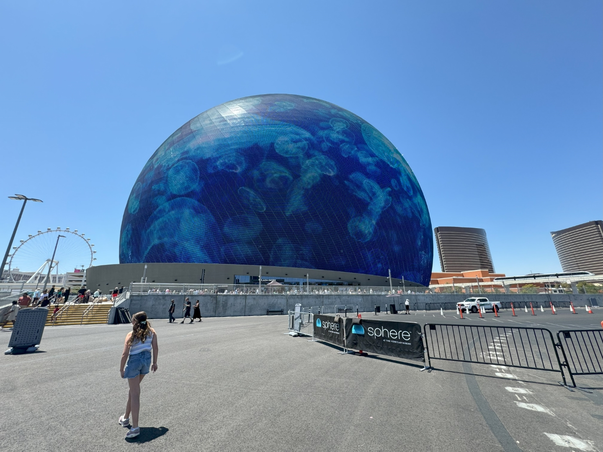
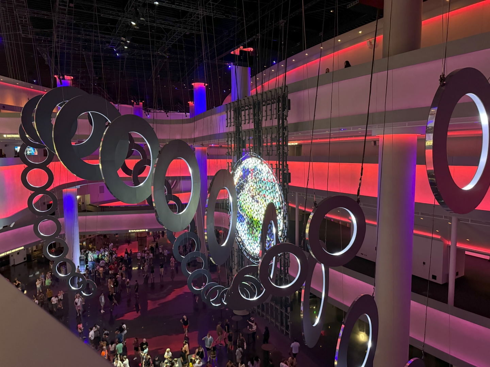
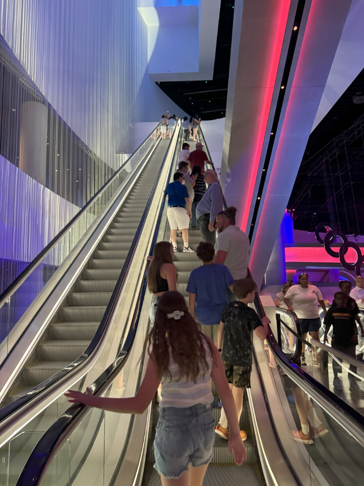
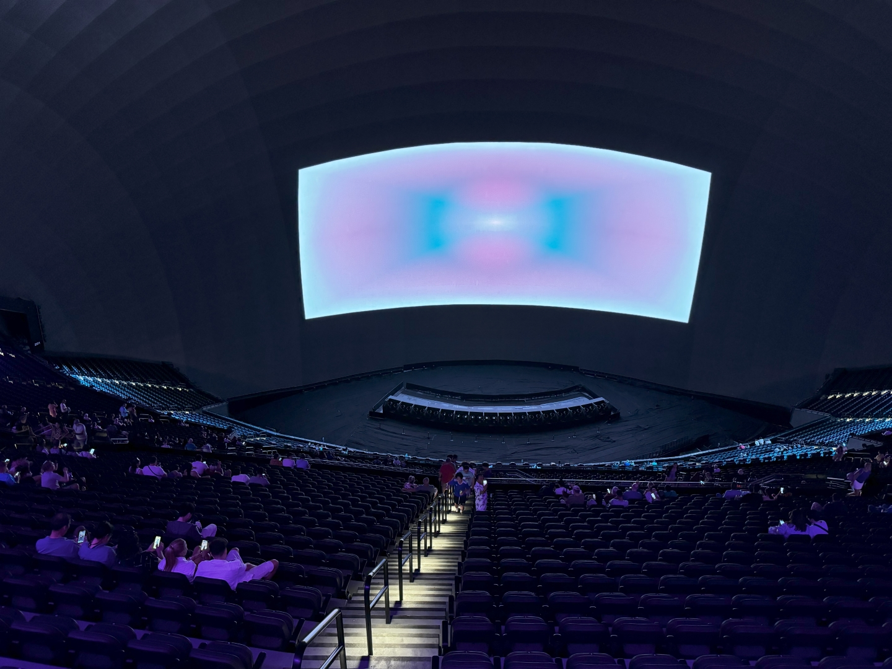

Toen we twee weken aankwamen op Las Vegas Airport, zagen we 'm al liggen: de Sphere. De Sphere is een bolvormig muziek- en entertainmentgebouw, dichtbij de Las Vegas Strip. Het is eind vorig jaar geopend en de totale kosten zijn geschat op 2,3 miljard dollar! De Sphere is 112 meter hoog en 157 meter breed in diameter. Het theater heeft aan de buitenzijde 54.000 vierkante meter aan led-schermen, opgebouwd uit 1,2 miljoen led-lampen. Aan de binnenzijde is een led-scherm van 15.000 vierkante meter met een beeldresolutie van 16K geplaatst, bij oplevering het grootste en scherpste scherm ter wereld. Het geluid wordt verzorgd door 167.000 (!) individueel versterkte luidsprekers. Het is een fenomenaal gezicht.

Binnen is het een kakafonie van hologrammen en intelligente robots.

We nemen de ene roltrap na de andere om bij onze zitplaatsen (er zijn er 18.600!) uit te komen.

We zitten bijna bovenin, en je zou bijna hoogtevrees krijgen als je naar beneden kijkt.

De film gaat over hoe mooi de natuur is, en dat de mensheid 'm zo ver verwoest heeft dat de mensheid naar de ruimte geevacueerd moet worden op zoek naar een nieuwe plek om te leven.

Toen de film begon, dachten we eerst dat we genaaid waren en dat het scherm niet veel groter zou worden dan op de foto hierboven. Op enig moment zien we de aarde vanuit de ruimte en wordt ingezoomd. Zover dat de film over bijna de hele zaal wordt geprojecteerd. Het beeld is ongelooflijk scherp, en het geluid gaat door lijf en leden. Waanzinnig! De beelden zijn prachtig, en vaak hoor je de zaal oooh en aah roepen.

Het is een geweldige ervaring! Na de film rijden we naar de outlet om wat te shoppen en eten.
