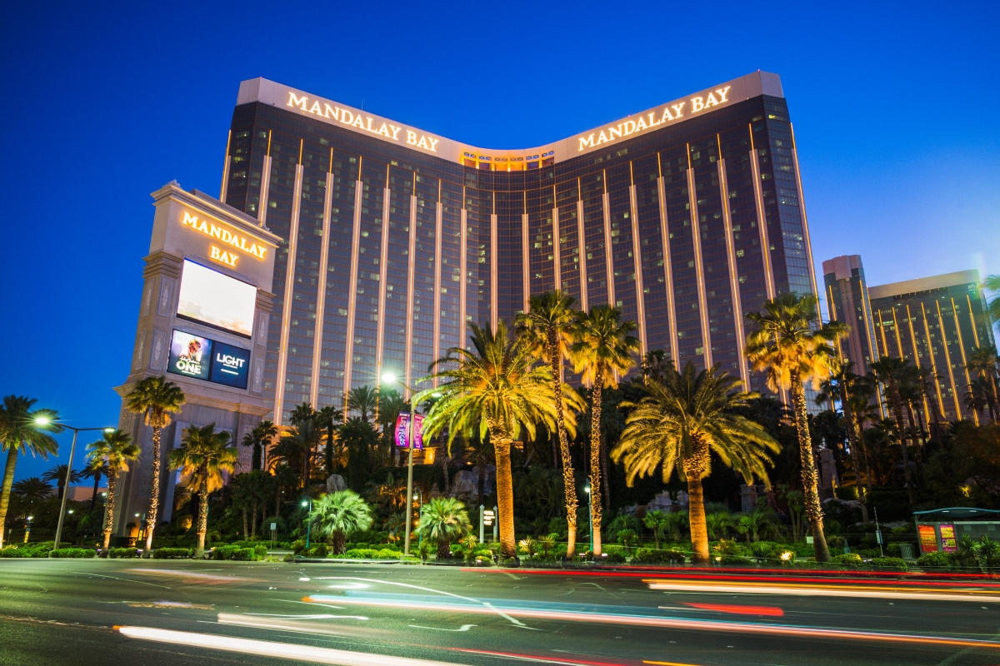
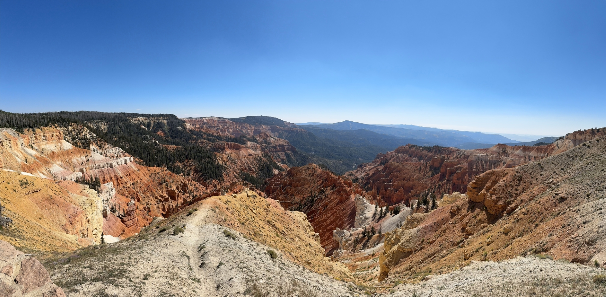
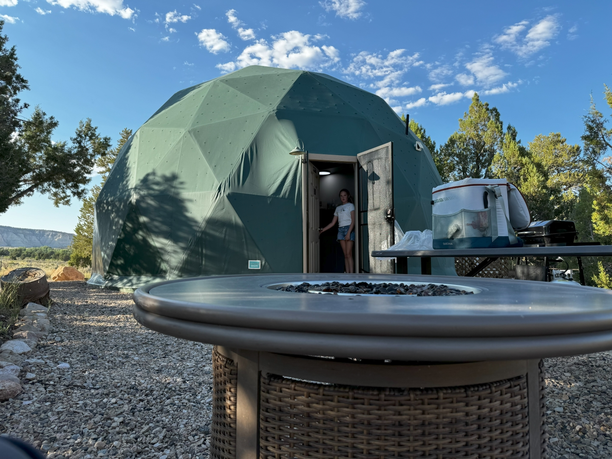
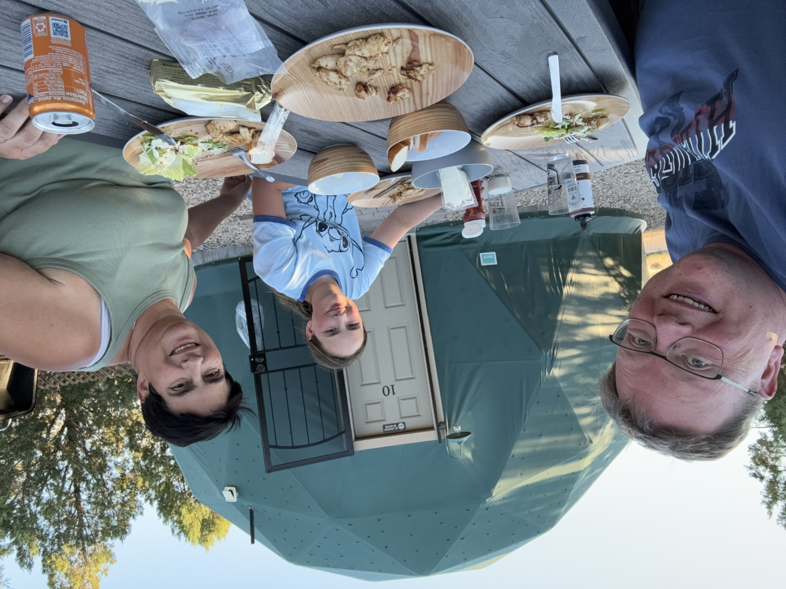
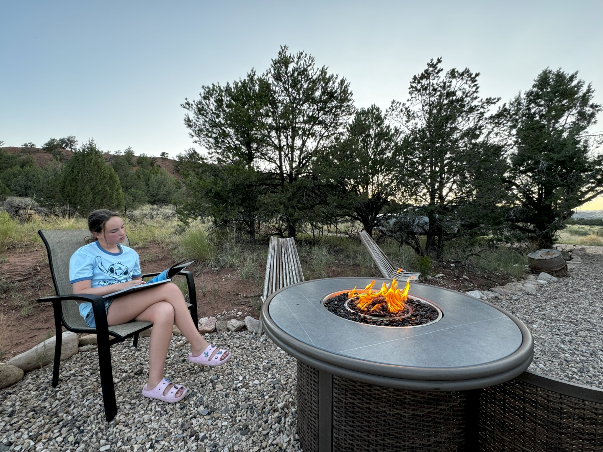
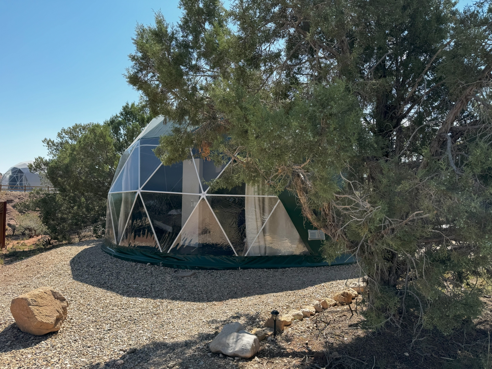

Na al het geweld in Las Vegas, hebben we vandaag een rustige dag. We gaan Mandalay Bay verlaten. Ondanks de grootte (3200 kamers!), is het toch best een prettige ervaring. Grote kamer, en alle faciliteiten zijn aanwezig. Bovendien ligt het helemaal aan de zuidkant van de Strip dus is het ook niet zo heel druk.

Na een kleine tussenstop bij de Hobby Lobby duiken we Interstate 15 op tot aan Cedar City, Utah waar we wat boodschapjes doen. We rijden verder via een prachtige weg door naar Cedar Breaks National Monument. Men noemt dit Monument ook wel "Bryce Canyon without the crowds", en dat lijkt ook wel te kloppen. Er is nagenoeg niemand, en hoewel het een stuk kleiner is dan z'n bekende broer, zijn de uitzichten prachtig.

Via de waanzinnig mooie UT-143, en later de UT-12 rijden we naar onze overnachtingsplek in Cannonville: [Bryce Glamp and Camp](https://www.bryceglampandcamp.com/)

Het is een kleinschalige camping met 10 zogenaamde domes. De dome is van alle gemakken voorzien: queen size bed, dubbele airco, douche, toilet, keukentje. Buiten staan een gas-bbq en een gas haard. Onze dome staat helemaal aan de rand, dus we hebben mooi uitzicht over de omliggende bergen en velden.

Aan een kant van de dome is een glazen wand, zodat je 's avonds vanuit je bed kunt genieten van de prachtige sterrenhemel.

