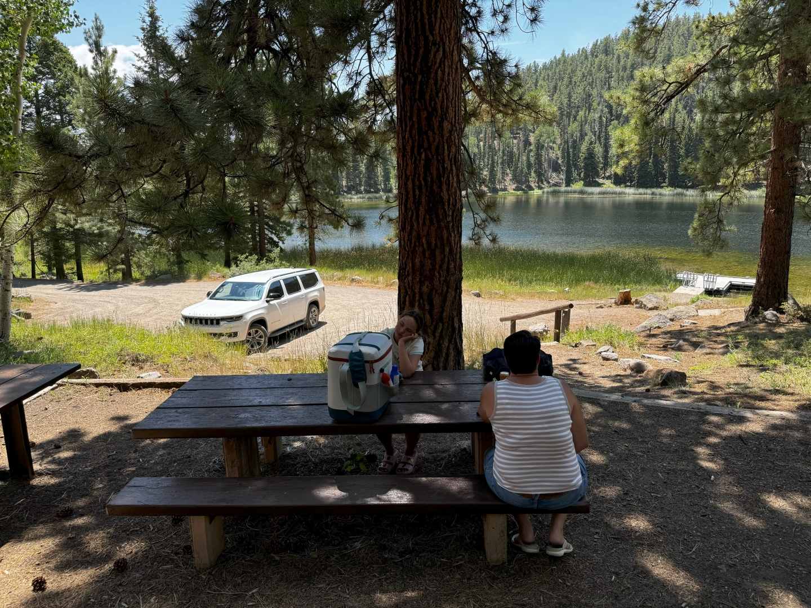
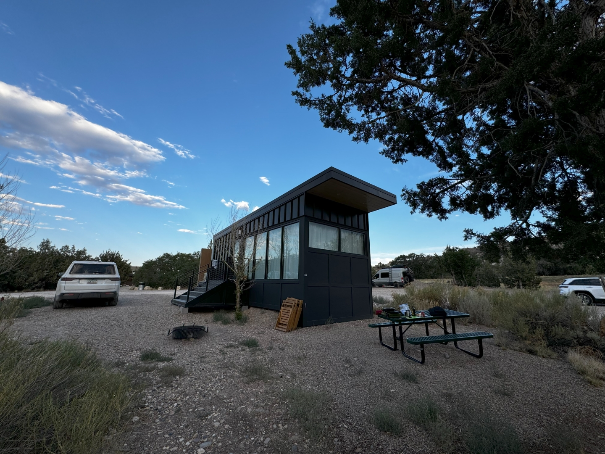
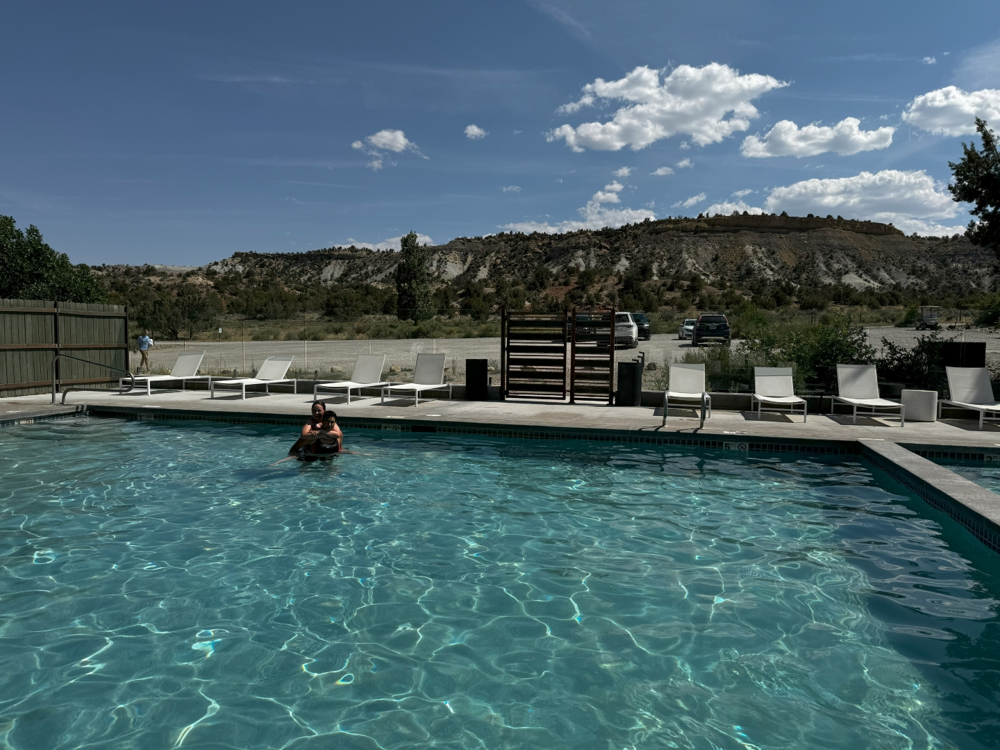
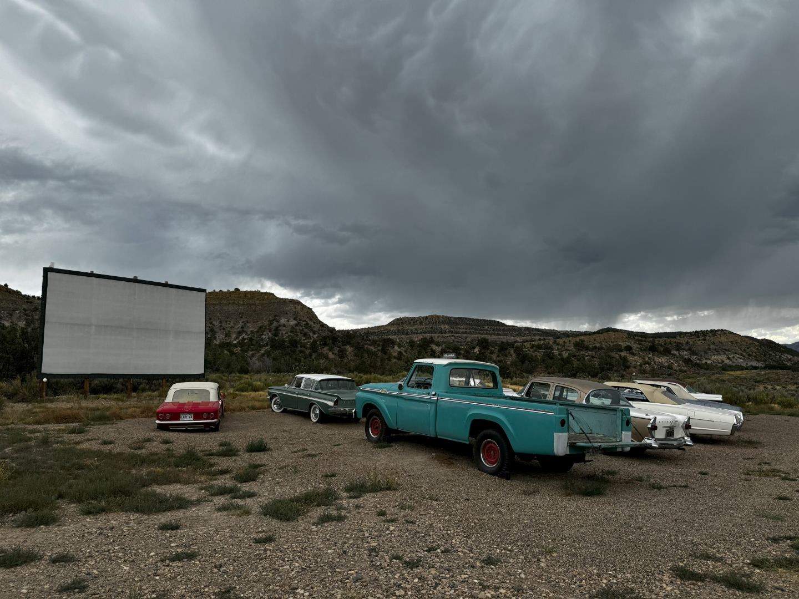
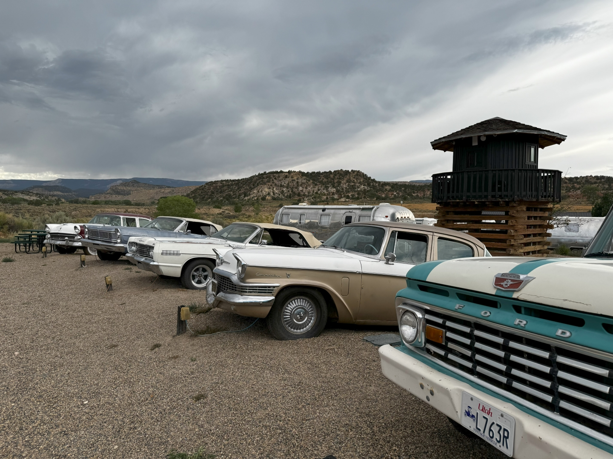
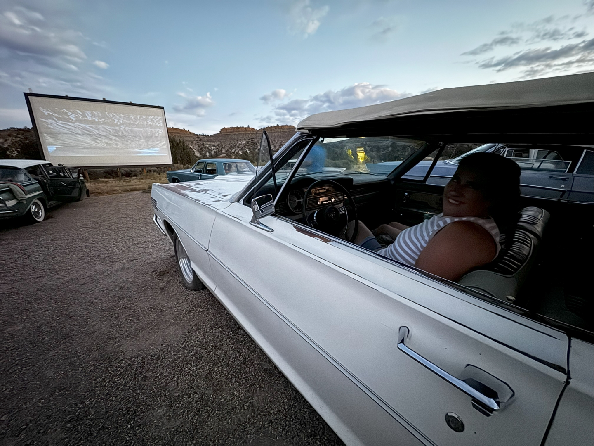

Onze volgende overnachtingsplek in Escalante, Utah is maar 45 minuten rijden, dus we hebben alle tijd om de omgeving een beetje te verkennen. We rijden verder via de UT-12 en slaan de onverharde weg naar Posey Lake in. Dit kleine meertje ligt op zo'n 2600 meter hoogte dus is de temperatuur er aangenaam. Het is overigens het minst toeristische meer van de zuidelijkste 48 staten. Ja ja, ze verzinnen wat hier :-)

We wilden eigenlijk met de supboard gaan peddelen, maar het te water gaan is wat lastig hier. En dus besluiten we om maar te gaan lunchen. Het is heerlijk rustig, op wat eekhoorns en een Duits gezin na.

Om stipt drie uur melden we ons bij Ofland in Escalante om in te checken. Snel leggen we de spullen in ons huis, trekken de zwembroek aan en duiken in het heerlijke zwembad.

Na het eten lopen we snel naar de Drive In bioscoop die ook op ons terrein ligt. Fantastisch! Er staan allemaal auto's uit de vijftiger en zestiger jaren.

Popcorn en drinken kun je ophalen in een oude Airstream caravan. Zelfs de reclame filmpjes zijn uit vervlogen tijden. Vanavond draait The Never Ending Story (uit 1984). We vonden de film erg leuk!

