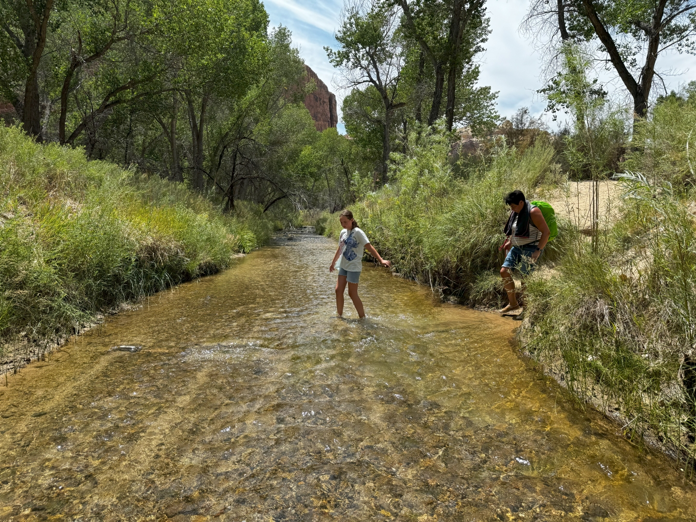
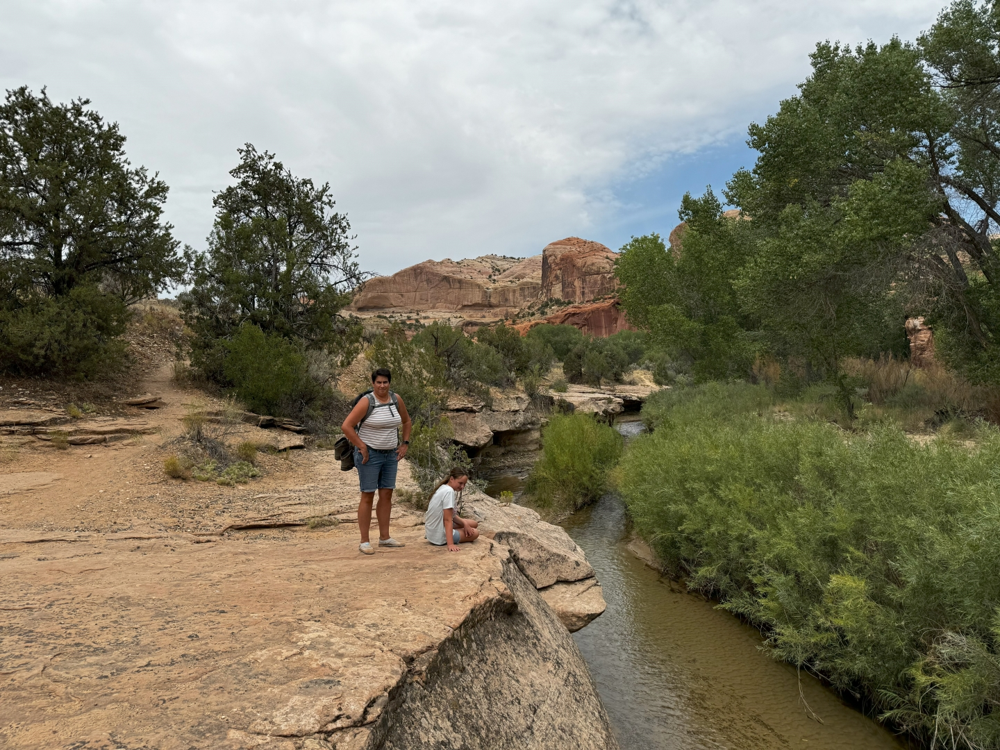
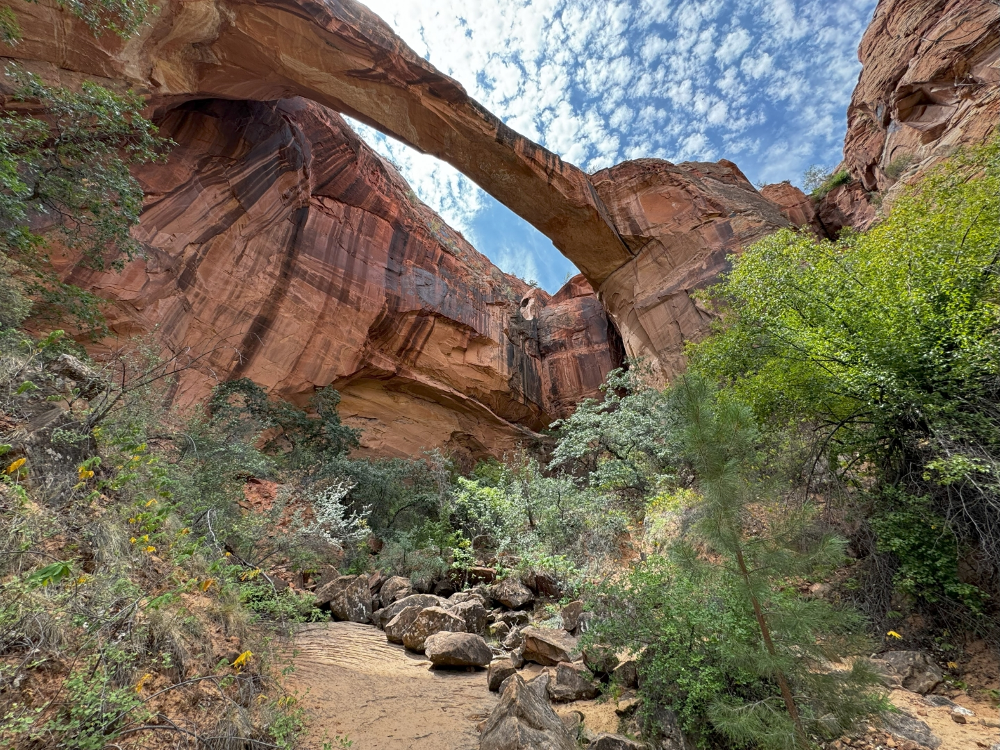
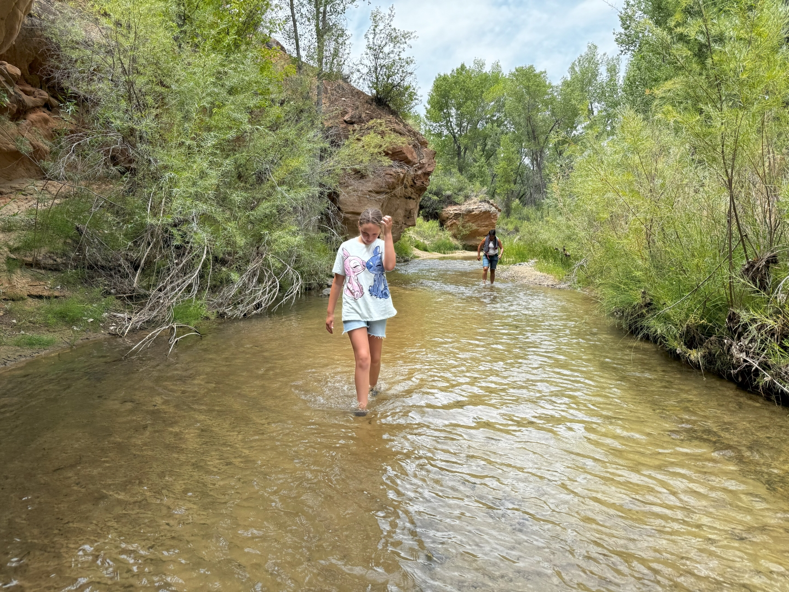
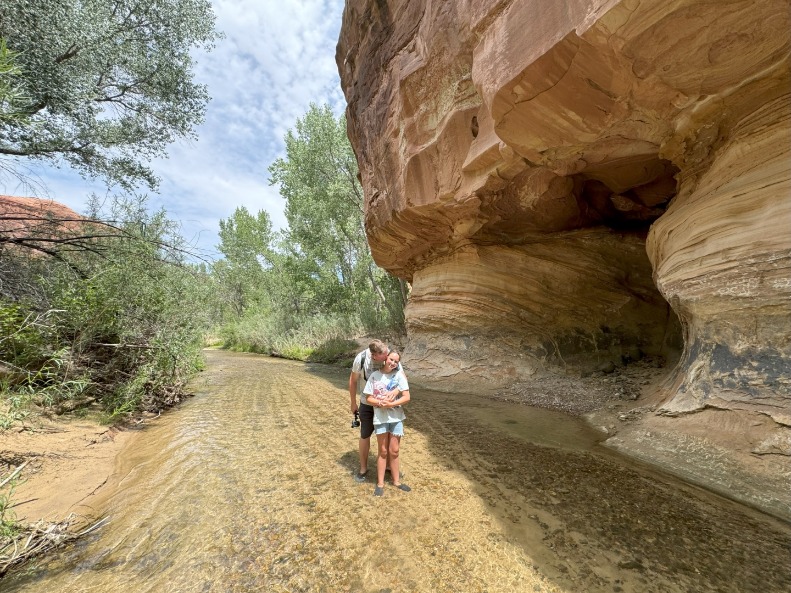

We parkeren de auto deze ochtend bij Escalante River Trailhead. We gaan van hieruit wandelen naar Natural Bridge. Het belooft een leuk tochtje te worden, want we moeten vijf keer de rivier doorkruisen. En dus hebben we, naast de normale wandelschoenen, ook de waterschoenen mee in de rugzak. Na nog geen 100 meter gelopen te hebben, komen we bij de rivier aan. Om aan de overkant te komen moeten we al de wandelschoenen ruilen voor de waterschoenen :-) De rest van de wandeling houden we die laatste maar gewoon aan.

Het is weer erg warm. Er is veel los zand op de wandelpaden, dus het lopen gaat zwaar.

De uitzichten op de omliggende rotsen en bergen zijn prachtig. We komen bijna geen andere wandelaars tegen. Na een uurtje of zo komen we aan bij de Natural Bridge.

De weg terug kiezen we wat het kortst is: of via de rivier, of via het wandelpad.

Moe maar voldaan spenderen we de rest van de middag in het zwembad bij ons huis en halen we eten uit de foodtruck. 's Avonds gaan we weer naar de drive in bioscoop en kijken naar de gremlins.
