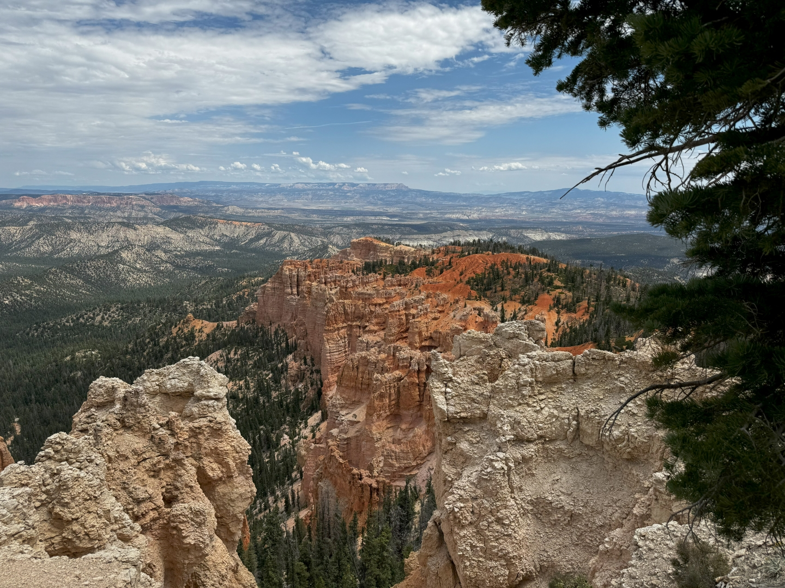
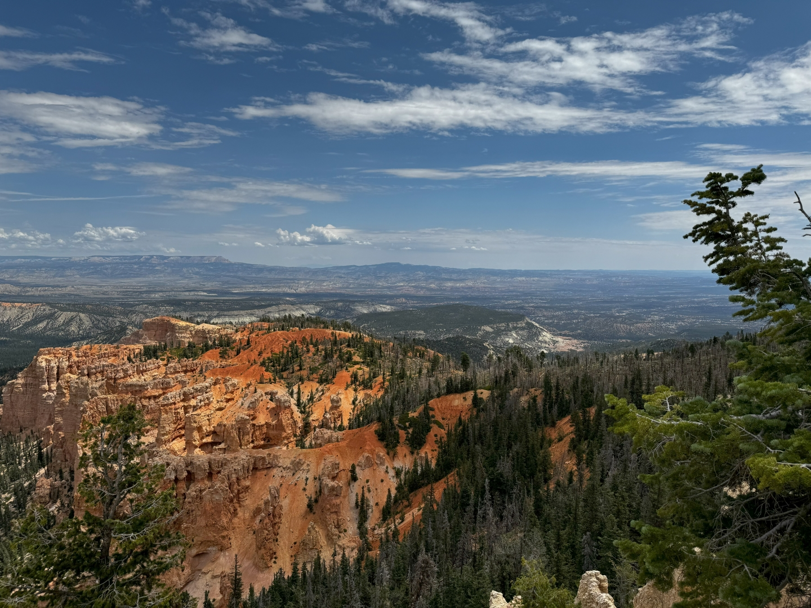
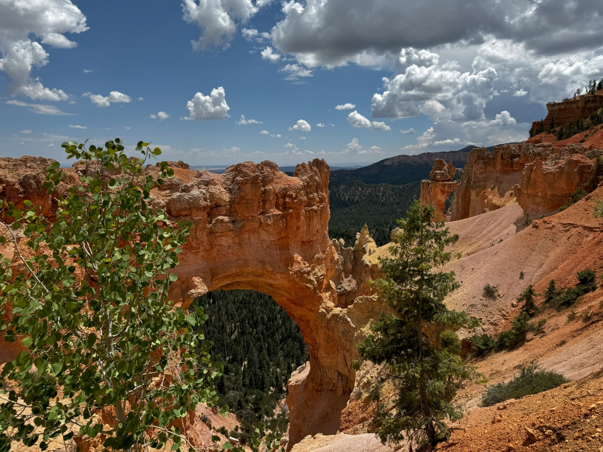
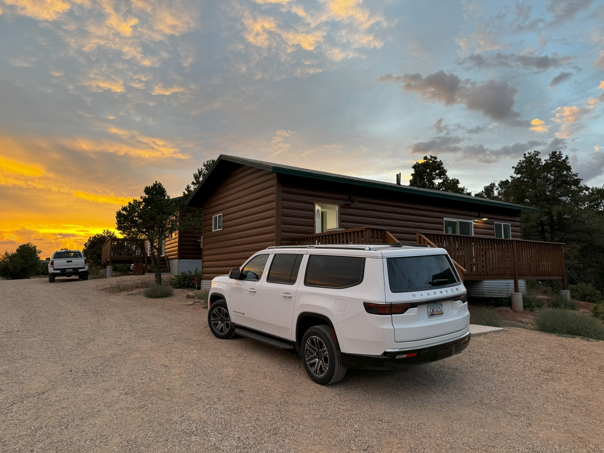

De rit naar de volgende overnachtingsplek is niet zo heel lang, iets meer dan twee uurtjes. En dus hebben we mooi de tijd om 's morgens rustig te ontbijten en uit te checken. Onderweg komen we min of meer langs Bryce Canyon National Park.

We rijden de weg in het park helemaal door tot het eindpunt Rainbow Point. Er zijn hier niet heel veel mensen (de meesten blijven denk ik in het Amphitheatre), en het uitzicht is spectaculair.

Het is vanaf hier maar een paar honderd meter lopen naar Yovimpa Point. Ook hier weer een mooi uitzicht.

Hierna lopen we weer terug naar de auto en rijden een klein stukje de weg terug naar de uitgang. We stoppen bij Agua Canyon en Natural Bridge.

Op de parkeerplaats bij Far Viewpoint staat een taco truck. We kopen er wat tacos en nachos voor de lunch. Op een wiebelig bankje peuzelen we het op. Het smaakt bijzonder goed.

Bij het visitor center nemen we even de tijd voor een sanitaire stop. De lucht boven ons wordt zwart, en het begint enorm te donderen. Snel springen we in de voiture, en rijden een half uur in de stromende regen. De ruitenwissers staan in de hoogste stand, en je ziet amper een hand voor ogen. Gelukkig schijnt de zon al snel weer volop en kunnen we met een lach het laatste stuk naar Zion Ponderosa Resort rijden. Dit park ligt ten oosten van Zion National Park. We zijn hier al vaker geweest met de camper, maar nu hebben we voor de komende twee nachten een huis gehuurd op hetzelfde terrein.

Als we naar het restaurant lopen, kleurt de hemel prachtig.

's Avonds zitten we lekker op ons eigen terras bij de gashaard.

