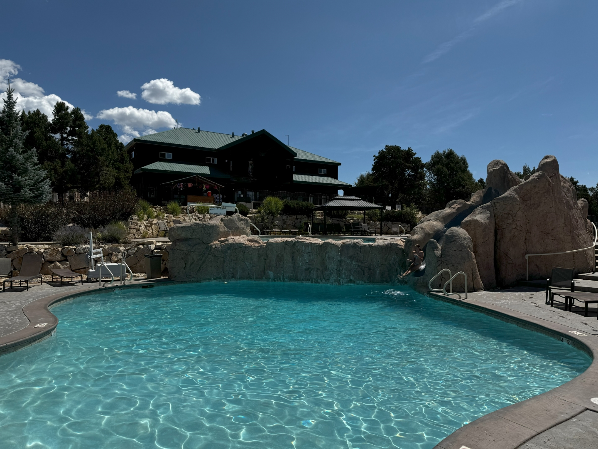
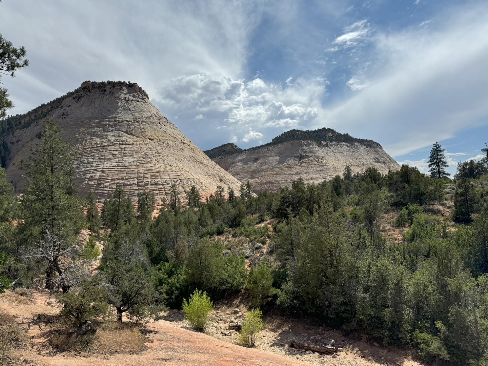
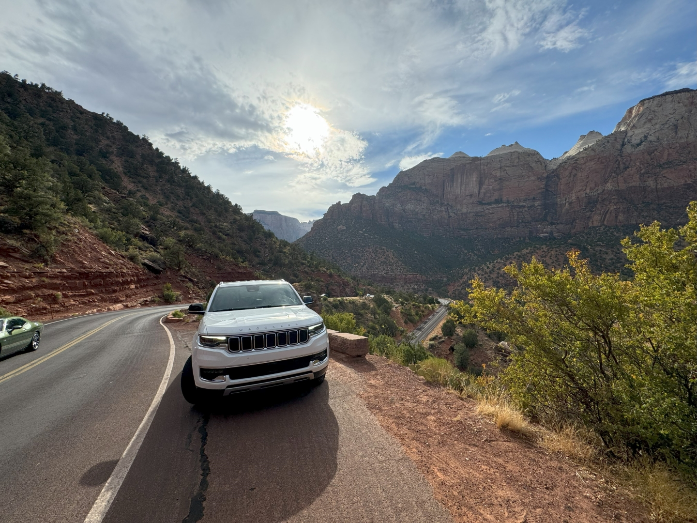

Direct na het ontbijt gaan we zwemmen. We zijn helemaal alleen, heerlijk!

Aan het einde van de middag rijden we Zion National Park in. De eerste stop is Checkerboard Mesa. Zo genoemd, omdat het met een beetje fantasie lijkt op een schaakbord.

We zijn natuurlijk al heel vaak in Zion geweest. Maar iedere keer als je uit de tunnel komt, en de enorme rotspartijen ziet, blijft het erg indrukwekkend.

We eten een simpele maar goede hamburger, pannenkoek en kippie in Springdale, het toegangsstadje aan de zuid west kant van Zion, en rijden daarna weer terug dwars door het park.
