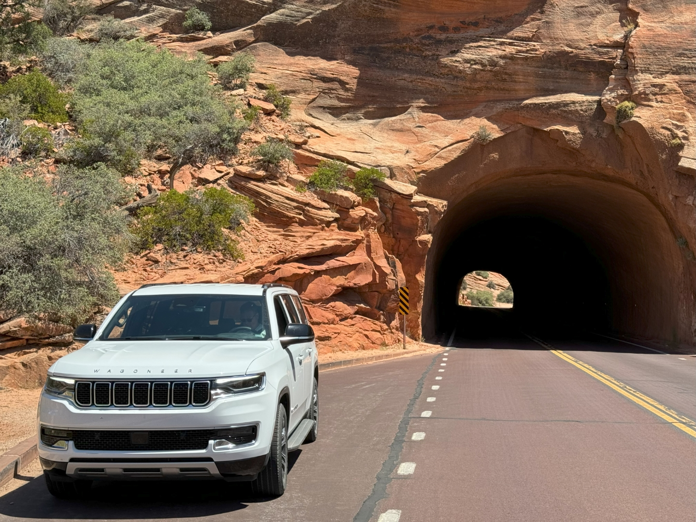
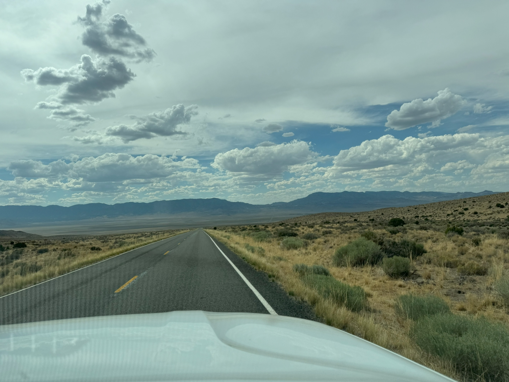
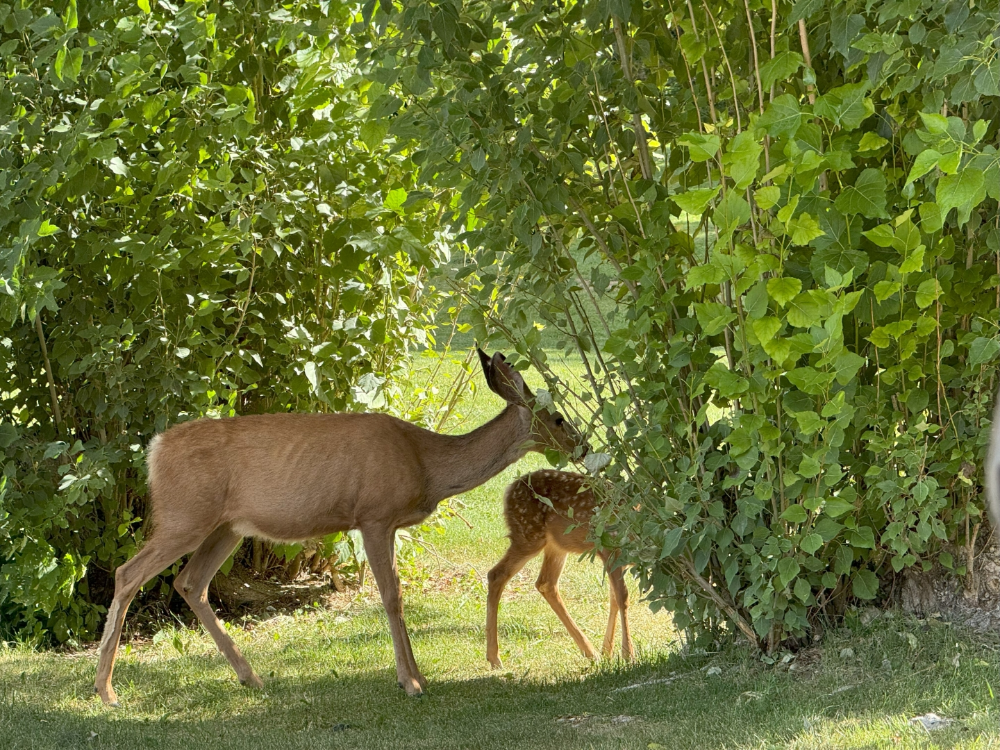
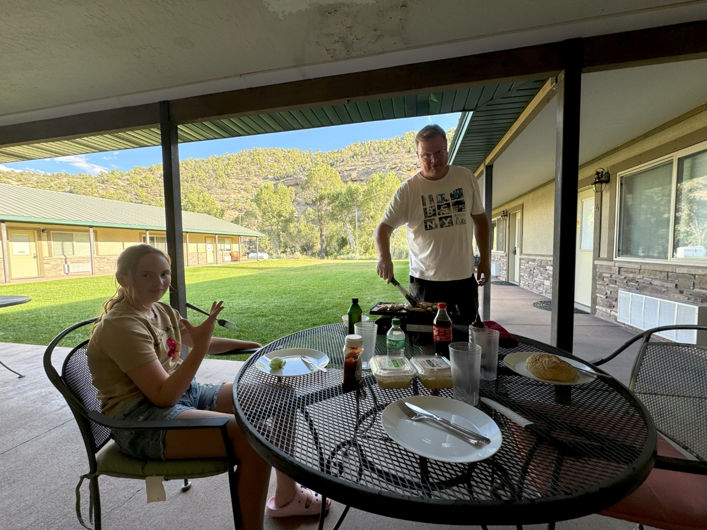
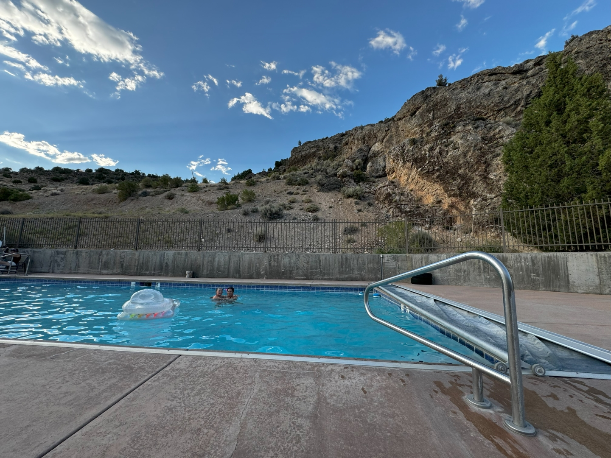

Na het ontbijt zetten we al onze spullen weer in de auto, en parkeren 'm vervolgens naast het zwembad. De rit naar de volgende bestemming is nogal lang, dus we willen in de ochtend nog even genieten van het heerlijke water.

Na lunchtijd vertrekken we voorgoed van Zion Ponderosa Ranch Resort. Vooruit, we rijden weer dwars door Zion National Park heen. Gewoon omdat het kan.

Ons doel vandaag, Hidden Canyon Resort in Baker, net over de grens met Nevada, ligt op ongeveer 4 uur rijden. De weg ernaartoe is heel bijzonder: een beetje kronkelen om een heuvel op en af te komen, daarna rijden we over een weg die kilometers lang langs een liniaal lijkt ingetekend. Links en rechts is niets anders dan stenen, een verdwaalde struik, en wat dor gras. En daarna weer een heuvel op en af, en weer kilometers rechtuit. We werden er gewoon wat melig van. Op een stuk van ruim 100 km lang zijn we misschien 10 auto's tegengekomen...

Het laatste stuk naar ons hotel is een goed begaanbare onverharde weg van een kilometer of 10. De naam Hidden Canyon Resort doet z'n naam wel eer aan in ieder geval.

We worden welkom geheten door een hele kudde herten.

Voor de deur bakken we snel wat dooie kip en daarna duiken we het zwembad in.

's Avonds gaan we een beetje op tijd slapen, want morgen moeten we vroeg op.
